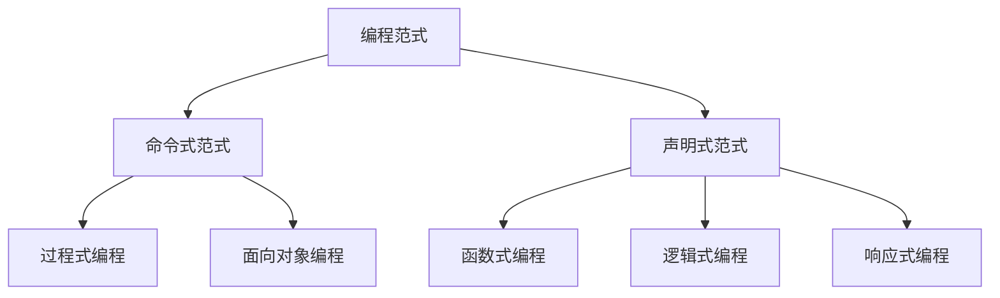

# 编程范式详解：从概念到实践

编程范式（Programming Paradigm）是**编程的基本风格和方法论**，它定义了程序员思考问题和构建解决方案的方式。不同的范式提供了不同的抽象模型和代码组织方式，如同不同的"世界观"会影响我们解决问题的方法。

## 主要编程范式分类



### 1. 命令式范式 (Imperative Programming)
**核心思想**：通过明确的指令序列告诉计算机如何完成任务（"如何做"）

#### 1.1 过程式编程 (Procedural Programming)
```python
# 计算员工工资的示例
def calculate_salary(hours, rate):
    base_pay = hours * rate
    if hours > 40:
        overtime = (hours - 40) * rate * 0.5
        base_pay += overtime
    tax = base_pay * 0.2
    return base_pay - tax

# 主程序流程
hours_worked = 45
hourly_rate = 20
net_pay = calculate_salary(hours_worked, hourly_rate)
print(f"Net pay: ${net_pay:.2f}")
```

**特点**：
- 程序由一系列过程/函数组成
- 使用变量存储状态
- 顺序执行指令
- 典型语言：C, Pascal, BASIC

**适用场景**：系统编程、嵌入式开发、脚本编写

#### 1.2 面向对象编程 (Object-Oriented Programming, OOP)
```java
// Java 示例：银行账户系统
class BankAccount {
    private String owner;
    private double balance;
    
    public BankAccount(String owner, double initialBalance) {
        this.owner = owner;
        this.balance = initialBalance;
    }
    
    public void deposit(double amount) {
        if (amount > 0) {
            balance += amount;
        }
    }
    
    public void withdraw(double amount) {
        if (amount > 0 && amount <= balance) {
            balance -= amount;
        }
    }
    
    public double getBalance() {
        return balance;
    }
}

// 使用
public class Main {
    public static void main(String[] args) {
        BankAccount account = new BankAccount("Alice", 1000);
        account.deposit(500);
        account.withdraw(200);
        System.out.println("Balance: $" + account.getBalance());
    }
}
```

**四大支柱**：
- **封装**：隐藏实现细节
- **继承**：代码重用和层次结构
- **多态**：同一接口不同实现
- **抽象**：简化复杂系统

**设计模式**：
- 单例模式（Singleton）
- 工厂模式（Factory）
- 观察者模式（Observer）
- MVC模式（Model-View-Controller）

**适用场景**：GUI应用、企业级系统、游戏开发

### 2. 声明式范式 (Declarative Programming)
**核心思想**：描述目标状态而非具体步骤（"做什么"）

#### 2.1 函数式编程 (Functional Programming, FP)
```haskell
-- Haskell 示例：计算斐波那契数列
fibonacci :: Int -> Int
fibonacci 0 = 0
fibonacci 1 = 1
fibonacci n = fibonacci (n-1) + fibonacci (n-2)

-- 使用高阶函数和递归
main = do
    let fibs = take 10 [fibonacci n | n <- [0..]]
    print fibs -- [0,1,1,2,3,5,8,13,21,34]
```

**核心概念**：
- 纯函数（无副作用）
- 不可变数据
- 高阶函数
- 递归代替循环
- 函数组合

**适用场景**：数据处理、并发编程、数学计算

#### 2.2 逻辑编程 (Logic Programming)
```prolog
% Prolog 示例：家族关系
father(john, jim).
father(john, ann).
mother(mary, jim).
mother(mary, ann).

sibling(X, Y) :- 
    father(F, X), father(F, Y),
    mother(M, X), mother(M, Y),
    X \= Y.

% 查询
?- sibling(jim, ann). % true
```

**特点**：
- 基于形式逻辑
- 事实和规则定义
- 自动推理机制
- 回溯搜索

**适用场景**：人工智能、专家系统、自然语言处理

#### 2.3 响应式编程 (Reactive Programming)
```javascript
// JavaScript + RxJS 示例：实时搜索
const searchInput = document.getElementById('search');
const resultsContainer = document.getElementById('results');

fromEvent(searchInput, 'input')
  .pipe(
    map(event => event.target.value),
    filter(text => text.length > 2),
    debounceTime(300),
    distinctUntilChanged(),
    switchMap(query => fetch(`/api/search?q=${query}`))
  )
  .subscribe(results => {
    resultsContainer.innerHTML = renderResults(results);
  });
```

**核心概念**：
- 数据流（Stream）
- 观察者模式
- 函数式操作符
- 异步事件处理

**适用场景**：实时系统、UI交互、事件驱动架构

## 多范式编程语言比较

| 语言       | 支持的范式                      | 特点                          |
|------------|--------------------------------|-------------------------------|
| **Python** | OOP + 过程式 + 函数式          | 易学易用，丰富的库支持        |
| **Java**   | OOP为主 + 函数式(Java 8+)      | 强类型，跨平台，企业级应用    |
| **C++**    | 多范式(过程式/OOP/泛型/函数式) | 高性能，系统级开发            |
| **Scala**  | 函数式 + OOP                   | JVM语言，兼顾灵活性和性能     |
| **Haskell**| 纯函数式                       | 强类型系统，惰性求值          |
| **JavaScript**| 多范式(原型/OOP/函数式/响应式) | 全栈开发，事件驱动            |

## 如何选择编程范式？

### 1. 根据问题领域选择
- **业务系统**：面向对象（封装业务逻辑）
- **数据处理**：函数式（无副作用转换）
- **实时系统**：响应式（事件流处理）
- **规则引擎**：逻辑编程（自动推理）

### 2. 根据团队技能选择
- 熟悉数学：函数式编程
- 工程背景：面向对象
- 学术研究：逻辑编程

### 3. 现代开发趋势：混合范式
```typescript
// TypeScript 示例：混合范式实践
class ShoppingCart {
    private items: Product[] = [];
    
    // OOP方法：封装状态
    addItem(item: Product) {
        this.items = [...this.items, item]; // 函数式：不可变更新
    }
    
    // 函数式方法
    getTotalPrice() {
        return this.items.reduce(
            (total, item) => total + item.price, 0
        );
    }
    
    // 响应式方法
    subscribe(observer: Observer) {
        // 实现观察者模式
    }
}

// 函数式工具
const applyDiscount = (cart: ShoppingCart, discount: number) => {
    const total = cart.getTotalPrice();
    return total * (1 - discount);
};
```

## 新兴编程范式

### 1. 面向切面编程 (AOP)
```java
// Java + Spring AOP 示例
@Aspect
public class LoggingAspect {
    
    @Before("execution(* com.example.service.*.*(..))")
    public void logBefore(JoinPoint joinPoint) {
        System.out.println("Method called: " + joinPoint.getSignature().getName());
    }
}

@Service
public class UserService {
    public void createUser(User user) {
        // 业务逻辑
    }
}
```

**核心概念**：
- 关注点分离
- 横切关注点（日志、事务、安全）
- 切入点（Pointcut）
- 通知（Advice）

### 2. 领域驱动设计 (DDD)
```csharp
// C# 示例：电子商务领域模型
public class Order {
    public Guid Id { get; }
    public Customer Customer { get; }
    private List<OrderItem> _items = new List<OrderItem>();
    
    public void AddItem(Product product, int quantity) {
        // 领域逻辑：验证业务规则
        if (quantity <= 0)
            throw new InvalidOperationException("Quantity must be positive");
        
        _items.Add(new OrderItem(product, quantity));
    }
    
    public decimal CalculateTotal() {
        return _items.Sum(item => item.Product.Price * item.Quantity);
    }
}
```

**核心概念**：
- 领域模型
- 限界上下文
- 实体和值对象
- 聚合根
- 领域事件

### 3. 函数式响应式编程 (FRP)
```elm
-- Elm 示例：计数器应用
import Browser
import Html exposing (Html, button, div, text)
import Html.Events exposing (onClick)

type Msg = Increment | Decrement

update : Msg -> Model -> Model
update msg model =
    case msg of
        Increment ->
            model + 1
        Decrement ->
            model - 1

view : Model -> Html Msg
view model =
    div []
        [ button [ onClick Decrement ] [ text "-" ]
        , div [] [ text (String.fromInt model) ]
        , button [ onClick Increment ] [ text "+" ]
        ]

main : Program () Model Msg
main =
    Browser.sandbox { init = 0, update = update, view = view }
```

## 学习路径建议

1. **掌握基础范式**：
   - 过程式编程 → 面向对象编程 → 函数式编程
   
2. **实践混合范式**：
   - Python/JavaScript 多范式项目
   - Scala/Haskell 深入函数式
   
3. **学习专业范式**：
   - Prolog 逻辑编程
   - RxJS/Elm 响应式编程
   
4. **探索新兴范式**：
   - 领域驱动设计
   - 函数式响应式编程

> "好的程序员了解多种范式，伟大的程序员知道何时使用哪种范式。" - 匿名

编程范式不是互斥的选择，而是解决问题的工具箱。现代开发往往需要**混合使用多种范式**，根据具体场景选择最合适的工具。理解不同范式的哲学思想和适用场景，将使您成为更全面、更灵活的开发人员。