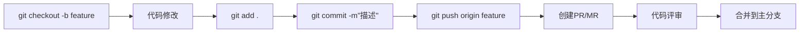
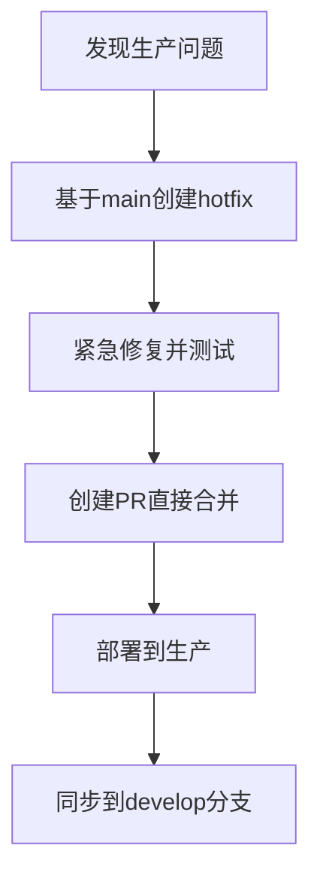

## Git 与 GitHub 全面指南：从基础到团队协作

### 一、核心概念解析

| **工具** | **定位** | **核心功能** | **类比说明** |
|----------|----------|--------------|--------------|
| **Git** | 分布式版本控制系统 | 代码版本管理、分支操作、历史追踪 | 代码的"时间机器" |
| **GitHub** | 基于 Git 的代码托管平台 | 代码托管、协作开发、项目管理 | 代码的"社交网络" |

---

### 二、Git 核心工作流（开发者视角）

#### 1. 日常开发循环


#### 2. 必备 Git 命令手册

| 命令 | 使用场景 | 示例 |
|------|----------|------|
| `git clone` | 克隆仓库 | `git clone https://github.com/user/repo.git` |
| `git status` | 查看状态 | `git status` |
| `git add` | 暂存文件 | `git add file.txt` |
| `git commit` | 提交更改 | `git commit -m "修复登录bug"` |
| `git push` | 推送代码 | `git push origin main` |
| `git pull` | 拉取更新 | `git pull --rebase` |
| `git branch` | 分支管理 | `git branch -d old-feature` |
| `git checkout` | 切换分支 | `git checkout -b new-feature` |
| `git merge` | 合并分支 | `git merge feature/login` |
| `git rebase` | 变基操作 | `git rebase main` |
| `git stash` | 暂存修改 | `git stash pop` |
| `git log` | 查看历史 | `git log --oneline --graph` |

---

### 三、GitHub 团队协作实战

#### 1. 标准协作流程
```mermaid
sequenceDiagram
    开发者->>+GitHub： 创建特性分支(feature/login)
    开发者->>+本地： 开发并提交代码
    开发者->>+GitHub： 推送分支并创建PR
    团队->>+PR页面： 代码审查/讨论
    团队->>+GitHub： 批准PR
    维护者->>+GitHub： 合并到main分支
    GitHub->>+CI系统： 触发自动化测试/部署
```

#### 2. 高效协作技巧
1. **分支策略**
   - `main`：生产就绪代码
   - `develop`：集成测试分支
   - `feature/`：功能开发分支
   - `hotfix/`：紧急修复分支

2. **PR最佳实践**
   - 保持PR小巧（<300行代码）
   - 添加清晰描述和截图
   - 关联Issue编号（Close #123）
   - 使用模板规范格式

3. **代码审查标准**
   ```markdown
   - [ ] 功能实现正确
   - [ ] 无安全漏洞
   - [ ] 单元测试覆盖
   - [ ] 文档更新
   - [ ] 符合编码规范
   ```

---

### 四、企业级工作场景应用

#### 1. DevOps 流水线集成
```
开发 → 提交PR → 自动测试 → 人工审核 → 合并 → 自动部署
```

#### 2. 关键功能应用
| **功能** | **使用场景** | **效率提升** |
|----------|--------------|--------------|
| **GitHub Actions** | CI/CD自动化 | 节省70%部署时间 |
| **Projects** | 项目管理 | 可视化任务追踪 |
| **CodeSpaces** | 云端开发 | 秒级环境搭建 |
| **Security** | 漏洞扫描 | 提前发现安全风险 |
| **Insights** | 代码分析 | 优化技术债务 |

#### 3. 企业安全策略
```yaml
# .github/workflows/security.yml
name: Security Scan
on: [push, pull_request]
jobs:
  security:
    runs-on: ubuntu-latest
    steps:
    - uses: actions/checkout@v4
    - name: Run SAST
      uses: github/codeql-action@v2
    - name: Dependency Check
      uses: actions/dependency-review-action@v3
```

---

### 五、高频问题解决方案

#### 1. 代码冲突处理
```bash
# 当多人修改同一文件时
git fetch origin
git rebase origin/main
# 手动解决冲突标记 <<<<<<< 
git add resolved-file.js
git rebase --continue
```

#### 2. 紧急修复流程


#### 3. 版本回退操作
```bash
# 查看提交历史
git log --oneline

# 回退到指定版本
git reset --hard a1b2c3d

# 强制推送到远程（谨慎使用）
git push --force origin main
```

---

### 六、Git/GitHub 学习资源
1. **交互式学习**：  
   - [GitHub Learning Lab](https://lab.github.com/)
   - [Learn Git Branching](https://learngitbranching.js.org/)

2. **进阶书籍**：  
   - 《Pro Git》（官方免费电子书）
   - 《GitHub Essentials》

3. **企业实践**：  
   - [Google工程实践文档](https://google.github.io/eng-practices/)
   - [Microsoft的GitHub使用规范](https://docs.microsoft.com/azure/devops/repos/git/gitworkflow)

> 💡 **专家提示**：团队应定期进行`git rebase`演练，建立Code Review文化，并将GitHub Actions集成到每日工作流中，可提升40%以上协作效率。