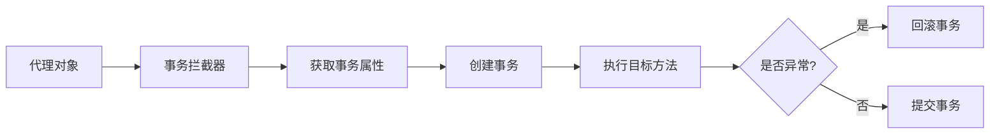
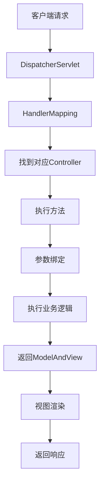
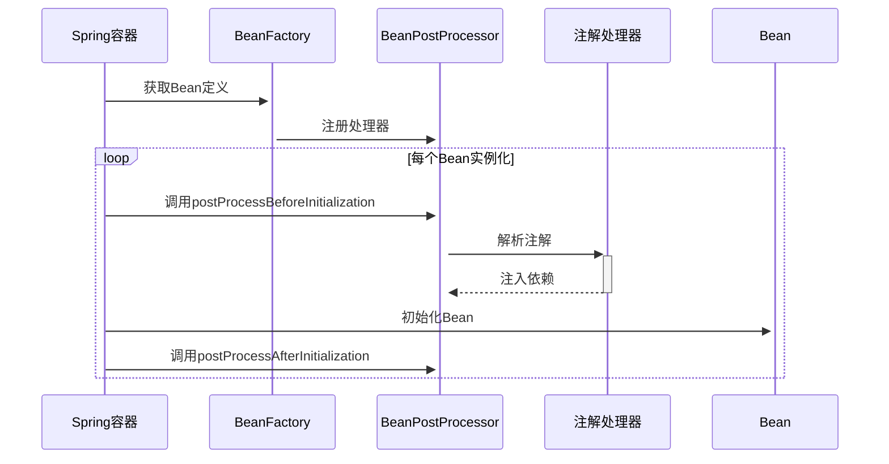
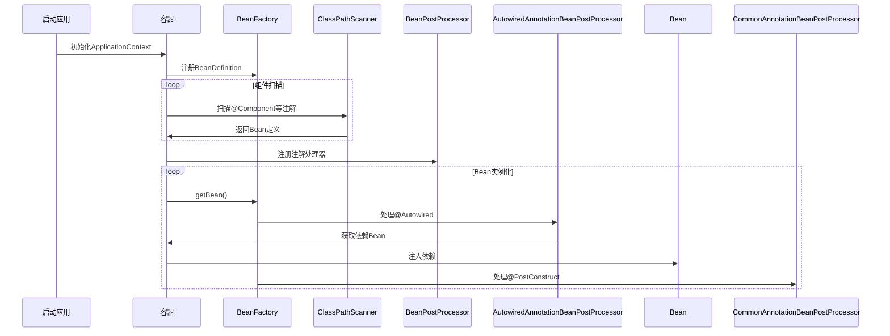

## Spring Framework 核心注解深度解析

### 一、IOC/DI 容器注解

#### 1. 组件扫描注解
| 注解 | 作用 | 参数说明 | 使用示例 |
|------|------|----------|----------|
| `@ComponentScan` | 包扫描 | `basePackages`：扫描包路径<br>`excludeFilters`：排除过滤器 | `@ComponentScan("com.example")` |
| `@Component` | 通用组件 | `value`：Bean名称 | `@Component("userService")` |
| `@Service` | 业务层 | 同`@Component` | `@Service` |
| `@Repository` | 持久层 | 自动转换数据访问异常 | `@Repository` |
| `@Controller` | 控制层 | MVC专用 | `@Controller` |
| `@Configuration` | 配置类 | 声明配置类 | `@Configuration` |

**原理流程**：
```mermaid
graph TD
    A[启动类] --> B[@ComponentScan]
    B --> C[扫描指定包]
    C --> D[识别@Component等注解]
    D --> E[创建BeanDefinition]
    E --> F[BeanFactory注册]
    F --> G[依赖注入]
```

#### 2. 依赖注入注解
| 注解 | 作用 | 参数 | 示例 |
|------|------|------|------|
| `@Autowired` | 自动装配 | `required`：是否必须 | `@Autowired private UserDao userDao;` |
| `@Qualifier` | 指定Bean名称 | `value`：Bean名称 | `@Qualifier("mysqlUserDao")` |
| `@Resource` | JSR-250注入 | `name`：指定Bean | `@Resource(name="userService")` |
| `@Value` | 注入属性 | `value`：属性值/表达式 | `@Value("${db.url}")` |
| `@Primary` | 首选Bean | 无 | `@Primary @Service` |

**实现原理**：
- `@Autowired`通过`AutowiredAnnotationBeanPostProcessor`实现
- 注入过程：
  1. 查找匹配类型的Bean
  2. 使用`Qualifier`筛选
  3. 按`@Primary`优先级选择
  4. 按属性名匹配

### 二、AOP 切面编程注解

#### 核心注解
| 注解 | 作用 | 参数 | 示例 |
|------|------|------|------|
| `@Aspect` | 声明切面类 | 无 | `@Aspect @Component` |
| `@Pointcut` | 定义切点 | `value`：切点表达式 | `@Pointcut("execution(* com.service.*.*(..))")` |
| `@Before` | 前置通知 | `value`：切点 | `@Before("logPointcut()")` |
| `@After` | 后置通知 | 同上 | `@After("logPointcut()")` |
| `@Around` | 环绕通知 | 同上 | `@Around("logPointcut()")` |
| `@AfterReturning` | 返回通知 | `pointcut/value`：切点<br>`returning`：返回值名 | `@AfterReturning(returning="result")` |
| `@AfterThrowing` | 异常通知 | `throwing`：异常名 | `@AfterThrowing(throwing="ex")` |

**AOP执行流程**：
```mermaid
sequenceDiagram
    调用者->>+目标对象： 方法调用
    目标对象->>+AOP代理： 请求转发
    AOP代理->>+切面： 执行@Before
    切面-->>-AOP代理： 前置处理
    AOP代理->>+目标对象： 执行实际方法
    目标对象-->>-AOP代理： 返回结果/异常
    AOP代理->>+切面： 执行@After/@AfterReturning等
    切面-->>-AOP代理： 后置处理
    AOP代理-->>-调用者： 返回最终结果
```

### 三、事务管理注解

#### `@Transactional` 详解
| 参数 | 作用 | 可选值 | 默认值 |
|------|------|--------|--------|
| `value` | 事务管理器 | Bean名称 | "" |
| `propagation` | 传播行为 | `REQUIRED`, `SUPPORTS`等 | `REQUIRED` |
| `isolation` | 隔离级别 | `DEFAULT`, `READ_COMMITTED`等 | `DEFAULT` |
| `timeout` | 超时时间(秒) | 整数 | -1 |
| `readOnly` | 是否只读 | true/false | false |
| `rollbackFor` | 回滚异常类 | Class[] | {} |
| `noRollbackFor` | 不回滚异常 | Class[] | {} |

**使用示例**：
```java
@Transactional(
  propagation = Propagation.REQUIRED,
  isolation = Isolation.READ_COMMITTED,
  timeout = 30,
  rollbackFor = {SQLException.class}
)
public void transferMoney(Account from, Account to, double amount) {
  // 业务逻辑
}
```

**事务实现原理**：


### 四、Spring MVC 注解

#### 控制器相关
| 注解 | 作用 | 参数 | 示例 |
|------|------|------|------|
| `@RequestMapping` | 请求映射 | `value`：URL<br>`method`：请求方法 | `@RequestMapping("/users")` |
| `@GetMapping` | GET请求 | 同`@RequestMapping` | `@GetMapping("/{id}")` |
| `@PostMapping` | POST请求 | 同上 | `@PostMapping` |
| `@ResponseBody` | 直接返回数据 | 无 | `@ResponseBody User getUser()` |
| `@RequestBody` | 接收请求体 | 无 | `@RequestBody User user` |
| `@PathVariable` | 路径变量 | `value`：变量名 | `@PathVariable("id") Long id` |
| `@RequestParam` | 请求参数 | `value`：参数名<br>`required`：是否必须 | `@RequestParam("name")` |
| `@RestController` | REST控制器 | 组合`@Controller`+`@ResponseBody` | `@RestController` |

**请求处理流程**：


### 五、条件装配注解

#### 条件化配置
| 注解 | 作用 | 参数 | 示例 |
|------|------|------|------|
| `@Conditional` | 条件装配 | `value`：Condition实现类 | `@Conditional(OnClassCondition.class)` |
| `@Profile` | 环境配置 | `value`：环境名称 | `@Profile("prod")` |
| `@ConditionalOnClass` | 类存在时装配 | `value`：类名 | `@ConditionalOnClass(DataSource.class)` |
| `@ConditionalOnProperty` | 属性存在时装配 | `name`：属性名<br>`havingValue`：属性值 | `@ConditionalOnProperty(name="cache.enabled")` |

**条件装配原理**：
```mermaid
graph LR
    A[加载配置类] --> B[解析@Conditional]
    B --> C[执行Condition.matches]
    C --> D{条件满足?}
    D -->|是| E[注册Bean]
    D -->|否| F[跳过注册]
```

### 六、注解实现原理深度解析

#### 1. 注解处理机制
```mermaid
graph TB
    A[启动Spring容器] --> B[ConfigurationClassPostProcessor]
    B --> C[解析配置类]
    C --> D[扫描@Component]
    D --> E[注册BeanDefinition]
    E --> F[BeanFactoryPostProcessor]
    F --> G[处理@Autowired等]
```

#### 2. 核心处理器
| 处理器 | 功能 | 处理的注解 |
|--------|------|------------|
| `ConfigurationClassPostProcessor` | 处理配置类 | `@Configuration`, `@ComponentScan` |
| `AutowiredAnnotationBeanPostProcessor` | 处理自动注入 | `@Autowired`, `@Value` |
| `CommonAnnotationBeanPostProcessor` | 处理JSR注解 | `@Resource`, `@PostConstruct` |
| `PersistenceAnnotationBeanPostProcessor` | 处理持久化注解 | `@PersistenceUnit`, `@PersistenceContext` |
| `AsyncAnnotationBeanPostProcessor` | 处理异步注解 | `@Async` |

#### 3. 注解生效流程


### 七、最佳实践与常见问题

#### 1. 注解使用准则
- **保持简洁**：避免过度使用注解
- **明确范围**：使用最具体的注解（如用`@Service`代替`@Component`）
- **组合注解**：创建自定义组合注解提高可读性
  ```java
  @Retention(RetentionPolicy.RUNTIME)
  @Target(ElementType.TYPE)
  @Service
  @Transactional
  public @interface BusinessService {}
  ```

#### 2. 常见问题解决
- **循环依赖**：
  - 使用`@Lazy`延迟加载
  - 重构代码结构
- **注解不生效**：
  - 检查包扫描范围
  - 确认代理模式（CGLIB vs JDK Proxy）
  - 验证Bean加载顺序
- **事务失效场景**：
  - 非public方法
  - 同对象内部调用
  - 异常类型不匹配

#### 3. 性能优化建议
1. 合理使用`@Lazy`延迟初始化
2. 避免在频繁调用的方法上使用`@Transactional`
3. 使用`@Indexed`加速组件扫描
4. 限制`@ComponentScan`范围

> **Spring注解设计哲学**：通过元注解实现"约定优于配置"，减少样板代码，提高开发效率。深入理解注解背后的处理器机制，是掌握Spring框架的关键。

### 学习资源
1. [Spring官方文档 - Core Annotations](https://docs.spring.io/spring-framework/docs/current/reference/html/core.html#beans-annotation-config)
2. [Spring注解驱动开发原理](https://spring.io/blog/2019/04/03/spring-tips-annotated-spring)
3. [Spring源码深度解析](https://github.com/spring-projects/spring-framework)


## Spring IOC/DI 容器注解深度解析

### 一、核心组件注册注解

#### 1. `@Component`
- **作用**：通用组件注册，标记类为Spring管理的Bean
- **参数**：
  - `value`：指定Bean名称（默认类名首字母小写）
- **使用场景**：通用组件类
```java
@Component("myBean") // 自定义Bean名称
public class MyComponent { ... }
```

#### 2. 派生注解
| 注解 | 专用场景 | 附加特性 |
|------|----------|----------|
| `@Service` | 业务逻辑层 | 无特殊功能，语义化标识 |
| `@Repository` | 数据访问层 | 自动转换数据访问异常为Spring统一异常 |
| `@Controller` | Web控制层 | MVC专用，支持请求映射 |
| `@Configuration` | 配置类 | 声明该类包含Bean定义方法 |

### 二、依赖注入注解

#### 1. `@Autowired`
- **作用**：自动按类型注入依赖
- **参数**：
  - `required`：是否强制注入（默认true）
- **注入位置**：
  - 构造器（推荐）
  - Setter方法
  - 字段
```java
@Service
public class UserService {
    // 构造器注入（推荐）
    @Autowired
    public UserService(UserRepository repo) { ... }
    
    // 字段注入
    @Autowired
    private EmailService emailService;
    
    // Setter注入
    @Autowired(required = false)
    public void setLogger(Logger logger) { ... }
}
```

#### 2. `@Qualifier`
- **作用**：解决同类型多个Bean的歧义
- **参数**：
  - `value`：目标Bean名称
```java
@Autowired
@Qualifier("mysqlDataSource")
private DataSource dataSource;
```

#### 3. `@Resource`
- **作用**：JSR-250标准注入（优先按名称，再按类型）
- **参数**：
  - `name`：指定Bean名称
```java
@Resource(name = "oracleDataSource")
private DataSource dataSource;
```

#### 4. `@Value`
- **作用**：注入基本值或表达式结果
- **参数**：
  - `value`：值表达式
```java
@Value("${database.url}")
private String dbUrl;

@Value("#{systemProperties['user.timezone']}")
private String timezone;
```

### 三、作用域与生命周期

#### 1. `@Scope`
- **作用**：定义Bean作用域
- **参数**：
  - `value`：作用域类型
  - `proxyMode`：代理模式
```java
@Scope(value = ConfigurableBeanFactory.SCOPE_PROTOTYPE, 
       proxyMode = ScopedProxyMode.TARGET_CLASS)
public class PrototypeBean { ... }
```

#### 2. 生命周期回调
| 注解 | 执行时机 | 说明 |
|------|----------|------|
| `@PostConstruct` | 依赖注入完成后 | 替代XML的init-method |
| `@PreDestroy` | Bean销毁前 | 替代XML的destroy-method |
```java
public class DatabasePool {
    @PostConstruct
    public void init() { // 初始化连接池 }
    
    @PreDestroy
    public void cleanup() { // 释放资源 }
}
```

### 四、高级配置注解

#### 1. `@Lazy`
- **作用**：延迟初始化Bean
- **参数**：
  - `value`：是否延迟（默认true）
```java
@Lazy // 首次使用时初始化
@Service
public class HeavyService { ... }
```

#### 2. `@Primary`
- **作用**：标记同类型Bean中的首选实现
```java
@Primary
@Service
public class DefaultPaymentService implements PaymentService { ... }
```

#### 3. `@Profile`
- **作用**：环境特定配置激活
- **参数**：
  - `value`：环境名称
```java
@Profile("production")
@Configuration
public class ProdConfig { ... }
```

### 五、条件化注册

#### 1. `@Conditional`
- **作用**：基于条件注册Bean
- **参数**：
  - `value`：Condition接口实现类
```java
@Bean
@Conditional(OnClassCondition.class)
public DataSource dataSource() { ... }
```

#### 2. 常用条件注解
| 注解 | 生效条件 |
|------|----------|
| `@ConditionalOnClass` | 类路径存在指定类 |
| `@ConditionalOnMissingBean` | 容器中不存在指定Bean |
| `@ConditionalOnProperty` | 配置属性存在且匹配 |
```java
@Bean
@ConditionalOnProperty(name = "cache.enabled", havingValue = "true")
public CacheManager cacheManager() { ... }
```

### 六、IOC容器工作原理解析

#### 1. 注解处理流程


#### 2. 核心处理器
| 处理器 | 处理的注解 | 功能 |
|--------|------------|------|
| `AutowiredAnnotationBeanPostProcessor` | @Autowired, @Value | 依赖注入 |
| `CommonAnnotationBeanPostProcessor` | @Resource, @PostConstruct, @PreDestroy | JSR-250支持 |
| `ConfigurationClassPostProcessor` | @Configuration, @ComponentScan | 配置类处理 |
| `PersistenceAnnotationBeanPostProcessor` | @PersistenceUnit, @PersistenceContext | JPA支持 |

### 七、最佳实践与陷阱规避

#### 1. 注入方式选择
| 方式 | 优点 | 缺点 |
|------|------|------|
| 构造器注入 | 不可变依赖，强不变性 | 参数多时代码臃肿 |
| Setter注入 | 可选依赖，灵活配置 | 可能处于部分初始化状态 |
| 字段注入 | 代码简洁 | 破坏封装，测试困难 |

**推荐实践**：
```java
// 强依赖使用构造器注入
@Service
public class OrderService {
    private final PaymentGateway gateway;
    
    @Autowired // Spring 4.3+ 可省略
    public OrderService(PaymentGateway gateway) {
        this.gateway = gateway;
    }
}

// 可选依赖使用Setter注入
public class EmailService {
    private TemplateEngine templateEngine;
    
    @Autowired(required = false)
    public void setTemplateEngine(TemplateEngine engine) {
        this.templateEngine = engine;
    }
}
```

#### 2. 常见陷阱
1. **循环依赖**：
   - 症状：`BeanCurrentlyInCreationException`
   - 解决方案：
     - 使用Setter注入替代构造器注入
     - 使用`@Lazy`延迟加载
     ```java
     @Service
     public class ServiceA {
         @Autowired
         public ServiceA(@Lazy ServiceB serviceB) { ... }
     }
     ```

2. **代理失效**：
   - 场景：同一类内方法调用导致`@Transactional`、`@Cacheable`失效
   - 解决方案：
     - 将方法拆分到不同类
     - 通过AopContext获取代理对象
     ```java
     ((UserService) AopContext.currentProxy()).doSomething();
     ```

3. **作用域错误**：
   - 症状：单例Bean中注入原型Bean仍为单例
   - 解决方案：
     - 使用`@Scope(proxyMode = ScopedProxyMode.TARGET_CLASS)`
     - 使用方法注入
     ```java
     @Lookup
     public abstract PrototypeBean getPrototypeBean();
     ```

### 八、高级特性

#### 1. 自定义限定注解
```java
@Target({ElementType.FIELD, ElementType.PARAMETER})
@Retention(RetentionPolicy.RUNTIME)
@Qualifier
public @interface MySQLDatabase { }

// 使用
@Autowired
@MySQLDatabase
private DataSource dataSource;
```

#### 2. 泛型自动注入
```java
public interface Store<T> { ... }

@Configuration
public class Config {
    @Bean
    public StringStore stringStore() { return new StringStore(); }
    
    @Bean
    public IntegerStore integerStore() { return new IntegerStore(); }
}

// 自动注入特定实现
@Autowired
private Store<String> stringStore; // 注入StringStore

@Autowired
private Store<Integer> integerStore; // 注入IntegerStore
```

#### 3. 环境感知注入
```java
@Autowired
private Environment env;

public void connect() {
    String url = env.getProperty("db.url");
    // ...
}
```

### 总结
Spring IOC/DI容器的注解驱动开发提供了简洁强大的依赖管理能力。掌握核心注解的使用场景和参数配置，理解容器背后的工作机制，能够帮助开发者构建更健壮、可维护的应用程序。关键要点：

1. **组件注册**：合理使用`@Component`及派生注解
2. **依赖注入**：优先使用构造器注入强依赖
3. **作用域管理**：理解不同作用域的生命周期
4. **条件装配**：使用`@Profile`和`@Conditional`实现环境适配
5. **避免陷阱**：警惕循环依赖和代理失效问题
6. **高级特性**：善用泛型注入和自定义限定符

> 最佳实践：Spring 5+推荐使用**构造器注入**作为主要注入方式，结合Lombok的`@RequiredArgsConstructor`可大幅简化代码：
> ```java
> @Service
> @RequiredArgsConstructor
> public class OrderService {
>     private final PaymentGateway gateway;
>     private final InventoryService inventory;
>     // 无需显式构造函数
> }
> ```