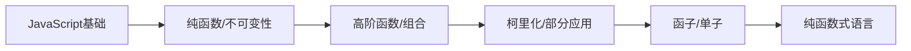

# 函数式编程详解：概念、原理与实践

## 什么是函数式编程？

函数式编程（Functional Programming，FP）是一种**编程范式**，它将计算视为数学函数的求值，并避免使用程序状态和可变数据。与命令式编程（如面向对象编程）不同，函数式编程强调函数的应用而非指令的执行。

## 核心概念与原理

### 1. 纯函数 (Pure Functions)
```javascript
// 纯函数示例
function add(a, b) {
    return a + b;
}

// 非纯函数示例（有副作用）
let total = 0;
function addToTotal(x) {
    total += x; // 修改了外部状态
    return total;
}
```

**特性**：
- 相同输入始终产生相同输出
- 无副作用（不修改外部状态）
- 不依赖外部状态

### 2. 不可变性 (Immutability)
```javascript
// 不可变数据操作
const original = [1, 2, 3];
const updated = [...original, 4]; // 创建新数组

// 对象不可变性
const person = { name: "Alice", age: 30 };
const updatedPerson = { ...person, age: 31 };
```

**原理**：数据一旦创建就不能被修改，任何"修改"操作都会创建新的数据副本。

### 3. 高阶函数 (Higher-Order Functions)
```javascript
// 函数作为参数
function map(array, transform) {
    const result = [];
    for (let i = 0; i < array.length; i++) {
        result.push(transform(array[i]));
    }
    return result;
}

const doubled = map([1, 2, 3], x => x * 2); // [2, 4, 6]

// 函数作为返回值
function createMultiplier(factor) {
    return function(x) {
        return x * factor;
    };
}

const triple = createMultiplier(3);
console.log(triple(5)); // 15
```

### 4. 函数组合 (Function Composition)
```javascript
// 简单组合
const compose = (f, g) => x => f(g(x));

const toUpperCase = str => str.toUpperCase();
const exclaim = str => str + '!';

const shout = compose(exclaim, toUpperCase);
console.log(shout('hello')); // "HELLO!"

// 多函数组合
const pipe = (...fns) => x => fns.reduce((v, f) => f(v), x);

const add5 = x => x + 5;
const multiplyBy2 = x => x * 2;
const subtract10 = x => x - 10;

const transform = pipe(add5, multiplyBy2, subtract10);
console.log(transform(10)); // (10+5=15, 15*2=30, 30-10=20) -> 20
```

### 5. 递归 (Recursion)
```javascript
// 递归代替循环
function factorial(n) {
    if (n <= 1) return 1;
    return n * factorial(n - 1);
}

// 尾递归优化
function factorialTail(n, acc = 1) {
    if (n <= 1) return acc;
    return factorialTail(n - 1, n * acc);
}
```

### 6. 柯里化 (Currying)
```javascript
// 普通函数
function add(a, b, c) {
    return a + b + c;
}

// 柯里化版本
function curryAdd(a) {
    return function(b) {
        return function(c) {
            return a + b + c;
        };
    };
}

const add5 = curryAdd(5);
const add5and3 = add5(3);
console.log(add5and3(2)); // 10

// 更通用的柯里化函数
function curry(fn) {
    return function curried(...args) {
        if (args.length >= fn.length) {
            return fn.apply(this, args);
        } else {
            return function(...args2) {
                return curried.apply(this, args.concat(args2));
            };
        }
    };
}

const curriedMultiply = curry((a, b, c) => a * b * c);
console.log(curriedMultiply(2)(3)(4)); // 24
```

## 函数式编程的优势

1. **更易推理和测试**：纯函数没有副作用，测试时只需关注输入输出
2. **更安全的并发**：不可变数据天然线程安全
3. **更简洁的代码**：通过高阶函数和组合减少样板代码
4. **更少的Bug**：避免由共享状态引起的问题
5. **更好的模块化**：函数是独立的构建块

## 实践应用

### 数据处理管道
```javascript
const data = [
    { id: 1, name: "Alice", age: 25, score: 85 },
    { id: 2, name: "Bob", age: 30, score: 92 },
    { id: 3, name: "Charlie", age: 22, score: 78 },
    { id: 4, name: "Diana", age: 28, score: 95 }
];

// 函数式数据处理
const result = data
    .filter(person => person.age > 25) // 过滤年龄大于25
    .map(person => ({ // 转换结构
        ...person,
        grade: person.score >= 90 ? 'A' : 
               person.score >= 80 ? 'B' : 'C'
    }))
    .sort((a, b) => b.score - a.score); // 按分数降序排序

console.log(result);
```

### React中的函数式编程
```jsx
// 使用纯函数组件
const UserList = ({ users }) => (
    <ul>
        {users.map(user => (
            <li key={user.id}>
                {user.name} - {user.email}
            </li>
        ))}
    </ul>
);

// 使用高阶组件
const withLoading = (Component) => ({ isLoading, ...props }) => 
    isLoading ? <div>Loading...</div> : <Component {...props} />;

const EnhancedUserList = withLoading(UserList);

// 在应用中使用
<EnhancedUserList 
    isLoading={loading} 
    users={userData} 
/>
```

## 函数式编程语言

1. **纯函数式**：
   - Haskell
   - Elm

2. **多范式支持FP**：
   - JavaScript (ES6+)
   - Python
   - Scala
   - F#
   - Clojure

3. **传统语言中的FP支持**：
   - Java (Streams API)
   - C# (LINQ)
   - C++ (Lambda表达式)

## 学习路径建议

1. 从JavaScript/TypeScript开始实践基本概念
2. 学习常用函数式工具：
   - Lodash FP
   - Ramda
3. 尝试纯函数式语言如Elm
4. 深入学习Haskell
5. 实践函数式响应式编程(RxJS)



函数式编程不仅是一种技术，更是一种思考问题的方式。通过将复杂问题分解为小型纯函数的组合，我们可以构建出更可靠、更易维护的应用程序系统。