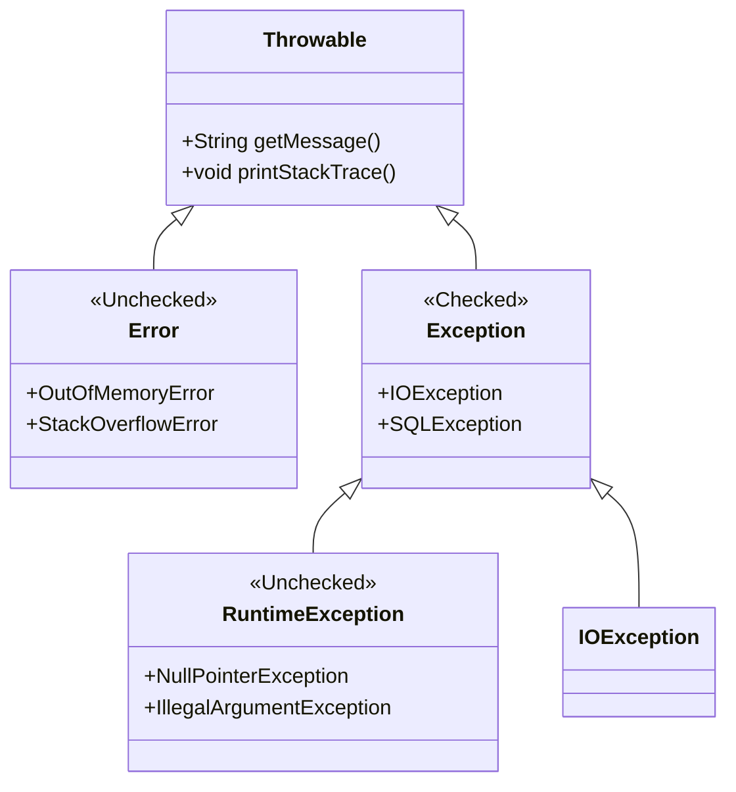
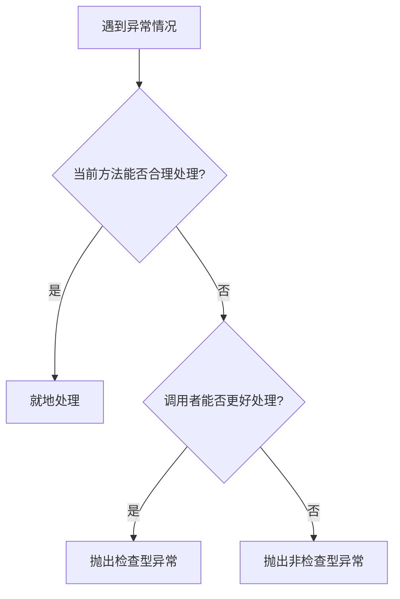
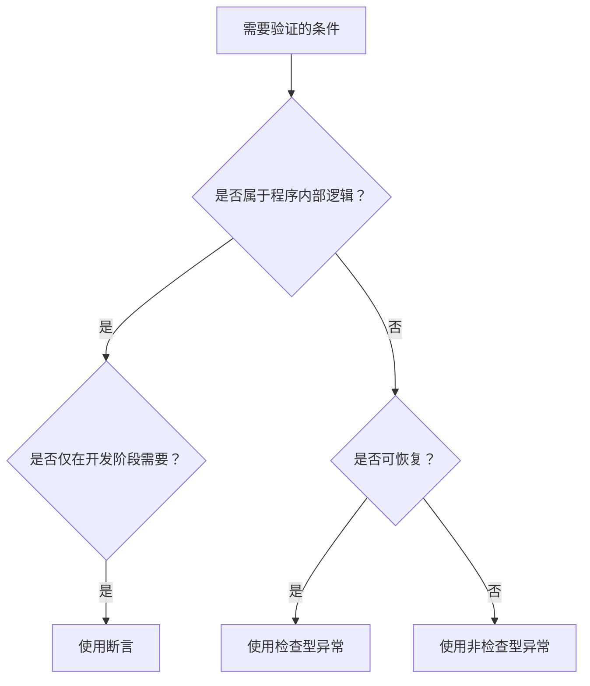

# Java核心基础卷5

# 异常

# Java 异常处理：全面指南与最佳实践

## 一、异常处理基础概念

### 1. 异常的本质与分类

**异常**是程序执行过程中发生的不正常事件，会中断正常指令流。Java 异常体系结构如下：



#### 异常分类：

| **类型**         | **特点**               | **示例**                                                 |
| ---------------- | ---------------------- | -------------------------------------------------------- |
| **检查型异常**   | 必须处理（编译时强制） | `IOException`, `SQLException`                            |
| **非检查型异常** | 运行时异常，可不处理   | `NullPointerException`, `ArrayIndexOutOfBoundsException` |
| **错误(Error)**  | JVM 严重问题，无法恢复 | `OutOfMemoryError`, `StackOverflowError`                 |

### 2. 异常处理核心机制

#### try-catch-finally 基本结构：

```java
try {
    // 可能抛出异常的代码
    FileInputStream fis = new FileInputStream("file.txt");
} catch (FileNotFoundException e) {
    // 处理特定异常
    System.err.println("文件未找到: " + e.getMessage());
} catch (IOException e) {
    // 处理更通用的异常
    System.err.println("IO 错误: " + e.getMessage());
} finally {
    // 始终执行的清理代码
    if (fis != null) {
        try {
            fis.close();
        } catch (IOException e) {
            // 处理关闭异常
        }
    }
}
```

## 二、异常捕获与处理技巧

### 1. 精确异常捕获

**从具体到一般**的捕获顺序：

```java
try {
    // 数据库操作
} catch (SQLSyntaxErrorException e) {
    // 处理特定SQL语法错误
} catch (SQLException e) {
    // 处理通用SQL异常
} catch (Exception e) {
    // 兜底处理
}
```

### 2. 多重捕获（Java 7+）

```java
try {
    // 可能抛出多种异常
} catch (FileNotFoundException | ParseException e) {
    // 统一处理文件未找到或解析异常
    logger.error("输入处理失败", e);
}
```

### 3. try-with-resources（Java 7+）

自动资源管理，无需显式 finally 关闭：

```java
try (FileInputStream fis = new FileInputStream("file.txt");
     BufferedReader br = new BufferedReader(new InputStreamReader(fis))) {
    // 使用资源
    System.out.println(br.readLine());
} catch (IOException e) {
    // 处理异常
}
```

### 4. 异常信息记录

正确记录异常信息：

```java
try {
    // ...
} catch (Exception e) {
    // 错误方式：丢失堆栈信息
    logger.error("错误发生: " + e); 
    
    // 正确方式：保留完整堆栈
    logger.error("错误详情", e); 
}
```

## 三、异常抛出与传播

### 1. 声明抛出异常（throws）

```java
public void readFile() throws IOException {
    // 可能抛出IOException的方法
    Files.readAllBytes(Paths.get("file.txt"));
}
```

### 2. 主动抛出异常（throw）

```java
public void setAge(int age) {
    if (age < 0 || age > 150) {
        throw new IllegalArgumentException("无效年龄: " + age);
    }
    this.age = age;
}
```

### 3. 异常包装与链式传递

```java
try {
    // 数据库操作
} catch (SQLException e) {
    // 包装原始异常，添加上下文信息
    throw new DataAccessException("数据库操作失败", e);
}
```

## 四、自定义异常实践

### 1. 创建自定义异常

```java
// 业务异常基类
public class BusinessException extends RuntimeException {
    private final ErrorCode errorCode;
    
    public BusinessException(ErrorCode errorCode, String message) {
        super(message);
        this.errorCode = errorCode;
    }
    
    public ErrorCode getErrorCode() {
        return errorCode;
    }
}

// 具体业务异常
public class InsufficientFundsException extends BusinessException {
    public InsufficientFundsException(double balance) {
        super(ErrorCode.INSUFFICIENT_FUNDS, 
              "余额不足，当前余额: " + balance);
    }
}
```

### 2. 使用自定义异常

```java
public void withdraw(double amount) {
    if (amount > balance) {
        throw new InsufficientFundsException(balance);
    }
    balance -= amount;
}
```

## 五、异常处理最佳实践

### 1. 处理 vs 抛出的决策树



### 2. 黄金原则

1. **早抛出**：在问题发生点尽快抛出异常
2. **晚捕获**：在具备足够上下文处理时才捕获
3. **异常透明**：避免捕获后"吞掉"异常
4. **资源安全**：使用 try-with-resources 确保资源释放
5. **日志完整**：记录异常时包含完整堆栈信息

### 3. 性能优化

- **避免在循环内捕获**：将 try-catch 移至循环外部

- **减少异常实例化开销**：重用异常对象（谨慎使用）

  ```java
  private static final IllegalArgumentException INVALID_ARG = 
      new IllegalArgumentException("无效参数");
  
  public void validate(Object arg) {
      if (arg == null) throw INVALID_ARG;
  }
  ```

## 六、常见反模式与解决方案

### 1. 空捕获块（最危险的反模式）

```java
// ❌ 错误：完全忽略异常
try {
    processData();
} catch (Exception e) {
    // 什么都不做！
}

// ✅ 修复：至少记录日志
try {
    processData();
} catch (Exception e) {
    logger.error("数据处理失败", e);
}
```

### 2. 过度泛化的捕获

```java
// ❌ 错误：捕获过于宽泛
try {
    // ...
} catch (Exception e) { // 捕获所有异常
    // ...
}

// ✅ 修复：精确捕获具体异常
try {
    // ...
} catch (FileNotFoundException e) {
    // 处理特定异常
} catch (IOException e) {
    // 处理IO异常
}
```

### 3. finally 块中的资源泄漏

```java
// ❌ 错误：finally中未正确处理异常
FileInputStream fis = null;
try {
    fis = new FileInputStream("file.txt");
    // ...
} finally {
    fis.close(); // 如果close抛出异常，会掩盖原始异常
}

// ✅ 修复：Java 7+ 使用try-with-resources
try (FileInputStream fis = new FileInputStream("file.txt")) {
    // ...
}
```

### 4. 异常信息暴露

```java
// ❌ 错误：暴露敏感信息
try {
    connectDatabase();
} catch (SQLException e) {
    throw new RuntimeException("连接失败: " + e.getMessage());
    // 可能暴露数据库地址、凭证等
}

// ✅ 修复：使用安全异常消息
try {
    connectDatabase();
} catch (SQLException e) {
    logger.error("数据库连接错误", e);
    throw new ServiceException("系统内部错误");
}
```

## 七、企业级异常处理框架

### 1. Spring 的异常处理

```java
@ControllerAdvice
public class GlobalExceptionHandler {
    
    @ExceptionHandler(BusinessException.class)
    public ResponseEntity<ErrorResponse> handleBusinessException(BusinessException ex) {
        return ResponseEntity.status(HttpStatus.BAD_REQUEST)
                .body(new ErrorResponse(ex.getErrorCode(), ex.getMessage()));
    }
    
    @ExceptionHandler(Exception.class)
    public ResponseEntity<ErrorResponse> handleAllExceptions(Exception ex) {
        return ResponseEntity.status(HttpStatus.INTERNAL_SERVER_ERROR)
                .body(new ErrorResponse("SYSTEM_ERROR", "系统内部错误"));
    }
}
```

### 2. 错误响应标准化

```java
public class ErrorResponse {
    private String code;
    private String message;
    private Instant timestamp;
    
    // 构造器、getter省略
}
```

## 八、异常处理检查清单

1. **设计阶段**：
   - 定义清晰的异常层次结构
   - 确定检查型 vs 非检查型异常策略
   - 规划跨模块异常传递规则

2. **编码阶段**：
   - 使用 try-with-resources 管理资源
   - 避免捕获 `Throwable` 或 `Error`
   - 为自定义异常提供有用上下文信息

3. **测试阶段**：
   - 单元测试覆盖所有异常分支
   - 验证异常消息的完整性和安全性
   - 压力测试异常处理性能影响

4. **生产运维**：
   - 监控异常频率和类型
   - 配置报警规则（如每分钟超过50次相同异常）
   - 定期审计异常处理代码

## 总结：异常处理核心原则

| **原则**         | **正确做法**                             | **错误做法**                     |
| ---------------- | ---------------------------------------- | -------------------------------- |
| **异常类型选择** | 业务错误用自定义异常，技术错误用内置异常 | 所有错误都用 `RuntimeException`  |
| **异常消息**     | 提供足够诊断信息但不暴露敏感数据         | 返回原始异常消息给最终用户       |
| **资源管理**     | 使用 try-with-resources                  | finally 块中手动关闭且不处理异常 |
| **日志记录**     | 记录异常时包含完整堆栈轨迹               | 仅记录异常消息文本               |
| **异常传递**     | 包装底层异常添加上下文信息               | 直接抛出原始底层异常             |
| **全局处理**     | 使用 `@ControllerAdvice` 统一处理        | 在每个控制器重复异常处理逻辑     |

> **终极建议**：  
> 将异常视为**领域模型的一部分**，而非技术细节。良好的异常处理能显著提升系统的可维护性、可诊断性和用户体验。


# 断言

# Java 断言机制深度解析

## 一、断言核心概念

### 1. 断言定义

**断言（Assertion）** 是一种在代码中嵌入的**可验证检查点**，用于在开发和测试阶段验证程序内部逻辑的正确性。当程序执行到断言位置时，会检查指定的布尔条件，如果条件为假，立即抛出 `AssertionError`。

### 2. 断言的本质特性

| **特性**         | **说明**                                               |
| ---------------- | ------------------------------------------------------ |
| **开发阶段工具** | 主要用于开发调试，生产环境通常禁用                     |
| **条件验证**     | 验证程序内部状态是否符合预期（如参数约束、算法不变式） |
| **快速失败**     | 条件失败时立即抛出错误，避免后续错误传播               |
| **可配置性**     | 可通过JVM参数全局或按包/类启用/禁用                    |
| **非异常替代**   | 不用于处理常规错误（如用户输入错误、IO问题等）         |

## 二、断言语法详解

### 1. 基本语法形式

```java
// 简单形式（无错误信息）
assert condition;

// 带消息形式（包含诊断信息）
assert condition : errorMessage;
```

### 2. 语法要素解析

| **部分**       | **说明**                                             | **示例**                  |
| -------------- | ---------------------------------------------------- | ------------------------- |
| `assert`       | Java关键字（JDK 1.4+）                               | `assert`                  |
| `condition`    | 布尔表达式，必须为true才能继续执行                   | `x > 0`                   |
| `errorMessage` | 可选的错误消息表达式（任意类型，自动调用toString()） | `"x应为正数，实际：" + x` |

### 3. 完整使用示例

```java
public class CircleCalculator {
    public double calculateArea(double radius) {
        // 验证前置条件
        assert radius >= 0 : "半径不能为负数: " + radius;
        
        double area = Math.PI * radius * radius;
        
        // 验证后置条件
        assert area >= 0 : "面积计算错误: " + area;
        
        return area;
    }
}
```

## 三、启用与禁用断言

### 1. 启用断言

```bash
# 启用所有断言
java -ea com.example.Main

# 启用特定包的断言
java -ea:com.example... com.example.Main

# 启用特定类的断言
java -ea:com.example.Calculator com.example.Main
```

### 2. 禁用断言

```bash
# 禁用所有断言（默认状态）
java com.example.Main

# 禁用特定包的断言
java -da:com.example... com.example.Main

# 禁用系统类断言（默认禁用）
java -dsa com.example.Main
```

### 3. 断言状态检测

```java
public class AssertionStatusCheck {
    public static void main(String[] args) {
        // 检测当前类断言状态
        boolean enabled = AssertionStatusCheck.class.desiredAssertionStatus();
        System.out.println("断言状态: " + (enabled ? "启用" : "禁用"));
    }
}
```

## 四、典型应用场景

### 1. 内部不变性检查

```java
public class Matrix {
    private final double[][] data;
    
    public Matrix(double[][] data) {
        this.data = data;
        // 验证矩阵结构
        assert isRectangular(data) : "矩阵行长度不一致";
    }
    
    private boolean isRectangular(double[][] matrix) {
        int cols = matrix[0].length;
        for (double[] row : matrix) {
            if (row.length != cols) return false;
        }
        return true;
    }
}
```

### 2. 控制流不可达验证

```java
public class NetworkService {
    public void process(Response response) {
        switch (response.getStatus()) {
            case SUCCESS: handleSuccess(); break;
            case FAILURE: handleFailure(); break;
            case TIMEOUT: handleTimeout(); break;
            default:
                // 确保所有状态都被处理
                assert false : "未知响应状态: " + response.getStatus();
        }
    }
}
```

### 3. 算法不变式验证

```java
public class BinarySearcher {
    public int search(int[] array, int target) {
        assert isSorted(array) : "数组必须有序";
        
        int low = 0;
        int high = array.length - 1;
        
        while (low <= high) {
            int mid = (low + high) >>> 1;
            int midVal = array[mid];
            
            if (midVal < target)
                low = mid + 1;
            else if (midVal > target)
                high = mid - 1;
            else
                return mid; // 找到目标
        }
        
        return -1; // 未找到
    }
    
    private boolean isSorted(int[] array) {
        for (int i = 0; i < array.length - 1; i++) {
            if (array[i] > array[i+1]) return false;
        }
        return true;
    }
}
```

## 五、断言与异常的区别

| **维度**     | **断言（Assertion）**                   | **异常（Exception）**            |
| ------------ | --------------------------------------- | -------------------------------- |
| **设计目的** | 检测程序内部逻辑错误                    | 处理可预见的异常情况             |
| **使用阶段** | 开发/测试阶段（生产环境通常禁用）       | 全生命周期（开发、测试、生产）   |
| **处理机制** | 失败时抛出 `AssertionError`（不可恢复） | 可捕获处理并恢复                 |
| **启用方式** | 需显式通过JVM参数开启                   | 始终启用                         |
| **适用场景** | 验证不变式、前置/后置条件               | 处理用户输入错误、外部资源问题等 |
| **性能影响** | 可完全移除（禁用时无开销）              | 始终存在性能开销                 |

## 六、使用断言的最佳实践

### 1. 适用场景指南



### 2. 黄金原则

1. **不用于公共API参数校验**

   ```java
   // ❌ 错误用法：公共方法参数校验
   public void setTemperature(double temp) {
       assert temp >= -273.15 : "绝对零度不可达";
       this.temp = temp;
   }
   
   // ✅ 正确做法：使用异常
   public void setTemperature(double temp) {
       if (temp < -273.15) {
           throw new IllegalArgumentException("绝对零度不可达");
       }
       this.temp = temp;
   }
   ```

2. **避免副作用**

   ```java
   // ❌ 危险：断言包含副作用
   assert updateDatabase() : "数据库更新失败";
   
   // ✅ 安全：无副作用
   boolean success = updateDatabase();
   assert success : "数据库更新失败";
   ```

3. **提供有效诊断信息**

   ```java
   // ❌ 无信息：难以定位问题
   assert isValid(state);
   
   // ✅ 含诊断信息
   assert isValid(state) : "无效状态: " + state;
   ```

## 七、常见错误与规避方案

### 1. 生产环境依赖断言

**问题**：生产环境断言默认禁用，导致关键检查被跳过

```java
public void processPayment(double amount) {
    assert amount > 0; // 生产环境可能被禁用
    // 处理支付...
}
```

**修复**：关键检查使用异常机制

```java
public void processPayment(double amount) {
    if (amount <= 0) {
        throw new IllegalArgumentException("金额必须为正数");
    }
    // 处理支付...
}
```

### 2. 忽略断言禁用风险

**问题**：断言逻辑影响程序行为

```java
private boolean debugMode = false;

public void initialize() {
    assert (debugMode = true); // 副作用：改变debugMode
    // 初始化...
}
```

**修复**：隔离断言与业务逻辑

```java
private boolean debugMode = false;

public void initialize() {
    boolean temp = true;
    assert temp; // 无副作用
    debugMode = temp;
    // 初始化...
}
```

## 八、高级应用技巧

### 1. 条件编译替代方案

```java
private static final boolean DEBUG = false;

public void complexOperation() {
    // 类内模拟断言机制
    if (DEBUG && !invariantCheck()) {
        throw new AssertionError("不变式违反");
    }
    // 操作代码...
}
```

### 2. 结合单元测试框架

```java
public class AssertionTests {
    @Test(expected = AssertionError.class)
    public void testInvalidInput() {
        // 启用断言状态下应抛出AssertionError
        Calculator calc = new Calculator();
        calc.squareRoot(-1); // 方法内有: assert x >= 0;
    }
}
```

### 3. 性能敏感场景优化

```java
public class HighPerformanceAlgorithm {
    public void execute() {
        // 仅当断言启用时执行昂贵检查
        if (assertionsEnabled()) {
            performExpensiveConsistencyCheck();
        }
        // 核心算法...
    }
    
    private boolean assertionsEnabled() {
        boolean enabled = false;
        assert enabled = true; // 利用断言副作用检测状态
        return enabled;
    }
}
```

## 九、断言在Java生态中的应用

### 1. Java标准库使用示例

```java
// Collections.binarySearch 实现片段
private static int indexedBinarySearch(List<?> list, Object key) {
    assert list instanceof RandomAccess; // 验证随机访问特性
    // 二分查找实现...
}
```

### 2. JVM参数最佳实践

```bash
# 开发环境配置
java -ea -da:com.thirdparty... -ea:com.ourproject... MainApp

# 生产环境配置
java -server -XX:+AggressiveOpts MainApp
```

## 总结：断言使用决策矩阵

| **条件**                       | **推荐方案**             | **理由**                       |
| ------------------------------ | ------------------------ | ------------------------------ |
| 验证内部算法不变式             | 断言                     | 纯内部逻辑，生产环境无需检查   |
| 公共API参数校验                | IllegalArgumentException | 必须始终验证                   |
| 外部资源状态检查（文件、网络） | 异常                     | 可恢复错误，可能在生产环境发生 |
| 调试辅助代码                   | 断言                     | 仅开发阶段需要                 |
| 关键业务规则检查               | 异常                     | 生产环境必须保证执行           |

**最终建议**：

1. 在开发和测试阶段**充分使用断言**验证内部假设
2. 生产部署时**默认禁用断言**（-da）
3. 通过代码审查确保**断言不包含业务逻辑**
4. 对性能敏感模块使用**断言状态检测**优化
5. **关键检查**始终使用异常机制

> 断言是Java开发者工具箱中的"精密仪器"——在正确场景下使用，它能显著提升代码质量和开发效率；但误用或滥用则可能导致严重问题。掌握其精妙之处，方能发挥最大价值。


# 日志

### Logback 与 SLF4J 使用指南

#### **核心组件介绍**

1. **SLF4J (Simple Logging Facade for Java)**
   - **定位**：日志门面框架（抽象层）
   - **作用**：提供统一日志API，解耦应用与具体日志实现
   - **核心接口**：`Logger`、`LoggerFactory`
   - **优势**：
     - 支持参数化日志：`logger.debug("User: {} logged in", username)`
     - 避免日志级别检查导致的性能浪费

2. **Logback**
   - **定位**：SLF4J 原生实现（Log4j 作者开发的继任者）
   - **组成模块**：
     - `logback-core`：基础库
     - `logback-classic`：完整SLF4J实现
     - `logback-access`：Web容器集成
   - **核心优势**：
     - 性能优于 Log4j（异步日志快10倍）
     - 自动重载配置文件
     - 丰富的过滤策略
     - 强大的归档策略（TimeBasedRollingPolicy）

---

### **快速配置步骤**

#### 1. 添加依赖（Maven）

```xml
<!-- SLF4J API -->
<dependency>
    <groupId>org.slf4j</groupId>
    <artifactId>slf4j-api</artifactId>
    <version>2.0.9</version>
</dependency>

<!-- Logback 实现 -->
<dependency>
    <groupId>ch.qos.logback</groupId>
    <artifactId>logback-classic</artifactId>
    <version>1.4.11</version>
</dependency>

<!-- 可选：JSON日志 -->
<dependency>
    <groupId>ch.qos.logback.contrib</groupId>
    <artifactId>logback-json-classic</artifactId>
    <version>0.1.5</version>
</dependency>
```

#### 2. 基础配置文件 `logback.xml`

```xml
<?xml version="1.0" encoding="UTF-8"?>
<configuration scan="true" scanPeriod="30 seconds">

  <!-- 控制台输出 -->
  <appender name="CONSOLE" class="ch.qos.logback.core.ConsoleAppender">
    <encoder>
      <pattern>%d{yyyy-MM-dd HH:mm:ss} [%thread] %-5level %logger{36} - %msg%n</pattern>
    </encoder>
  </appender>

  <!-- 文件滚动日志 -->
  <appender name="FILE" class="ch.qos.logback.core.rolling.RollingFileAppender">
    <file>logs/app.log</file>
    <rollingPolicy class="ch.qos.logback.core.rolling.SizeAndTimeBasedRollingPolicy">
      <fileNamePattern>logs/app.%d{yyyy-MM-dd}.%i.log.gz</fileNamePattern>
      <maxFileSize>100MB</maxFileSize>
      <maxHistory>30</maxHistory>
      <totalSizeCap>5GB</totalSizeCap>
    </rollingPolicy>
    <encoder>
      <pattern>%d{ISO8601} [%thread] %-5level %logger{40} - %msg%n</pattern>
    </encoder>
  </appender>

  <!-- 异步日志提升性能 -->
  <appender name="ASYNC" class="ch.qos.logback.classic.AsyncAppender">
    <queueSize>1024</queueSize>
    <discardingThreshold>0</discardingThreshold>
    <appender-ref ref="FILE"/>
  </appender>

  <!-- 日志级别控制 -->
  <root level="INFO">
    <appender-ref ref="CONSOLE"/>
    <appender-ref ref="ASYNC"/>
  </root>
  
  <!-- 包级别日志 -->
  <logger name="com.yourpackage" level="DEBUG"/>
</configuration>
```

#### 3. Java 代码使用

```java
import org.slf4j.Logger;
import org.slf4j.LoggerFactory;

public class MyService {
    // 推荐使用常量声明Logger
    private static final Logger logger = LoggerFactory.getLogger(MyService.class);
    
    public void process() {
        logger.trace("Detailed trace message"); // 低级别日志
        logger.debug("Debug data: {}", complexObject); // 参数化日志
        logger.info("Service started");
        
        try {
            // 业务代码
        } catch (Exception ex) {
            logger.error("Processing failed: ", ex); // 异常堆栈记录
        }
    }
}
```

---

### **高级特性应用**

#### 1. **条件日志输出**

```java
// 避免不必要的字符串拼接
if (logger.isDebugEnabled()) {
    logger.debug("Heavy data: {}", computeExpensiveData());
}
```

#### 2. **MDC (Mapped Diagnostic Context)**

```java
// 设置请求ID
MDC.put("requestId", UUID.randomUUID().toString());
try {
    logger.info("Start processing");
    // 业务逻辑
} finally {
    MDC.remove("requestId"); // 必须清理
}

// 配置中引用
<pattern>%d [%X{requestId}] %msg%n</pattern>
```

#### 3. **多环境配置**

```xml
<!-- 通过系统属性切换配置 -->
<springProfile name="dev">
    <root level="DEBUG"/>
</springProfile>
<springProfile name="prod">
    <root level="WARN"/>
    <appender-ref ref="SENTRY"/> <!-- 错误监控系统 -->
</springProfile>
```

#### 4. **JSON 日志输出**

```xml
<appender name="JSON" class="ch.qos.logback.core.ConsoleAppender">
    <encoder class="ch.qos.logback.contrib.json.classic.JsonLayout">
        <jsonFormatter class="ch.qos.logback.contrib.jackson.JacksonJsonFormatter"/>
        <timestampFormat>yyyy-MM-dd'T'HH:mm:ss.SSSZ</timestampFormat>
        <appendLineSeparator>true</appendLineSeparator>
    </encoder>
</appender>
```

---

### **最佳实践建议**

1. **日志级别规范**

   - `ERROR`：需要人工干预的系统错误
   - `WARN`：可自动恢复的异常（如重试成功）
   - `INFO`：关键业务流程节点
   - `DEBUG`：诊断信息（生产环境默认关闭）
   - `TRACE`：详细数据流（仅开发环境使用）

2. **性能优化**

   - 使用`AsyncAppender`避免I/O阻塞
   - 生产环境禁用`console` appender
   - 敏感数据过滤：实现`MessageConverter`

3. **日志治理**

   ```xml
   <!-- 错误日志单独存储 -->
   <appender name="ERROR_FILE" class="ch.qos.logback.core.rolling.RollingFileAppender">
     <filter class="ch.qos.logback.classic.filter.ThresholdFilter">
       <level>ERROR</level>
     </filter>
   </appender>
   ```

4. **动态调整日志级别**

   - 通过JMX：`jconsole > ch.qos.logback.classic > setLoggerLevel`
   - 通过Spring Boot Actuator：`POST /actuator/loggers/com.example`

---

### **与传统JDK日志对比**

| 特性           | `java.util.logging` | Logback + SLF4J     |
| -------------- | ------------------- | ------------------- |
| 配置灵活性     | 有限（properties）  | 强大（XML/Groovy）  |
| 日志归档策略   | 基础                | 支持时间/大小双维度 |
| 异步日志       | 需自定义            | 内置高性能实现      |
| 动态刷新配置   | 不支持              | 支持热加载          |
| 上下文数据传递 | 无                  | MDC支持             |
| 日志过滤       | 简单                | 复杂条件支持        |
| 社区支持       | 官方维护            | 活跃社区生态        |

> **迁移提示**：使用`jul-to-slf4j`桥接器可将JDK日志重定向到SLF4J

通过SLF4J+Logback组合，开发者能获得企业级的日志管理能力，同时保持代码与具体实现的解耦，是替代JDK日志的理想方案。


# 调试技巧

### Java 调试核心技巧（IDE + 命令行 + 生产环境）

---

#### **一、IDE 高效调试（IntelliJ/Eclipse 通用）**

1. **智能断点进阶**

   ```java
   // 条件断点（当 count>100 时暂停）
   for (int i = 0; i < 1000; i++) {  // 右键断点 -> Condition: i > 100
       process(data[i]);
   }
   
   // 字段断点（对象属性修改时触发）
   class User {
       private String name;  // 在字段行设断点 -> 右键选择 "Field Watchpoint"
   }
   ```

2. **流式调试技巧**

   - **表达式求值**：调试时按 `Alt+F8` 实时执行代码片段
   - **Stream Trace**：在流操作代码处设断点 → 查看流元素处理过程
   - **Lambda 调试**：强制进入 lambda 方法（IDEA 点击 `Force Step Into`）

3. **多线程调试**

   ```java
   ExecutorService pool = Executors.newFixedThreadPool(3);
   // 设置断点 -> 右键选择 "Suspend: Thread"（非默认的All）
   pool.submit(() -> task1());
   pool.submit(() -> task2());
   ```

4. **即时代码热更新**

   - 修改方法体 → `Ctrl+Shift+F9`（IDEA）重编译并继续执行
   - 支持：变量名修改、方法逻辑调整（不支持结构变更）

---

#### **二、命令行调试工具**

1. **JDB 基础调试**

   ```bash
   # 启动调试
   java -agentlib:jdwp=transport=dt_socket,server=y,suspend=n,address=5005 MyApp
   
   # 连接调试
   jdb -attach 5005
   > stop at MyClass:22    # 在第22行设断点
   > run                   # 启动程序
   > locals                # 查看局部变量
   ```

2. **JStack 诊断卡死**

   ```bash
   # 1. 查找Java进程PID
   jps -l
   
   # 2. 捕获线程快照
   jstack -l 12345 > thread_dump.txt
   
   # 分析重点：
   - "BLOCKED" 状态线程
   - 死锁提示："Found one Java-level deadlock"
   ```

3. **JMap + MAT 分析内存泄漏**

   ```bash
   # 生成堆转储文件
   jmap -dump:live,format=b,file=heap.bin 12345
   
   # 使用 Eclipse Memory Analyzer 分析：
   - Dominator Tree 查找占用最大对象
   - Path to GC Roots 追踪引用链
   ```

---

#### **三、生产环境调试技巧**

1. **Arthas 实时诊断**

   ```bash
   # 启动Arthas
   java -jar arthas-boot.jar
   
   # 常用命令：
   [arthas@12345]$ watch com.example.Service * '{params, returnObj}' -x 3  # 观察方法入参/返回值
   [arthas@12345]$ trace *.ClassName methodName # 追踪方法调用链路
   [arthas@12345]$ jad --source-only com.example.Class > source.java  # 反编译类
   ```

2. **动态日志级别调整**

   ```bash
   # Spring Boot Actuator
   curl -X POST http://localhost:8080/actuator/loggers/com.example \
   -H "Content-Type: application/json" \
   -d '{"configuredLevel": "DEBUG"}'
   ```

3. **轻量级远程调试**

   ```bash
   # 启动应用时添加参数（慎用！仅限内网）
   java -agentlib:jdwp=transport=dt_socket,server=y,address=5005,suspend=n -jar app.jar
   
   # IDEA 连接：Run -> Edit Configurations -> Remote JVM Debug
   ```

---

#### **四、调试策略优化**

1. **防御性日志定位**

   ```java
   // 在异常捕获点记录完整上下文
   try {
       riskyOperation();
   } catch (Exception ex) {
       logger.error("Operation failed. Params: {} | Context: {}", 
                    params, 
                    getContextSnapshot(),  // 关键上下文快照
                    ex);
   }
   ```

2. **单元测试调试法**

   ```java
   // 在测试中复现问题
   @Test
   void reproduceBug() {
       // 1. 构造问题数据
       Input input = createProblematicInput(); 
       
       // 2. 调试模式运行测试
       testSUT(input);  // 在此方法内设断点
   }
   ```

3. **内存问题快速定位**

   | 工具         | 命令                        | 用途                 |
   | ------------ | --------------------------- | -------------------- |
   | **jstat**    | `jstat -gcutil 12345 1s`    | 实时GC监控           |
   | **VisualVM** | 连接进程 → 抽样器           | CPU/内存热点方法分析 |
   | **jcmd**     | `jcmd 12345 GC.class_stats` | 类内存占用统计       |

---

#### **五、调试禁忌与最佳实践**

- **生产环境禁止**：
  - 直接修改代码调试
  - 长时间开启远程调试端口
  - 高频日志输出（影响性能）

- **高效调试原则**：
  1. 优先通过日志定位问题区域
  2. 最小化复现代码块（隔离问题）
  3. 使用条件断点避免无效暂停
  4. 多线程问题用快照分析替代单步跟踪

> **终极技巧**：当常规方法失效时，使用 `-XX:+ShowCodeDetailsInExceptionMessages`（JDK 14+）获取更精确的NPE信息：
>
> ```java
> // 输出示例：Cannot invoke "User.getName()" because "user" is null
> System.out.println(user.getName());
> ```

掌握这些技巧可解决95%的Java调试问题，重点培养**日志分析优先**和**最小化复现**的思维习惯。