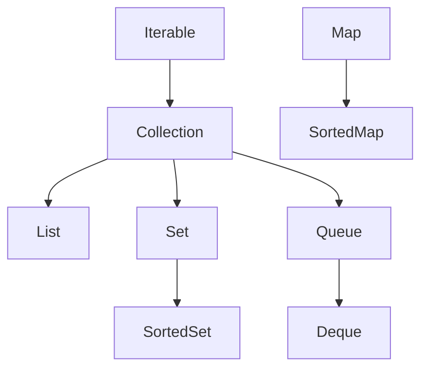
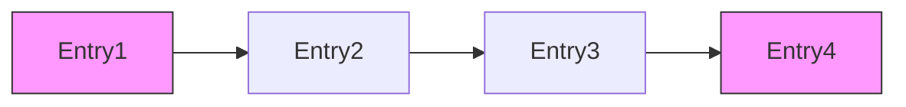

# Java核心基础卷6

# 泛型程序设计

### 教科书式解析：Java 泛型程序设计

---

#### **一、为什么要使用泛型程序设计？**

1. **类型安全（Type Safety）**  

   - 编译时类型检查，避免`ClassCastException`
   - 消除强制类型转换，减少运行时错误

   ```java
   // 非泛型：存在类型转换风险
   List list = new ArrayList();
   list.add("text");
   Integer num = (Integer) list.get(0); // 运行时ClassCastException
   
   // 泛型：编译时捕获错误
   List<String> safeList = new ArrayList<>();
   safeList.add("text");
   // safeList.add(100);  // 编译错误
   ```

2. **代码复用（Code Reusability）**  

   - 编写通用算法，适用于多种数据类型
   - 避免为不同类型重写相同逻辑

   ```java
   // 泛型方法可处理任意类型
   public <T> T getFirst(List<T> list) {
       return list.get(0);
   }
   ```

3. **代码清晰度（Code Clarity）**  

   - 显式声明容器元素类型
   - 增强代码可读性和可维护性

   ```java
   Map<String, List<Student>> school = new HashMap<>(); // 明确键值类型
   ```

4. **API设计优化**  

   - 集合框架（`Collection Framework`）基于泛型
   - 提供类型安全的容器接口

---

#### **二、定义泛型类**

```java
public class Box<T> {      // T: 类型参数
    private T content;     // 泛型字段

    public void set(T content) { 
        this.content = content;
    }

    public T get() {       // 返回泛型类型
        return content;
    }
}
```

**使用示例：**

```java
Box<String> stringBox = new Box<>();
stringBox.set("Hello");
String value = stringBox.get(); // 无需强制转换

Box<Integer> intBox = new Box<>();
intBox.set(100);
```

---

#### **三、泛型方法**

```java
// 类型参数声明在返回类型前
public static <T> T findMax(T[] array, Comparator<T> comparator) {
    T max = array[0];
    for (T item : array) {
        if (comparator.compare(item, max) > 0) {
            max = item;
        }
    }
    return max;
}
```

**类型推断：**

```java
String[] words = {"apple", "banana", "pear"};
String maxWord = findMax(words, String::compareTo); // 自动推断T为String
```

---

#### **四、类型变量的限定**

```java
// T必须实现Comparable接口
public static <T extends Comparable<T>> T max(T a, T b) {
    return a.compareTo(b) > 0 ? a : b;
}

// 多限定：类在前，接口在后
public static <T extends Number & Comparable<T>> T clamp(T val, T min, T max) {
    if (val.compareTo(min) < 0) return min;
    if (val.compareTo(max) > 0) return max;
    return val;
}
```

**限定规则：**

- `extends` 表示上界（类/接口）
- 最多一个类限定，多个接口用`&`连接
- 类型变量不能有下界限定

---

#### **五、泛型代码和虚拟机（类型擦除）**

1. **类型擦除（Type Erasure）**

   - 编译时擦除类型参数，替换为限定类型
   - 无限定类型替换为`Object`

   ```java
   // 编译前
   Box<String> box = new Box<>();
   // 编译后（字节码）
   Box box = new Box(); // 原始类型
   ```

2. **桥方法（Bridge Methods）**

   - 编译器生成合成方法保持多态性

   ```java
   // 泛型类
   class Node<T> {
       public void setData(T data) {...}
   }
   
   // 子类
   class IntNode extends Node<Integer> {
       // 编译器生成桥方法：
       // public void setData(Object data) {
       //    setData((Integer) data);
       // }
   }
   ```

---

#### **六、限制与局限性**

1. **不能用基本类型实例化**

   ```java
   // List<int> list; // 错误
   List<Integer> list; // 正确
   ```

2. **运行时类型查询无效**

   ```java
   if (box instanceof Box<String>) {...} // 编译错误
   ```

3. **不能创建参数化类型数组**

   ```java
   // Box<String>[] boxes = new Box<String>[10]; // 错误
   Box<String>[] boxes = (Box<String>[]) new Box<?>[10]; // 警告
   ```

4. **不能实例化类型变量**

   ```java
   public class Box<T> {
       // private T obj = new T(); // 错误
       private T obj = (T) new Object(); // 不安全
   }
   ```

5. **泛型类不能继承Throwable**

   ```java
   // class Problem<T> extends Exception {...} // 错误
   ```

---

#### **七、泛型类型的继承规则**

1. **参数化类型无协变性**

   ```java
   // 错误示例
   List<String> strList = new ArrayList<>();
   // List<Object> objList = strList; // 编译错误
   ```

2. **原始类型兼容性**

   ```java
   List rawList = new ArrayList<String>(); // 警告
   ```

3. **通配符继承关系**

   ```mermaid
   graph TD
     A[List<?>] --> B[List<? extends Number>]
     A --> C[List<? super Integer>]
     B --> D[List<Integer>]
     C --> D
   ```

---

#### **八、通配符类型（Wildcard Types）**

1. **上界通配符（? extends T）**

   ```java
   // 可读取为T类型，不能写入（null除外）
   void process(List<? extends Number> list) {
       Number num = list.get(0); // 安全
       // list.add(10); // 错误
   }
   ```

2. **下界通配符（? super T）**

   ```java
   // 可写入T类型，读取为Object
   void addNumbers(List<? super Integer> list) {
       list.add(100); // 安全
       Object obj = list.get(0); // 需强制转换
   }
   ```

3. **无限定通配符（?）**

   ```java
   // 只允许null操作
   void printList(List<?> list) {
       for (Object elem : list) {
           System.out.println(elem);
       }
   }
   ```

**PECS原则（Producer-Extends, Consumer-Super）：**  

- 生产者用`? extends T`（输出数据）
- 消费者用`? super T`（输入数据）

---

### 关键概念总结

| 概念         | 要点                                                |
| ------------ | --------------------------------------------------- |
| **泛型优势** | 类型安全、代码复用、消除强制转换                    |
| **泛型类**   | `class ClassName<T> { ... }`                        |
| **泛型方法** | `<T> returnType method(T param) { ... }`            |
| **类型限定** | `<T extends Class & Interface1 & Interface2>`       |
| **类型擦除** | 编译时替换为限定类型/`Object`，生成桥方法           |
| **继承规则** | `Box<Number>`与`Box<Integer>`无继承关系             |
| **通配符**   | `? extends T`（读）、`? super T`（写）、`?`（只读） |

泛型程序设计是Java类型系统的核心进步，通过编译时类型检查显著提升程序健壮性，同时保持与旧代码的兼容性。掌握泛型机制对开发高质量Java程序至关重要。

> [!IMPORTANT]
>
> ### 类型通配符上限/下限 vs 泛型形参上限：使用与注意事项
>
> #### 一、类型通配符的上限（`? extends T`）
>
> **使用场景**：
>
> 1. 作为数据生产者（只读操作）
> 2. 需要从集合中安全读取为父类型
>
> ```java
> // 安全读取Number及其子类
> void printNumbers(List<? extends Number> list) {
>     for (Number n : list) {  // 安全读取
>         System.out.println(n.doubleValue());
>     }
>     // list.add(10); // 编译错误！不能写入
> }
> ```
>
> **注意事项**：
>
> 1. **写入限制**：只能添加`null`（除`null`外不能添加任何元素）
> 2. **读取安全**：读取的元素自动向上转型为`T`
> 3. **类型范围**：接受`T`及其所有子类类型
> 4. **使用场景**：适合只读操作（如遍历、计算）
>
> ---
>
> #### 二、类型通配符的下限（`? super T`）
>
> **使用场景**：
>
> 1. 作为数据消费者（写入操作）
> 2. 需要向集合添加特定类型及其子类
>
> ```java
> // 安全写入Integer及其父类
> void addIntegers(List<? super Integer> list) {
>     list.add(100);    // 安全写入Integer
>     list.add(200);
>     // Integer num = list.get(0); // 编译错误！只能读取为Object
>     Object obj = list.get(0);  // 必须转为Object
> }
> ```
>
> **注意事项**：
>
> 1. **读取限制**：只能读取为`Object`类型（需要显式向下转型）
> 2. **写入安全**：可以添加`T`及其子类对象
> 3. **类型范围**：接受`T`及其所有父类类型
> 4. **使用场景**：适合写入操作（如集合填充）
>
> ---
>
> #### 三、泛型形参的上限（`<T extends U>`）
>
> **使用场景**：
>
> 1. 定义泛型类/方法时约束类型
> 2. 需要调用特定类型的方法
>
> ```java
> // T必须实现Comparable
> class SortedContainer<T extends Comparable<T>> {
>     private T value;
> 
>     public boolean isGreaterThan(T other) {
>         return value.compareTo(other) > 0;  // 可调用Comparable方法
>     }
> }
> ```
>
> **注意事项**：
>
> 1. **多限定规则**：类在前接口在后，用`&`连接
>
>    ```java
>    <T extends Number & Comparable<T> & Serializable>
>    ```
>
> 2. **类型安全**：编译时保证类型满足约束
>
> 3. **方法调用**：可在泛型代码中调用限定类型的方法
>
> 4. **擦除规则**：擦除到第一个限定类型（如`<T extends A & B>` → `A`）
>
> ---
>
> ### 三者的核心区别
>
> | **特性**     | 通配符上限 (`? extends T`) | 通配符下限 (`? super T`) | 泛型形参上限 (`<T extends U>`) |
> | ------------ | -------------------------- | ------------------------ | ------------------------------ |
> | **声明位置** | 方法参数/变量声明          | 方法参数/变量声明        | 类/方法定义                    |
> | **类型关系** | 接受`T`的子类              | 接受`T`的父类            | 约束`T`为`U`的子类             |
> | **写入能力** | 不可写入（除null）         | 可写入`T`及其子类        | 可写入`T`类型                  |
> | **读取能力** | 读取为`T`类型              | 读取为`Object`           | 读取为`T`类型                  |
> | **类型变量** | 无具体类型变量             | 无具体类型变量           | 有具体类型变量`T`              |
> | **典型应用** | 生产者(Producer)           | 消费者(Consumer)         | 类型约束                       |
>
> ---
>
> ### PECS 原则（Producer-Extends, Consumer-Super）
>
> **核心规则**：
>
> ```java
> // 正确应用PECS
> public static <T> void copy(
>     List<? extends T> src,  // PRODUCER: 提供T对象
>     List<? super T> dest    // CONSUMER: 消费T对象
> ) {
>     for (T item : src) {
>         dest.add(item);  // 安全读写
>     }
> }
> ```
>
> **应用场景**：
>
> 1. 生产者（数据来源）：使用`extends`
>
>    ```java
>    // 从集合获取数据
>    T getFirst(List<? extends T> list) {
>        return list.get(0);
>    }
>    ```
>
> 2. 消费者（数据去向）：使用`super`
>
>    ```java
>    // 向集合添加数据
>    void addAll(List<? super T> list, Collection<T> items) {
>        list.addAll(items);
>    }
>    ```
>
> ---
>
> ### 关键注意事项
>
> 1. **通配符不能用于泛型初始化**：
>
>    ```java
>    // 错误示例
>    List<?> list = new ArrayList<?>();  // 编译错误
>    
>    // 正确做法
>    List<?> list = new ArrayList<String>();
>    ```
>
> 2. **嵌套通配符的处理**：
>
>    ```java
>    List<List<? extends Number>> matrix = new ArrayList<>();
>    matrix.add(Arrays.asList(1, 2));       // List<Integer>
>    matrix.add(Arrays.asList(1.1, 2.2));   // List<Double>
>    ```
>
> 3. **与泛型方法配合**：
>
>    ```java
>    // 同时使用泛型方法和通配符
>    public static <T> void merge(
>        List<? super T> dest,
>        List<? extends T> src1,
>        List<? extends T> src2
>    ) {
>        dest.addAll(src1);
>        dest.addAll(src2);
>    }
>    ```
>
> 4. **避免无界通配符滥用**：
>
>    ```java
>    // 过度使用?导致类型信息丢失
>    void process(List<?> list) {  // 只能使用Object方法
>        for (Object o : list) {
>            System.out.println(o);
>        }
>    }
>    
>    // 更好的方式（保留类型信息）
>    <T> void process(List<T> list) {
>        for (T item : list) {
>            System.out.println(item);
>        }
>    }
>    ```
>
> 5. **数组与泛型的特殊处理**：
>
>    ```java
>    // 通配符数组的创建
>    List<?>[] lists = new List<?>[10];  // 允许
>    // List<String>[] arr = new List<String>[10]; // 错误
>    ```
>
> ---
>
> ### 类型系统关系图
>
> ```mermaid
> graph TD
>     Object -->|super| Number[Number super]
>     Number -->|super| Integer[Integer]
> 
>     Producer[Producer: ? extends Number] -->|接受| Integer
>     Producer -->|接受| Double[Double]
> 
>     Consumer[Consumer: ? super Integer] -->|接受| Number
>     Consumer -->|接受| Object
> 
>     Generic[泛型形参: T extends Number] -->|约束| Integer
>     Generic -->|约束| Double
> ```
>
> > **最佳实践总结**：
> >
> > 1. **读数据用`extends`**：保证安全读取为父类型
> > 2. **写数据用`super`**：保证安全写入子类型
> > 3. **定义泛型用`<T extends U>`**：约束类型并调用特定方法
> > 4. **复杂场景结合PECS**：在API设计中平衡灵活性与安全性
> > 5. **避免混用导致编译器困惑**：保持类型声明的一致性
>
> 通过合理使用通配符和泛型限定，可以在保证类型安全的前提下，极大提升代码的灵活性和复用性，这是Java泛型系统最强大的特性之一。


# 集合

### Java 集合框架（Collections Framework）全面解析

---

#### **一、框架设计目标**

1. **统一架构**：提供标准化的集合操作接口
2. **高复用性**：解耦接口与实现
3. **算法复用**：通用算法（排序/查找）独立于数据结构
4. **类型安全**：泛型支持（JDK5+）
5. **性能优化**：针对不同场景提供多种实现

---

#### **二、核心接口层次**



1. **根接口**：
   - `Iterable`：支持迭代器（`iterator()`）
   - `Collection`：所有集合的基接口（`add/remove/size`）

2. **核心子接口**：
   - **List**：有序可重复集合（索引访问）
   - **Set**：无序唯一元素集合
   - **Queue**：队列（FIFO/LIFO）
   - **Deque**：双端队列
   - **Map**：键值对集合（独立于Collection体系）

---

#### **三、关键实现类对比**

##### 1. List 实现

| **实现类**             | 数据结构     | 线程安全 | 特点                           |
| ---------------------- | ------------ | -------- | ------------------------------ |
| `ArrayList`            | 动态数组     | 否       | 随机访问快(O1)，插入删除慢(On) |
| `LinkedList`           | 双向链表     | 否       | 插入删除快(O1)，访问慢(On)     |
| `Vector`               | 动态数组     | 是       | 遗留类，性能差                 |
| `CopyOnWriteArrayList` | 写时复制数组 | 是       | 读多写少场景                   |

##### 2. Set 实现

| **实现类**            | 底层实现             | 排序     | 特点              |
| --------------------- | -------------------- | -------- | ----------------- |
| `HashSet`             | HashMap              | 无序     | 最佳性能(O1)      |
| `LinkedHashSet`       | 链表+哈希表          | 插入顺序 | 保持插入顺序      |
| `TreeSet`             | 红黑树               | 自然排序 | 有序集合(O log n) |
| `CopyOnWriteArraySet` | CopyOnWriteArrayList | 无序     | 线程安全          |

##### 3. Queue/Deque 实现

| **实现类**            | 类型     | 阻塞 | 特点         |
| --------------------- | -------- | ---- | ------------ |
| `ArrayDeque`          | 循环数组 | 否   | 高效双端操作 |
| `PriorityQueue`       | 二叉堆   | 否   | 优先级队列   |
| `ArrayBlockingQueue`  | 数组     | 是   | 固定大小     |
| `LinkedBlockingQueue` | 链表     | 是   | 无界队列     |

##### 4. Map 实现

| **实现类**          | 数据结构         | 排序          | 线程安全 | 特点           |
| ------------------- | ---------------- | ------------- | -------- | -------------- |
| `HashMap`           | 数组+链表/红黑树 | 无序          | 否       | 最佳通用实现   |
| `LinkedHashMap`     | 链表+哈希表      | 访问/插入顺序 | 否       | 保持迭代顺序   |
| `TreeMap`           | 红黑树           | 键排序        | 否       | 有序映射       |
| `ConcurrentHashMap` | 分段锁           | 无序          | 是       | 高并发优化     |
| `Hashtable`         | 哈希表           | 无序          | 是       | 遗留类，全表锁 |

---

#### **四、核心算法工具类**

##### 1. `Collections` 工具类

```java
// 排序
Collections.sort(list); 

// 线程安全包装
List<String> syncList = Collections.synchronizedList(new ArrayList<>());

// 不可变集合
List<String> unmodifiable = Collections.unmodifiableList(list);

// 二分查找
int index = Collections.binarySearch(sortedList, key);
```

##### 2. `Arrays` 工具类

```java
// 数组转集合
List<String> list = Arrays.asList("A", "B", "C");

// 快速排序
Arrays.sort(arr);

// 并行操作
Arrays.parallelSetAll(arr, i -> i * 2);
```

---

#### **五、并发集合（java.util.concurrent）**

1. **锁分离技术**：

   - `ConcurrentHashMap`：分段锁（JDK7），CAS+红黑树（JDK8+）
   - `ConcurrentSkipListMap`：跳表实现

2. **阻塞队列**：

   ```java
   BlockingQueue<String> queue = new ArrayBlockingQueue<>(10);
   queue.put("item");  // 阻塞插入
   String item = queue.take(); // 阻塞获取
   ```

3. **写时复制**：

   - `CopyOnWriteArrayList`：适合读多写少场景
   - 修改时创建新数组，不影响读操作

4. **并发工具**：

   - `ConcurrentLinkedQueue`：无锁队列
   - `ConcurrentSkipListSet`：并发有序集合

---

#### **六、性能选型指南**

| **场景**      | **推荐实现**           | **原因**       |
| ------------- | ---------------------- | -------------- |
| 随机访问为主  | `ArrayList`            | O(1)索引访问   |
| 频繁插入删除  | `LinkedList`           | O(1)链表操作   |
| 去重存储      | `HashSet`              | O(1)哈希性能   |
| 需要排序      | `TreeSet`/`TreeMap`    | 红黑树有序存储 |
| 键值存储      | `HashMap`              | 最佳哈希实现   |
| 高并发读写    | `ConcurrentHashMap`    | 分段锁/CAS优化 |
| 生产者-消费者 | `ArrayBlockingQueue`   | 阻塞队列支持   |
| 线程安全列表  | `CopyOnWriteArrayList` | 读无锁写复制   |

---

#### **七、最佳实践与注意事项**

1. **泛型初始化**：

   ```java
   // 菱形语法（JDK7+）
   List<String> list = new ArrayList<>();
   ```

2. **集合判空**：

   ```java
   // 使用isEmpty()而非size()==0
   if (!collection.isEmpty()) { ... }
   ```

3. **迭代安全**：

   ```java
   // 使用迭代器删除元素
   Iterator<Integer> it = list.iterator();
   while (it.hasNext()) {
       if (it.next() % 2 == 0) {
           it.remove();  // 安全删除
       }
   }
   ```

4. **容量优化**：

   ```java
   // 预分配ArrayList容量
   List<String> largeList = new ArrayList<>(10000);
   ```

5. **避免装箱开销**：

   ```java
   // 使用原始类型集合（Trove/GS Collections）
   IntList intList = new TIntArrayList();
   ```

6. **Map遍历优化**：

   ```java
   // JDK8+ 使用forEach
   map.forEach((k, v) -> System.out.println(k + ": " + v));
   ```

---

#### **八、历史演进**

1. **JDK 1.0**：

   - `Vector`, `Hashtable`, `Stack`（已过时）

2. **JDK 1.2**：

   - 集合框架诞生（List/Set/Map体系）

3. **JDK 5**：

   - 泛型支持
   - `ConcurrentHashMap`引入

4. **JDK 7**：

   - 分段锁优化
   - 转移表（Transfer）技术

5. **JDK 8**：

   - HashMap红黑树优化（链表>8转换）
   - 流式API支持集合操作

   ```java
   list.stream()
       .filter(s -> s.length() > 3)
       .map(String::toUpperCase)
       .collect(Collectors.toList());
   ```

6. **JDK 9+**：

   - 工厂方法创建不可变集合

   ```java
   List<String> names = List.of("Alice", "Bob", "Charlie");
   Set<Integer> nums = Set.of(1, 2, 3);
   Map<String, Integer> scores = Map.of("Alice", 90, "Bob", 85);
   ```

---

### 总结

Java集合框架提供了**标准化、高性能、可扩展**的数据结构实现：

- **基础集合**：ArrayList/HashMap/HashSet满足大部分需求
- **特殊场景**：LinkedList/TreeMap/LinkedHashMap提供有序或插入顺序保持
- **并发环境**：ConcurrentHashMap/CopyOnWriteArrayList保证线程安全
- **工具类**：Collections/Arrays提供丰富算法操作

**设计原则**：

1. 80%场景使用ArrayList+HashMap组合
2. 并发场景优先选择java.util.concurrent实现
3. 只读集合使用不可变集合（JDK9+）
4. 大数据量场景关注初始容量和负载因子

掌握集合框架的选择标准和底层实现原理，是编写高效Java程序的核心能力之一。


### Java 集合框架核心接口详解

#### 一、接口层次结构


#### 二、根接口 Iterable

**核心功能**：支持迭代器遍历

```java
public interface Iterable<T> {
    Iterator<T> iterator();  // 获取迭代器
    
    // JDK8+ 默认方法
    default void forEach(Consumer<? super T> action) {
        for (T t : this) {
            action.accept(t);
        }
    }
    
    default Spliterator<T> spliterator() { /* 分割迭代器 */ }
}
```

#### 三、Collection 接口（集合根接口）

**核心方法**：

```java
public interface Collection<E> extends Iterable<E> {
    // 基本操作
    int size();
    boolean isEmpty();
    boolean contains(Object o);
    boolean add(E e);
    boolean remove(Object o);
    Iterator<E> iterator();
    
    // 批量操作
    boolean containsAll(Collection<?> c);
    boolean addAll(Collection<? extends E> c);
    boolean removeAll(Collection<?> c);
    boolean retainAll(Collection<?> c);
    void clear();
    
    // 数组转换
    Object[] toArray();
    <T> T[] toArray(T[] a);
    
    // JDK8+ 流操作
    default Stream<E> stream() { /* 顺序流 */ }
    default Stream<E> parallelStream() { /* 并行流 */ }
}
```

#### 四、List 接口（有序集合）

**特点**：元素有序、可重复、支持索引访问

```java
public interface List<E> extends Collection<E> {
    // 位置访问
    E get(int index);
    E set(int index, E element);
    void add(int index, E element);
    E remove(int index);
    
    // 搜索
    int indexOf(Object o);
    int lastIndexOf(Object o);
    
    // 列表迭代器
    ListIterator<E> listIterator();
    ListIterator<E> listIterator(int index);
    
    // 子列表
    List<E> subList(int fromIndex, int toIndex);
    
    // JDK8+ 默认方法
    default void replaceAll(UnaryOperator<E> operator) { /* 元素替换 */ }
    default void sort(Comparator<? super E> c) { /* 排序 */ }
}
```

#### 五、Set 接口（唯一集合）

**特点**：元素唯一、无序（部分实现有序）

```java
public interface Set<E> extends Collection<E> {
    // 继承Collection方法
    // 特殊约定：禁止重复元素
    // equals方法实现：比较元素是否相同
}
```

#### 六、Queue 接口（队列）

**特点**：先进先出（FIFO）处理模型

```java
public interface Queue<E> extends Collection<E> {
    // 插入
    boolean add(E e);      // 失败时抛异常
    boolean offer(E e);    // 失败时返回false
    
    // 移除
    E remove();            // 空队列抛异常
    E poll();              // 空队列返回null
    
    // 检查
    E element();           // 空队列抛异常
    E peek();              // 空队列返回null
}
```

#### 七、Deque 接口（双端队列）

**特点**：支持两端操作

```java
public interface Deque<E> extends Queue<E> {
    // 前端操作
    void addFirst(E e);
    boolean offerFirst(E e);
    E removeFirst();
    E pollFirst();
    E getFirst();
    E peekFirst();
    
    // 后端操作
    void addLast(E e);
    boolean offerLast(E e);
    E removeLast();
    E pollLast();
    E getLast();
    E peekLast();
    
    // 栈操作
    void push(E e);    // = addFirst
    E pop();           // = removeFirst
}
```

#### 八、Map 接口（键值映射）

**特点**：键唯一、值可重复

```java
public interface Map<K,V> {
    // 基本操作
    int size();
    boolean isEmpty();
    boolean containsKey(Object key);
    boolean containsValue(Object value);
    V get(Object key);
    V put(K key, V value);
    V remove(Object key);
    
    // 批量操作
    void putAll(Map<? extends K, ? extends V> m);
    void clear();
    
    // 视图集合
    Set<K> keySet();
    Collection<V> values();
    Set<Map.Entry<K,V>> entrySet();
    
    // 嵌套接口
    interface Entry<K,V> {
        K getKey();
        V getValue();
        V setValue(V value);
        // JDK8+ 比较方法
    }
    
    // JDK8+ 默认方法
    default V getOrDefault(Object key, V defaultValue) { /* ... */ }
    default void forEach(BiConsumer<? super K, ? super V> action) { /* ... */ }
    default V putIfAbsent(K key, V value) { /* ... */ }
    default boolean remove(Object key, Object value) { /* ... */ }
    default V compute(K key, BiFunction<? super K, ? super V, ? extends V> remapping) { /* ... */ }
}
```

#### 九、SortedSet 接口（有序集合）

**特点**：元素自动排序

```java
public interface SortedSet<E> extends Set<E> {
    // 范围视图
    SortedSet<E> subSet(E fromElement, E toElement);
    SortedSet<E> headSet(E toElement);
    SortedSet<E> tailSet(E fromElement);
    
    // 端点访问
    E first();
    E last();
    
    // 比较器
    Comparator<? super E> comparator();
}
```

#### 十、SortedMap 接口（有序映射）

**特点**：键自动排序

```java
public interface SortedMap<K,V> extends Map<K,V> {
    // 范围视图
    SortedMap<K,V> subMap(K fromKey, K toKey);
    SortedMap<K,V> headMap(K toKey);
    SortedMap<K,V> tailMap(K fromKey);
    
    // 端点访问
    K firstKey();
    K lastKey();
    
    // 比较器
    Comparator<? super K> comparator();
}
```

#### 十一、NavigableSet 接口（导航集合）

**特点**：扩展 SortedSet，支持导航方法

```java
public interface NavigableSet<E> extends SortedSet<E> {
    // 导航方法
    E lower(E e);       // 小于e的最大元素
    E floor(E e);       // 小于等于e的最大元素
    E ceiling(E e);     // 大于等于e的最小元素
    E higher(E e);      // 大于e的最小元素
    
    // 获取并移除
    E pollFirst();      // 获取并移除第一个元素
    E pollLast();       // 获取并移除最后一个元素
    
    // 逆序迭代
    Iterator<E> descendingIterator();
    NavigableSet<E> descendingSet();
}
```

#### 十二、NavigableMap 接口（导航映射）

**特点**：扩展 SortedMap，支持导航方法

```java
public interface NavigableMap<K,V> extends SortedMap<K,V> {
    // 键导航
    Map.Entry<K,V> lowerEntry(K key);
    K lowerKey(K key);
    Map.Entry<K,V> floorEntry(K key);
    K floorKey(K key);
    Map.Entry<K,V> ceilingEntry(K key);
    K ceilingKey(K key);
    Map.Entry<K,V> higherEntry(K key);
    K higherKey(K key);
    
    // 获取并移除
    Map.Entry<K,V> pollFirstEntry();
    Map.Entry<K,V> pollLastEntry();
    
    // 逆序视图
    NavigableMap<K,V> descendingMap();
    NavigableSet<K> navigableKeySet();
    NavigableSet<K> descendingKeySet();
}
```

### 接口核心特性对比

| **接口**       | **有序性**    | **唯一性** | **空元素** | **访问方式**    | **典型实现**              |
| -------------- | ------------- | ---------- | ---------- | --------------- | ------------------------- |
| `List`         | 插入顺序/索引 | 允许重复   | 允许       | 索引/迭代器     | ArrayList, LinkedList     |
| `Set`          | 一般无序      | 元素唯一   | 最多一个   | 迭代器          | HashSet, TreeSet          |
| `SortedSet`    | 排序顺序      | 元素唯一   | 取决于实现 | 迭代器          | TreeSet                   |
| `NavigableSet` | 排序顺序      | 元素唯一   | 取决于实现 | 导航方法/迭代器 | TreeSet                   |
| `Queue`        | FIFO/LIFO     | 允许重复   | 取决于实现 | 队列操作        | LinkedList, PriorityQueue |
| `Deque`        | 双端顺序      | 允许重复   | 取决于实现 | 双端操作        | ArrayDeque, LinkedList    |
| `Map`          | 一般无序      | 键唯一     | 键最多一个 | 键访问          | HashMap, TreeMap          |
| `SortedMap`    | 键排序        | 键唯一     | 键最多一个 | 键访问          | TreeMap                   |
| `NavigableMap` | 键排序        | 键唯一     | 键最多一个 | 导航方法/键访问 | TreeMap                   |

### 关键设计原则

1. **接口分离原则**：

   - 集合操作（Collection）与映射操作（Map）分离
   - 有序性（List）与唯一性（Set）分离
   - 基础操作与导航操作分离

2. **向后兼容**：

   - 通过默认方法（JDK8+）增强接口而不破坏实现

   ```java
   // JDK8 在Iterable中添加的默认方法
   default void forEach(Consumer<? super T> action)
   ```

3. **视图机制**：

   - 通过`keySet()`, `entrySet()`, `values()`提供不同视图
   - `subList()`, `subSet()`提供部分集合视图

### 最佳实践

1. **面向接口编程**：

   ```java
   // 声明为接口类型
   List<String> names = new ArrayList<>();
   NavigableMap<Integer, String> scores = new TreeMap<>();
   ```

2. **接口选择原则**：

   - 需要索引访问 → `List`
   - 需要元素唯一 → `Set`
   - 需要键值映射 → `Map`
   - 需要排序 → `SortedSet`/`SortedMap`
   - 需要导航 → `NavigableSet`/`NavigableMap`

3. **避免直接实现接口**：

   ```java
   // 不推荐
   class CustomList implements List<String> { ... }
   
   // 推荐：继承抽象类
   class CustomList extends AbstractList<String> { ... }
   ```

4. **使用不可变集合**（JDK9+）：

   ```java
   List<String> immutableList = List.of("A", "B", "C");
   Set<Integer> immutableSet = Set.of(1, 2, 3);
   Map<String, Integer> immutableMap = Map.of("A", 1, "B", 2);
   ```

### 重要注意事项

1. **契约一致性**：

   - 实现类必须遵守接口定义的契约（如`Set`不允重复元素）
   - `equals()`和`hashCode()`方法需正确实现

2. **视图集合的时效性**：

   ```java
   Map<String, Integer> map = new HashMap<>();
   Set<String> keys = map.keySet();
   
   map.put("newKey", 10);
   System.out.println(keys.contains("newKey")); // true - 视图实时更新
   ```

3. **并发修改异常**：

   ```java
   List<String> list = new ArrayList<>(Arrays.asList("A", "B"));
   for (String s : list) {
       list.remove(s); // 抛出ConcurrentModificationException
   }
   ```

4. **接口演进**：

   - JDK5：引入泛型
   - JDK8：添加流操作和默认方法
   - JDK9：添加工厂方法创建不可变集合

理解这些接口的设计原理和相互关系，是掌握Java集合框架的基础。正确选择和使用接口，可以编写出更灵活、可维护性更高的代码。

> [!IMPORTANT]
>
> ### Java 集合遍历与操作全面指南  
>
> 涵盖 **Lambda**、**Iterator**、**foreach**、**Predicate** 和 **Stream API** 的详细用法与最佳实践：
>
> ---
>
> #### **一、使用 Lambda 遍历集合**  
>
> **方法**：`forEach(Consumer)`  
> **特点**：简洁、链式调用、避免外部迭代  
>
> ```java
> List<String> list = List.of("A", "B", "C");
> 
> // 标准 Lambda
> list.forEach(s -> System.out.println(s));
> 
> // 方法引用（推荐）
> list.forEach(System.out::println);
> ```
>
> **输出**：  
>
> ```
> A  
> B  
> C  
> ```
>
> > **适用场景**：简单遍历、日志输出、链式处理（如配合 `peek()`）
>
> ---
>
> #### **二、使用 Iterator 遍历集合**  
>
> **核心方法**：`hasNext()`, `next()`, `remove()`  
>
> ```java
> List<Integer> nums = new ArrayList<>(List.of(1, 2, 3));
> Iterator<Integer> it = nums.iterator();
> 
> while (it.hasNext()) {
>     int num = it.next();
>     if (num % 2 == 0) {
>         it.remove(); // 安全删除当前元素
>     }
> }
> System.out.println(nums); // [1, 3]
> ```
>
> **关键点**：  
>
> - 唯一支持遍历时删除元素的方式  
> - 线程不安全集合需手动同步  
> - 避免在循环中直接修改原集合（引发 `ConcurrentModificationException`）
>
> ---
>
> #### **三、使用 Lambda 遍历 Iterator**  
>
> **方法**：`forEachRemaining(Consumer)`  
> **特点**：内部迭代、代码更简洁  
>
> ```java
> Iterator<String> it = List.of("X", "Y", "Z").iterator();
> 
> // 剩余元素全部消费
> it.forEachRemaining(System.out::println); 
> ```
>
> **输出**：  
>
> ```
> X  
> Y  
> Z  
> ```
>
> > **适用场景**：部分迭代后继续处理剩余元素、资源关闭前的最终处理
>
> ---
>
> #### **四、foreach 循环（增强 for 循环）**  
>
> **语法**：`for (Element e : collection)`  
> **本质**：编译器转换为 `Iterator` 调用  
>
> ```java
> List<String> colors = List.of("Red", "Green", "Blue");
> 
> for (String color : colors) {
>     System.out.print(color + " "); 
> }
> // 输出：Red Green Blue
> ```
>
> **限制**：  
>
> - ❌ 遍历时不能增删元素（`ConcurrentModificationException`）  
> - ❌ 无法访问迭代器状态（如当前位置）  
>
> ---
>
> #### **五、Predicate 操作集合**  
>
> **核心方法**：`removeIf(Predicate)`  
> **特点**：条件删除、避免显式循环  
>
> ```java
> List<Integer> numbers = new ArrayList<>(List.of(10, 20, 30, 40));
> 
> // 删除所有大于25的元素
> numbers.removeIf(n -> n > 25); 
> System.out.println(numbers); // [10, 20]
> ```
>
> **自定义 Predicate 复用**：  
>
> ```java
> Predicate<String> lengthGt3 = s -> s.length() > 3;
> List<String> words = new ArrayList<>(List.of("Java", "C++", "Python"));
> 
> words.removeIf(lengthGt3.negate()); // 保留长度>3的单词
> System.out.println(words); // [Java, Python]
> ```
>
> > **适用场景**：条件过滤、批量删除、规则化清理
>
> ---
>
> #### **六、Stream API 操作集合**  
>
> ##### 1. **核心优势**  
>
> - 声明式编程（描述做什么而非怎么做）  
> - 链式操作（`filter`/`map`/`reduce`）  
> - 并行处理（`parallelStream()`）  
>
> ##### 2. **常用操作示例**  
>
> ```java
> List<String> data = List.of("apple", "banana", "cherry", "date");
> 
> // 过滤 + 转换 + 收集
> List<String> result = data.stream()
>     .filter(s -> s.length() > 5)     // 长度>5
>     .map(String::toUpperCase)        // 转大写
>     .toList();                       // 收集为不可修改列表
> 
> System.out.println(result); // [BANANA, CHERRY]
> 
> // 统计计算
> long count = data.stream().filter(s -> s.contains("a")).count();
> System.out.println(count); // 4
> 
> // 并行流加速
> int sum = data.parallelStream()
>     .mapToInt(String::length)
>     .sum();
> System.out.println(sum); // 20 (5+6+6+4)
> ```
>
> ##### 3. **流操作分类**  
>
> | **操作类型** | **方法示例**                         | **特点**             |
> | ------------ | ------------------------------------ | -------------------- |
> | 中间操作     | `filter()`, `map()`, `sorted()`      | 惰性求值，返回新流   |
> | 终端操作     | `forEach()`, `collect()`, `reduce()` | 触发计算，流不可复用 |
>
> ---
>
> ### **技术选型指南**  
>
> | **场景**                    | **推荐方式**                  | **原因**                           |
> | --------------------------- | ----------------------------- | ---------------------------------- |
> | 简单遍历                    | `forEach()` 或 `foreach` 循环 | 代码简洁直观                       |
> | 遍历时删除元素              | `Iterator.remove()`           | 唯一安全方式                       |
> | 条件批量删除                | `removeIf(Predicate)`         | 避免手动迭代，线程安全（同步集合） |
> | 多步处理（过滤/转换/聚合）  | Stream API                    | 声明式编程，易于并行化             |
> | 大数据集处理                | `parallelStream()`            | 自动利用多核CPU                    |
> | 资源敏感遍历（如文件/网络） | `Iterator` + `hasNext()`      | 精细控制迭代过程                   |
>
> ---
>
> ### **性能注意事项**  
>
> 1. **Stream API**  
>
>    - 小数据集合（<1000元素）可能比循环慢  
>    - 并行流有启动开销，适合 CPU 密集型操作  
>
> 2. **ArrayList vs LinkedList**  
>
>    ```java
>    // ArrayList：随机访问快 O(1)
>    list.get(index);  
>    
>    // LinkedList：迭代器遍历快 O(n)
>    iterator.next();  
>    ```
>
> 3. **避免在循环中调用 `size()`**  
>
>    ```java
>    // 反例：每次循环都调用 size()
>    for (int i = 0; i < list.size(); i++) {...} 
>    
>    // 正例：缓存 size 值
>    int size = list.size();
>    for (int i = 0; i < size; i++) {...}
>    ```
>
> ---
>
> ### **最佳实践总结**  
>
> 1. **读操作优先**：  
>    - 只读场景用 `List.copyOf()` 或不可修改视图  
> 2. **写操作安全**：  
>    - 删除用 `Iterator.remove()` 或 `removeIf()`  
>    - 并发修改用 `ConcurrentHashMap` 或同步包装  
> 3. **复杂处理**：  
>    - 数据转换/聚合首选 Stream API  
>    - 并行流注意线程安全和状态隔离  
> 4. **代码简洁性**：  
>    - 简单遍历用 `forEach` 或方法引用  
>    - 避免过度嵌套流操作（可拆分步骤）  
>
> 掌握这些技巧可显著提升集合操作的效率、可读性和健壮性。


### List、Set、Queue 常用实现类详解

---

#### 一、List 实现类

##### 1. ArrayList

**底层原理**：

- 基于**动态数组**实现（Object[] elementData）
- 初始容量：10（默认）
- 扩容机制：新容量 = 旧容量 × 1.5（`int newCapacity = oldCapacity + (oldCapacity >> 1)`）
- JDK8+ 优化：延迟初始化存储数组（首次add时创建）

**使用示例**：

```java
List<String> list = new ArrayList<>(100); // 预分配容量
list.add("Java");
list.add(0, "Python"); // 指定位置插入
String item = list.get(1); // 随机访问
list.remove(0); // 删除元素（后续元素前移）
```

**注意点**：

1. **随机访问快**：O(1) 时间复杂度

2. **插入/删除慢**：

   - 尾部操作：O(1)
   - 中间操作：O(n)（需要移动元素）

3. **线程不安全**：多线程环境需同步

   ```java
   List<String> syncList = Collections.synchronizedList(new ArrayList<>());
   ```

4. **快速失败机制**：迭代中修改集合会抛`ConcurrentModificationException`

---

##### 2. LinkedList

**底层原理**：

- 基于**双向链表**实现（Node<E> 节点）

- 节点结构：

  ```java
  private static class Node<E> {
      E item;
      Node<E> next;
      Node<E> prev;
  }
  ```

**使用示例**：

```java
LinkedList<String> list = new LinkedList<>();
list.addFirst("Head"); // 头部插入
list.addLast("Tail");  // 尾部插入
String first = list.pollFirst(); // 移除并返回头部
list.forEach(System.out::println); // 顺序遍历
```

**注意点**：

1. **插入删除快**：O(1)（已知位置时）
2. **随机访问慢**：O(n)（需要遍历链表）
3. **内存开销大**：每个元素消耗额外空间存储指针
4. **最佳实践**：
   - 频繁在首尾增删时使用
   - 避免使用`get(int index)`进行随机访问

---

##### 3. CopyOnWriteArrayList

**底层原理**：

- **写时复制**技术
- 读操作：直接访问当前数组（不加锁）
- 写操作：复制新数组 → 修改 → 替换引用（加锁）

**使用场景**：

```java
CopyOnWriteArrayList<String> safeList = new CopyOnWriteArrayList<>();
// 读线程（无需同步）
safeList.forEach(System.out::println); 

// 写线程（线程安全）
safeList.add("new element");
```

**注意点**：

1. **读多写少**：写操作成本高（复制整个数组）
2. **数据弱一致性**：迭代器访问的是创建时的快照
3. **内存消耗**：写操作可能导致内存占用翻倍
4. **适用场景**：监听器列表、配置信息等低频修改场景

---

#### 二、Set 实现类

##### 1. HashSet

**底层原理**：

- 基于 **HashMap** 实现
- 元素存储：HashMap的Key（Value为固定`PRESENT`对象）
- 哈希冲突解决：链表+红黑树（JDK8+）

**数据结构**：

```java
// 简化版存储结构
HashMap<E, Object> map = new HashMap<>();
map.put(element, PRESENT); // PRESENT = new Object()
```

**使用示例**：

```java
Set<String> set = new HashSet<>();
set.add("apple");
set.add("banana");
boolean contains = set.contains("apple"); // O(1)查找
set.remove("banana");
```

**注意点**：

1. **无序存储**：不保证插入顺序

2. **初始容量**：16（默认），负载因子：0.75

3. **性能优化**：

   ```java
   // 预知元素数量时指定初始容量
   new HashSet<>(1000);
   ```

4. **对象要求**：必须正确实现`hashCode()`和`equals()`

---

##### 2. LinkedHashSet

**底层原理**：

- 继承HashSet
- 基于 **LinkedHashMap** 实现
- 维护元素插入顺序的双向链表

**数据结构**：



**使用示例**：

```java
Set<String> orderedSet = new LinkedHashSet<>();
orderedSet.add("first");
orderedSet.add("second");
// 遍历顺序：first → second
```

**注意点**：

1. **保持插入顺序**：迭代顺序=元素添加顺序
2. **性能略低**：比HashSet多维护链表指针
3. **内存占用**：较HashSet多存储两个指针（before/after）

---

##### 3. TreeSet

**底层原理**：

- 基于 **TreeMap（红黑树）** 实现
- 元素按自然顺序或Comparator排序

**数据结构特点**：

- 自平衡二叉查找树
- 每个节点包含：元素、左子节点、右子节点、颜色标记

**使用示例**：

```java
TreeSet<Integer> sortedSet = new TreeSet<>();
sortedSet.add(5);
sortedSet.add(2);
sortedSet.add(8); 
// 自动排序：2, 5, 8
Integer first = sortedSet.first(); // 2
Integer last = sortedSet.last();  // 8
```

**注意点**：

1. **元素有序**：默认自然排序（Comparable），或自定义Comparator

2. **操作复杂度**：O(log n) 添加/删除/查找

3. **不支持null**：抛出NullPointerException

4. **范围查询**：

   ```java
   SortedSet<Integer> subset = sortedSet.subSet(3, 7); // [3,7)
   ```

---

#### 三、Queue 实现类

##### 1. LinkedList（作为Queue）

**底层原理**：

- 双向链表实现
- 实现Deque接口，支持双端操作

**队列操作**：

```java
Queue<String> queue = new LinkedList<>();
queue.offer("Task1"); // 入队（尾部添加）
queue.offer("Task2");
String task = queue.poll(); // 出队（头部移除）
String peek = queue.peek(); // 查看队首
```

**注意点**：

1. **无容量限制**：可能引发内存问题
2. **非线程安全**：多线程环境需外部同步
3. **适用场景**：简单单线程队列需求

---

##### 2. PriorityQueue

**底层原理**：

- 基于**二叉堆**（最小堆/最大堆）实现
- 数组存储：queue[n]的子节点为queue[2n+1]和queue[2n+2]

**堆结构示例**：

```
      1
     / \
    2   3
   / \ 
  4   5 
```

**使用示例**：

```java
// 最小堆（默认）
PriorityQueue<Integer> minHeap = new PriorityQueue<>();
minHeap.offer(5);
minHeap.offer(1);
minHeap.offer(3);
minHeap.poll(); // 1（最小元素）

// 最大堆
PriorityQueue<Integer> maxHeap = new PriorityQueue<>(Comparator.reverseOrder());
```

**注意点**：

1. **无界队列**：自动扩容
2. **非线程安全**：多线程用`PriorityBlockingQueue`
3. **排序规则**：
   - 自然顺序（Comparable）
   - 或自定义Comparator
4. **堆排序**：每次出队触发堆调整（O(log n)）

---

##### 3. ArrayBlockingQueue

**底层原理**：

- 基于**循环数组**实现

- 关键属性：

  ```java
  final Object[] items; // 存储元素
  int takeIndex;        // 出队位置
  int putIndex;         // 入队位置
  int count;            // 元素数量
  ```

- 使用ReentrantLock保证线程安全

**使用示例**：

```java
BlockingQueue<String> queue = new ArrayBlockingQueue<>(10);

// 生产者
queue.put("item"); // 队列满时阻塞

// 消费者
String item = queue.take(); // 队列空时阻塞
```

**注意点**：

1. **有界队列**：固定容量（构造时指定）

2. **公平性选项**：

   ```java
   new ArrayBlockingQueue<>(10, true); // 公平锁
   ```

3. **阻塞特性**：

   - `put()`：队列满时阻塞
   - `take()`：队列空时阻塞

4. **适用场景**：生产者-消费者模型

---

### 四、核心原理对比表

| **集合类型** | **实现类**           | **底层结构** | **时间复杂度**      | **线程安全** | **特点**               |
| ------------ | -------------------- | ------------ | ------------------- | ------------ | ---------------------- |
| **List**     | ArrayList            | 动态数组     | 随机访问：O(1)      | 否           | 随机访问快，插入删除慢 |
|              | LinkedList           | 双向链表     | 插入删除：O(1)      | 否           | 首尾操作快，随机访问慢 |
|              | CopyOnWriteArrayList | 写时复制数组 | 读：O(1)，写：O(n)  | 是           | 读多写少场景           |
| **Set**      | HashSet              | 哈希表       | 平均：O(1)          | 否           | 无序，快速查找         |
|              | LinkedHashSet        | 链表+哈希表  | 平均：O(1)          | 否           | 保持插入顺序           |
|              | TreeSet              | 红黑树       | O(log n)            | 否           | 元素自动排序           |
| **Queue**    | LinkedList           | 双向链表     | 插入/删除：O(1)     | 否           | 通用队列实现           |
|              | PriorityQueue        | 二叉堆       | 插入/删除：O(log n) | 否           | 优先级队列             |
|              | ArrayBlockingQueue   | 循环数组     | 插入/删除：O(1)     | 是           | 有界阻塞队列           |

---

### 五、最佳实践与避坑指南

1. **容量规划**：

   ```java
   // 避免ArrayList频繁扩容
   new ArrayList<>(expectedSize);
   
   // HashSet避免哈希冲突
   new HashSet<>(expectedSize * 2); 
   ```

2. **迭代安全**：

   ```java
   // 正确删除元素
   Iterator<String> it = list.iterator();
   while (it.hasNext()) {
       if (it.next().equals("remove")) {
           it.remove(); // 安全删除
       }
   }
   ```

3. **对象约束**：

   - HashSet/TreeSet元素必须实现：

     ```java
     // HashSet要求
     public int hashCode() { /* 一致返回相同值 */ }
     public boolean equals(Object o) { /* 逻辑一致 */ }
     
     // TreeSet要求
     public int compareTo(Object o) { /* 排序逻辑 */ }
     ```

4. **队列选择策略**：

   | **场景**              | **推荐实现**        |
   | --------------------- | ------------------- |
   | 简单单线程队列        | LinkedList          |
   | 优先级处理            | PriorityQueue       |
   | 生产者-消费者（有界） | ArrayBlockingQueue  |
   | 高并发无界队列        | LinkedBlockingQueue |
   | 延迟任务调度          | DelayQueue          |

5. **并发场景解决方案**：

   ```java
   // List并发方案
   List<String> safeList = new CopyOnWriteArrayList<>();
   
   // Set并发方案
   Set<String> safeSet = ConcurrentHashMap.newKeySet();
   
   // Queue并发方案
   BlockingQueue<String> safeQueue = new LinkedBlockingQueue<>();
   ```

6. **性能敏感场景优化**：

   ```java
   // 避免LinkedList的随机访问
   for (String s : linkedList) { ... }  // 使用迭代器
   // 而非
   for (int i=0; i<linkedList.size(); i++) {
       linkedList.get(i); // O(n)操作
   }
   ```

---

### 六、底层机制深度解析

1. **HashMap冲突解决**：

   - JDK7：数组+链表
   - JDK8+：数组+链表/红黑树（链表长度>8时转换）

   ```java
   // 树化阈值
   static final int TREEIFY_THRESHOLD = 8;
   // 退化阈值
   static final int UNTREEIFY_THRESHOLD = 6;
   ```

2. **TreeMap红黑树规则**：

   - 节点是红色或黑色
   - 根节点是黑色
   - 所有叶子（NIL）是黑色
   - 红色节点的子节点都是黑色
   - 从任一节点到叶子的路径包含相同数量黑节点

3. **ArrayBlockingQueue阻塞机制**：

   ```java
   // 入队阻塞逻辑
   while (count == items.length) {
       notFull.await(); // 等待队列非满信号
   }
   // 出队唤醒
   if (count == items.length) {
       notFull.signal(); // 唤醒等待的生产者
   }
   ```

4. **CopyOnWriteArrayList写时复制**：

   ```java
   public boolean add(E e) {
       synchronized(lock) {
           Object[] newElements = Arrays.copyOf(elements, len + 1);
           newElements[len] = e;
           setArray(newElements); // volatile写保证可见性
       }
   }
   ```

掌握这些实现类的底层原理和使用注意事项，能够帮助开发者根据具体场景选择最优集合实现，避免性能陷阱和并发问题。


### Map常用实现类详解

以下是Java中常用的`Map`实现类及其使用注意点、底层原理和适用场景的总结：

------

#### 1. **HashMap**

- **使用场景**：快速存取键值对，不要求顺序，允许`null`键和值。
- **注意点**：

- **非线程安全**：多线程环境下可能引起死循环（扩容时）或数据不一致，需用`ConcurrentHashMap`替代。
- **初始容量与负载因子**：默认容量16，负载因子0.75。提前预估容量以减少扩容开销。
- **哈希冲突**：键需正确实现`hashCode()`和`equals()`方法，避免低效哈希导致链表过长。

- **底层原理**：

- **结构**：数组 + 链表 + 红黑树（Java 8+）。
- **树化**：链表长度≥8时转红黑树（数组容量≥64），≤6时退化为链表。
- **哈希计算**：`(n-1) & hash`确定索引，n为数组长度。

------

#### 2. **LinkedHashMap**

- **使用场景**：需要保持插入顺序或访问顺序（LRU缓存）。
- **注意点**：

- **顺序模式**：通过`accessOrder`参数控制（默认`false`为插入顺序，`true`为访问顺序）。
- **LRU实现**：结合`removeEldestEntry()`方法可自动移除最旧条目。

- **底层原理**：

- **结构**：继承`HashMap`，内部维护双向链表记录顺序。
- **插入/访问顺序**：每次操作（如`get()`）可能调整链表节点位置（若`accessOrder=true`）。

------

#### 3. **TreeMap**

- **使用场景**：需按键的自然顺序或自定义顺序排序。
- **注意点**：

- **键必须可比较**：键实现`Comparable`或构造时传入`Comparator`，否则抛出`ClassCastException`。
- **性能**：查询/更新操作时间复杂度为`O(log n)`，低于`HashMap`。

- **底层原理**：

- **结构**：基于红黑树（自平衡二叉搜索树），保证有序性。
- **排序规则**：依赖`Comparable`或`Comparator`，`Comparator`优先级更高。

------

#### 4. **ConcurrentHashMap**

- **使用场景**：高并发环境下的线程安全Map。
- **注意点**：

- **弱一致性**：`size()`、`isEmpty()`等方法返回近似值，不保证实时准确。
- **替代方案**：优于`Hashtable`和`Collections.synchronizedMap()`，支持更高的并发度。

- **底层原理**：

- **Java 7**：分段锁（Segment），每段独立加锁。
- **Java 8+**：数组 + 链表/红黑树 + CAS + `synchronized`（锁住单个桶，粒度更细）。

------

#### 5. **Hashtable（不推荐）**

- **注意点**：

- **过时**：使用`synchronized`方法级锁，性能差，推荐用`ConcurrentHashMap`。
- **不允许null键值**：插入`null`会抛`NullPointerException`。

------

### 对比表格

| 实现类                | 顺序      | 线程安全 | 允许null键值 | 时间复杂度（平均） | 底层结构            |
| --------------------- | --------- | -------- | ------------ | ------------------ | ------------------- |
| **HashMap**           | 无        | 否       | 是           | O(1)               | 数组+链表/红黑树    |
| **LinkedHashMap**     | 插入/访问 | 否       | 是           | O(1)               | 哈希表+双向链表     |
| **TreeMap**           | 排序      | 否       | 否（键）     | O(log n)           | 红黑树              |
| **ConcurrentHashMap** | 无        | 是       | 否           | O(1)               | 分段锁/CAS+哈希表   |
| **Hashtable**         | 无        | 是       | 否           | O(1)               | 数组+链表（全表锁） |

------

### 使用建议

- **快速查找**：首选`HashMap`，调优初始容量。
- **保持顺序**：`LinkedHashMap`（插入/访问顺序）或`TreeMap`（排序）。
- **高并发**：`ConcurrentHashMap`（优于`Hashtable`）。
- **缓存场景**：`LinkedHashMap`实现LRU，或直接使用`Guava Cache`/`Caffeine`。

通过理解各实现类的特性及底层机制，可更高效地选择合适的`Map`以应对不同场景。


# 副本与视图

以下是Java集合框架中副本、视图及相关概念的全面解析，包括小集合、不可修改副本/视图、子范围、检查型视图、同步视图和可选操作说明：

---

### 一、核心概念回顾

| **特性**         | **副本（Copy）**                           | **视图（View）**                                |
| ---------------- | ------------------------------------------ | ----------------------------------------------- |
| **数据存储**     | 独立内存空间（浅拷贝）                     | 共享原集合内存                                  |
| **内存开销**     | 高（O(n)）                                 | 极低（O(1)）                                    |
| **修改影响**     | 完全隔离                                   | 双向实时同步                                    |
| **典型创建方式** | `new ArrayList<>(orig)`<br>`List.copyOf()` | `Collections.unmodifiableList()`<br>`subList()` |

---

### 二、小集合工厂方法（Java 9+）

提供高效创建**不可修改小集合**的方式：

```java
// 创建不可修改小集合
List<String> tinyList = List.of("A", "B", "C");
Set<Integer> tinySet = Set.of(1, 2, 3);
Map<String, Integer> tinyMap = Map.of("k1", 1, "k2", 2);

// 特点：
// 1. 固定大小（不支持add/remove）
// 2. 拒绝null元素（NullPointerException）
// 3. 线程安全
```

---

### 三、不可修改副本 vs 不可修改视图

#### 1. 不可修改副本

```java
List<String> orig = new ArrayList<>(List.of("A", "B"));
List<String> unmodCopy = List.copyOf(orig); // Java 10+

// 特性：
// ✅ 完全独立的数据副本
// ❌ 任何修改操作抛出 UnsupportedOperationException
// 🔒 原集合修改不影响副本
```

#### 2. 不可修改视图

```java
List<String> orig = new ArrayList<>(List.of("A", "B"));
List<String> unmodView = Collections.unmodifiableList(orig);

// 特性：
// 🔗 实时反映原集合变化
// ❌ 视图自身不可修改（UnsupportedOperationException）
// ✏️ 原集合仍可修改
orig.add("C"); // unmodView 自动变为 [A, B, C]
```

---

### 四、子范围视图

在现有集合上创建**动态映射的子集**：

```java
// List子范围
List<String> list = Arrays.asList("A", "B", "C", "D");
List<String> sub = list.subList(1, 3); // [B, C]

sub.set(0, "X"); // list变为 [A, X, C, D]
sub.add("Y");    // list变为 [A, X, Y, C, D]

// SortedSet子范围
SortedSet<Integer> set = new TreeSet<>(Set.of(10, 20, 30, 40));
SortedSet<Integer> subset = set.subSet(20, 40); // [20, 30]

// SortedMap子范围
SortedMap<String, Integer> map = new TreeMap<>(Map.of("A",1,"B",2,"C",3));
SortedMap<String, Integer> submap = map.subMap("A", "C"); // {A=1, B=2}
```

> ⚠️ **失效场景**：原集合结构修改后子视图可能失效
>
> ```java
> List<String> sub = list.subList(1, 3);
> list.add(0, "NEW"); // 修改原集合结构
> String s = sub.get(0); // 抛出ConcurrentModificationException
> ```

---

### 五、检查型视图（类型安全包装）

在泛型擦除场景下**强制类型检查**：

```java
List rawList = new ArrayList<String>();
List<String> checkedList = Collections.checkedList(rawList, String.class);

checkedList.add("OK");   // 允许
checkedList.add(100);    // ❌ 立即抛出ClassCastException

// 应用场景：
// 1. 调试泛型问题
// 2. 防止非法类型插入（如混合操作原始集合）
```

---

### 六、同步视图（线程安全包装）

提供基础的**线程安全保证**：

```java
List<String> syncList = Collections.synchronizedList(new ArrayList<>());

// 安全用法：
synchronized (syncList) { // 手动加锁保证复合操作原子性
    if (!syncList.contains("X")) {
        syncList.add("X");
    }
}

// 注意：
// 1. 迭代器需要手动同步
// 2. Java 5+ 推荐使用 java.util.concurrent 包替代
```

---

### 七、关于可选操作的说明

#### 为什么存在可选操作？

集合接口设计时，某些操作对特定实现**无意义**：

```java
Arrays.asList("A", "B").add("C"); // UnsupportedOperationException
Collections.emptyList().remove(0); // UnsupportedOperationException
```

#### 常见可选操作场景：

| **集合类型** | **典型不支持操作** | **原因**         |
| ------------ | ------------------ | ---------------- |
| 固定大小集合 | add/remove         | 物理大小不可变   |
| 只读视图     | 所有修改方法       | 设计目标为不可变 |
| 某些Map实现  | put/remove         | 如EnumMap键受限  |
| 单例集合     | add                | 只能包含一个元素 |

#### 最佳实践：

```java
try {
    unmodifiableList.add("test");
} catch (UnsupportedOperationException ex) {
    // 处理策略：
    // 1. 使用支持操作的集合实现
    // 2. 创建新副本修改
    List<String> modifiable = new ArrayList<>(unmodifiableList);
    modifiable.add("test");
}
```

---

### 八、技术选型指南

| **场景**                 | **推荐方案**       | **示例**                          |
| ------------------------ | ------------------ | --------------------------------- |
| 防御性编程（防外部修改） | 不可修改视图       | `Collections.unmodifiableList()`  |
| 数据隔离（独立修改）     | 副本               | `new ArrayList<>(orig)`           |
| 内存敏感的大集合部分访问 | 子范围视图         | `list.subList(0, 100)`            |
| 类型安全增强             | 检查型视图         | `Collections.checkedCollection()` |
| 遗留代码线程安全改造     | 同步视图           | `Collections.synchronizedMap()`   |
| 静态常量集合             | 小集合工厂方法     | `List.of("A", "B")`               |
| 复合操作（如检查再添加） | 副本修改或并发集合 | `ConcurrentHashMap.putIfAbsent()` |

---

### 九、关键注意事项

1. **浅拷贝陷阱**：

   ```java
   List<StringBuilder> list = List.of(new StringBuilder("Text"));
   List<StringBuilder> copy = new ArrayList<>(list);
   copy.get(0).append("!"); // 原集合内容也被修改！
   ```

2. **视图失效场景**：

   - 子视图创建后原集合被直接修改
   - 迭代过程中修改集合（未使用迭代器方法）

3. **性能权衡**：

   - 视图：内存高效但操作可能变慢（如同步视图）
   - 副本：内存开销大但操作更快

理解这些概念可显著提升集合使用的安全性、效率和可维护性。


# 集合里的有用算法

## Java 集合框架中的实用算法指南

Java 集合框架提供了丰富的通用算法实现，这些算法以静态方法的形式存在于 `Collections` 和 `Arrays` 类中。以下是关键算法的全面解析：

---

### 一、为什么使用泛型算法？

1. **代码复用**：避免为不同集合类型重复实现相同逻辑
2. **高效实现**：使用优化算法（如 TimSort、二分查找）
3. **类型安全**：泛型保证编译时类型检查
4. **标准化**：统一接口降低学习成本
5. **健壮性**：经过严格测试的官方实现

---

### 二、排序与混排

#### 1. 排序（`Collections.sort()` / `Arrays.sort()`）

```java
List<Integer> numbers = new ArrayList<>(List.of(3, 1, 4, 1, 5));

// 自然排序（需实现 Comparable）
Collections.sort(numbers); // [1, 1, 3, 4, 5]

// 自定义排序（Comparator）
Collections.sort(numbers, Comparator.reverseOrder()); // [5, 4, 3, 1, 1]

// 数组排序
int[] arr = {3, 1, 4};
Arrays.sort(arr); // [1, 3, 4]
```

#### 2. 混排（`Collections.shuffle()`）

```java
List<String> cards = new ArrayList<>(List.of("A♠", "K♥", "Q♦", "J♣"));
Collections.shuffle(cards); // 随机顺序，如 [Q♦, J♣, A♠, K♥]
```

> **底层实现**：使用 Fisher-Yates 洗牌算法，时间复杂度 O(n)

---

### 三、二分查找（`Collections.binarySearch()`）

```java
List<Integer> sorted = List.of(10, 20, 30, 40, 50);

// 查找元素
int index = Collections.binarySearch(sorted, 30); // 2

// 未找到时返回 (-(插入点) - 1)
int notFound = Collections.binarySearch(sorted, 25); // -3

// 自定义比较器
List<String> words = List.of("apple", "banana", "cherry");
int pos = Collections.binarySearch(
    words, "berry", Comparator.comparing(String::length)
);
```

**前提条件**：集合必须**已排序**（与比较器一致）

---

### 四、简单实用算法

#### 1. 极值查找

```java
List<Integer> nums = List.of(7, 2, 9, 4);

int max = Collections.max(nums); // 9
int min = Collections.min(nums); // 2

// 自定义比较器
String longest = Collections.max(
    List.of("Java", "C++", "Python"), 
    Comparator.comparing(String::length)
); // "Python"
```

#### 2. 填充与复制

```java
List<String> list = new ArrayList<>(Collections.nCopies(3, null));
Collections.fill(list, "Hello"); // [Hello, Hello, Hello]

List<String> src = List.of("A", "B", "C");
List<String> dest = new ArrayList<>(Arrays.asList(new String[3]));
Collections.copy(dest, src); // dest = [A, B, C]
```

#### 3. 频率与不相交检查

```java
List<Integer> data = List.of(1, 2, 3, 2, 1, 2);

int freq = Collections.frequency(data, 2); // 3

boolean disjoint = Collections.disjoint(
    List.of(1, 2, 3), 
    List.of(4, 5, 6)
); // true（无共同元素）
```

---

### 五、批操作

#### 1. 批量添加

```java
List<String> list = new ArrayList<>();
Collections.addAll(list, "A", "B", "C"); // [A, B, C]
```

#### 2. 条件删除（`removeIf`）

```java
List<Integer> numbers = new ArrayList<>(List.of(1, 2, 3, 4, 5));
numbers.removeIf(n -> n % 2 == 0); // [1, 3, 5]
```

#### 3. 替换所有

```java
List<String> words = new ArrayList<>(List.of("foo", "bar", "foo"));
Collections.replaceAll(words, "foo", "FOO"); // [FOO, bar, FOO]
```

---

### 六、集合与数组转换

#### 1. 集合 → 数组

```java
List<String> list = List.of("A", "B", "C");

// 方法1：返回Object[]
Object[] arr1 = list.toArray(); 

// 方法2：类型安全数组
String[] arr2 = list.toArray(new String[0]); 

// 方法3：预分配数组
String[] arr3 = new String[list.size()];
list.toArray(arr3);
```

#### 2. 数组 → 集合

```java
String[] arr = {"Java", "Kotlin", "Scala"};

// 方法1：固定大小（支持修改元素）
List<String> list1 = Arrays.asList(arr); 

// 方法2：可修改集合
List<String> list2 = new ArrayList<>(Arrays.asList(arr));

// 方法3：不可修改集合（Java 9+）
List<String> list3 = List.of(arr);
```

> ⚠️ **注意**：`Arrays.asList()` 返回的集合：
>
> - 大小固定（不能 add/remove）
> - 修改会反映到原数组
> - 支持 `set()` 修改元素

---

### 七、编写自定义算法

#### 1. 通用算法模板

```java
public static <T> int customAlgorithm(
    Collection<? extends T> coll, 
    Predicate<? super T> condition
) {
    int count = 0;
    for (T item : coll) {
        if (condition.test(item)) {
            count++;
            // 自定义处理逻辑
        }
    }
    return count;
}

// 使用示例
List<Integer> nums = List.of(1, 2, 3, 4, 5);
int evenCount = customAlgorithm(nums, n -> n % 2 == 0); // 2
```

#### 2. 使用函数式接口

```java
public static <T> void transformCollection(
    List<T> list, 
    UnaryOperator<T> transformer
) {
    ListIterator<T> it = list.listIterator();
    while (it.hasNext()) {
        it.set(transformer.apply(it.next()));
    }
}

// 使用示例
List<String> words = new ArrayList<>(List.of("hello", "world"));
transformCollection(words, String::toUpperCase); // [HELLO, WORLD]
```

#### 3. 结合 Stream API

```java
public static <T> List<T> filterAndSort(
    Collection<T> coll, 
    Predicate<T> filter, 
    Comparator<T> sorter
) {
    return coll.stream()
              .filter(filter)
              .sorted(sorter)
              .collect(Collectors.toList());
}

// 使用示例
List<Integer> result = filterAndSort(
    Set.of(5, 2, 8, 1, 9),
    n -> n > 3,
    Comparator.reverseOrder()
); // [9, 8, 5]
```

---

### 八、最佳实践

1. **优先使用内置算法**：

   ```java
   // 而非手动实现排序
   Collections.sort(list); 
   ```

2. **针对集合类型选择算法**：

   - ArrayList：适合随机访问和排序
   - LinkedList：适合插入删除
   - HashSet：适合存在性检查

3. **算法选择指南**：

   | **需求** | **推荐算法**                 |
   | -------- | ---------------------------- |
   | 排序     | `Collections.sort()`         |
   | 查找     | `Collections.binarySearch()` |
   | 随机化   | `Collections.shuffle()`      |
   | 批量添加 | `Collections.addAll()`       |
   | 条件删除 | `Collection.removeIf()`      |
   | 极值查找 | `Collections.max()/min()`    |

4. **性能注意事项**：

   - 二分查找前必须排序
   - 大集合排序考虑归并排序（`Collections.sort()` 使用 TimSort）
   - 频繁增删用 LinkedList 代替 ArrayList

---

### 九、高级应用

#### 1. 不可修改视图包装

```java
List<String> modifiable = new ArrayList<>();
List<String> unmodifiable = Collections.unmodifiableList(modifiable);

modifiable.add("OK"); // 允许
unmodifiable.add("Fail"); // 抛出 UnsupportedOperationException
```

#### 2. 同步包装

```java
List<String> syncList = Collections.synchronizedList(new ArrayList<>());

// 线程安全访问
synchronized (syncList) {
    Iterator<String> it = syncList.iterator();
    while (it.hasNext()) {
        System.out.println(it.next());
    }
}
```

#### 3. 检查型视图（泛型类型安全）

```java
List rawList = new ArrayList();
List<String> checkedList = Collections.checkedList(rawList, String.class);

checkedList.add("OK");   // 允许
rawList.add(100);        // 运行时抛出 ClassCastException
```

掌握这些算法能显著提升开发效率和代码质量，建议在理解底层原理的基础上灵活运用。


# Collections 工具类深度解析

Collections 是 Java 集合框架中的核心工具类，位于 `java.util` 包中，提供了大量**静态方法**用于操作和处理集合。以下是其核心功能的全面解析：

---

## 一、核心功能概览

| **功能类别**   | **代表方法**                         | **说明**                |
| -------------- | ------------------------------------ | ----------------------- |
| 排序与查找     | `sort()`, `binarySearch()`           | 集合排序与二分查找      |
| 混排与旋转     | `shuffle()`, `rotate()`              | 随机打乱、元素旋转      |
| 极值操作       | `max()`, `min()`                     | 查找最大/最小元素       |
| 批量操作       | `addAll()`, `replaceAll()`, `fill()` | 批量添加/替换/填充      |
| 不可变视图     | `unmodifiableXXX()`                  | 创建只读集合视图        |
| 同步包装       | `synchronizedXXX()`                  | 创建线程安全集合        |
| 检查型视图     | `checkedXXX()`                       | 运行时类型安全保证      |
| 特殊集合操作   | `frequency()`, `disjoint()`          | 元素频率/集合不相交检查 |
| 单例与空集合   | `singletonXXX()`, `emptyXXX()`       | 创建单元素或空集合      |
| 位置交换与拷贝 | `swap()`, `copy()`                   | 元素交换、集合复制      |

---

## 二、关键方法详解

### 1. 排序操作

```java
List<Integer> numbers = new ArrayList<>(List.of(3, 1, 4, 1, 5));

// 自然排序（元素需实现 Comparable）
Collections.sort(numbers); // [1, 1, 3, 4, 5]

// 自定义排序（使用 Comparator）
Collections.sort(numbers, Comparator.reverseOrder()); // [5, 4, 3, 1, 1]
```

### 2. 二分查找

```java
List<String> sorted = Arrays.asList("apple", "banana", "cherry");

int index = Collections.binarySearch(sorted, "banana"); // 1
int notFound = Collections.binarySearch(sorted, "berry"); // -3（插入点-1）
```

### 3. 混排与旋转

```java
List<Integer> list = new ArrayList<>(List.of(1, 2, 3, 4, 5));

Collections.shuffle(list); // 随机打乱顺序，如 [3, 1, 5, 2, 4]
Collections.rotate(list, 2); // 向右旋转2位 → [2, 4, 3, 1, 5]
```

### 4. 极值查找

```java
List<String> words = List.of("Java", "Python", "C++");

String longest = Collections.max(words, 
    Comparator.comparing(String::length)); // "Python"

String shortest = Collections.min(words, 
    Comparator.comparing(String::length)); // "C++"
```

### 5. 批处理操作

```java
List<String> list = new ArrayList<>();

// 批量添加元素
Collections.addAll(list, "A", "B", "C"); // [A, B, C]

// 批量替换
Collections.replaceAll(list, "B", "BB"); // [A, BB, C]

// 批量填充
Collections.fill(list, "X"); // [X, X, X]
```

### 6. 不可修改视图

```java
List<String> modifiable = new ArrayList<>(List.of("A", "B"));
List<String> unmodifiable = Collections.unmodifiableList(modifiable);

modifiable.add("C"); // 允许 → [A, B, C]
unmodifiable.add("D"); // 抛出 UnsupportedOperationException
```

### 7. 同步包装

```java
List<String> syncList = Collections.synchronizedList(new ArrayList<>());

// 线程安全操作示例
synchronized (syncList) {
    syncList.add("item");
    if (!syncList.contains("test")) {
        syncList.add("test");
    }
}
```

### 8. 检查型视图（类型安全）

```java
List rawList = new ArrayList();
List<String> checkedList = Collections.checkedList(rawList, String.class);

checkedList.add("OK"); // 允许
rawList.add(100);      // 抛出 ClassCastException（运行时检测）
```

### 9. 特殊集合操作

```java
List<Integer> nums = List.of(1, 2, 3, 2, 1, 2);

// 元素频率统计
int freq = Collections.frequency(nums, 2); // 3

// 集合不相交检查
boolean noCommon = Collections.disjoint(
    List.of(1, 2), 
    List.of(3, 4)
); // true
```

### 10. 特殊集合创建

```java
// 单元素集合（不可修改）
Set<String> singletonSet = Collections.singleton("Unique");
Map<String, Integer> singletonMap = Collections.singletonMap("key", 1);

// 空集合（不可修改）
List<String> emptyList = Collections.emptyList();
Map<String, Integer> emptyMap = Collections.emptyMap();
```

### 11. 元素交换与复制

```java
List<String> list = new ArrayList<>(List.of("A", "B", "C"));

Collections.swap(list, 0, 2); // [C, B, A]

List<String> dest = Arrays.asList(new String[3]);
Collections.copy(dest, list); // dest = [C, B, A]
```

---

## 三、最佳实践与注意事项

1. **不可变视图 vs 不可变集合**

   ```java
   // 视图：底层数据可被修改
   List<String> view = Collections.unmodifiableList(modifiableList);
   
   // 真正不可变集合（Java 9+）
   List<String> immutable = List.of("A", "B");
   ```

2. **同步包装的局限性**

   - 仅保证单个操作的原子性
   - 复合操作仍需手动同步
   - 推荐使用 `java.util.concurrent` 包替代

3. **算法选择指南**

   | **场景**     | **推荐方法**                      |
   | ------------ | --------------------------------- |
   | 小集合排序   | `Collections.sort()`              |
   | 大集合排序   | `list.parallelStream().sorted()`  |
   | 存在性检查   | `Collections.frequency() > 0`     |
   | 类型安全转换 | `Collections.checkedCollection()` |

4. **性能注意事项**

   - `binarySearch()` 前必须排序
   - `fill()` 在 `LinkedList` 上效率低（O(n²)）
   - 同步包装会增加方法调用开销

---

## 四、高级技巧

### 1. 自定义算法模板

```java
public static <T> void processCollection(
    Collection<T> coll, 
    Consumer<T> processor,
    Predicate<T> filter
) {
    coll.stream()
        .filter(filter)
        .forEach(processor);
}

// 使用示例
List<Integer> nums = List.of(1, 2, 3, 4, 5);
processCollection(
    nums, 
    System.out::println, 
    n -> n % 2 == 0
); // 输出 2 4
```

### 2. 组合不可变视图

```java
List<String> base = new ArrayList<>(List.of("A", "B"));

// 多层包装
List<String> secureList = Collections.checkedList(
    Collections.synchronizedList(
        Collections.unmodifiableList(base)
    ), 
    String.class
);

// 特点：
// 1. 不可修改
// 2. 线程安全
// 3. 运行时类型检查
```

### 3. 空集合的安全使用

```java
// 安全返回空集合（避免NPE）
public List<String> getData() {
    return dataExists ? dataList : Collections.emptyList();
}

// 客户端安全使用
for (String item : getData()) {
    // 即使空集合也不会出错
}
```

---

## 五、版本演进特性

| **Java 版本** | **新增功能**                            |
| ------------- | --------------------------------------- |
| Java 1.2      | 基础 Collections 工具类                 |
| Java 5        | 泛型支持、新增 checkedCollection 等方法 |
| Java 8        | 支持 Lambda 表达式（如 removeIf）       |
| Java 9        | 新增 of() 工厂方法创建不可变集合        |
| Java 10       | 新增 copyOf() 创建不可修改副本          |

掌握 Collections 工具类能显著提升集合操作的效率和代码质量，建议结合具体场景灵活选用合适方法。