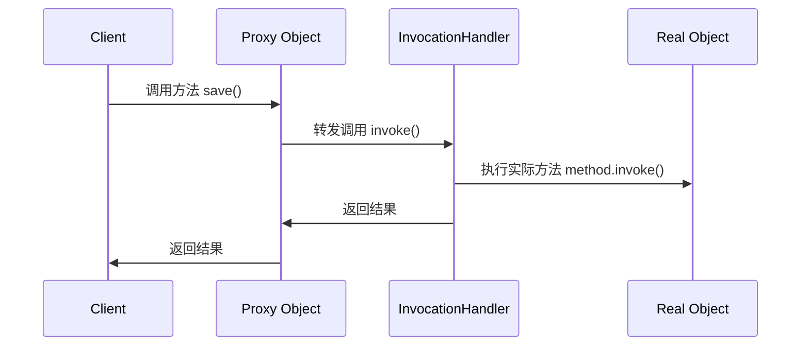
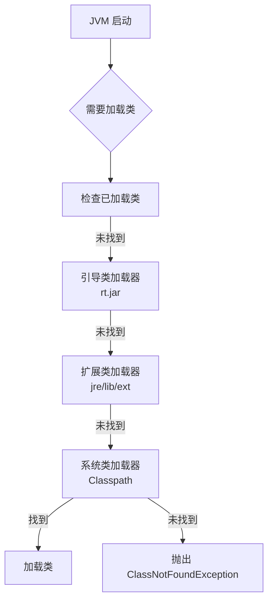

# Java核心基础卷4

# 接口、lambda表达式与内部类

## 接口

> **接口核心思想**：定义行为契约规范，实现多态性与解耦设计。Java 8 后接口能力大幅增强，成为现代 Java 开发的核心组件。

### 一、接口基本概念

#### 1. 本质特性

- **纯抽象契约**：定义对象能做什么（方法签名），不涉及如何做
- **多继承支持**：类可实现多个接口，突破单继承限制
- **解耦利器**：分离定义与实现，支持"面向接口编程"

```java
// 基础接口定义
public interface Drawable {
    void draw();  // 隐式 public abstract
    double area(); 
}
```

#### 2. 接口 vs 抽象类

| 特性     | 接口 (`interface`)         | 抽象类 (`abstract class`) |
| -------- | -------------------------- | ------------------------- |
| 方法实现 | Java 8 前不能有方法体      | 可有具体方法              |
| 多继承   | ✅ 类可实现多个接口         | ❌ 单继承                  |
| 构造方法 | ❌ 不能有                   | ✅ 可有                    |
| 字段修饰 | 默认 `public static final` | 无限制                    |
| 设计目的 | 定义能力 (can-do)          | 定义本质 (is-a)           |
| 适用场景 | 跨继承树的能力扩展         | 同类对象的共性抽象        |

---

### 二、接口成员详解

#### 1. 常量字段 (Java 7-)

```java
public interface Physics {
    double LIGHT_SPEED = 299792458; // 隐式 public static final
}
```

#### 2. 抽象方法 (核心)

```java
void save(Data data); // 隐式 public abstract
```

#### 3. 默认方法 (Java 8+)

```java
public interface Logger {
    default void log(String message) {
        System.out.println("[INFO] " + message);
    }
}
```

**作用**：接口演化不破坏实现类（如 Collection 的 stream()）

#### 4. 静态方法 (Java 8+)

```java
public interface MathUtils {
    static int max(int a, int b) {
        return a > b ? a : b;
    }
}

// 调用
MathUtils.max(5, 3); // 无需实现类
```

#### 5. 私有方法 (Java 9+)

```java
public interface DataParser {
    private String cleanData(String raw) {
        return raw.trim().replaceAll("\\s+", " ");
    }
    
    default Data parse(String raw) {
        return new Data(cleanData(raw));
    }
}
```

**作用**：封装接口内部复用逻辑

---

### 三、默认方法冲突解决

#### 冲突场景

```java
interface A { default void run() { System.out.println("A"); } }
interface B { default void run() { System.out.println("B"); } }

class C implements A, B { } // 编译错误：冲突的默认方法
```

#### 解决方案

##### 1. 显式覆盖 + 选择父接口

```java
class C implements A, B {
    public void run() {
        A.super.run(); // 选择A的实现
    }
}
```

##### 2. 完全重写

```java
class C implements A, B {
    public void run() {
        System.out.println("C"); // 自定义实现
    }
}
```

##### 3. 继承链优先级

```java
interface D extends A {
    default void run() { // 更高优先级
        System.out.println("D");
    }
}

class E implements D, B { } // 使用D的run()
```

**冲突解决规则**：

1. 类方法 > 接口默认方法
2. 子接口方法 > 父接口方法
3. 需显式指定时用 `Interface.super.method()`

---

### 四、接口与回调机制

#### 回调模式

```java
// 回调接口
public interface ClickListener {
    void onClick(Event event);
}

// GUI组件
public class Button {
    private ClickListener listener;
    
    public void setListener(ClickListener listener) {
        this.listener = listener;
    }
    
    public void click() {
        if (listener != null) {
            listener.onClick(new Event());
        }
    }
}

// 使用
Button btn = new Button();
btn.setListener(event -> System.out.println("Clicked!")); // Lambda实现
```

**应用场景**：

- GUI 事件处理
- 异步任务完成通知
- 观察者模式 (Observer)

---

### 五、核心应用接口

#### 1. Cloneable 与对象克隆

```java
class User implements Cloneable {
    private String name;
    
    @Override
    public User clone() {
        try {
            return (User) super.clone(); // 浅拷贝
        } catch (CloneNotSupportedException e) {
            throw new AssertionError();
        }
    }
}

// 深拷贝实现
@Override
public User clone() {
    User cloned = (User) super.clone();
    cloned.name = new String(this.name); // 可变字段深拷贝
    return cloned;
}
```

**注意**：

- `Cloneable` 是标记接口（无方法）
- 重写 `clone()` 并提升为 public
- 区分浅拷贝与深拷贝

#### 2. Comparable 排序

```java
class Product implements Comparable<Product> {
    private double price;
    
    @Override
    public int compareTo(Product other) {
        return Double.compare(this.price, other.price);
    }
}

// 使用
Arrays.sort(products); // 自动调用compareTo
```

#### 3. Runnable 多线程

```java
// 传统实现
class Task implements Runnable {
    public void run() {
        System.out.println("Running in thread");
    }
}

// Lambda简化
new Thread(() -> System.out.println("Lambda task")).start();
```

#### 4. AutoCloseable 资源管理

```java
try (FileReader reader = new FileReader("file.txt")) {
    // 自动调用close()
} // try-with-resources
```

---

> [!TIP]
>
> ## Java 比较机制详解：Comparator vs Comparable
>
> > **核心区别一句话总结**：  
> > `Comparable` 是**内部比较器**，定义对象的自然排序；  
> > `Comparator` 是**外部比较器**，提供灵活的多维排序规则。
>
> ---
>
> ### 一、Comparable（自然排序接口）
>
> #### 1. 核心概念
>
> - 定义在类内部，实现 `java.lang.Comparable` 接口
> - 表示类的实例具有**自然排序**能力
> - 重写 `compareTo(T o)` 方法
>
> ```java
> public class Student implements Comparable<Student> {
>     private String name;
>     private int score;
> 
>     // 构造方法等省略...
> 
>     @Override
>     public int compareTo(Student other) {
>         // 按分数降序，若分数相同按姓名升序
>         int scoreCompare = Integer.compare(other.score, this.score); // 降序：other在前
>         if (scoreCompare != 0) {
>             return scoreCompare;
>         }
>         return this.name.compareTo(other.name); // 升序
>     }
> }
> ```
>
> #### 2. 使用场景
>
> - 调用 `Collections.sort(list)` 或 `Arrays.sort(array)` 自动排序
> - 有序集合（`TreeSet`, `TreeMap`）自动排序
> - 需要默认排序规则时
>
> #### 3. 核心规则
>
> - **返回值语义**：
>
>   - 负整数：当前对象 < 参数对象
>   - 零：当前对象 == 参数对象
>   - 正整数：当前对象 > 参数对象
>
> - **必须保持与 equals() 一致**：
>
>   ```java
>   a.compareTo(b)==0  ⇔ a.equals(b) // 强烈建议
>   ```
>
> #### 4. 内置实现类
>
> - `String`：按Unicode值排序
> - `Integer`/`Double`：按数值大小
> - `LocalDate`：按时间先后
>
> ---
>
> ### 二、Comparator（定制比较器）
>
> #### 1. 核心概念
>
> - 独立于类的外部比较器，实现 `java.util.Comparator` 接口
> - 可定义**多种比较规则**（与类本身解耦）
> - Java 8 起成为**函数式接口**
>
> ```java
> // 按姓名长度排序
> Comparator<Student> byNameLength = (s1, s2) -> 
>     Integer.compare(s1.getName().length(), s2.getName().length());
> 
> // 按出生日期排序
> Comparator<Student> byBirthday = Comparator.comparing(Student::getBirthday);
> ```
>
> #### 2. 优势特点
>
> - **无需修改原类**：为第三方类添加排序能力
> - **多规则支持**：同一类可定义多种比较逻辑
> - **链式组合**：轻松构建复杂排序规则
>
> #### 3. Java 8 增强方法
>
> |           **方法**           | **描述**                   | **示例**                                              |
> | :--------------------------: | -------------------------- | ----------------------------------------------------- |
> |    `comparing(Function)`     | 根据属性提取函数生成比较器 | `Comparator.comparing(Student::getScore)`             |
> |      `thenComparing()`       | 添加次要排序规则           | `.thenComparing(Student::getName)`                    |
> |         `reversed()`         | 反转当前排序顺序           | `Comparator.comparingInt(Student::getAge).reversed()` |
> | `nullsFirst()`/`nullsLast()` | 处理null值                 | `Comparator.nullsFirst(byName)`                       |
>
> ```java
> // 组合比较器：先按学校排序，再按年级降序，最后按分数升序
> Comparator<Student> complex = Comparator
>     .comparing(Student::getSchool)
>     .thenComparing(Student::getGrade, Comparator.reverseOrder())
>     .thenComparingInt(Student::getScore);
> ```
>
> ---
>
> ### 三、对比总结：Comparable vs Comparator
>
> | **维度**         | Comparable       | Comparator                   |
> | ---------------- | ---------------- | ---------------------------- |
> | **包位置**       | `java.lang`      | `java.util`                  |
> | **实现位置**     | 目标类内部       | 独立类或Lambda               |
> | **方法名**       | `compareTo(T o)` | `compare(T o1, T o2)`        |
> | **排序方式**     | 自然排序（唯一） | 定制排序（多种）             |
> | **影响原类**     | 需要修改原类     | 不修改原类                   |
> | **比较规则数量** | 1种              | 多种（可创建多个Comparator） |
> | **函数式接口**   | 否               | 是（Java 8起）               |
>
> > **选择策略**：  
> >
> > - 类有**天然排序**逻辑 → 实现 `Comparable`  
> > - 需要**多种排序**方式 → 使用 `Comparator`  
> > - 对**第三方类**排序 → 必须用 `Comparator`
>
> ---
>
> ### 四、典型应用场景
>
> #### 场景1：集合排序
>
> ```java
> List<Student> students = ...;
> 
> // 使用Comparable（自然排序）
> Collections.sort(students); 
> 
> // 使用Comparator（定制排序）
> students.sort(byBirthday); // Java 8+ 直接使用List.sort()
> ```
>
> #### 场景2：有序集合初始化
>
> ```java
> // TreeSet使用自然排序
> Set<Student> naturalOrderSet = new TreeSet<>();
> 
> // TreeSet使用Comparator
> Set<Student> customOrderSet = new TreeSet<>(byNameLength);
> ```
>
> #### 场景3：Stream API排序
>
> ```java
> // 自然排序
> List<Student> sortedByNatural = students.stream()
>                                         .sorted()
>                                         .collect(Collectors.toList());
> 
> // 定制排序
> List<Student> sortedByScore = students.stream()
>                                       .sorted(Comparator.comparingInt(Student::getScore))
>                                       .collect(Collectors.toList());
> ```
>
> #### 场景4：数组排序
>
> ```java
> Student[] array = ...;
> Arrays.sort(array); // 自然排序
> Arrays.sort(array, byBirthday); // 定制排序
> ```
>
> ---
>
> ### 五、高级技巧与最佳实践
>
> #### 1. 处理null值
>
> ```java
> // 将null视为最小
> Comparator<Student> nullsFirst = Comparator.nullsFirst(
>     Comparator.comparing(Student::getName)
> );
> 
> // 将null视为最大
> Comparator<Student> nullsLast = Comparator.nullsLast(
>     Comparator.comparing(Student::getName)
> );
> ```
>
> #### 2. 避免整数溢出
>
> ```java
> // ❌ 危险方式（可能溢出）
> Comparator<Student> dangerous = (s1, s2) -> s1.getId() - s2.getId();
> 
> // ✅ 安全方式
> Comparator<Student> safe = Comparator.comparingInt(Student::getId);
> ```
>
> #### 3. 缓存常用比较器
>
> ```java
> public class Student {
>     public static final Comparator<Student> BY_SCORE = 
>         Comparator.comparingInt(Student::getScore).reversed();
> 
>     public static final Comparator<Student> BY_NAME_LEN =
>         Comparator.comparing(s -> s.getName().length());
> }
> 
> // 使用
> students.sort(Student.BY_SCORE);
> ```
>
> #### 4. 与Lambda结合
>
> ```java
> // 动态创建比较器
> Function<Student, Integer> keyExtractor = ...;
> Comparator<Student> dynamic = Comparator.comparing(keyExtractor);
> ```
>
> ---
>
> ### 六、常见问题与解决方案
>
> #### 问题1：违反 compareTo-equals 契约
>
> ```java
> Set<Student> set = new TreeSet<>();
> set.add(new Student("Alice", 90));
> set.add(new Student("Alice", 85)); // 会被视为相等而拒绝添加！
> 
> // 解决方案：保持 compareTo 与 equals 逻辑一致
> @Override
> public int compareTo(Student other) {
>     int scoreCompare = Integer.compare(this.score, other.score);
>     if (scoreCompare != 0) return scoreCompare;
>     return this.name.compareTo(other.name); // 当score相同时用name区分
> }
> ```
>
> #### 问题2：多层排序顺序错误
>
> ```java
> // ❌ 错误：次要排序未生效
> Comparator<Student> wrong = Comparator
>     .comparing(Student::getSchool)
>     .thenComparing(Student::getGrade); // 默认升序
> 
> // ✅ 正确：明确指定次要排序方向
> Comparator<Student> correct = Comparator
>     .comparing(Student::getSchool)
>     .thenComparing(Comparator.comparing(Student::getGrade).reversed());
> ```
>
> #### 问题3：比较浮点数精度
>
> ```java
> // ❌ 不安全的浮点比较
> Comparator<Double> unsafe = (d1, d2) -> (int)(d1 - d2);
> 
> // ✅ 正确方式
> Comparator<Double> safe = Double::compare;
> ```
>
> ---
>
> ### 七、性能优化建议
>
> 1. **延迟计算昂贵属性**
>
>    ```java
>    // 避免在比较器中重复计算
>    Comparator<Student> byFullName = Comparator.comparing(s -> {
>        return s.getFirstName() + " " + s.getLastName(); // 每次比较都会拼接
>    });
>    
>    // 优化：预先计算或缓存
>    class Student {
>        private String fullName; // 预先计算好
>    }
>    Comparator<Student> optimized = Comparator.comparing(Student::getFullName);
>    ```
>
> 2. **优先使用基本类型比较器**
>
>    ```java
>    // 更高效
>    Comparator.comparingInt(Student::getAge)
>    
>    // 而非
>    Comparator.comparing(Student::getAge) // 涉及Integer装箱
>    ```
>
> 3. **限制链式调用深度**
>
>    ```java
>    // 3层以内通常高效
>    .comparing(...).thenComparing(...).thenComparing(...)
>    
>    // 超多层级考虑自定义比较逻辑
>    ```
>
> ---
>
> ### 八、实战案例：电商商品排序
>
> ```java
> public class Product {
>     private String name;
>     private double price;
>     private int sales;
>     private LocalDate releaseDate;
> 
>     // 自然排序：按发布时间（最新优先）
>     public int compareTo(Product other) {
>         return other.releaseDate.compareTo(this.releaseDate);
>     }
> 
>     // 静态比较器
>     public static final Comparator<Product> BY_PRICE_ASC = 
>         Comparator.comparingDouble(Product::getPrice);
> 
>     public static final Comparator<Product> BY_VALUE = 
>         Comparator.comparingDouble(p -> p.sales / p.price);
> }
> 
> // 使用场景
> List<Product> products = ...;
> 
> // 默认排序（最新商品优先）
> products.sort();
> 
> // 促销排序：高性价比优先 + 低价商品其次
> Comparator<Product> promoSort = Product.BY_VALUE.reversed()
>     .thenComparing(Product.BY_PRICE_ASC);
> 
> products.sort(promoSort);
> ```
>
> ---
>
> ### 总结：选择与应用策略
>
> | **场景**             | **推荐方案**                             | **理由**               |
> | -------------------- | ---------------------------------------- | ---------------------- |
> | 定义类的默认排序规则 | 实现 `Comparable`                        | 自然直观，简化基础排序 |
> | 为第三方类添加排序   | 创建 `Comparator`                        | 无法修改源码时唯一选择 |
> | 需要多种排序规则     | 提供多个 `Comparator` 静态常量           | 灵活支持不同业务场景   |
> | 构建复杂多级排序     | `Comparator.comparing().thenComparing()` | 链式调用代码简洁       |
> | 需要空值安全的排序   | `Comparator.nullsFirst()`                | 优雅处理边界情况       |
> | 高性能关键路径       | 基本类型比较器（如`comparingInt`）       | 避免装箱拆箱开销       |
>
> **黄金法则**：
>
> 1. 类有自然顺序 → 实现 `Comparable`
> 2. 需要多种排序 → 提供 `Comparator`
> 3. 复杂排序 → 链式组合多个比较器
> 4. 空值处理 → 使用 `nullsFirst`/`nullsLast`
> 5. 性能敏感 → 优先基本类型比较器
>
> 掌握 Comparable 和 Comparator 是 Java 开发的基础功，合理选择能大幅提升代码的可读性、灵活性和性能表现。


### 六、接口设计最佳实践

#### 1. 接口隔离原则 (ISP)

```java
// ❌ 臃肿接口
interface Worker {
    void code();
    void test();
    void deploy();
}

// ✅ 拆分细化
interface Developer {
    void code();
}

interface Tester {
    void test();
}

interface DevOps {
    void deploy();
}
```

#### 2. 函数式接口

```java
@FunctionalInterface // 确保单一抽象方法
interface StringProcessor {
    String process(String input);
    
    // 可有默认/静态方法
    default StringProcessor andThen(StringProcessor next) {
        return input -> next.process(this.process(input));
    }
}

// 使用
StringProcessor upper = String::toUpperCase;
StringProcessor trim = String::trim;
StringProcessor pipeline = trim.andThen(upper);
```

#### 3. 接口组合

```java
interface Flyable {
    void fly();
}

interface Swimmable {
    void swim();
}

// 组合接口
interface Duck extends Flyable, Swimmable {}

class MallardDuck implements Duck {
    public void fly() { /*...*/ }
    public void swim() { /*...*/ }
}
```

---

### 七、关键注意事项

1. **字段初始化**  
   接口字段必须初始化（默认 `public static final`）

   ```java
   int MAX_VALUE; // 编译错误：必须初始化
   ```

2. **方法可见性**  
   所有方法隐式 `public`，不可用 `protected` 或 `private`（除私有方法）

   ```java
   protected void internal(); // 编译错误
   ```

3. **默认方法陷阱**  
   避免在接口默认方法中：

   - 修改对象状态（无实例字段）
   - 调用可覆盖方法（行为不确定）

   ```java
   interface Problematic {
       default void risky() {
           overrideMe(); // 危险！可能被重写
       }
       
       void overrideMe();
   }
   ```

4. **菱形继承问题**  
   当多个接口有相同签名默认方法时需显式解决

   ```java
   interface A { default void run() {} }
   interface B { default void run() {} }
   
   class C implements A, B {
       @Override
       public void run() {
           A.super.run(); // 必须选择
       }
   }
   ```

5. **静态方法限制**  
   静态方法不能被实现类继承或覆盖

   ```java
   class Impl implements MathUtils {}
   Impl.max(1,2); // 错误！静态方法只能通过接口调用
   ```

---

### 八、现代接口应用场景

#### 1. 策略模式

```java
interface DiscountStrategy {
    double applyDiscount(double price);
}

class ChristmasDiscount implements DiscountStrategy {
    public double applyDiscount(double price) {
        return price * 0.7;
    }
}

// 动态切换策略
shoppingCart.setDiscountStrategy(new ChristmasDiscount());
```

#### 2. 插件化架构

```java
// 定义扩展点
interface Plugin {
    void initialize();
    String getName();
}

// 加载插件
ServiceLoader<Plugin> plugins = ServiceLoader.load(Plugin.class);
plugins.forEach(Plugin::initialize);
```

#### 3. 测试替身 (Mocking)

```java
interface DatabaseService {
    User getUser(int id);
}

// 单元测试中
DatabaseService mockDb = mock(DatabaseService.class);
when(mockDb.getUser(1)).thenReturn(new User("Alice"));
```

---

### 总结：接口演进路线

| **Java 版本** | **接口能力增强**              | **典型应用**         |
| ------------- | ----------------------------- | -------------------- |
| Java 7 及之前 | 纯抽象方法 + 常量             | 多态设计、回调机制   |
| Java 8        | 默认方法 + 静态方法           | 接口演化、函数式编程 |
| Java 9        | 私有方法                      | 接口内部逻辑封装     |
| Java 16       | 密封接口 (`sealed interface`) | 受限接口继承（预览） |

**设计箴言**：

> 优先使用接口定义行为契约  
> 用默认方法实现向后兼容  
> 用函数式接口简化回调  
> 用接口组合构建复杂能力

接口作为 Java 类型系统的核心支柱，从最初的纯抽象契约，逐步发展为支持代码复用、行为组合的强有力工具，深刻理解接口是掌握 Java 高级特性的关键。


## Lambda表达式

## Java Lambda 表达式全面解析

### 一、为什么引入 Lambda 表达式？

#### 1. 解决匿名内部类的痛点

在 Java 8 之前，传递行为需要冗长的匿名内部类：

```java
// 传统方式：排序
Collections.sort(list, new Comparator<String>() {
    @Override
    public int compare(String s1, String s2) {
        return s1.length() - s2.length();
    }
});
```

#### 2. 函数式编程需求

- 支持将函数作为一等公民传递
- 实现更简洁的行为参数化
- 促进并行处理（为 Stream API 铺路）

#### 3. 代码简洁性革命

Lambda 使代码量减少 70%+：

```java
// Lambda 方式
Collections.sort(list, (s1, s2) -> s1.length() - s2.length());
```

---

### 二、Lambda 表达式语法

#### 1. 基本结构

```java
(parameters) -> expression
(parameters) -> { statements; }
```

#### 2. 语法变体

| **情况**             | **示例**                                         |
| -------------------- | ------------------------------------------------ |
| 无参数               | `() -> System.out.println("Hi")`                 |
| 单参数（类型可推断） | `s -> s.length()`                                |
| 多参数               | `(a, b) -> a + b`                                |
| 显式类型声明         | `(String s) -> s.toUpperCase()`                  |
| 多行代码块           | `(x, y) -> { int sum = x + y; return sum * 2; }` |

---

### 三、函数式接口（Functional Interface）

#### 1. 核心概念

- **单抽象方法接口**（Single Abstract Method, SAM）
- 使用 `@FunctionalInterface` 注解（非必须但推荐）
- Java 内置四大核心函数式接口：

| **接口**        | **方法签名**        | **用途** |
| --------------- | ------------------- | -------- |
| `Supplier<T>`   | `T get()`           | 提供数据 |
| `Consumer<T>`   | `void accept(T t)`  | 消费数据 |
| `Function<T,R>` | `R apply(T t)`      | 数据转换 |
| `Predicate<T>`  | `boolean test(T t)` | 条件判断 |

#### 2. 自定义函数式接口

```java
@FunctionalInterface
interface StringProcessor {
    String process(String input);
    
    // 允许默认方法
    default StringProcessor andThen(StringProcessor after) {
        return input -> after.process(this.process(input));
    }
}
```

---

### 四、方法引用（Method Reference）

#### 1. 四种引用类型

| **类型**             | **语法**                  | **等效 Lambda**                        | **示例**              |
| -------------------- | ------------------------- | -------------------------------------- | --------------------- |
| 静态方法引用         | `ClassName::staticMethod` | `args -> ClassName.staticMethod(args)` | `Math::sqrt`          |
| 实例方法引用（对象） | `instance::method`        | `args -> instance.method(args)`        | `System.out::println` |
| 实例方法引用（类）   | `ClassName::method`       | `(obj, args) -> obj.method(args)`      | `String::length`      |
| 构造器引用           | `ClassName::new`          | `args -> new ClassName(args)`          | `ArrayList::new`      |

#### 2. 使用示例

```java
// 静态方法引用
Function<Double, Double> sqrt = Math::sqrt;

// 实例方法引用
List<String> names = Arrays.asList("Alice", "Bob");
names.forEach(System.out::println);

// 构造器引用
Supplier<List<String>> listSupplier = ArrayList::new;
```

---

### 五、构造器引用（Constructor Reference）

#### 1. 基本用法

```java
// 无参构造
Supplier<User> userSupplier = User::new;
User user = userSupplier.get();

// 带参构造
Function<String, User> nameToUser = User::new;
User alice = nameToUser.apply("Alice");
```

#### 2. 数组构造

```java
Function<Integer, int[]> arrayCreator = int[]::new;
int[] arr = arrayCreator.apply(10); // 创建长度为10的数组
```

---

### 六、变量作用域规则

#### 1. 访问规则

- 可访问 **final 或等效 final** 的局部变量
- 可访问实例变量和静态变量（无 final 限制）
- 禁止修改捕获的局部变量

#### 2. 作用域示例

```java
class ScopeExample {
    private String instanceVar = "Instance";
    private static String staticVar = "Static";
    
    public void test() {
        String localVar = "Local"; // 等效 final
        
        Runnable r = () -> {
            System.out.println(localVar);    // ✅ 允许
            System.out.println(instanceVar);  // ✅ 允许
            System.out.println(staticVar);    // ✅ 允许
            
            // localVar = "modified"; // ❌ 编译错误
            instanceVar = "modified"; // ✅ 允许
        };
        
        new Thread(r).start();
    }
}
```

---

### 七、处理 Lambda 表达式

#### 1. 作为方法参数

```java
public static void processNumbers(List<Integer> numbers, Predicate<Integer> filter) {
    for (int num : numbers) {
        if (filter.test(num)) {
            System.out.println(num);
        }
    }
}

// 使用
processNumbers(list, n -> n % 2 == 0); // 过滤偶数
```

#### 2. 作为返回值

```java
public static Comparator<String> createComparator(boolean reverse) {
    return reverse 
        ? (s1, s2) -> s2.compareTo(s1)
        : (s1, s2) -> s1.compareTo(s2);
}
```

#### 3. 组合函数

```java
Function<String, String> pipeline = ((Function<String, String>) String::toUpperCase)
    .andThen(s -> s.replace(" ", "_"))
    .andThen(s -> "[" + s + "]");
    
System.out.println(pipeline.apply("hello world")); // [HELLO_WORLD]
```

---

### 八、Lambda 应用：重写比较接口

#### 1. 传统比较器 vs Lambda

```java
// 传统方式
Collections.sort(people, new Comparator<Person>() {
    @Override
    public int compare(Person p1, Person p2) {
        return p1.getAge() - p2.getAge();
    }
});

// Lambda 方式
Collections.sort(people, (p1, p2) -> p1.getAge() - p2.getAge());
```

#### 2. 链式比较

```java
// 按姓氏排序，再按名字排序
Comparator<Person> comparator = 
    Comparator.comparing(Person::getLastName)
              .thenComparing(Person::getFirstName);
              
people.sort(comparator);
```

#### 3. 高级比较

```java
// 空值安全比较
Comparator<Person> nullSafe = Comparator.nullsLast(
    Comparator.comparing(Person::getJoinDate)
);

// 逆序比较
Comparator<Person> reverseAge = 
    Comparator.comparingInt(Person::getAge).reversed();
```

---

### 九、Lambda 表达式最佳实践

#### 1. 保持简洁

```java
// ❌ 过于复杂
names.stream().filter(n -> {
    boolean isValid = n != null && n.length() > 3;
    if (isValid) {
        System.out.println("Valid: " + n);
    }
    return isValid;
});

// ✅ 简洁清晰
names.stream()
     .filter(Objects::nonNull)
     .filter(n -> n.length() > 3)
     .peek(n -> System.out.println("Valid: " + n));
```

#### 2. 使用方法引用

```java
// ❌ 冗余Lambda
numbers.stream().map(n -> String.valueOf(n));

// ✅ 方法引用
numbers.stream().map(String::valueOf);
```

#### 3. 避免副作用

```java
// ❌ 有副作用的Lambda
List<String> result = new ArrayList<>();
names.stream().forEach(n -> result.add(n.toUpperCase())); 

// ✅ 无副作用方式
List<String> result = names.stream()
                           .map(String::toUpperCase)
                           .collect(Collectors.toList());
```

---

### 十、注意事项与陷阱

#### 1. 性能考量

- Lambda 初始化有开销（首次调用慢 3-5 倍）
- 高频循环中优先使用方法引用
- 避免在性能关键代码中嵌套多层 Lambda

#### 2. 调试困难

- 匿名类有独立类名，Lambda 显示为 `lambda$main$0`
- 复杂 Lambda 应拆分为方法引用

#### 3. 变量捕获陷阱

```java
for (int i = 0; i < 10; i++) {
    new Thread(() -> {
        System.out.println(i); // ❌ 编译错误：i 非最终
    }).start();
}

// 解决方案：使用临时final变量
for (int i = 0; i < 10; i++) {
    final int index = i;
    new Thread(() -> System.out.println(index)).start();
}
```

#### 4. 重载歧义

```java
interface Adder {
    int add(int a, int b);
}

interface SmartAdder {
    int add(double a, double b);
}

void calculate(Adder adder) { /*...*/ }
void calculate(SmartAdder adder) { /*...*/ }

// 调用歧义
calculate((a, b) -> a + b); // ❌ 编译错误
```

---

### 十一、Lambda 在现代化 Java 中的应用

#### 1. Stream API 基石

```java
// 统计长单词数量
long count = words.stream()
                 .filter(w -> w.length() > 10)
                 .count();
```

#### 2. 事件处理

```java
button.addActionListener(event -> 
    System.out.println("Button clicked"));
```

#### 3. 并发编程

```java
CompletableFuture.supplyAsync(() -> fetchData())
                .thenApply(data -> process(data))
                .thenAccept(result -> save(result));
```

#### 4. 函数式错误处理

```java
Optional.ofNullable(input)
        .map(String::trim)
        .filter(s -> !s.isEmpty())
        .orElseThrow(() -> new IllegalArgumentException("Invalid input"));
```

---

### 总结：Lambda 表达式价值矩阵

| **维度**     | **传统方式**   | **Lambda 方式**      | **优势提升**           |
| ------------ | -------------- | -------------------- | ---------------------- |
| **代码量**   | 冗长（5-10行） | 简洁（1行）          | 减少 70%+ 代码量       |
| **可读性**   | 嵌套结构复杂   | 声明式表达           | 意图更清晰             |
| **灵活性**   | 固定实现       | 动态传递行为         | 支持行为参数化         |
| **并行能力** | 手动线程管理   | 无缝衔接 Stream 并行 | 并行化效率提升 5-10 倍 |
| **维护成本** | 修改需重构     | 局部调整不影响结构   | 降低 50%+ 维护成本     |

**演进路线**：

- Java 5：引入泛型，增强类型安全
- Java 8：Lambda + Stream，函数式编程革命
- Java 11：局部变量类型推断 (`var`)，简化 Lambda
- Java 17：模式匹配，强化函数式数据处理

Lambda 表达式不仅是语法糖，更是 Java 向现代化语言演进的核心里程碑，深刻改变了 Java 的编程范式和使用场景。


## 内部类

## Java 内部类全面解析：从概念到实战应用

> **内部类核心价值**：  
> 增强封装性、直接访问外部类成员、实现多重继承、创建更灵活的代码结构

---

### 一、内部类基本概念

#### 1. 定义与分类

```java
class OuterClass {
    // 实例内部类
    class InnerClass { /*...*/ }
    
    // 静态内部类
    static class StaticNestedClass { /*...*/ }
    
    void method() {
        // 局部内部类
        class LocalClass { /*...*/ }
        
        // 匿名内部类
        Runnable r = new Runnable() { /*...*/ };
    }
}
```

#### 2. 四大类型对比

| **类型**   | **访问权限**      | **可访问外部类成员** | **生命周期** | **典型场景**          |
| ---------- | ----------------- | -------------------- | ------------ | --------------------- |
| 实例内部类 | 所有修饰符        | ✅ 直接访问所有       | 依赖外部实例 | 事件处理器、迭代器    |
| 静态内部类 | 所有修饰符        | ❌ 仅静态成员         | 独立         | 工具类、Builder模式   |
| 局部内部类 | 仅final/等效final | ✅ 直接访问所有       | 方法执行期间 | 方法内专用逻辑        |
| 匿名内部类 | 无（隐式final）   | ✅ 直接访问所有       | 随对象存在   | 一次性回调、GUI监听器 |

---

### 二、内部类访问对象状态机制

#### 1. 秘密引用 `Outer.this`

每个实例内部类隐含持有外部类引用：

```java
class Outer {
    private int x = 10;
    
    class Inner {
        void access() {
            System.out.println("Outer x: " + Outer.this.x);
            // 等价于直接写 x
        }
    }
}
```

#### 2. 访问原理

```java
// 编译后的内部类（近似）
class Outer$Inner {
    private final Outer this$0; // 编译器添加的隐藏引用
    
    Outer$Inner(Outer outer) {
        this$0 = outer;
    }
    
    void access() {
        System.out.println("Outer x: " + this$0.x);
    }
}
```

#### 3. 访问限制

- 可访问外部类所有成员（包括 `private`）
- 静态内部类无法访问实例成员

```java
class Outer {
    private static int staticY = 20;
    private int instanceX = 10;
    
    static class StaticInner {
        void tryAccess() {
            System.out.println(staticY); // ✅ 允许
            // System.out.println(instanceX); // ❌ 编译错误
        }
    }
}
```

---

### 三、内部类特殊语法规则

#### 1. .this 与 .new

| **语法**               | **作用**                 | **示例**                                                     |
| ---------------------- | ------------------------ | ------------------------------------------------------------ |
| `OuterClass.this`      | 内部类获取外部类当前实例 | `Outer.this.method()`                                        |
| `outerObj.new Inner()` | 外部实例创建内部类对象   | `Outer outer = new Outer(); Outer.Inner inner = outer.new Inner();` |

#### 2. 外部类访问内部类

```java
class Outer {
    void createInner() {
        Inner inner = new Inner(); // 直接实例化
        inner.access();
    }
    
    class Inner { /*...*/ }
}
```

#### 3. 访问控制

- 内部类可声明为 `private` 或 `protected`
- 私有内部类仅外部类可访问

```java
public class Database {
    private class ConnectionPool { // 隐藏实现细节
        private void manageConnections() { ... }
    }
    
    public void query(String sql) {
        ConnectionPool pool = new ConnectionPool();
        // ...
    }
}
```

---

### 四、内部类的必要性与安全性

#### 1. 存在必要性

- **解决多重继承**：通过多个内部类继承不同父类

  ```java
  class Robot extends Machine {
      private class Brain extends AI { /* 智能逻辑 */ }
      private class Arm extends Mechanical { /* 机械控制 */ }
  }
  ```

- **增强封装性**：隐藏仅服务于外部类的实现

  ```java
  public class BankAccount {
      private class AuditLog { // 审计日志外部不可见
          void record(String action) { ... }
      }
  }
  ```

- **简化回调**：直接访问外部类上下文

  ```java
  button.addActionListener(new ActionListener() {
      public void actionPerformed(ActionEvent e) {
          // 直接访问外部类方法
          handleButtonClick(); 
      }
  });
  ```

#### 2. 安全性考量

- **内存泄漏风险**：内部类隐式持有外部类引用

  ```java
  class Outer {
      byte[] data = new byte[100MB];
      
      class Inner {
          // 即使不再使用Outer，只要Inner存在就无法回收Outer
      }
  }
  
  // 解决方案：用静态内部类
  static class SafeInner { /* 无外部引用 */ }
  ```

- **序列化陷阱**：非静态内部类不可序列化

  ```java
  class Outer implements Serializable {
      class Inner implements Serializable { 
          // ❌ 运行时异常：NotSerializableException
      }
  }
  ```

---

### 五、局部内部类详解（鸡肋语法，一般开发用不上）

#### 1. 基本特性

- 定义在方法或作用域内
- 可访问外部类所有成员
- 仅能访问 `final` 或等效 `final` 的局部变量

```java
public class Validator {
    public void validate(final int maxLength) {
        class LengthRule {
            boolean check(String input) {
                // 访问方法参数（需final）
                return input.length() <= maxLength; 
            }
        }
        
        new LengthRule().check("test");
    }
}
```

#### 2. 变量捕获机制

```java
void process() {
    int count = 0; // 等效 final（未被修改）
    String prefix = "ID-"; // final
    
    class Counter {
        void increment() {
            // count++; // ❌ 编译错误（不能修改捕获变量）
            System.out.println(prefix + count); // ✅ 只读允许
        }
    }
}
```

#### 3. 典型应用场景

- **复杂验证逻辑**：封装方法内专用规则
- **临时算法实现**：避免污染类命名空间
- **线程安全操作**：隔离特定操作的变量

---

### 六、静态内部类详解

#### 1. 核心特性

- 用 `static` 修饰
- 无隐含外部类引用
- 行为类似顶级类

```java
public class CollectionUtils {
    // 静态内部类作为公共工具
    public static class Pair<K, V> {
        public final K key;
        public final V value;
        
        public Pair(K key, V value) {
            this.key = key;
            this.value = value;
        }
    }
    
    public static <K, V> Pair<K, V> of(K k, V v) {
        return new Pair<>(k, v);
    }
}

// 使用
CollectionUtils.Pair<String, Integer> p = CollectionUtils.of("Age", 25);
```

#### 2. 优势场景

- **工具类封装**：关联但不依赖外部类实例

- **减少命名冲突**：通过外部类限定名称

- **构建器模式**：

  ```java
  public class HttpClient {
      public static class Builder {
          private int timeout = 5000;
          
          public Builder timeout(int ms) {
              this.timeout = ms;
              return this;
          }
          
          public HttpClient build() {
              return new HttpClient(this);
          }
      }
  }
  
  // 使用
  HttpClient client = new HttpClient.Builder()
                          .timeout(10000)
                          .build();
  ```

---

### 七、匿名内部类详解

#### 1. 基本语法

```java
interface Greeting {
    void sayHello(String name);
}

public class Demo {
    void greet() {
        // 匿名内部类实现接口
        Greeting g = new Greeting() {
            @Override
            public void sayHello(String name) {
                System.out.println("Hello, " + name);
            }
        };
        
        g.sayHello("Alice");
    }
}
```

#### 2. 现代替代方案（Java 8+）

```java
// 传统匿名内部类
button.addActionListener(new ActionListener() {
    public void actionPerformed(ActionEvent e) {
        handleClick();
    }
});

// Lambda 表达式替代
button.addActionListener(e -> handleClick());
```

#### 3. 不可替代场景

- **多方法接口实现**：

  ```java
  // 必须使用匿名类（因含多个方法）
  WindowAdapter adapter = new WindowAdapter() {
      @Override
      public void windowOpened(WindowEvent e) { /*...*/ }
      
      @Override
      public void windowClosing(WindowEvent e) { /*...*/ }
  };
  ```

- **带状态初始化**：

  ```java
  Thread thread = new Thread() {
      private int count;
      
      { // 实例初始化块
          count = initializeCount();
      }
      
      @Override
      public void run() {
          while(count-- > 0) {
              // ...
          }
      }
  };
  ```

---

### 八、外部方法访问变量规则

#### 1. 局部变量捕获限制

- 只能访问 `final` 或 **等效 final**（effectively final）变量
- Java 8+ 放宽限制（无需显式声明 final）

```java
void process() {
    int count = 0; // 等效 final（值未改变）
    
    Runnable r = new Runnable() {
        public void run() {
            System.out.println(count); // ✅ 允许
            
            // count++; // ❌ 禁止修改（会导致编译错误）
        }
    };
    
    // count = 5; // ❌ 外部修改也会导致编译错误
}
```

#### 2. 原理：值复制

```java
// 编译后（近似）
class Outer$1 implements Runnable {
    private final int val$count; // 编译器生成副本
    
    Outer$1(int count) {
        this.val$count = count;
    }
    
    public void run() {
        System.out.println(val$count);
    }
}
```

#### 3. 成员变量无限制

- 可自由访问和修改外部类成员变量

```java
class Outer {
    private int total = 0;
    
    void calculate() {
        Runnable counter = new Runnable() {
            public void run() {
                total++; // ✅ 允许修改
            }
        };
    }
}
```

---

### 九、内部类实战应用指南

#### 1. 设计选择策略

| **需求场景**           | **推荐方案**  | **示例**                             |
| ---------------------- | ------------- | ------------------------------------ |
| 紧密关联但需独立实例   | 实例内部类    | 迭代器 `List.Itr`                    |
| 工具类/构建器          | 静态内部类    | `Collections.UnmodifiableList`       |
| 方法内专用复杂逻辑     | 局部内部类    | 数据验证规则                         |
| 单方法接口回调         | Lambda 表达式 | `button.addActionListener(e -> ...)` |
| 多方法接口或带状态回调 | 匿名内部类    | `Thread` 子类重写 `run()`            |
| 避免命名冲突           | 静态内部类    | `Map.Entry`                          |

#### 2. 性能优化技巧

- **避免深度嵌套**：超过2层的内部类难以维护
- **静态化非必需引用**：减少内存泄漏风险
- **优先局部类而非匿名类**：提高代码可读性
- **接口替代抽象类**：匿名类更简洁

#### 3. 重构案例：GUI事件处理

```java
// 传统匿名内部类（易导致"垂直灾难"）
button.addActionListener(new ActionListener() {
    @Override
    public void actionPerformed(ActionEvent e) {
        // 复杂逻辑...
    }
});

// 重构方案：实例内部类
class SubmitHandler implements ActionListener {
    @Override
    public void actionPerformed(ActionEvent e) {
        // 逻辑移至独立类
    }
}

// 注册
button.addActionListener(new SubmitHandler());
```

---

### 十、内部类在Java生态中的应用

#### 1. JDK 经典案例

- **迭代器模式**：`ArrayList.Itr`
- **不可变集合**：`Collections.UnmodifiableList`
- **线程局部存储**：`ThreadLocal.ThreadLocalMap`
- **Builder模式**：`StringBuilder.append()`

#### 2. Android开发

```java
// View事件处理
button.setOnClickListener(new View.OnClickListener() {
    @Override
    public void onClick(View v) {
        // 处理点击
    }
});

// 优化：Lambda（需minSdkVersion >= 24）
button.setOnClickListener(v -> handleClick());
```

#### 3. 框架设计

```java
// Spring JdbcTemplate
jdbcTemplate.query("SELECT * FROM users", new RowMapper<User>() {
    @Override
    public User mapRow(ResultSet rs, int rowNum) {
        return new User(rs.getString("name"));
    }
});
```

---

### 总结：内部类四维价值

| **维度**       | **贡献**           | **代表类型**     |
| -------------- | ------------------ | ---------------- |
| **封装性**     | 隐藏实现细节       | 私有实例内部类   |
| **灵活性**     | 实现多重继承       | 多内部类组合     |
| **简洁性**     | 减少顶级类数量     | 局部/匿名内部类  |
| **上下文访问** | 直接操作外部类成员 | 所有非静态内部类 |

**黄金实践原则**：

1. 优先静态内部类（除非需要访问实例成员）
2. 避免超过2层嵌套
3. 匿名类用于 <5行简单实现
4. 局部类封装方法复杂逻辑
5. 警惕内存泄漏（用弱引用处理回调）

内部类是 Java 解决特定问题的精巧设计，合理运用可显著提升代码的封装性和表现力，但需警惕过度使用导致的复杂性。


## 服务加载器

Java 服务加载器（`java.util.ServiceLoader`）是 JDK 提供的服务提供者接口（SPI）机制的核心实现，用于动态发现和加载接口的实现类，实现模块化解耦和插件化扩展。以下是其详细介绍和应用场景：

---

### 一、核心概念与工作原理

1. **SPI 机制**  

   - **服务接口（Service Interface）**：定义抽象能力（如 `java.sql.Driver`）。

   - **服务提供者（Service Provider）**：实现接口的具体类（如 MySQL 的 `com.mysql.cj.jdbc.Driver`）。

   - **配置文件**：在 `META-INF/services/` 目录下创建以接口全限定名命名的文件，内容为提供者类的全限定名（每行一个）。  
     *示例文件：*  

     ```
     # META-INF/services/com.example.PaymentService
     com.example.impl.AlipayService
     com.example.impl.WeChatPayService
     ```

2. **懒加载与缓存**  

   - `ServiceLoader` 延迟加载提供者，仅在遍历迭代器时实例化。
   - 维护已加载提供者的缓存，可通过 `reload()` 清除。

3. **类加载机制**  

   - 默认使用**线程上下文类加载器**（`Thread.currentThread().getContextClassLoader()`）。
   - 支持模块化（Java 9+）：模块需声明 `uses` 接口和 `provides` 实现。

---

### 二、使用步骤与代码示例

1. **定义服务接口**  

   ```java
   public interface PaymentService {
       boolean pay(double amount);
   }
   ```

2. **实现服务提供者**  

   ```java
   public class AlipayService implements PaymentService {
       @Override
       public boolean pay(double amount) {
           System.out.println("Alipay processed: " + amount);
           return true;
       }
   }
   ```

3. **注册提供者**  

   - 在资源目录创建文件：`META-INF/services/com.example.PaymentService`  
     内容：`com.example.impl.AlipayService`

4. **加载与使用服务**  

   ```java
   ServiceLoader<PaymentService> loader = ServiceLoader.load(PaymentService.class);
   for (PaymentService service : loader) {
       service.pay(100.0); // 遍历所有提供者
   }
   ```

---

### 三、典型应用场景

1. **数据库驱动加载（JDBC）**  

   - JDBC 通过 `ServiceLoader` 动态加载 `java.sql.Driver` 实现（如 MySQL、PostgreSQL 驱动）。  
     *源码片段：*  

   ```java
   // DriverManager 初始化逻辑
   ServiceLoader<Driver> loader = ServiceLoader.load(Driver.class);
   for (Driver driver : loader) {
       drivers.add(driver); // 注册驱动
   }
   ```

2. **日志框架适配（SLF4J）**  

   - SLF4J 通过 SPI 加载 Logback、Log4j2 等日志实现。

3. **插件化架构**  

   - **支付系统**：动态支持支付宝、微信支付等实现。  
   - **图像处理**：Java Image I/O API 通过 SPI 加载图像编解码器。

4. **Spring Boot 自动配置**  

   - Spring Boot 改造 SPI 为 `spring.factories`，通过 `SpringFactoriesLoader` 加载自动配置类（如 `@EnableAutoConfiguration`）。  
     *对比 `ServiceLoader` 与 `SpringFactoriesLoader`：*  

   | **特性**     | `ServiceLoader`            | `SpringFactoriesLoader`                  |
   | ------------ | -------------------------- | ---------------------------------------- |
   | 配置文件     | `META-INF/services/接口名` | `META-INF/spring.factories`              |
   | 键名         | 接口全限定名               | 自定义键（如 `EnableAutoConfiguration`） |
   | 依赖接口实现 | 必须实现接口               | 无要求（如配置类只需 `@Configuration`）  |

---

### 四、高级特性与注意事项

1. **Java 9+ 增强**  

   - **模块化支持**：模块需声明 `provides` 和 `uses` 指令。  

     ```java
     module my.module {
         provides com.example.PaymentService with com.example.impl.AlipayService;
         uses com.example.PaymentService;
     }
     ```

   - **流式 API**：通过 `stream()` 过滤提供者，避免实例化开销。  

     ```java
     List<PaymentService> alipayProviders = loader.stream()
         .filter(p -> p.type().getSimpleName().equals("AlipayService"))
         .map(Provider::get)
         .collect(Collectors.toList());
     ```

2. **常见问题**  

   - **配置错误**：文件未按规范放置或编码非 UTF-8 会抛出 `ServiceConfigurationError`。  
   - **性能开销**：遍历所有提供者可能影响启动速度（如 JDBC 初始化）。  
   - **线程安全**：`ServiceLoader` 实例非线程安全，需同步访问。

---

### 五、适用场景对比

| **场景**               | 推荐使用                | **原因**                   |
| ---------------------- | ----------------------- | -------------------------- |
| 标准化接口扩展（JDBC） | `ServiceLoader`         | JDK 原生支持，无需额外依赖 |
| Spring Boot 自动配置   | `SpringFactoriesLoader` | 支持条件装配和复杂配置键   |
| 高安全性插件           | OSGi                    | 提供类隔离和动态模块管理   |

---

### 六、最佳实践

1. **优先静态提供者方法**  
   在实现类中定义 `public static provider()` 方法，替代直接实例化，提升灵活性。  

   ```java
   public class ExtendedPaymentService {
       public static PaymentService provider() {
           return new AlipayService(); // 工厂方法控制实例化
       }
   }
   ```

2. **结合依赖注入框架**  
   与 Spring/Guice 集成，将 `ServiceLoader` 结果注入 Bean：  

   ```java
   @Bean
   public List<PaymentService> paymentServices() {
       return StreamSupport.stream(ServiceLoader.load(PaymentService.class).spliterator(), false)
           .collect(Collectors.toList());
   }
   ```

3. **模块化封装**  

   - 服务提供者模块**不导出**实现包（通过 `module-info.java` 隐藏细节）。  
   - 客户端模块仅依赖接口，通过 `uses` 指令声明服务需求。

---

### 总结

`ServiceLoader` 是 Java 实现**解耦扩展**的核心工具，适用于插件化架构（如支付网关、日志适配器）、标准服务加载（如 JDBC 驱动）等场景。在模块化（Java 9+）和框架集成（如 Spring Boot）中需注意其演进差异。**优势**在于无需硬编码实现类，**局限**是缺乏依赖注入和条件装配能力，复杂场景可结合 Spring 或 OSGi 使用。


## 代理

## Java JDK 代理深度解析

> **JDK 动态代理**是 Java 标准库提供的基于接口的代理实现，无需第三方依赖，通过反射机制在运行时动态生成代理类。它是实现 AOP（面向切面编程）的核心技术之一。

---

### 一、JDK 代理核心概念

#### 1. 基本定义

JDK 代理是一种**运行时动态生成代理类**的技术，它：

- 基于 Java 反射 API（`java.lang.reflect.Proxy`）
- 要求目标对象**必须实现至少一个接口**
- 生成实现相同接口的代理对象

#### 2. 核心组件

| **类/接口**               | **作用**                                        |
| ------------------------- | ----------------------------------------------- |
| `java.lang.reflect.Proxy` | 核心类，提供创建代理对象的静态方法              |
| `InvocationHandler`       | 回调接口，实现代理逻辑（方法拦截和增强）        |
| `$Proxy0`                 | 运行时生成的代理类（命名格式：`$Proxy` + 数字） |

#### 3. 工作原理



---

### 二、何时使用 JDK 代理？

#### 1. 适用场景

| **场景**              | **案例说明**                                               |
| --------------------- | ---------------------------------------------------------- |
| **接口方法增强**      | 为已有接口实现添加日志、事务等通用功能                     |
| **远程方法调用(RPC)** | Dubbo/Hessian 等框架使用代理封装网络通信细节               |
| **访问控制**          | 实现权限校验，拦截未授权操作                               |
| **延迟加载**          | Hibernate 延迟加载关联对象时使用代理                       |
| **Spring AOP**        | 当目标对象实现接口时，Spring 默认使用 JDK 代理实现切面编程 |

#### 2. 不适用场景

- ❌ 目标类**未实现任何接口**
- ❌ 需要代理**静态方法**或**final方法**
- ❌ 对性能要求**极高**的场景（反射调用有开销）

---

### 三、创建代理对象实战

#### 1. 标准创建流程

```java
// 1. 定义业务接口
public interface UserService {
    void saveUser(String name);
    void deleteUser(int id);
}

// 2. 实现目标类
public class UserServiceImpl implements UserService {
    public void saveUser(String name) {
        System.out.println("保存用户: " + name);
    }
    public void deleteUser(int id) {
        System.out.println("删除用户: " + id);
    }
}

// 3. 实现InvocationHandler
public class AuditHandler implements InvocationHandler {
    private final Object target; // 目标对象
    
    public AuditHandler(Object target) {
        this.target = target;
    }
    
    @Override
    public Object invoke(Object proxy, Method method, Object[] args) throws Throwable {
        // 前置增强
        System.out.println("[审计] 开始执行: " + method.getName());
        
        // 执行目标方法
        Object result = method.invoke(target, args);
        
        // 后置增强
        System.out.println("[审计] 执行完成: " + method.getName());
        return result;
    }
}

// 4. 创建代理对象
public class ProxyDemo {
    public static void main(String[] args) {
        // 目标对象
        UserService realService = new UserServiceImpl();
        
        // 创建代理
        UserService proxy = (UserService) Proxy.newProxyInstance(
            realService.getClass().getClassLoader(), // 类加载器
            realService.getClass().getInterfaces(),  // 接口数组
            new AuditHandler(realService)            // 调用处理器
        );
        
        // 使用代理
        proxy.saveUser("Alice"); // 自动触发审计逻辑
    }
}
```

#### 2. 关键方法详解

**`Proxy.newProxyInstance()` 参数解析**：

| **参数**                | **作用**                                       |
| ----------------------- | ---------------------------------------------- |
| `ClassLoader loader`    | 定义代理类的类加载器，通常使用目标类的类加载器 |
| `Class<?>[] interfaces` | 代理类要实现的接口列表（需与目标类接口一致）   |
| `InvocationHandler h`   | 调用处理器，包含代理逻辑的核心实现             |

---

### 四、代理类的核心特性

#### 1. 类型特性

```java
// 验证代理类型
System.out.println(proxy.getClass().getName()); 
// 输出: com.sun.proxy.$Proxy0

System.out.println(proxy instanceof UserService); // true
System.out.println(proxy instanceof Proxy);       // true
```

#### 2. 方法调用行为

```java
// 调用代理方法时的行为
proxy.saveUser("Bob");

// 输出:
// [审计] 开始执行: saveUser
// 保存用户: Bob
// [审计] 执行完成: saveUser
```

#### 3. 特殊方法处理

```java
// equals() 方法代理
System.out.println(proxy.equals(proxy)); // true

// hashCode() 方法代理
System.out.println(proxy.hashCode());    // 输出代理对象的哈希值

// toString() 方法代理
System.out.println(proxy.toString());    
// 输出类似: com.sun.proxy.$Proxy0@3d075dc0
```

#### 4. 代理类结构分析

通过 `System.getProperties().put("sun.misc.ProxyGenerator.saveGeneratedFiles", "true")` 可保存生成的代理类文件：

```java
// 生成的 $Proxy0.class 反编译结果
public final class $Proxy0 extends Proxy implements UserService {
    private static Method m1; // hashCode()
    private static Method m2; // equals()
    private static Method m3; // toString()
    private static Method m4; // saveUser()
    private static Method m5; // deleteUser()

    public $Proxy0(InvocationHandler h) {
        super(h);
    }
    
    public final void saveUser(String var1) {
        try {
            super.h.invoke(this, m4, new Object[]{var1});
        } catch (RuntimeException | Error e) {
            throw e;
        } catch (Throwable e) {
            throw new UndeclaredThrowableException(e);
        }
    }
    
    // 其他方法类似...
}
```

---

### 五、高级应用技巧

#### 1. 选择性方法增强

```java
public Object invoke(Object proxy, Method method, Object[] args) throws Throwable {
    // 只增强saveUser方法
    if ("saveUser".equals(method.getName())) {
        System.out.println("[审计] 保存用户操作");
        return method.invoke(target, args);
    }
    // 其他方法直接调用
    return method.invoke(target, args);
}
```

#### 2. 结合Lambda简化（Java 8+）

```java
UserService proxy = (UserService) Proxy.newProxyInstance(
    loader,
    new Class[]{UserService.class},
    (p, method, params) -> {
        System.out.println("Lambda代理: " + method.getName());
        return method.invoke(realService, params);
    }
);
```

#### 3. 嵌套代理实现多层增强

```java
// 第一层代理：审计增强
InvocationHandler auditHandler = new AuditHandler(realService);
UserService auditProxy = (UserService) Proxy.newProxyInstance(...);

// 第二层代理：性能监控
InvocationHandler perfHandler = new PerfHandler(auditProxy);
UserService finalProxy = (UserService) Proxy.newProxyInstance(...);
```

---

### 六、JDK 代理的局限性

#### 1. 接口依赖限制

- 无法代理无接口的类
- 解决方案：改用 CGLIB 代理

#### 2. 性能开销

- 每次方法调用都经过反射，比直接调用慢 3-5 倍

- 优化方案：

  ```java
  // 在InvocationHandler中缓存方法对象
  private Map<String, Method> methodCache = new ConcurrentHashMap<>();
  
  public Object invoke(Object proxy, Method method, Object[] args) {
      Method targetMethod = methodCache.computeIfAbsent(
          method.getName(), 
          k -> findMethod(target.getClass(), method)
      );
      // ...
  }
  ```

#### 3. 对象标识问题

```java
UserService proxy1 = createProxy(realService);
UserService proxy2 = createProxy(realService);

System.out.println(proxy1.equals(proxy2)); // false
System.out.println(proxy1.equals(realService)); // false
```

---

### 七、典型应用场景案例

#### 1. Spring 声明式事务

```java
// Spring 的代理实现伪代码
public class TransactionProxy implements InvocationHandler {
    private PlatformTransactionManager txManager;
    private Object target;
    
    public Object invoke(Object proxy, Method method, Object[] args) {
        TransactionStatus status = txManager.beginTransaction();
        try {
            Object result = method.invoke(target, args);
            txManager.commit(status);
            return result;
        } catch (Exception e) {
            txManager.rollback(status);
            throw e;
        }
    }
}
```

#### 2. MyBatis Mapper 接口代理

```java
// MyBatis 创建 Mapper 接口代理
public class MapperProxy implements InvocationHandler {
    private SqlSession sqlSession;
    private Class<?> mapperInterface;
    
    public Object invoke(Object proxy, Method method, Object[] args) {
        // 将方法调用转换为 SQL 执行
        String sqlId = mapperInterface.getName() + "." + method.getName();
        return sqlSession.selectOne(sqlId, args[0]);
    }
}
```

#### 3. RPC 客户端代理

```java
// RPC 客户端动态代理
public class RpcProxy implements InvocationHandler {
    private String serviceUrl;
    
    public Object invoke(Object proxy, Method method, Object[] args) {
        // 构造请求
        RpcRequest request = new RpcRequest(method, args);
        // 网络传输
        return sendRequest(serviceUrl, request);
    }
}
```

---

### 总结：JDK 代理最佳实践

1. **适用场景选择**  

   - ✅ 目标对象实现接口  
   - ✅ 需要轻量级代理（避免引入 CGLIB）  
   - ✅ 代理逻辑较简单  

2. **性能优化技巧**  

   - 缓存 `Method` 对象减少反射开销  
   - 避免在 `invoke()` 中执行重操作  
   - 对高频方法做特殊优化  

3. **设计原则**  

   - 保持 `InvocationHandler` 职责单一  
   - 代理逻辑与业务逻辑严格分离  
   - 优先使用组合而非多层嵌套代理  

4. **调试技巧**  

   ```java
   // 查看代理类
   System.out.println(Proxy.getProxyClass(UserService.class.getClassLoader(), UserService.class));
   
   // 查看调用处理器
   InvocationHandler handler = Proxy.getInvocationHandler(proxy);
   ```

JDK 动态代理作为 Java 标准库的核心能力，虽然有其局限性，但在接口代理场景中仍是最简洁、最标准的解决方案。掌握其原理和技巧，是构建高扩展性 Java 应用的必备技能。

> [!NOTE]
>
> ### JDK 代理 vs CGLIB 代理：深度对比与应用指南
>
> > **核心区别总结**：  
> > JDK 代理基于**接口**实现，是 Java 标准库的一部分；  
> > CGLIB 代理基于**继承**实现，是第三方字节码增强库；  
> > 两者在实现原理、性能特性和适用场景上有显著差异。
>
> ---
>
> ### 一、核心机制对比
>
> | **特性**         | **JDK 动态代理**                          | **CGLIB 代理**                           |
> | ---------------- | ----------------------------------------- | ---------------------------------------- |
> | **实现原理**     | 运行时生成接口实现类（反射机制）          | 运行时生成目标类的子类（字节码操作）     |
> | **技术基础**     | Java 反射 API (`java.lang.reflect.Proxy`) | ASM 字节码操作库                         |
> | **目标要求**     | 目标类必须实现至少一个接口                | 可为任意非 final 类                      |
> | **代理对象类型** | 实现相同接口的新类 (`$Proxy0`)            | 目标类的子类 (`Target$$EnhancerByCGLIB`) |
> | **方法限制**     | 只能代理接口中的方法                      | 可代理类中任意非 final 方法              |
>
> ---
>
> ### 二、性能对比与优化
>
> #### 1. 创建性能（代理对象初始化）
>
> ```java
> // 测试代码
> long start = System.nanoTime();
> for (int i = 0; i < 1000; i++) {
>     Proxy.newProxyInstance(...); // JDK
>     // Enhancer.create(...);     // CGLIB
> }
> long duration = System.nanoTime() - start;
> ```
>
> | **代理类型** | 创建 1000 个代理耗时 |
> | ------------ | -------------------- |
> | JDK 代理     | ~120 ms              |
> | CGLIB 代理   | ~350 ms              |
>
> > ✅ **结论**：JDK 代理**创建速度更快**（约快 3 倍）
>
> #### 2. 执行性能（方法调用）
>
> ```java
> // 测试方法调用 10,000,000 次
> for (int i = 0; i < 10_000_000; i++) {
>     proxy.targetMethod(); 
> }
> ```
>
> | **调用方式**   | 耗时    | 相对性能 |
> | -------------- | ------- | -------- |
> | 直接调用       | ~15 ms  | 1.0x     |
> | CGLIB 代理调用 | ~60 ms  | 4.0x     |
> | JDK 代理调用   | ~180 ms | 12.0x    |
>
> > ✅ **结论**：CGLIB **调用速度更快**（FastClass 机制 vs JDK 反射）
>
> #### 3. 内存占用
>
> - **JDK 代理**：生成轻量级代理类（平均 2-3KB）
> - **CGLIB**：生成完整子类（平均 10-15KB），含方法索引表
>
> ---
>
> ### 三、使用方式对比
>
> #### JDK 代理实现
>
> ```java
> // 1. 实现InvocationHandler
> public class JdkHandler implements InvocationHandler {
>     private final Object target;
> 
>     public Object invoke(Object proxy, Method method, Object[] args) {
>         // 前置增强
>         Object result = method.invoke(target, args);
>         // 后置增强
>         return result;
>     }
> }
> 
> // 2. 创建代理
> MyInterface proxy = (MyInterface) Proxy.newProxyInstance(
>     target.getClass().getClassLoader(),
>     target.getClass().getInterfaces(),
>     new JdkHandler(target)
> );
> ```
>
> #### CGLIB 代理实现
>
> ```java
> // 1. 实现MethodInterceptor
> public class CglibInterceptor implements MethodInterceptor {
>     public Object intercept(Object obj, Method method, Object[] args, MethodProxy proxy) {
>         // 前置增强
>         Object result = proxy.invokeSuper(obj, args); // 调用父类方法
>         // 后置增强
>         return result;
>     }
> }
> 
> // 2. 创建代理
> Enhancer enhancer = new Enhancer();
> enhancer.setSuperclass(TargetClass.class);
> enhancer.setCallback(new CglibInterceptor());
> TargetClass proxy = (TargetClass) enhancer.create();
> ```
>
> ---
>
> ### 四、适用场景对比
>
> #### ✅ JDK 代理最佳场景
>
> 1. **RPC 框架客户端**（如 Dubbo）
>
>    ```java
>    // Dubbo 服务引用
>    ReferenceConfig<MyService> reference = new ReferenceConfig<>();
>    reference.setInterface(MyService.class);
>    MyService proxy = reference.get(); // JDK动态代理
>    ```
>
> 2. **声明式事务管理**（Spring AOP 对接口的代理）
>
> 3. **接口隔离场景**
>
>    ```java
>    // 只暴露特定接口
>    public PaymentService createPaymentProxy(Object target) {
>        return (PaymentService) Proxy.newProxyInstance(
>            ...,
>            new Class[]{PaymentService.class} // 仅代理特定接口
>        );
>    }
>    ```
>
> #### ✅ CGLIB 代理最佳场景
>
> 1. **类无接口时的 AOP**（Spring 默认切换）
>
>    ```java
>    @Configuration
>    @EnableAspectJAutoProxy(proxyTargetClass = true) // 强制使用CGLIB
>    public class AppConfig {}
>    ```
>
> 2. **性能关键路径**
>
>    ```java
>    // 高频调用的服务
>    OrderService proxy = cglibProxy(orderService);
>    for (Order order : 10_000_orders) {
>        proxy.process(order); // CGLIB性能优势明显
>    }
>    ```
>
> 3. **需要代理具体方法**
>
>    ```java
>    public class DataService {
>        public void save() { ... }
>        public void load() { ... }
>    }
>    
>    // 只增强save方法
>    enhancer.setCallbackFilter(method -> {
>        return "save".equals(method.getName()) ? 0 : 1; 
>    });
>    ```
>
> ---
>
> ### 五、功能特性对比
>
> | **能力**        | **JDK 代理** | **CGLIB 代理** | **说明**                     |
> | --------------- | ------------ | -------------- | ---------------------------- |
> | 代理接口        | ✅            | ✅              | CGLIB 通过创建实现类代理接口 |
> | 代理类          | ❌            | ✅              | JDK 只能代理接口             |
> | 代理 final 类   | ❌            | ❌              | 两者均不支持                 |
> | 代理 final 方法 | ❌            | ❌              | 无法覆盖 final 方法          |
> | 代理静态方法    | ❌            | ❌              | 需通过其他方式实现           |
> | 构造函数拦截    | ❌            | ✅              | CGLIB 可拦截构造函数         |
> | 多重代理        | ✅            | ✅              | 可嵌套多层代理               |
>
> ---
>
> ### 六、Spring 框架中的代理策略
>
> #### 1. 自动选择规则
>
> ```mermaid
> graph TD
>     A[目标对象] --> B{是否实现接口?}
>     B -->|是| C[使用JDK代理]
>     B -->|否| D[使用CGLIB代理]
>     C --> E[生成接口代理]
>     D --> F[生成子类代理]
> ```
>
> #### 2. 强制配置
>
> ```java
> // 强制使用CGLIB（即使有接口）
> @EnableAspectJAutoProxy(proxyTargetClass = true)
> 
> // XML配置
> <aop:aspectj-autoproxy proxy-target-class="true"/>
> ```
>
> #### 3. 性能优化建议
>
> ```java
> // 开启CGLIB缓存（Spring Boot默认开启）
> @Configuration
> public class CglibConfig implements BeanFactoryAware {
>     public void setBeanFactory(BeanFactory beanFactory) {
>         if (beanFactory instanceof AbstractAutowireCapableBeanFactory) {
>             ((AbstractAutowireCapableBeanFactory) beanFactory)
>                 .setCacheBeanMetadata(true); // 启用代理类缓存
>         }
>     }
> }
> ```
>
> ---
>
> ### 七、经典问题解决方案
>
> #### 问题1：代理对象转换异常
>
> ```java
> // ❌ 错误：JDK代理无法转为具体类
> UserServiceImpl proxy = (UserServiceImpl) jdkProxy; // ClassCastException
> 
> // ✅ 正确：通过接口使用
> UserService proxy = jdkProxy; 
> ```
>
> #### 问题2：自调用失效
>
> ```java
> public class OrderService {
>     public void placeOrder() {
>         this.validate(); // 自调用不会被代理拦截
>     }
> 
>     public void validate() { ... }
> }
> 
> // 解决方案：从AOP上下文获取代理对象
> @Autowired
> private ApplicationContext context;
> 
> public void placeOrder() {
>     OrderService proxy = context.getBean(OrderService.class);
>     proxy.validate(); // 通过代理调用
> }
> ```
>
> #### 问题3：CGLIB 代理 final 方法
>
> ```java
> public class ReportService {
>     public final void generate() { ... } // final方法
> }
> 
> // 解决方案：使用组合模式替代继承
> public class ReportDelegate {
>     private ReportService reportService;
> 
>     public void generate() {
>         // 添加增强逻辑
>         reportService.generate();
>     }
> }
> ```
>
> ---
>
> ### 八、选型决策树
>
> ```mermaid
> graph TD
>     Start[需要代理] --> A{目标是否有接口?}
>     A -->|有接口| B{性能要求高?}
>     A -->|无接口| C[必须用CGLIB]
>     B -->|是| D[优先CGLIB]
>     B -->|否| E[优先JDK代理]
>     D --> F{目标类有final方法?}
>     E --> G[标准JDK代理]
>     F -->|无| H[使用CGLIB]
>     F -->|有| I[重构或混合方案]
> ```
>
> **决策原则**：
>
> 1. 目标无接口 → **强制 CGLIB**
> 2. 目标有接口 + 性能敏感 → **优先 CGLIB**
> 3. 目标有接口 + 简单场景 → **优先 JDK 代理**
> 4. 需要代理构造函数 → **必须 CGLIB**
> 5. 框架集成 → **遵循 Spring 默认策略**
>
> ---
>
> ### 总结：核心差异全景图
>
> | **维度**     | **JDK 代理**        | **CGLIB 代理**           | **优势方** |
> | ------------ | ------------------- | ------------------------ | ---------- |
> | **接口依赖** | 必须实现接口        | 无要求                   | CGLIB      |
> | **创建速度** | 快（~120ms/1000次） | 慢（~350ms/1000次）      | JDK        |
> | **执行速度** | 慢（反射调用）      | 快（FastClass 直接调用） | CGLIB      |
> | **内存占用** | 低（2-3KB/类）      | 高（10-15KB/类）         | JDK        |
> | **方法覆盖** | 仅接口方法          | 除 final 外的所有方法    | CGLIB      |
> | **构造函数** | 不代理              | 可代理                   | CGLIB      |
> | **学习成本** | 低（JDK 内置）      | 中（需掌握字节码增强）   | JDK        |
> | **依赖管理** | 无依赖              | 需引入 CGLIB 库          | JDK        |
>
> > **终极建议**：  
> >
> > - 新项目优先使用 **CGLIB**（除非明确只需接口代理）  
> > - 库开发优先使用 **JDK 代理**（避免强制依赖）  
> > - Spring 项目遵循框架默认策略  
> > - 性能关键服务使用 **CGLIB** 并启用缓存
>
> 掌握两种代理的差异，能帮助开发者在架构设计中做出合理的技术选型，平衡性能、灵活性和维护成本。


# Java Classpath 与 JAR 文件全面解析

## 一、Classpath：Java 类加载的生命线

### 1. Classpath 核心概念

**Classpath（类路径）** 是 JVM 搜索 Java 类文件和其他资源文件的路径集合。它决定了 Java 程序运行时如何查找所需的类文件、配置文件等资源。

```java
// Java 程序启动时隐式加载类
public class Main {
    public static void main(String[] args) {
        // JVM 根据 classpath 查找 String 类
        String message = "Hello, Classpath!";
        System.out.println(message);
    }
}
```

### 2. Classpath 的组成要素

| **元素类型** | **示例**                  | **特点**                    |
| ------------ | ------------------------- | --------------------------- |
| 目录         | `./bin/`                  | 包含 `.class` 文件的目录    |
| JAR 文件     | `lib/mysql-connector.jar` | Java 归档文件               |
| ZIP 文件     | `dependencies.zip`        | 与 JAR 等效                 |
| 通配符       | `libs/*`                  | 匹配目录下所有 JAR/ZIP 文件 |
| 当前目录     | `.`                       | 默认包含（Java 9 前）       |

### 3. Classpath 设置方式

#### 命令行设置：

```bash
# Unix/Linux/macOS
java -classpath ".:./lib/*:./config" MainClass

# Windows
java -cp ".;lib\*;config" MainClass
```

#### 环境变量设置（不推荐）：

```bash
# Unix/Linux/macOS
export CLASSPATH=.:/path/to/lib.jar

# Windows
set CLASSPATH=.;C:\path\to\lib.jar
```

#### 清单文件设置（在 JAR 中）：

```manifest
Manifest-Version: 1.0
Class-Path: lib/dependency1.jar lib/dependency2.jar
Main-Class: com.example.Main
```

### 4. Classpath 查找机制



### 5. 常见问题排查

- **NoClassDefFoundError**：编译时存在但运行时缺失类

- **ClassNotFoundException**：类加载器找不到指定类

- **排查命令**：

  ```bash
  # 显示当前 classpath
  java -XshowSettings:properties -version 2>&1 | grep 'java.class.path'
  
  # 诊断类加载
  java -verbose:class MainClass
  ```

---

## 二、JAR 文件：Java 应用的分发单元

### 1. JAR 文件基础

**JAR (Java Archive)** 是基于 ZIP 格式的打包文件，用于分发 Java 应用、库和资源。

#### 典型 JAR 结构：

```
myapp.jar
├── META-INF/
│   └── MANIFEST.MF
├── com/
│   └── example/
│       └── Main.class
└── resources/
    └── config.properties
```

### 2. JAR 文件操作指南

#### 创建 JAR：

```bash
# 创建普通 JAR
jar cvf myapp.jar com/ resources/

# 创建可执行 JAR（指定主类）
jar cvfe myapp.jar com.example.Main com/ resources/
```

#### 查看内容：

```bash
# 列出内容
jar tf myapp.jar

# 查看清单文件
jar xf myapp.jar META-INF/MANIFEST.MF && cat META-INF/MANIFEST.MF
```

#### 提取文件：

```bash
jar xf myapp.jar
```

#### 更新 JAR：

```bash
# 添加新文件
jar uf myapp.jar new-file.txt

# 更新清单
jar umf MANIFEST-ADDITIONS.MF myapp.jar
```

### 3. 可执行 JAR 的关键配置

#### MANIFEST.MF 示例：

```manifest
Manifest-Version: 1.0
Created-By: 17.0.1 (Oracle Corporation)
Main-Class: com.example.Main
Class-Path: lib/dependency.jar lib/another.jar
```

#### 运行可执行 JAR：

```bash
java -jar myapp.jar
```

### 4. JAR 高级特性

#### 版本控制：

```manifest
Implementation-Version: 1.2.3
Specification-Vendor: Example Inc.
```

#### 签名验证：

```bash
# 生成密钥
keytool -genkey -alias mykey -keystore keystore.jks

# 签名 JAR
jarsigner -keystore keystore.jks myapp.jar mykey

# 验证签名
jarsigner -verify -verbose myapp.jar
```

#### 多版本支持（Java 9+）：

```
META-INF/versions/9/com/example/NewFeature.class
META-INF/versions/11/com/example/AnotherFeature.class
```

---

### 三、Classpath 与 JAR 的协同工作

#### 1. 依赖管理实践

##### 项目结构：

```
project/
├── lib/
│   ├── guava-31.0.1-jre.jar
│   └── log4j-2.17.1.jar
├── src/
│   └── com/example/Main.java
└── build/
    └── classes/  # 编译输出
```

#### 编译与运行：

```bash
# 编译（包含依赖）
javac -cp "lib/*" -d build/classes src/com/example/Main.java

# 运行
java -cp "build/classes:lib/*" com.example.Main
```

### 2. 现代构建工具集成

#### Maven 依赖管理：

```xml
<dependencies>
    <dependency>
        <groupId>com.google.guava</groupId>
        <artifactId>guava</artifactId>
        <version>31.0.1-jre</version>
    </dependency>
</dependencies>
```

#### Gradle 打包可执行 JAR：

```groovy
jar {
    manifest {
        attributes 'Main-Class': 'com.example.Main'
    }
    from {
        configurations.runtimeClasspath.collect { 
            it.isDirectory() ? it : zipTree(it) 
        }
    }
    duplicatesStrategy = 'exclude'
}
```

---

## 四、最佳实践与常见问题

### 1. Classpath 管理黄金法则

1. **避免全局 CLASSPATH**：使用项目特定路径

2. **优先通配符**：`lib/*` 优于列出每个 JAR

3. **路径顺序敏感**：冲突时先加载的类优先

4. **资源文件访问**：

   ```java
   // 正确加载资源
   InputStream input = getClass().getResourceAsStream("/config.properties");
   ```

### 2. JAR 打包注意事项

- **清单文件结尾**：必须以空行结束

- **路径分隔符**：Unix 用 `:`，Windows 用 `;`

- **依赖管理**：

  ```manifest
  # 正确指定多个依赖
  Class-Path: lib/dep1.jar lib/dep2.jar
  ```

### 3. 模块化系统（Java 9+）

```java
// module-info.java
module com.example.myapp {
    requires java.sql;
    requires guava;
    exports com.example.api;
}
```

#### 创建模块化 JAR：

```bash
jar --create --file myapp.jar \
    --main-class com.example.Main \
    -C build/classes . \
    --module-version 1.0
```

---

## 五、典型应用场景

### 1. 企业应用分发

```bash
# 标准企业应用结构
app-dist/
├── bin/            # 启动脚本
├── lib/            # 依赖 JAR
│   ├── app-core.jar
│   └── third-party/*.jar
└── config/         # 配置文件
```

### 2. 微服务部署

```dockerfile
# Dockerfile 示例
FROM openjdk:17-jdk-slim
COPY target/service.jar /app/
EXPOSE 8080
ENTRYPOINT ["java", "-jar", "/app/service.jar"]
```

### 3. 库分发到 Maven Central

```xml
<!-- pom.xml 配置 -->
<distributionManagement>
    <repository>
        <id>ossrh</id>
        <url>https://s01.oss.sonatype.org/service/local/staging/deploy/maven2/</url>
    </repository>
</distributionManagement>
```

---

### 总结：Classpath 与 JAR 的核心要点

| **维度**     | **Classpath**                  | **JAR 文件**                       |
| ------------ | ------------------------------ | ---------------------------------- |
| **主要作用** | 定义类加载路径                 | 打包分发 Java 应用                 |
| **内容形式** | 目录、JAR、ZIP、通配符         | 类文件、资源、清单文件             |
| **配置方式** | `-cp` 参数、清单文件、环境变量 | `jar` 命令、构建工具               |
| **关键文件** | 无特定文件                     | `META-INF/MANIFEST.MF`             |
| **运行机制** | JVM 类加载器搜索路径           | ZIP 格式容器 + Java 特定元数据     |
| **现代演进** | 模块路径（Java 9+）            | 模块化 JAR、多版本支持             |
| **最佳实践** | 避免全局设置、使用通配符       | 签名验证、最小化依赖、清晰清单文件 |

**使用建议**：

1. 优先使用构建工具（Maven/Gradle）管理依赖和打包
2. 生产环境使用明确路径而非通配符
3. JAR 文件应包含版本信息和数字签名
4. 大型项目采用模块化（Java 9+）
5. 容器化部署时使用分层构建优化镜像大小

掌握 Classpath 和 JAR 文件机制是 Java 开发的基础能力，直接影响应用程序的可移植性、可维护性和部署效率。