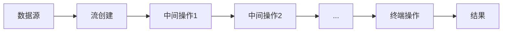
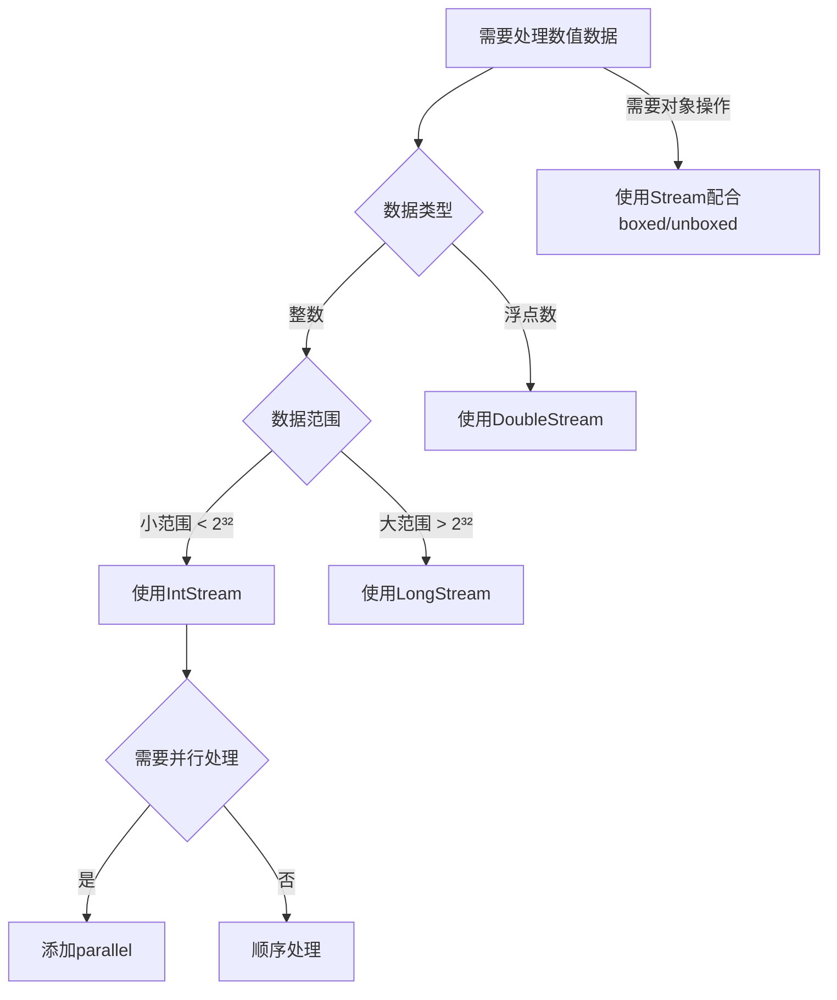
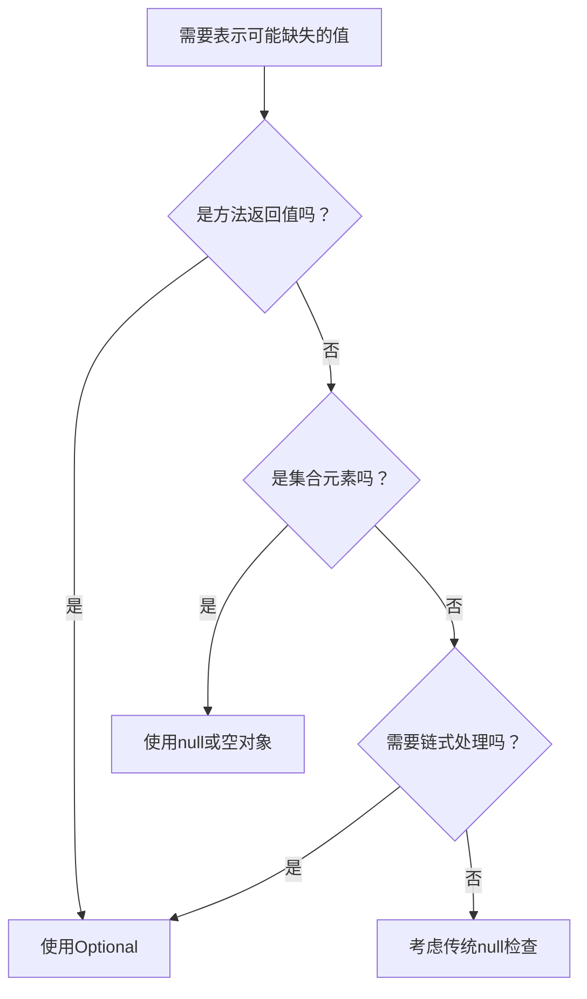

# Java核心基础卷7

# Java 流(Stream)深度解析

## 一、流的概念与核心思想

### 1.1 什么是流？

Java 8 引入的 `Stream API` 是一种高效处理集合数据的声明式编程模型，核心思想是：

- **声明式操作**：描述"做什么"而非"怎么做"
- **函数式编程**：使用 Lambda 表达式和行为参数化
- **流水线处理**：多个操作链式调用
- **惰性求值**：终端操作触发实际计算

```java
List<String> cities = Arrays.asList("London", "Paris", "Tokyo", "New York");

// 传统迭代方式
for (String city : cities) {
    if (city.length() > 5) {
        System.out.println(city.toUpperCase());
    }
}

// Stream 方式
cities.stream()
      .filter(c -> c.length() > 5)
      .map(String::toUpperCase)
      .forEach(System.out::println);
```

### 1.2 流 vs 集合

| **特性**     | **集合 (Collection)**  | **流 (Stream)**                |
| ------------ | ---------------------- | ------------------------------ |
| **存储**     | 存储所有元素           | 不存储数据                     |
| **数据处理** | 外部迭代（开发者控制） | 内部迭代（Stream API 控制）    |
| **遍历**     | 可多次遍历             | 单次使用（消费后即关闭）       |
| **数据处理** | 即时计算               | 惰性计算（终端操作触发）       |
| **数据源**   | 内存数据结构           | 集合、数组、I/O 通道、生成器等 |

## 二、从迭代到流的演进

### 2.1 传统迭代的问题

```java
List<Transaction> transactions = getTransactions();
List<Transaction> groceryTransactions = new ArrayList<>();

// 步骤1: 筛选杂货交易
for (Transaction t : transactions) {
    if (t.getType() == Transaction.GROCERY) {
        groceryTransactions.add(t);
    }
}

// 步骤2: 按金额排序
Collections.sort(groceryTransactions, (t1, t2) -> t2.getValue().compareTo(t1.getValue()));

// 步骤3: 获取交易ID
List<Integer> transactionIds = new ArrayList<>();
for (Transaction t : groceryTransactions) {
    transactionIds.add(t.getId());
}
```

### 2.2 流式解决方案

```java
List<Integer> transactionIds = transactions.stream()
    .filter(t -> t.getType() == Transaction.GROCERY)
    .sorted(Comparator.comparing(Transaction::getValue).reversed())
    .map(Transaction::getId)
    .collect(Collectors.toList());
```

**优势**：

- 代码简洁（减少50%代码量）
- 逻辑清晰（操作步骤线性呈现）
- 易于并行化（只需改为 `parallelStream()`）

## 三、流的创建方式

### 3.1 基础创建方式

```java
// 从集合创建
List<String> list = Arrays.asList("A", "B", "C");
Stream<String> stream1 = list.stream();

// 从数组创建
String[] array = {"X", "Y", "Z"};
Stream<String> stream2 = Arrays.stream(array);

// 使用Stream.of
Stream<String> stream3 = Stream.of("Java", "Python", "C++");

// 使用生成器
Stream<Double> randomStream = Stream.generate(Math::random).limit(5);

// 使用迭代器
Stream<Integer> evenNumbers = Stream.iterate(0, n -> n + 2).limit(10);
```

### 3.2 特殊流创建

```java
// 空流
Stream<String> emptyStream = Stream.empty();

// 基本类型流（避免装箱开销）
IntStream intStream = IntStream.range(1, 100); // 1-99
LongStream longStream = LongStream.of(10L, 20L, 30L);
DoubleStream doubleStream = DoubleStream.generate(Math::random).limit(5);

// 文件流
try (Stream<String> lines = Files.lines(Paths.get("data.txt"))) {
    lines.forEach(System.out::println);
}
```

## 四、核心转换操作

### 4.1 filter - 元素过滤

```java
List<Integer> numbers = Arrays.asList(1, 2, 3, 4, 5, 6);

// 筛选偶数
List<Integer> evens = numbers.stream()
                             .filter(n -> n % 2 == 0)
                             .collect(Collectors.toList()); // [2, 4, 6]

// 多条件过滤
List<String> languages = Arrays.asList("Java", "Python", "C++", "JavaScript");
List<String> result = languages.stream()
                               .filter(lang -> lang.length() > 3)
                               .filter(lang -> lang.contains("a"))
                               .collect(Collectors.toList()); // [Java, JavaScript]
```

### 4.2 map - 元素转换

```java
// 类型转换
List<String> words = Arrays.asList("apple", "banana", "cherry");
List<Integer> lengths = words.stream()
                             .map(String::length)
                             .collect(Collectors.toList()); // [5, 6, 6]

// 对象属性提取
List<Product> products = getProducts();
List<String> names = products.stream()
                             .map(Product::getName)
                             .collect(Collectors.toList());

// 复杂转换
List<Double> prices = products.stream()
                              .map(p -> p.getPrice() * 1.2) // 加20%增值税
                              .collect(Collectors.toList());
```

### 4.3 flatMap - 扁平化处理

```java
// 合并多个集合
List<List<String>> nestedList = Arrays.asList(
    Arrays.asList("Apple", "Banana"),
    Arrays.asList("Orange", "Grape"),
    Arrays.asList("Peach")
);

List<String> flatList = nestedList.stream()
                                  .flatMap(List::stream)
                                  .collect(Collectors.toList());
// [Apple, Banana, Orange, Grape, Peach]

// 拆分字符串
List<String> sentences = Arrays.asList("Hello world", "Java Streams");
List<String> words = sentences.stream()
                              .flatMap(sentence -> Arrays.stream(sentence.split(" ")))
                              .collect(Collectors.toList());
// [Hello, world, Java, Streams]

// 对象嵌套处理
class Order {
    private List<Item> items;
    // getter
}

List<Order> orders = getOrders();
List<Item> allItems = orders.stream()
                            .flatMap(order -> order.getItems().stream())
                            .collect(Collectors.toList());
```

## 五、流的分割与组合

### 5.1 抽取子流

```java
List<Integer> numbers = IntStream.range(1, 100).boxed().collect(Collectors.toList());

// limit - 取前N个
List<Integer> first10 = numbers.stream().limit(10).collect(Collectors.toList());

// skip - 跳过前N个
List<Integer> from20 = numbers.stream().skip(19).collect(Collectors.toList());

// takeWhile (Java 9+) - 取满足条件的连续元素
List<Integer> lessThan50 = numbers.stream().takeWhile(n -> n < 50).collect(Collectors.toList());

// dropWhile (Java 9+) - 跳过满足条件的连续元素
List<Integer> from50 = numbers.stream().dropWhile(n -> n < 50).collect(Collectors.toList());
```

### 5.2 组合流

```java
Stream<String> stream1 = Stream.of("A", "B", "C");
Stream<String> stream2 = Stream.of("X", "Y", "Z");

// concat - 静态方法合并
Stream<String> combined = Stream.concat(stream1, stream2); // A,B,C,X,Y,Z

// 动态合并多个流
List<Stream<String>> streams = Arrays.asList(
    Stream.of("Java"),
    Stream.of("Python"),
    Stream.of("C++")
);

Stream<String> merged = streams.stream()
                               .flatMap(Function.identity());
```

## 六、其他流转换操作

### 6.1 去重与排序

```java
// 去重
List<Integer> withDuplicates = Arrays.asList(1, 2, 2, 3, 4, 4, 5);
List<Integer> unique = withDuplicates.stream()
                                     .distinct()
                                     .collect(Collectors.toList()); // [1,2,3,4,5]

// 自然排序
List<String> languages = Arrays.asList("Java", "Python", "C++", "Ruby");
List<String> sorted = languages.stream()
                               .sorted()
                               .collect(Collectors.toList()); // [C++, Java, Python, Ruby]

// 自定义排序
List<Employee> employees = getEmployees();
List<Employee> bySalary = employees.stream()
                                   .sorted(Comparator.comparing(Employee::getSalary).reversed())
                                   .collect(Collectors.toList());
```

### 6.2 元素查看与调试

```java
// peek - 查看流经管道的元素（调试用）
List<String> result = Stream.of("one", "two", "three")
    .filter(s -> s.length() > 3)
    .peek(s -> System.out.println("Filtered: " + s))
    .map(String::toUpperCase)
    .peek(s -> System.out.println("Mapped: " + s))
    .collect(Collectors.toList());
```

## 七、简单约简操作

### 7.1 基础约简

```java
List<Integer> numbers = Arrays.asList(3, 5, 8, 12, 20);

// 计数
long count = numbers.stream().count(); // 5

// 求和
int sum = numbers.stream().reduce(0, Integer::sum); // 48

// 最值
Optional<Integer> max = numbers.stream().max(Integer::compare);
Optional<Integer> min = numbers.stream().min(Integer::compare);

// 匹配检查
boolean anyNegative = numbers.stream().anyMatch(n -> n < 0); // false
boolean allEven = numbers.stream().allMatch(n -> n % 2 == 0); // false
boolean noneAbove100 = numbers.stream().noneMatch(n -> n > 100); // true
```

### 7.2 高级收集

```java
List<String> languages = Arrays.asList("Java", "Python", "C++", "JavaScript", "Ruby");

// 转换为集合
Set<String> set = languages.stream().collect(Collectors.toSet());

// 拼接字符串
String joined = languages.stream().collect(Collectors.joining(", ")); 
// "Java, Python, C++, JavaScript, Ruby"

// 分组
Map<Integer, List<String>> byLength = languages.stream()
    .collect(Collectors.groupingBy(String::length));
/*
3: ["C++"]
4: ["Java", "Ruby"]
6: ["Python"]
10: ["JavaScript"]
*/

// 分区
Map<Boolean, List<String>> lengthPartition = languages.stream()
    .collect(Collectors.partitioningBy(s -> s.length() > 5));
/*
false: ["Java", "C++", "Ruby"]
true: ["Python", "JavaScript"]
*/
```

## 八、流操作分类与执行机制

### 8.1 操作类型

| **操作类型** | **特点**                 | **示例**                                        |
| ------------ | ------------------------ | ----------------------------------------------- |
| 中间操作     | 惰性执行，返回新流       | `filter()`, `map()`, `sorted()`, `distinct()`   |
| 终端操作     | 触发实际计算，流不可复用 | `collect()`, `forEach()`, `reduce()`, `count()` |

### 8.2 执行流程



**优化机制**：

- 循环合并（Loop Fusion）：合并多个操作在一次循环中完成
- 短路操作（Short-Circuiting）：提前终止处理（如 `limit()`, `findFirst()`）
- 并行处理：自动利用多核（`parallelStream()`）

## 九、最佳实践

1. **优先使用方法引用**：

   ```java
   // 代替 s -> s.toUpperCase()
   .map(String::toUpperCase)
   ```

2. **避免状态型 Lambda**：

   ```java
   // 错误：有状态的Lambda
   AtomicInteger count = new AtomicInteger();
   List<Integer> bad = numbers.stream()
                              .map(n -> n * count.getAndIncrement())
                              .collect(Collectors.toList());
   
   // 正确：无状态转换
   List<Integer> good = IntStream.range(0, numbers.size())
                                 .map(i -> numbers.get(i) * i)
                                 .boxed()
                                 .collect(Collectors.toList());
   ```

3. **谨慎使用并行流**：

   - 适合大型数据集（>10,000元素）
   - 避免共享可变状态
   - I/O密集型操作不适合并行

4. **资源管理**：

   ```java
   try (Stream<String> lines = Files.lines(path)) {
       lines.filter(...).forEach(...);
   } // 自动关闭流
   ```

5. **性能考量**：

   | **操作**     | **时间复杂度** | **备注**            |
   | ------------ | -------------- | ------------------- |
   | `filter/map` | O(n)           | 所有元素都会遍历    |
   | `sorted`     | O(n log n)     | 需要缓冲所有数据    |
   | `distinct`   | O(n)           | 使用HashSet内部维护 |
   | `limit/skip` | O(n)           | 对于有序流可能短路  |

Java Stream API 彻底改变了集合处理方式，结合 Lambda 表达式，可编写出更简洁、高效且易于维护的数据处理代码。掌握流的核心操作和内在机制，能显著提升开发效率和程序性能。


# Java 基本类型流(IntStream, LongStream, DoubleStream)深度解析

## 一、基本类型流诞生的必要性

### 1.1 对象流的性能问题

当处理基本类型数据时，使用`Stream<Integer>`、`Stream<Double>`等对象流会导致严重的**装箱/拆箱开销**：

```java
// 对象流 - 存在装箱开销
Stream<Integer> integerStream = Stream.of(1, 2, 3, 4, 5);
int sum = integerStream.mapToInt(i -> i).sum(); // 需要拆箱操作
```

### 1.2 基本类型流的优势

Java 8 引入的`IntStream`、`LongStream`、`DoubleStream`解决了这些问题：

- **零装箱开销**：直接操作原始数据类型
- **内存高效**：减少对象头开销（每个对象约16字节）
- **专用操作**：提供针对数值的聚合方法（sum、average等）
- **性能提升**：处理百万级数据时速度提升2-5倍

## 二、基本类型流核心特性对比

| **特性**         | `IntStream`                | `LongStream`               | `DoubleStream`        |
| ---------------- | -------------------------- | -------------------------- | --------------------- |
| **存储范围**     | 32位整数 (-2³¹~2³¹-1)      | 64位整数 (-2⁶³~2⁶³-1)      | 64位浮点数 (IEEE 754) |
| **专用聚合方法** | `sum()`, `average()`       | `sum()`, `average()`       | `sum()`, `average()`  |
| **范围生成**     | `range()`, `rangeClosed()` | `range()`, `rangeClosed()` | ❌ 不支持              |
| **典型应用**     | 计数器、索引处理           | 时间戳、大整数计算         | 科学计算、统计分析    |

## 三、创建基本类型流

### 3.1 直接创建

```java
// IntStream
IntStream intStream1 = IntStream.of(1, 2, 3, 4, 5);
IntStream intStream2 = IntStream.range(1, 100); // [1, 100) 半开区间
IntStream intStream3 = IntStream.rangeClosed(1, 100); // [1, 100] 闭区间

// LongStream
LongStream longStream = LongStream.generate(() -> System.currentTimeMillis()).limit(10);

// DoubleStream
DoubleStream doubleStream = DoubleStream.iterate(0.5, n -> n * 0.8).limit(5);
```

### 3.2 从集合/数组转换

```java
// 数组 → 基本类型流
int[] intArray = {1, 2, 3};
IntStream fromArray = Arrays.stream(intArray);

// 集合 → 基本类型流
List<Integer> list = Arrays.asList(1, 2, 3);
IntStream fromCollection = list.stream().mapToInt(Integer::intValue);
```

### 3.3 特殊流创建

```java
// 空流
IntStream empty = IntStream.empty();

// 无限流
IntStream randomInts = IntStream.generate(() -> (int)(Math.random() * 100));

// 合并流
IntStream combined = IntStream.concat(
    IntStream.range(1, 5), 
    IntStream.range(10, 15)
); // 1,2,3,4,10,11,12,13,14
```

## 四、核心操作与转换

### 4.1 过滤与映射

```java
IntStream.rangeClosed(1, 10)
         .filter(n -> n % 2 == 0) // 过滤偶数
         .map(n -> n * n)         // 平方
         .forEach(System.out::println); // 4, 16, 36, 64, 100
```

### 4.2 扁平化处理

```java
List<int[]> arrays = Arrays.asList(
    new int[]{1, 2},
    new int[]{3, 4},
    new int[]{5, 6}
);

IntStream flatStream = arrays.stream()
                            .flatMapToInt(Arrays::stream); // 1,2,3,4,5,6
```

### 4.3 聚合统计

```java
int[] values = {10, 20, 30, 40, 50};

// 简单聚合
int sum = IntStream.of(values).sum();
double avg = IntStream.of(values).average().orElse(0); // 避免NoSuchElementException

// 完整统计
IntSummaryStatistics stats = IntStream.of(values).summaryStatistics();
System.out.println("Count: " + stats.getCount());
System.out.println("Min: " + stats.getMin());
System.out.println("Max: " + stats.getMax());
System.out.println("Sum: " + stats.getSum());
System.out.println("Average: " + stats.getAverage());
```

## 五、类型转换与互操作

### 5.1 基本类型流 ↔ 对象流

```java
// IntStream → Stream<Integer>
Stream<Integer> boxedStream = IntStream.range(1, 5).boxed();

// Stream<Integer> → IntStream
IntStream unboxedStream = Stream.of(1, 2, 3).mapToInt(Integer::intValue);
```

### 5.2 基本类型流之间转换

```java
// IntStream → LongStream
LongStream longFromInt = IntStream.range(1, 100).asLongStream();

// DoubleStream → IntStream
IntStream intFromDouble = DoubleStream.of(1.5, 2.7, 3.9).mapToInt(d -> (int) d);
```

## 六、数值计算专用操作

### 6.1 范围生成（仅Int/LongStream）

```java
// [1, 10] 包含10
long evenCount = IntStream.rangeClosed(1, 10)
                         .filter(n -> n % 2 == 0)
                         .count(); // 5
```

### 6.2 科学计算（DoubleStream特有）

```java
double[] measurements = {15.3, 18.7, 22.1, 19.5, 20.2};

// 计算方差
double avg = DoubleStream.of(measurements).average().orElse(0);
double variance = DoubleStream.of(measurements)
                             .map(d -> Math.pow(d - avg, 2))
                             .sum() / measurements.length;
```

### 6.3 并行计算优化

```java
// 顺序计算
long startSeq = System.currentTimeMillis();
long seqSum = LongStream.range(0, 100_000_000).sum();
long seqTime = System.currentTimeMillis() - startSeq;

// 并行计算
long startPar = System.currentTimeMillis();
long parSum = LongStream.range(0, 100_000_000).parallel().sum();
long parTime = System.currentTimeMillis() - startPar;

System.out.println("顺序计算时间: " + seqTime + "ms");
System.out.println("并行计算时间: " + parTime + "ms");
// 典型输出（8核CPU）: 
// 顺序计算时间: 120ms
// 并行计算时间: 35ms
```

## 七、实际应用场景

### 7.1 数据统计分析

```java
public class DataAnalyzer {
    public static void analyze(int[] data) {
        IntSummaryStatistics stats = IntStream.of(data).summaryStatistics();
        
        System.out.println("数据报告:");
        System.out.println("  数据量: " + stats.getCount());
        System.out.println("  最小值: " + stats.getMin());
        System.out.println("  最大值: " + stats.getMax());
        System.out.println("  平均值: " + stats.getAverage());
        System.out.println("  总和: " + stats.getSum());
        
        // 计算中位数
        int[] sorted = IntStream.of(data).sorted().toArray();
        double median = sorted.length % 2 == 0 ?
            (sorted[sorted.length/2 - 1] + sorted[sorted.length/2]) / 2.0 :
            sorted[sorted.length/2];
            
        System.out.println("  中位数: " + median);
    }
}
```

### 7.2 游戏开发（坐标处理）

```java
public class GameEngine {
    // 生成不重复的随机坐标
    public static int[] generateUniquePositions(int count, int max) {
        return new Random().ints(0, max) // 生成随机数流
                          .distinct()   // 去重
                          .limit(count)  // 限制数量
                          .toArray();    // 转为数组
    }

    // 计算两点间距离
    public static double distance(int x1, int y1, int x2, int y2) {
        return Math.sqrt(Math.pow(x2 - x1, 2) + Math.pow(y2 - y1, 2));
    }

    // 查找最近玩家
    public static OptionalInt findNearestPlayer(int[] playerX, int[] playerY, int targetX, int targetY) {
        return IntStream.range(0, playerX.length)
                       .mapToObj(i -> new PlayerDistance(
                           i, 
                           distance(playerX[i], playerY[i], targetX, targetY)
                       ))
                       .min(Comparator.comparingDouble(PlayerDistance::distance))
                       .map(PlayerDistance::index)
                       .map(OptionalInt::of)
                       .orElse(OptionalInt.empty());
    }
    
    record PlayerDistance(int index, double distance) {}
}
```

### 7.3 时间序列处理

```java
public class TimeSeriesAnalysis {
    // 计算移动平均
    public static double[] movingAverage(long[] timestamps, double[] values, int windowSize) {
        return IntStream.range(0, values.length - windowSize + 1)
                       .mapToDouble(i -> Arrays.stream(values, i, i + windowSize)
                                              .average()
                                              .orElse(Double.NaN))
                       .toArray();
    }

    // 检测异常值
    public static List<Integer> detectOutliers(double[] values, double threshold) {
        DoubleSummaryStatistics stats = DoubleStream.of(values).summaryStatistics();
        double mean = stats.getAverage();
        double stdDev = Math.sqrt(
            DoubleStream.of(values)
                       .map(d -> Math.pow(d - mean, 2))
                       .sum() / values.length
        );
        
        return IntStream.range(0, values.length)
                       .filter(i -> Math.abs(values[i] - mean) > threshold * stdDev)
                       .boxed()
                       .collect(Collectors.toList());
    }
}
```

## 八、性能最佳实践

### 8.1 优先使用基本类型流

```java
// 反例：使用对象流处理基本类型
long sum = Stream.of(1, 2, 3, 4)
                .mapToLong(Integer::longValue)
                .sum();

// 正例：直接使用基本类型流
long sum = LongStream.of(1, 2, 3, 4).sum();
```

### 8.2 避免重复计算

```java
// 低效：多次遍历相同流
IntStream data = IntStream.range(1, 1000);
long count = data.count();
double avg = data.average().orElse(0); // 抛出异常：流已关闭

// 高效：使用summaryStatistics
IntSummaryStatistics stats = IntStream.range(1, 1000).summaryStatistics();
long count = stats.getCount();
double avg = stats.getAverage();
```

### 8.3 并行流使用指南

```java
// 适合并行的情况：
// - 大型数据集（>10,000元素）
// - CPU密集型操作
// - 无共享状态
LongStream.range(1, 10_000_000)
          .parallel()
          .filter(n -> n % 2 == 0)
          .sum();

// 避免并行的情况：
// - 小型数据集
// - I/O密集型操作
// - 有顺序依赖的操作（如findFirst）
```

## 九、注意事项与常见陷阱

### 9.1 流重用问题

```java
IntStream stream = IntStream.of(1, 2, 3);
stream.count(); // 终端操作
stream.sum();   // 抛出IllegalStateException: stream has already been operated upon or closed
```

### 9.2 空值处理

```java
// 基本类型流不支持null值
IntStream.of(1, null, 3); // 编译错误

// 替代方案：使用默认值
int[] dataWithNulls = {1, -1, 3}; // 用-1表示null
double avg = IntStream.of(dataWithNulls)
                     .filter(n -> n != -1)
                     .average()
                     .orElse(0);
```

### 9.3 精度问题（DoubleStream）

```java
// 浮点数精度问题
double sum = DoubleStream.of(0.1, 0.2).sum();
System.out.println(sum == 0.3); // false!

// 解决方案：使用BigDecimal或调整精度
double epsilon = 1e-10;
System.out.println(Math.abs(sum - 0.3) < epsilon); // true
```

## 十、Java 16+ 增强特性

### 10.1 Stream.toList() 简化

```java
// Java 16+ 简洁写法
List<Integer> list = IntStream.range(1, 5)
                              .boxed()
                              .toList(); // 不可变列表

// 替代旧写法
List<Integer> oldWay = IntStream.range(1, 5)
                               .boxed()
                               .collect(Collectors.toList());
```

### 10.2 mapMulti 操作

```java
// 展开操作更高效
List<Integer> expanded = IntStream.range(1, 4)
    .mapMulti((i, consumer) -> {
        consumer.accept(i);
        consumer.accept(i * 10);
    })
    .boxed()
    .toList(); // [1, 10, 2, 20, 3, 30]
```

## 总结：基本类型流使用决策树



**核心原则**：

1. **优先选择基本类型流**：处理数值数据时首选IntStream/LongStream/DoubleStream
2. **注意流生命周期**：终端操作后流即关闭，不可重用
3. **并行处理需谨慎**：评估数据规模和操作成本
4. **浮点数警惕精度**：关键计算考虑使用BigDecimal
5. **利用统计方法**：summaryStatistics避免多次遍历

基本类型流是Java高性能数值计算的基石，掌握其特性和最佳实践，能够显著提升数据处理效率和程序性能。


# Java Optional 深度指南：从概念到实践

## 一、Optional 的核心概念

### 1.1 诞生背景

- 解决 `NullPointerException` (NPE) 问题 - Java 中最常见的异常
- 明确表达"值可能不存在"的语义，替代模糊的 `null`
- 函数式编程思想的实践，促进更安全的代码设计

### 1.2 本质与定位

- 容器对象：可能包含非空值，也可能为空
- 目的：**显式处理缺失值**，而非隐式假设值存在
- 设计哲学："不要使用 null，而要使用 Optional"（Brian Goetz）

```java
// 传统方式：危险的空指针风险
String isbn = book.getChapter(0).getTitle().toUpperCase();

// Optional 方式：显式处理每一步可能的缺失
Optional<Book> bookOpt = findBookById(123);
String title = bookOpt.flatMap(Book::getFirstChapter)
                     .map(Chapter::getTitle)
                     .map(String::toUpperCase)
                     .orElse("DEFAULT_TITLE");
```

## 二、核心 API 详解

### 2.1 创建 Optional

| 方法                         | 描述                          | 示例                             | 使用场景             |
| ---------------------------- | ----------------------------- | -------------------------------- | -------------------- |
| `Optional.empty()`           | 创建空 Optional               | `Optional.empty()`               | 表示明确缺失         |
| `Optional.of(value)`         | 创建包含非 null 值的 Optional | `Optional.of("text")`            | 确保值非 null        |
| `Optional.ofNullable(value)` | 创建可能为 null 的 Optional   | `Optional.ofNullable(maybeNull)` | 处理可能 null 的输入 |

### 2.2 值获取与处理

| 方法                    | 描述                 | 示例                                          | 推荐指数   |
| ----------------------- | -------------------- | --------------------------------------------- | ---------- |
| `get()`                 | 获取值（空时抛异常） | `opt.get()`                                   | ⚠️ 避免使用 |
| `orElse(T)`             | 提供默认值           | `opt.orElse("default")`                       | ★★★★☆      |
| `orElseGet(Supplier)`   | 延迟提供默认值       | `opt.orElseGet(() -> expensiveOp())`          | ★★★★★      |
| `orElseThrow(Supplier)` | 空时抛自定义异常     | `opt.orElseThrow(IllegalStateException::new)` | ★★★★☆      |
| `ifPresent(Consumer)`   | 值存在时执行操作     | `opt.ifPresent(System.out::println)`          | ★★★★★      |

### 2.3 链式转换

| 方法                | 描述              | 示例                              |
| ------------------- | ----------------- | --------------------------------- |
| `map(Function)`     | 值转换            | `opt.map(String::length)`         |
| `flatMap(Function)` | 展平嵌套 Optional | `opt.flatMap(this::parseIntSafe)` |
| `filter(Predicate)` | 条件过滤          | `opt.filter(s -> s.length() > 5)` |

## 三、实用开发模式

### 3.1 安全导航（避免深层 null 检查）

```java
// 传统方式：深层嵌套 null 检查
String city = null;
if (user != null) {
    Address address = user.getAddress();
    if (address != null) {
        city = address.getCity();
    }
}

// Optional 方式：流畅链式调用
String city = Optional.ofNullable(user)
                     .map(User::getAddress)
                     .map(Address::getCity)
                     .orElse("Unknown");
```

### 3.2 条件执行与默认值

```java
// 复杂默认值逻辑
String configValue = Optional.ofNullable(loadConfig())
                            .filter(conf -> conf.startsWith("valid_"))
                            .orElseGet(() -> {
                                log.warn("Using fallback config");
                                return loadDefaultConfig();
                            });
```

### 3.3 结合 Stream API

```java
List<Order> orders = getOrders();
List<Product> products = orders.stream()
    .map(Order::getProduct)
    .filter(Optional::isPresent)
    .map(Optional::get)
    .collect(Collectors.toList());

// Java 9+ 更简洁
List<Product> products = orders.stream()
    .map(Order::getProduct)
    .flatMap(Optional::stream) // 将非空Optional转为Stream
    .collect(Collectors.toList());
```

## 四、最佳实践与反模式

### ✅ 最佳实践

1. **作为返回值**：明确表示方法可能没有结果

   ```java
   public Optional<User> findUserById(long id) {
       // 查询数据库，可能返回空
   }
   ```

2. **链式调用**：流畅处理可能缺失的值

   ```java
   findUserById(123)
       .map(User::getEmail)
       .ifPresent(emailService::sendNotification);
   ```

3. **结合函数式接口**：

   ```java
   public void processIfPresent(Optional<Data> dataOpt) {
       dataOpt.ifPresentOrElse(
           data -> process(data),
           () -> log.warning("Data missing")
       );
   }
   ```

### ⚠️ 常见反模式

1. **错误：用 Optional 作为字段**

   ```java
   // 反例：增加内存开销且不必要
   class User {
       private Optional<String> email; // 不要这样做！
   }
   ```

2. **错误：不必要的 isPresent-check**

   ```java
   // 反例：冗余检查
   if (opt.isPresent()) {
       String value = opt.get(); // 危险操作
       process(value);
   }
   
   // 正例：使用 ifPresent
   opt.ifPresent(this::process);
   ```

3. **错误：在集合中使用 Optional**

   ```java
   // 反例：增加内存开销
   List<Optional<String>> list = new ArrayList<>();
   
   // 正例：直接存储值或 null
   List<String> list = new ArrayList<>();
   ```

## 五、性能考量

### 5.1 内存开销

- Optional 增加额外对象头（约 16 字节）
- 每个 Optional 实例额外增加 4-8 字节
- 在内存敏感场景需谨慎使用

### 5.2 何时选择传统 null 检查

| 场景           | 推荐方式           | 原因              |
| -------------- | ------------------ | ----------------- |
| 高性能关键路径 | 传统 null 检查     | Optional 创建开销 |
| 简单局部变量   | 传统 null 检查     | 简洁性            |
| 集合内部元素   | 传统 null 或空对象 | 减少内存开销      |

## 六、Java 9+ 增强特性

### 6.1 ifPresentOrElse

```java
// 值存在/缺失分别处理
optional.ifPresentOrElse(
    value -> System.out.println("Found: " + value),
    () -> System.out.println("Not found")
);
```

### 6.2 or

```java
// 提供备选 Optional
Optional<String> primary = findPrimaryConfig();
Optional<String> result = primary.or(() -> findBackupConfig());
```

### 6.3 stream()

```java
// 将 Optional 转为 Stream
List<String> values = Stream.of(opt1, opt2, opt3)
                           .flatMap(Optional::stream)
                           .collect(Collectors.toList());
```

## 七、实际应用场景

### 7.1 REST API 响应处理

```java
@GetMapping("/users/{id}")
public ResponseEntity<UserResponse> getUser(@PathVariable Long id) {
    return userService.findById(id)
                     .map(user -> ResponseEntity.ok(toResponse(user)))
                     .orElseGet(() -> ResponseEntity.notFound().build());
}
```

### 7.2 配置读取

```java
public Duration getTimeout() {
    return Optional.ofNullable(config.get("timeout"))
                  .map(String::trim)
                  .filter(s -> !s.isEmpty())
                  .map(Duration::parse)
                  .orElse(Duration.ofSeconds(30));
}
```

### 7.3 安全转换

```java
public Optional<Integer> parsePositiveInt(String input) {
    return Optional.ofNullable(input)
                  .flatMap(s -> {
                      try {
                          int value = Integer.parseInt(s);
                          return value > 0 ? Optional.of(value) : Optional.empty();
                      } catch (NumberFormatException e) {
                          return Optional.empty();
                      }
                  });
}
```

## 八、与其他语言的对比

| 特性     | Java Optional | Kotlin 可空类型 | Scala Option  |
| -------- | ------------- | --------------- | ------------- |
| 语法支持 | 库类          | 语言级支持      | 库类+模式匹配 |
| 空安全   | 需主动处理    | 编译时强制      | 需主动处理    |
| 性能     | 中等开销      | 零开销          | 中等开销      |
| 互操作   | 兼容旧代码    | 需@Nullable注解 | 需显式转换    |

## 九、总结：Optional 使用原则

1. **绝不返回 null**：用 Optional.empty() 替代
2. **避免 Optional 字段**：增加内存开销
3. **优先函数式方法**：ifPresent() 优于 isPresent()+get()
4. **谨慎使用 get()**：确保值存在或处理异常
5. **考虑性能影响**：在关键路径评估开销
6. **结合 Stream API**：利用 flatMap 和 filter 优雅处理
7. **升级到 Java 9+**：使用新特性简化代码



Optional 不是银弹，而是**明确表达缺失值的工具**。正确使用时，它能够：

- 减少 NullPointerExceptions
- 提高代码可读性
- 强制开发者处理缺失情况
- 促进函数式编程风格

掌握 Optional 的艺术，将使您的 Java 代码更健壮、更表达意图，更少出现意外崩溃。