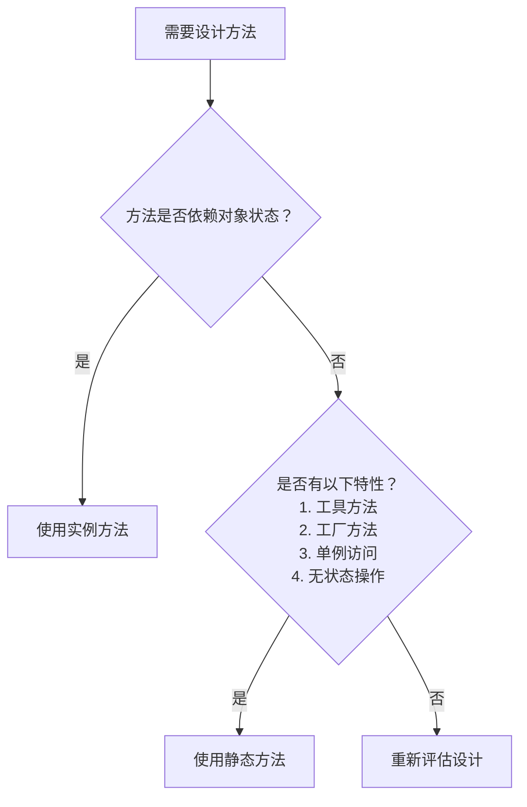
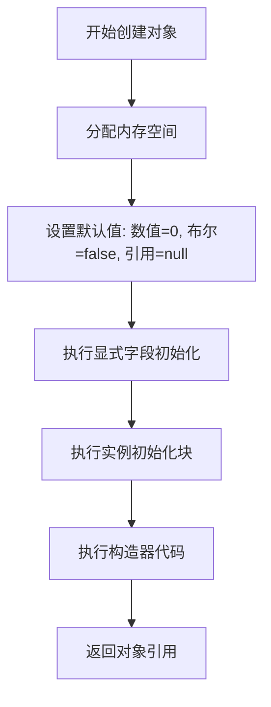

**目标：**

- 面向对象程序设计入门
- 如何创建标准Java类库中的类的对象
- 如何编写自己的类

## 面向对象程序设计概述

Java 是一门**纯面向对象**的编程语言（除了基本数据类型），这意味着它的核心设计思想和编程范式都是围绕着“对象”这个概念构建的。==面向对象程序设计（OOP）==是一种强大的编程模型，它通过将现实世界的事物抽象为程序中的“对象”来组织代码和数据。

以下是 Java 面向对象程序设计的关键概念概述：

1.  **核心思想：**
    *   **万物皆对象：** 程序中的一切实体（如用户、订单、按钮、数据库连接）都可以被视为对象。
    *   **程序是对象的集合：** 程序由一组相互协作的对象组成，对象之间通过发送消息（调用方法）进行交互。
    *   **每个对象都是其类型（类）的实例：** 对象是根据“蓝图”或“模板”（类）创建出来的具体个体。
    *   **对象封装状态和行为：** 对象包含==数据（属性/字段/状态）==和==对这些数据进行操作的方法（行为）==。

2.  **四大基本特性（基石）：**
    *   **抽象：**
        *   忽略事物中与当前目标无关的非本质特征，而只关注那些与当前目标相关的本质特征。
        *   在 Java 中，主要通过**类**和**接口**来实现抽象。
        *   **类：** 定义了一类对象的共同属性和方法。它是创建对象的模板。例如，一个 `Car` 类可以定义 `color`, `brand`, `speed` 属性和 `accelerate()`, `brake()` 方法。
        *   **接口：** 定义了一组方法契约（只声明方法签名，不实现），规定了实现该接口的类**必须**提供哪些功能。它关注的是“能做什么”，而不是“如何做”。例如，一个 `Drawable` 接口可以声明一个 `draw()` 方法。
    *   **封装：**
        *   将对象的属性（数据）和操作这些属性的方法（行为）捆绑在一起，形成一个独立的单元。
        *   隐藏对象的内部实现细节（属性通常是私有的 - `private`），只对外暴露必要的操作接口（公共方法 - `public`）。
        *   **目的：**
            *   提高安全性：防止外部代码直接修改内部数据，只能通过受控的方法访问。
            *   简化使用：使用者无需了解内部复杂实现，只需知道如何使用公开的方法。
            *   提高可维护性：内部实现的修改只要不改变公开接口，就不会影响使用该对象的代码。
        *   在 Java 中，通过访问修饰符 (`private`, `protected`, `public`, 默认`package-private`) 来实现封装。
    *   **继承：**
        *   允许一个类（子类、派生类）基于另一个已有类（父类、超类、基类）来创建新类。
        *   子类**自动拥有**父类的属性和方法（构造方法除外），并可以：
            *   添加新的属性和方法。
            *   覆盖父类的方法以提供特定实现。
        *   **目的：**
            *   代码复用：避免重复编写父类已有的代码。
            *   建立类层次结构（分类关系）：表达 `is-a` 关系（例如，`Dog` is an `Animal`, `Manager` is an `Employee`）。
        *   在 Java 中，使用 `extends` 关键字实现单继承（一个类只能有一个直接父类）。
    *   **多态：**
        *   字面意思是“多种形态”。
        *   指**同一个操作（方法调用）作用于不同的对象上，可以产生不同的执行结果**。
        *   **核心机制：**
            *   **继承：** 多态通常建立在继承或接口实现的基础上。
            *   **方法重写：** 子类可以覆盖父类的方法，提供自己的实现。
            *   **父类引用指向子类对象：** `ParentClass obj = new ChildClass();`
        *   **体现：**
            *   **编译时多态（静态绑定/早绑定）：** 主要指**方法重载**。在同一个类中，多个方法名相同但参数列表不同（类型、个数、顺序）。编译器在编译时根据参数确定调用哪个方法。
            *   **运行时多态（动态绑定/晚绑定）：** 主要指**基于继承和方法重写的多态**。当父类引用指向子类对象并调用被子类重写的方法时，JVM 在运行时根据对象的**实际类型**（而不是引用类型）来决定执行哪个方法。这是 OOP 中最重要的多态形式。
        *   **目的：**
            *   提高代码的**灵活性**和**可扩展性**：程序可以处理未来新加入的类对象，只要它们继承自同一个父类或实现了同一个接口。调用代码无需修改。
            *   接口统一：可以用父类类型（或接口类型）来引用不同的子类对象，统一调用方法。

3.  **关键元素：**
    *   **类：** 对象的模板/蓝图。定义<u>对象的属性（成员变量</u>）和<u>行为（成员方法）</u>。
    *   **对象：** 类的具体实例。使用 `new` 关键字创建。每个对象在内存中独立存在。
    *   **成员变量 (属性/字段/状态)：** 类中定义的变量，表示对象的特征或数据。
    *   **成员方法 (行为/函数)：** 类中定义的函数，表示对象能执行的操作。
    *   **构造方法：** 一种特殊的方法，用于在创建对象时初始化新对象的状态。方法名与类名相同，无返回类型声明。
    *   **访问修饰符：** `public`, `private`, `protected`, `(default)`。控制类、属性、方法的可见性和访问权限。
    *   **`this` 关键字：** 指向当前对象的引用。常用于区分成员变量和局部变量同名的情况，或在构造方法中调用其他构造方法。
    *   **`super` 关键字：** 指向直接父类对象的引用。常用于在子类中访问父类的成员（属性、方法）或调用父类的构造方法。

4.  **OOP 在 Java 中的优势：**
    *   **模块化：** 代码组织更清晰，易于理解和维护。
    *   **代码复用：** 继承和组合大大减少了重复代码。
    *   **灵活性 & 可扩展性：** 多态和接口使得添加新功能或修改现有功能更容易，对现有代码影响小。
    *   **易维护性：** 封装保护了内部数据，修改内部实现不影响外部使用者。
    *   **模拟现实世界：** 对象模型更自然地映射现实世界中的实体和关系。

**总结：**

Java 的面向对象程序设计围绕着**类**和**对象**展开，通过**抽象**定义概念，利用**封装**保护内部细节，借助**继承**实现代码复用和层次构建，并依赖**多态**（特别是运行时多态）提供强大的灵活性和扩展性。掌握这四大特性以及类、对象、方法、属性等基本元素，是理解和编写高效、健壮、可维护的 Java 程序的基础。OOP 思想让 Java 能够有效地处理大型、复杂的软件系统开发。


## 使用预定义类

由于Java面向对象的封装特性，使用预定义类时不需要了解它具体是如何实现的，你只需要知道方法名和参数（如果有的话）。

### 对象和对象变量

要想使用对象，首先必须构造对象，并指定其初始化状态。然后对对象应用方法。

在使用预定义类库（如 Java 标准库）时，**对象、对象变量和构造器**是最基础且必须掌握的核心概念。以下是详细解析：

---

### **1. 对象（Object）**

**定义**：类的具体实例，包含实际数据和行为  
**关键特性**：

- **状态（State）**：对象内部数据的当前值（通过字段存储）
- **行为（Behavior）**：对象可执行的操作（通过方法实现）
- **标识（Identity）**：对象在内存中的唯一地址

**示例**：

```java
String s = "Hello";  // "Hello" 是一个String对象
LocalDate today = LocalDate.now();  // today 是LocalDate对象
```

---

### **2. 对象变量（Object Variable）**

**定义**：存储对象**引用**的变量（非对象本身）  
**关键特性**：

| **概念**       | 说明                                     | 示例                          |
| -------------- | ---------------------------------------- | ----------------------------- |
| **引用类型**   | 变量存储对象的内存地址（非对象数据本身） | `String s;` (s是引用变量)     |
| **空引用**     | 未指向任何对象的变量（值为`null`）       | `Scanner scanner = null;`     |
| **多引用指向** | 多个变量可指向同一个对象                 | `String s1 = s;`              |
| **垃圾回收**   | 当无变量引用对象时，对象会被GC回收       | `s = null;` // 原对象可被回收 |

**内存模型**：

```
变量s1  →  [String对象("Hello")]
变量s2 ↗
```

---

### **3. 构造器（Constructor）**

**定义**：创建对象并初始化其状态的特殊方法  
**关键特性**：

| **特性**       | 说明                                     | 示例                                |
| -------------- | ---------------------------------------- | ----------------------------------- |
| **名称匹配**   | 必须与类名完全相同                       | `new ArrayList<>()`                 |
| **无返回值**   | 不声明返回类型（包括`void`）             | `public File(String path) {...}`    |
| **重载支持**   | 一个类可有多个参数不同的构造器           | `new String()` / `new String("Hi")` |
| **默认构造器** | 未定义构造器时，编译器自动生成无参构造器 | `new Object()`                      |
| **构造器链**   | 通过`this()`调用同类其他构造器           | 见下方代码示例                      |

**构造过程详解**：

```java
// 预定义类：java.io.File
File file = new File("data.txt");  // 调用File(String path)构造器

// 等效于以下步骤：
// 1. JVM分配内存空间
// 2. 初始化字段默认值（引用=null, 数值=0, 布尔=false）
// 3. 执行构造器代码（本例中：将"data.txt"存入path字段）
// 4. 返回对象引用赋给file变量
```

---

### **关键实践与陷阱**

#### **对象生命周期控制**

```java
// 正确：使用try-with-resources管理资源
try (BufferedReader br = new BufferedReader(new FileReader("file.txt"))) {
    // br对象在此块内有效
} // 自动调用br.close()释放资源

// 错误：未关闭资源
BufferedReader br = new BufferedReader(...);
// 忘记br.close() → 资源泄漏！
```

#### **空引用防御**

```java
// 安全访问对象
if (scanner != null) {
    scanner.nextLine();
}

// Java 9+ 空安全方法
Objects.requireNonNull(scanner, "Scanner不能为null");
```

#### **构造器链示例**

```java
// 自定义类演示构造器链
public class Employee {
    private String name;
    private int id;
    
    // 主构造器
    public Employee(String name, int id) {
        this.name = name;
        this.id = id;
    }
    
    // 辅助构造器（调用主构造器）
    public Employee(String name) {
        this(name, generateDefaultId());  // 调用主构造器
    }
    
    private static int generateDefaultId() { ... }
}
```

#### **易错点：混淆对象与基本类型**

```java
// 基本类型（值直接存储在变量中）
int x = 10;  
int y = x;   // 复制值（x=10, y=10）

// 对象类型（变量存储引用）
String s1 = "A";
String s2 = s1;   // 复制引用（s1和s2指向同一对象）
s2 = "B";         // s1仍为"A"，s2指向新对象"B"
```

---

### **为什么这些概念至关重要？**

1. **对象创建**：`new` + 构造器是创建对象的唯一方式
2. **内存管理**：理解引用变量避免内存泄漏
3. **空指针防护**：Java最常见的`NullPointerException`根源
4. **对象初始化**：构造器确保对象处于合法状态
5. **API正确使用**：预定义类（如`ArrayList`, `File`）依赖构造器参数配置

> [!note]
>
> **黄金法则**：  
> **对象变量 ≠ 对象本身**  
> 变量是遥控器，对象是电视机  
> 多个遥控器可控制同一台电视机  
> 没有遥控器=电视机无法操作（但可能仍在房间中）


---

使用Java预定义类库（如Java SE API）时，必须掌握以下核心概念知识，这些是高效、安全开发的基础：

### **1. 包（Package）与导入（Import）**

- **包结构**：理解类库的组织方式（如`java.util`包含集合类，`java.io`包含I/O类）

- **导入语法**：

  ```java
  import java.util.ArrayList;  // 单类导入
  import java.util.*;          // 整个包导入（谨慎使用）
  ```

- **完全限定名**：未导入时使用全路径（`java.time.LocalDate now = java.time.LocalDate.now()`）

---

### **2. 对象生命周期管理**

- **构造方法**：

  ```java
  // 不同重载版本
  String s1 = new String(); 
  String s2 = new String("Hello");
  ```

- **资源释放**：

  - **AutoCloseable接口**：必须使用try-with-resources

  ```java
  try (FileInputStream fis = new FileInputStream("file.txt")) {
      // 自动关闭资源
  } catch (IOException e) { ... }
  ```

---

### **3. 异常处理体系**

| **异常类型**    | **特点**     | **处理方式**          | **示例**               |
| --------------- | ------------ | --------------------- | ---------------------- |
| **受检异常**    | 必须处理     | `try-catch`或`throws` | `IOException`          |
| **运行时异常**  | 可选择性处理 | 预防性检查            | `NullPointerException` |
| **错误(Error)** | 不可恢复     | 通常不捕获            | `OutOfMemoryError`     |

```java
// 正确处理链
try {
    Files.readString(Path.of("data.txt"));
} catch (NoSuchFileException e) {
    System.err.println("文件不存在");
} catch (IOException e) {
    System.err.println("IO错误: " + e.getMessage());
}
```

---

### **4. 集合框架（java.util）**

- **核心接口关系**：

  ```
  Collection
  ├── List (ArrayList, LinkedList)
  ├── Set (HashSet, TreeSet)
  └── Queue (PriorityQueue)
  
  Map (HashMap, TreeMap)
  ```

- **关键特性**：

  - **ArrayList**：随机访问快（O(1)），插入/删除慢（O(n)）
  - **HashMap**：键值对存储，负载因子(0.75)触发扩容
  - **ConcurrentHashMap**：线程安全实现

---

### **5. 泛型（Generics）**

- **类型安全集合**：

  ```java
  List<String> names = new ArrayList<>();  // 编译时类型检查
  names.add(123); // 编译错误!
  ```

- **通配符**：

  ```java
  // 上界通配符
  void print(List<? extends Number> list) { ... }
  
  // 下界通配符
  void addNumbers(List<? super Integer> list) { ... }
  ```

---

### **6. 多线程与并发**

- **线程安全级别**：

  | **类**             | **线程安全** | **替代方案**        |
  | ------------------ | ------------ | ------------------- |
  | `StringBuilder`    | ❌ 不安全     | `StringBuffer`      |
  | `HashMap`          | ❌ 不安全     | `ConcurrentHashMap` |
  | `SimpleDateFormat` | ❌ 不安全     | `DateTimeFormatter` |

- **Executor框架**（现代线程管理）：

  ```java
  ExecutorService pool = Executors.newFixedThreadPool(4);
  pool.submit(() -> System.out.println("异步任务"));
  ```

---

### **7. 不可变对象（Immutability）**

- **JDK示例**：`String`, `LocalDate`, `BigInteger`

- **识别方法**：

  - 类声明为`final`
  - 字段均为`private final`
  - 没有setter方法

  ```java
  String s = "hello";
  s.toUpperCase();  // 返回新对象，原对象不变
  ```

---

### **8. Java I/O与NIO**

- **传统I/O**：基于流的同步阻塞

  ```java
  try (BufferedReader br = new BufferedReader(new FileReader("file.txt"))) {
      String line;
      while ((line = br.readLine()) != null) { ... }
  }
  ```

- **NIO（New I/O）**：基于通道的非阻塞

  ```java
  Path path = Paths.get("file.txt");
  List<String> lines = Files.readAllLines(path, StandardCharsets.UTF_8);
  ```

---

### **9. 函数式接口与Lambda**

- **常用接口**：

  | **接口**        | **方法**         | **用例** |
  | --------------- | ---------------- | -------- |
  | `Supplier<T>`   | `T get()`        | 延迟求值 |
  | `Consumer<T>`   | `void accept(T)` | 遍历集合 |
  | `Function<T,R>` | `R apply(T)`     | 数据转换 |

  ```java
  list.forEach(s -> System.out.println(s));  // Consumer实现
  ```

---

### **10. 注解（Annotations）**

- **元数据处理**：

  ```java
  @Override  // 强制编译器检查方法重写
  public String toString() { ... }
  
  @Deprecated(since="9", forRemoval=true)
  public void oldMethod() { ... }
  ```

---

### **11. 时间API（java.time）**

- **替代Date/Calendar**：

  ```java
  LocalDate today = LocalDate.now();
  LocalDateTime timestamp = LocalDateTime.of(2023, Month.JANUARY, 15, 10, 30);
  
  // 时间计算
  LocalDate nextWeek = today.plusWeeks(1);
  ```

---

### **12. 模块系统（Java 9+）**

- **module-info.java**：

  ```java
  module com.example.myapp {
      requires java.sql;       // 声明依赖
      exports com.example.util; // 导出包
  }
  ```

---

### **关键实践原则**

1. **资源释放**：100%使用try-with-resources处理`Closeable`对象

2. **不可变性**：优先选择不可变类（如`LocalDateTime`代替`Date`）

3. **集合初始化**：指定初始容量避免扩容开销

   ```java
   new ArrayList<>(100);  // 避免多次扩容
   ```

4. **空指针防御**：

   ```java
   // JDK 9+ 的Objects方法
   String name = Objects.requireNonNullElse(input, "default");
   ```

5. **文档优先**：遇到不熟悉的类，立即查阅[JavaDoc](https://docs.oracle.com/javase/8/docs/api/)

> [!warning] 
>
> **重要提醒**：Java类库遵循"失败快速"（Fail-Fast）原则，如`ArrayList`在并发修改时会立即抛出`ConcurrentModificationException`，而非尝试恢复。

掌握这些概念可避免常见陷阱（如资源泄漏、线程安全问题），并充分发挥Java标准库的强大功能。


## 自定义类

## Java 核心概念详解：构造器、null 引用、隐式与显式参数

### 一、构造器 (Constructor)

#### 定义与作用

构造器是用于**创建和初始化对象**的特殊方法，具有以下核心特性：

- 名称必须与类名完全相同
- 没有返回类型（包括 void）
- 创建对象时自动调用
- 可重载（多个不同参数的构造器）

#### 关键特性解析

```java
public class Employee {
    // 实例字段
    private String name;
    private double salary;
    private LocalDate hireDate;
    
    // -------------------- 构造器示例 --------------------
    
    // 1. 默认构造器（无参）
    public Employee() {
        // 提供默认值
        this.name = "Unknown";
        this.salary = 0.0;
        this.hireDate = LocalDate.now();
    }
    
    // 2. 带参数的构造器
    public Employee(String name, double salary) {
        // 使用this解决命名冲突
        this.name = name;
        this.salary = salary;
        this.hireDate = LocalDate.now();
    }
    
    // 3. 完整参数构造器
    public Employee(String name, double salary, LocalDate hireDate) {
        // 显式参数赋值给实例字段
        this.name = name;
        this.salary = salary;
        this.hireDate = hireDate;
    }
    
    // 4. 构造器链：调用其他构造器
    public Employee(String name) {
        // 调用双参数构造器
        this(name, 0.0); 
    }
    
    // 5. 构造器中的验证
    public Employee(String name, double salary) {
        // 验证参数有效性
        if (salary < 0) 
            throw new IllegalArgumentException("薪资不能为负数");
            
        this.name = Objects.requireNonNull(name, "姓名不能为null");
        this.salary = salary;
    }
}
```

#### 构造器使用场景

```java
// 创建对象的不同方式
Employee emp1 = new Employee(); // 使用默认构造器
Employee emp2 = new Employee("Alice", 75000); // 使用双参数构造器
Employee emp3 = new Employee("Bob", 85000, LocalDate.of(2020, 1, 15));

// 构造器链调用
Employee emp4 = new Employee("Charlie"); // 调用单参数构造器，再链式调用双参数构造器
```

#### 最佳实践

1. **始终提供参数验证**，防止无效对象状态
2. **优先使用构造器链**，减少代码重复
3. **考虑提供无参构造器**，特别是用于框架（如 JPA/Hibernate）
4. **复杂初始化逻辑**可封装在工厂方法中

<hr/>

### 二、null 引用

#### 概念与风险

`null` 表示**引用类型变量未指向任何对象**：

- 所有引用类型变量默认值为 `null`
- 在 `null` 上调用方法会导致 `NullPointerException`
- 是 Java 中最常见的运行时错误来源

#### 处理策略

```java
public class NullSafety {
    // 1. 防御性检查
    public void processEmployee(Employee emp) {
        if (emp == null) {
            throw new IllegalArgumentException("员工对象不能为null");
        }
        // 安全操作
        System.out.println(emp.getName());
    }
    
    // 2. 使用 Objects.requireNonNull (Java 7+)
    public Employee createEmployee(String name, Double salary) {
        String validName = Objects.requireNonNull(name, "姓名不能为null");
        Double validSalary = Objects.requireNonNull(salary, "薪资不能为null");
        
        return new Employee(validName, validSalary);
    }
    
    // 3. 使用 Optional (Java 8+)
    public Optional<String> getManagerName(Employee emp) {
        return Optional.ofNullable(emp)
                       .map(Employee::getManager)
                       .map(Employee::getName);
    }
    
    // 4. 使用空对象模式
    public Employee getDepartmentHead(Department dept) {
        if (dept == null || dept.getHead() == null) {
            return new NullEmployee(); // 特殊空对象实现
        }
        return dept.getHead();
    }
    
    // 5. 使用注解 (@NonNull)
    public void updateSalary(@NonNull Employee emp, double newSalary) {
        // 编译时/运行时检查
        emp.setSalary(newSalary);
    }
}
```

#### null 安全最佳实践

| **策略**               | **适用场景**           | **示例**                        |
| ---------------------- | ---------------------- | ------------------------------- |
| 显式检查               | 方法入口参数验证       | `if (obj == null) throw ...`    |
| Objects.requireNonNull | 构造函数和关键方法参数 | `Objects.requireNonNull(param)` |
| Optional               | 可能缺失的返回值       | `Optional.ofNullable(value)`    |
| 空对象模式             | 需要替代默认行为的场景 | `return new NullObject()`       |
| 注解检查               | 结合框架使用           | `@NonNull String name`          |

<hr/>

### 三、隐式参数 vs 显式参数

#### 概念对比

| **特性**     | **隐式参数 (Implicit Parameter)** | **显式参数 (Explicit Parameter)** |
| ------------ | --------------------------------- | --------------------------------- |
| **定义**     | 调用方法的对象本身                | 方法声明中列出的参数              |
| **访问方式** | 通过 `this` 关键字访问            | 直接通过参数名访问                |
| **传递方式** | 方法调用前点号左边的对象          | 方法调用时括号内传递的值          |
| **存在范围** | 所有实例方法中                    | 所有方法中                        |
| **静态方法** | 不存在                            | 存在                              |

#### 代码示例

```java
public class Calculator {
    // 实例字段 - 属于隐式参数的一部分
    private double memory;
    
    // 方法：add 有两个参数
    // 隐式参数：this (Calculator实例)
    // 显式参数：a, b
    public double add(double a, double b) {
        // 访问隐式参数的状态
        this.memory = a + b;
        
        // 返回显式参数计算结果
        return a + b;
    }
    
    // 另一个方法：显示隐式参数的使用
    public double multiplyByMemory(double factor) {
        // this.memory 访问隐式参数的状态
        // factor 是显式参数
        return this.memory * factor;
    }
    
    // 静态方法示例 - 没有隐式参数
    public static double staticAdd(double a, double b) {
        // 错误：无法访问 this.memory
        // 只能使用显式参数 a 和 b
        return a + b;
    }
}
```

#### 使用场景分析

```java
public class Main {
    public static void main(String[] args) {
        Calculator calc = new Calculator();
        
        // 方法调用：
        // 隐式参数：calc (Calculator实例)
        // 显式参数：5.0 和 3.0
        double result = calc.add(5.0, 3.0); // 返回 8.0
        
        // 第二次调用：
        // 隐式参数：同一个calc实例（包含更新后的memory）
        // 显式参数：2.0
        double memoryResult = calc.multiplyByMemory(2.0); // 返回 16.0 (8.0 * 2.0)
        
        // 静态方法调用 - 没有隐式参数
        double staticResult = Calculator.staticAdd(4.0, 2.0); // 返回 6.0
    }
}
```

#### 关键区别图解

```
调用过程：calc.add(5.0, 3.0)

[栈帧]
┌───────────────────────┐
│ 隐式参数: calc        │←── this引用
├───────────────────────┤
│ 显式参数: a = 5.0     │
├───────────────────────┤
│ 显式参数: b = 3.0     │
└───────────────────────┘

[堆内存]
┌───────────────────────┐
│ Calculator对象        │
│ memory: 0.0 → 8.0    │
└───────────────────────┘
```

#### 最佳实践

1. **显式使用 `this`**：

   ```java
   public void setName(String name) {
       // 明确区分实例字段和参数
       this.name = name;
   }
   ```

2. **避免参数遮蔽**：

   ```java
   // 不推荐：参数遮蔽实例字段
   public void setSalary(double salary) {
       salary = salary; // 错误！没有设置实例字段
   }
   ```

3. **静态方法注意事项**：

   - 不能访问实例字段（没有隐式参数）
   - 不能调用实例方法

4. **方法设计原则**：

   - 最小化显式参数数量（≤3个）
   - 优先使用对象状态（隐式参数）而非传递过多显式参数

------


### 四、综合应用示例

```java
public class BankAccount {
    private final String accountNumber; // 不可变字段
    private double balance;
    private AccountType type;
    
    // 构造器：显式参数验证
    public BankAccount(String accountNumber, double initialBalance, AccountType type) {
        this.accountNumber = Objects.requireNonNull(accountNumber, "账号不能为null");
        
        if (initialBalance < 0) {
            throw new IllegalArgumentException("初始余额不能为负数");
        }
        this.balance = initialBalance;
        
        this.type = Objects.requireNonNull(type, "账户类型不能为null");
    }
    
    // 存款方法：显式参数验证
    public void deposit(double amount) {
        // 隐式参数：this (当前账户)
        // 显式参数：amount
        
        if (amount <= 0) {
            throw new IllegalArgumentException("存款金额必须为正数");
        }
        
        this.balance += amount;
    }
    
    // 取款方法：使用显式参数和隐式参数状态
    public boolean withdraw(double amount) {
        // 验证显式参数
        if (amount <= 0) {
            throw new IllegalArgumentException("取款金额必须为正数");
        }
        
        // 访问隐式参数状态
        if (amount > this.balance) {
            return false; // 余额不足
        }
        
        this.balance -= amount;
        return true;
    }
    
    // 转账方法：多个隐式参数
    public boolean transferTo(BankAccount target, double amount) {
        // 显式参数验证
        Objects.requireNonNull(target, "目标账户不能为null");
        
        // 使用当前对象状态（隐式参数）
        if (this.withdraw(amount)) {
            // 访问另一个对象的隐式参数
            target.deposit(amount);
            return true;
        }
        return false;
    }
    
    // 空对象模式应用
    public static BankAccount getNullAccount() {
        return new NullBankAccount();
    }
    
    // 静态工厂方法
    public static BankAccount createSavingsAccount(String accountNumber, double initialBalance) {
        return new BankAccount(accountNumber, initialBalance, AccountType.SAVINGS);
    }
    
    // 嵌套枚举
    public enum AccountType {
        CHECKING, SAVINGS, BUSINESS
    }
    
    // 空对象实现
    private static class NullBankAccount extends BankAccount {
        public NullBankAccount() {
            super("NULL-ACCOUNT", 0, AccountType.CHECKING);
        }
        
        @Override
        public void deposit(double amount) {
            // 空实现
        }
        
        @Override
        public boolean withdraw(double amount) {
            return false;
        }
    }
}
```

## 关键概念总结表

| **概念**      | **定义**                   | **主要特点**                   | **最佳实践**                     |
| ------------- | -------------------------- | ------------------------------ | -------------------------------- |
| **构造器**    | 创建和初始化对象的特殊方法 | 与类同名、无返回值、可重载     | 参数验证、构造器链、提供默认值   |
| **null 引用** | 未指向任何对象的引用       | 默认值、导致 NPE、需要显式处理 | 防御性检查、Optional、空对象模式 |
| **显式参数**  | 方法声明中定义的参数       | 调用时传递、方法内直接访问     | 最小化数量、清晰命名、验证有效性 |
| **隐式参数**  | 调用方法的对象本身 (this)  | 实例方法特有、通过 this 访问   | 显式使用 this、避免参数遮蔽      |

掌握这些核心概念能帮助您：

1. 创建健壮的对象初始化逻辑
2. 避免常见的空指针异常
3. 设计清晰的方法签名和接口
4. 编写可维护的面向对象代码
5. 理解 Java 方法调用的底层机制

在实际开发中，始终考虑：

- **构造器**：对象是否有效状态创建？
- **null 处理**：是否已防御所有可能的 null 场景？
- **参数设计**：方法是否接收了最小必要参数？
- **隐式状态**：方法是否恰当使用了对象状态？


### Java `final` 关键字详解

`final` 关键字用于声明"不可更改"的实体，可修饰类、方法、变量（成员变量、局部变量）。核心作用是**强制不可变性**，在不同场景下有不同表现。

---

#### 一、修饰成员变量

**规则**：

1. **必须初始化**：可在声明时、构造方法或初始化块中初始化
2. **不可二次赋值**：初始化后值不能改变
3. **线程安全**：天然保证可见性（无需同步）

**示例**：

```java
class MyClass {
    final int CONST_VAL = 10;         // 声明时初始化
    final int blankFinal;
    
    public MyClass() {
        blankFinal = 20;              // 构造方法初始化
    }
    
    {
        // 初始化块中初始化
        // blankFinal = 20; 
    }
}
```

---

#### 二、修饰局部变量

**规则**：

1. **使用前初始化即可**（不必声明时初始化）
2. **单次赋值**：一旦赋值不可修改
3. **增强代码可读性**：明确标识不应改变的变量

**示例**：

```java
void calculate() {
    final double PI;
    PI = 3.14159;      // 首次赋值
    // PI = 3.14;      // 错误！不可二次赋值
    
    final List<String> list = new ArrayList<>();
    list.add("OK");    // 合法：修改对象内容
    // list = new ArrayList<>();  // 错误！不可修改引用
}
```

---

#### 三、基本类型 vs 引用类型

| **特性**         | **基本类型 (e.g. `final int`)** | **引用类型 (e.g. `final List`)** |
| ---------------- | ------------------------------- | -------------------------------- |
| **变量本身**     | 值不可变                        | 引用地址不可变                   |
| **对象内容**     | -                               | **可修改**（对象内部状态可变）   |
| **重新赋值**     | ❌ 禁止                          | ❌ 禁止指向新对象                 |
| **修改对象属性** | 不适用                          | ✔️ 允许（除非属性也是final）      |

**示例**：

```java
final int age = 30;
// age = 40;  // 编译错误！基本类型值不可变

final List<String> names = new ArrayList<>();
names.add("Alice");    // 合法：修改对象内容
// names = new ArrayList<>();  // 编译错误！引用不可变
```

---

#### 四、编译时常量（宏替换）

**条件**：

1. `final` + 基本类型/String
2. **声明时初始化**
3. 初始值为**编译时可确定的表达式**

**效果**：

- 编译器直接替换为字面量
- 类加载时**不触发**初始化（节省资源）
- 跨类修改常量需**重新编译**所有使用类

**示例**：

```java
// Constants.java
public class Constants {
    public static final int MAX_SIZE = 100;      // 编译时常量
    public static final String PREFIX = "ID-";   // 编译时常量
    public static final long TIMESTAMP = System.currentTimeMillis(); // ❌ 非常量
}

// User.java
public class User {
    void print() {
        System.out.println(Constants.MAX_SIZE); // 编译后变为 System.out.println(100);
    }
}
```

---

#### 五、关键注意事项

1. **空白final**：声明未初始化的final变量（必须在构造方法结束前初始化）

2. **final参数**：方法参数不能被修改（增强代码安全）

   ```java
   void process(final int id) {
       // id = 100;  // 编译错误！
   }
   ```

3. **final与static**：`static final` 定义全局常量（命名规范：全大写+下划线）

4. **内存模型**：final变量保证构造结束前完成初始化（避免指令重排序）

---

#### 六、典型应用场景

1. 定义程序常量（如配置参数）
2. 创建不可变对象（配合private final字段）
3. 匿名内部类访问外部变量（必须声明为final）
4. 确保方法参数不被意外修改

```java
// 不可变对象示例
public final class ImmutablePoint {
    private final int x;
    private final int y;
    
    public ImmutablePoint(int x, int y) {
        this.x = x;
        this.y = y;
    }
    // 仅提供getter，无setter
}
```

> **设计启示**：优先使用final声明变量，明确设计意图，减少副作用，提升代码健壮性。


> [!TIP]
>
> **建议内容：**我们首先介绍可变对象和不可变对象的概念，然后重点讨论不可变对象的应用以及如何实现带缓存的不可变对象。
>
> ### 可变对象 vs 不可变对象详解
>
> #### **基本区别**
>
> | **特性**     | **可变对象 (Mutable)**       | **不可变对象 (Immutable)**        |
> | ------------ | ---------------------------- | --------------------------------- |
> | **状态修改** | 创建后可修改内部状态         | 创建后状态不可改变                |
> | **线程安全** | 需额外同步机制               | 天然线程安全                      |
> | **对象复制** | 常需深拷贝保证安全           | 可安全共享（无需复制）            |
> | **HashCode** | 可变期间不宜作HashMap键      | 安全作为HashMap键（哈希不变）     |
> | **典型代表** | `StringBuilder`, `ArrayList` | `String`, `Integer`, `BigDecimal` |
>
> ---
>
> ### 不可变对象深度解析
>
> #### **核心特征**
>
> 1. **状态不可变**：对象创建后所有字段值固定
> 2. **字段私有+final**：防止外部修改
> 3. **无setter方法**：禁止状态修改接口
> 4. **子类控制**：类声明为`final`或使用私有构造器+工厂方法
> 5. **防御性拷贝**：构造器和getter返回深拷贝副本
>
> #### **实现模板**
>
> ```java
> public final class ImmutablePerson {
>     private final String name;
>     private final int age;
>     private final List<String> hobbies;  // 引用类型字段
> 
>     // 构造器进行防御性拷贝
>     public ImmutablePerson(String name, int age, List<String> hobbies) {
>         this.name = name;
>         this.age = age;
>         this.hobbies = Collections.unmodifiableList(new ArrayList<>(hobbies));
>     }
> 
>     // 返回不可修改的副本
>     public List<String> getHobbies() {
>         return Collections.unmodifiableList(hobbies);
>     }
> 
>     // 只有getter，无setter
>     public String getName() { return name; }
>     public int getAge() { return age; }
> }
> ```
>
> ---
>
> ### 不可变对象的优势应用
>
> #### **1. 线程安全典范**
>
> ```java
> // 多线程环境安全共享
> ImmutablePerson shared = new ImmutablePerson("Alice", 30, List.of("Reading"));
> 
> // 无需同步机制，线程直接读取
> new Thread(() -> System.out.println(shared.getName())).start();
> ```
>
> #### **2. 高性能缓存键**
>
> ```java
> Map<ImmutablePerson, String> personCache = new HashMap<>();
> 
> // 对象状态不变 → 哈希值恒定 → 安全作键
> ImmutablePerson key = new ImmutablePerson("Bob", 25, List.of("Hiking"));
> personCache.put(key, "Employee");
> ```
>
> #### **3. 函数式编程基石**
>
> ```java
> // 无副作用操作链
> List<ImmutablePerson> transformed = persons.stream()
>     .map(p -> p.withAge(p.getAge() + 1))  // 生成新对象
>     .toList();
> ```
>
> #### **4. 安全API设计**
>
> ```java
> public class SecurityConfig {
>     private final String secretKey;
> 
>     public SecurityConfig(String key) {
>         this.secretKey = key;  // 初始化后不可变
>     }
>     // 无setter防止密钥被篡改
> }
> ```
>
> ---
>
> ### 带缓存的不可变对象（享元模式）
>
> #### **设计目标**
>
> - **减少重复对象**：高频使用值对象（如整数、颜色代码）
> - **内存优化**：缓存常用实例，避免重复创建
> - **快速比对**：实例相同则对象相同（`==`比对有效）
>
> #### **经典实现：Integer缓存**
>
> ```java
> public final class Integer {
>     private final int value;
>     private static final Integer[] cache = new Integer[256];
> 
>     static {
>         for (int i = 0; i < cache.length; i++) {
>             cache[i] = new Integer(i - 128);  // 预创建常用对象
>         }
>     }
> 
>     // 工厂方法优先返回缓存对象
>     public static Integer valueOf(int i) {
>         if (i >= -128 && i <= 127) {
>             return cache[i + 128];
>         }
>         return new Integer(i);
>     }
> }
> ```
>
> #### **自定义缓存不可变对象**
>
> ```java
> public final class RGBColor {
>     private final int rgb;
>     private static final Map<Integer, RGBColor> CACHE = new ConcurrentHashMap<>();
> 
>     private RGBColor(int rgb) { this.rgb = rgb; }  // 私有构造器
> 
>     public static RGBColor of(int r, int g, int b) {
>         int code = (r << 16) | (g << 8) | b;
>         return CACHE.computeIfAbsent(code, RGBColor::new);
>     }
> 
>     // 实例复用演示
>     public static void main(String[] args) {
>         RGBColor red1 = RGBColor.of(255, 0, 0);
>         RGBColor red2 = RGBColor.of(255, 0, 0);
>         System.out.println(red1 == red2);  // true! 相同对象
>     }
> }
> ```
>
> ---
>
> ### 性能优化实践：缓存策略选择
>
> | **场景**           | **策略**                 | **示例**             |
> | ------------------ | ------------------------ | -------------------- |
> | **有限值域**       | 预加载全部实例           | `Integer` (-128~127) |
> | **大值域高频访问** | 软引用缓存+LRU淘汰       | `BigDecimal` 解析    |
> | **资源敏感场景**   | 弱引用缓存（GC可回收）   | 颜色代码缓存         |
> | **线程安全要求高** | `ConcurrentHashMap` 缓存 | 全局配置对象         |
>
> ```java
> // 软引用缓存实现（内存不足时自动回收）
> public class ImmutableDataCache {
>     private static final Map<String, SoftReference<ImmutableData>> CACHE = new HashMap<>();
> 
>     public static ImmutableData get(String id) {
>         SoftReference<ImmutableData> ref = CACHE.get(id);
>         ImmutableData data = (ref != null) ? ref.get() : null;
> 
>         if (data == null) {
>             data = loadFromDB(id);  // 昂贵操作
>             CACHE.put(id, new SoftReference<>(data));
>         }
>         return data;
>     }
> }
> ```
>
> ---
>
> ### 不可变对象设计陷阱
>
> 1. **伪不可变对象**
>
>    ```java
>    // 错误示例：数组内容可变
>    public final class FakeImmutable {
>        private final int[] values;
>    
>        public FakeImmutable(int[] v) {
>            this.values = v;  // 未防御性拷贝
>        }
>    
>        public int[] getValues() {
>            return values;    // 外部可修改数组内容!
>        }
>    }
>    ```
>
> 2. **解决方案**
>
>    ```java
>    // 正确实现：深度防御
>    public ImmutableArray(int[] v) {
>        this.values = Arrays.copyOf(v, v.length);
>    }
>    
>    public int[] getValues() {
>        return Arrays.copyOf(values, values.length);
>    }
>    ```
>
> 3. **延迟初始化问题**
>
>    ```java
>    // 错误：非final字段
>    public class LazyInitBug {
>        private final String data;
>        private String cachedUpperCase;  // 非final
>    
>        public String getCachedUpperCase() {
>            if (cachedUpperCase == null) {
>                cachedUpperCase = data.toUpperCase();
>            }
>            return cachedUpperCase;
>        }
>    }
>    // 多线程环境下可能重复计算
>    ```
>
> ---
>
> ### 最佳实践总结
>
> 1. **优先选择不可变对象**：尤其在并发、缓存、安全敏感场景
>
> 2. **防御性编程**：构造器和getter进行深度拷贝
>
> 3. **缓存策略**：根据场景选择强/软/弱引用缓存
>
> 4. **谨慎暴露引用**：返回不可修改视图（`Collections.unmodifiableXXX`）
>
> 5. **不可变+Builder模式**：解决多参数构造问题
>
>    ```java
>    ImmutablePerson person = new ImmutablePerson.Builder()
>        .name("Charlie")
>        .age(28)
>        .hobby("Swimming")
>        .hobby("Coding")
>        .build();
>    ```
>
> > **设计哲学**：不可变对象是减少BUG、提高性能的利器。在Java生态中，从`String`到`Duration`等时间API，再到函数式编程的基石，都深刻体现了不可变设计的价值。


------

## Java `static` 关键字详解：静态字段与静态方法

### 一、`static` 关键字的本质

**核心概念**：`static` 修饰的成员属于**类本身**，而非类的某个实例对象。这意味着：

- 静态成员在类加载时初始化
- 所有对象实例共享同一份静态成员
- 可以直接通过类名访问，无需创建对象实例

#### 静态 vs 非静态对比

| **特性**             | 实例成员 (非static)  | 静态成员 (static)               |
| -------------------- | -------------------- | ------------------------------- |
| **归属**             | 每个对象实例独立拥有 | 类所有，所有实例共享            |
| **内存分配**         | 对象创建时在堆中分配 | 类加载时在方法区分配            |
| **访问方式**         | 通过对象引用访问     | 通过类名直接访问                |
| **生命周期**         | 与对象实例共存亡     | 与类共存亡（从类加载到JVM卸载） |
| **能否访问实例成员** | 可直接访问           | 不能直接访问（需通过对象引用）  |

------


### 二、静态字段（类字段）

#### 1. 定义与特性

```java
public class Employee {
    // 实例字段 - 每个Employee对象都有自己的id和name
    private int id;
    private String name;
    
    // 静态字段 - 所有Employee对象共享一个计数器
    private static int nextId = 1;
    
    // 常量静态字段（通常大写命名）
    public static final double BASE_SALARY = 3000.0;

    public Employee(String name) {
        this.name = name;
        this.id = nextId;
        nextId++; // 修改共享静态字段
    }
}
```

#### 2. 使用场景

```java
// 访问常量静态字段
System.out.println("基本工资: " + Employee.BASE_SALARY);

// 创建对象
Employee alice = new Employee("Alice");
Employee bob = new Employee("Bob");

// 验证静态字段共享性
System.out.println(alice.id); // 输出1
System.out.println(bob.id);   // 输出2
```

#### 3. 关键注意事项

- **初始化时机**：静态字段在类加载时初始化
- **线程安全**：共享字段需考虑并发访问问题
- **内存管理**：静态字段不会被GC回收，谨慎使用大对象

> [!IMPORTANT]
>
> ## 实例字段 vs 类字段（静态字段）
>
> ## 一、核心概念对比
>
> | **特性**       | 实例字段 (Instance Field)   | 类字段 (Class Field / Static Field) |
> | -------------- | --------------------------- | ----------------------------------- |
> | **归属**       | 属于对象实例                | 属于类本身                          |
> | **内存分配**   | 每个对象实例独立存储一份    | 类加载时分配，所有实例共享一份      |
> | **初始化时机** | 对象创建时（构造函数执行）  | 类加载时（早于对象创建）            |
> | **访问方式**   | `objectReference.fieldName` | `ClassName.fieldName`               |
> | **生命周期**   | 与对象实例共存亡（GC回收）  | 与类共存亡（JVM运行期间）           |
> | **默认值**     | 与字段类型相关（如int为0）  | 同上                                |
>
> ## 二、实例字段详解
>
> ### 定义与特性
>
> 实例字段是定义在类中但**不属于类本身**的字段，每个对象实例都有自己独立的副本。
>
> ```java
> public class Car {
> // 实例字段 - 每辆车都有自己的状态
> private String model;       // 车型
> private int mileage;        // 里程数
> private boolean isRunning;  // 运行状态
> private double fuelLevel;   // 油量
> }
> ```
>
> ### 关键特点：
>
> 1. **对象状态封装**：
>
>    ```java
>    Car myCar = new Car();
>    myCar.model = "Tesla Model 3";
>    myCar.fuelLevel = 0.8;
>    
>    Car yourCar = new Car();
>    yourCar.model = "Toyota Camry";
>    yourCar.fuelLevel = 0.5;
>    
>    System.out.println(myCar.model); // 输出: Tesla Model 3
>    System.out.println(yourCar.model); // 输出: Toyota Camry
>    ```
>
> 2. **生命周期绑定**：
>
>    ```java
>    {
>        Car tempCar = new Car(); // 创建新对象
>        tempCar.mileage = 5000;
>    } // tempCar超出作用域，实例字段被GC回收
>    ```
>
> 3. **访问控制**：
>
>    ```java
>    public class BankAccount {
>        private double balance; // 私有实例字段
>    
>        // 通过公共方法访问
>        public double getBalance() {
>            return balance;
>        }
>    
>        public void deposit(double amount) {
>            if (amount > 0) {
>                balance += amount;
>            }
>        }
>    }
>    ```
>
> ## 三、类字段（静态字段）详解
>
> ### 定义与特性
>
> 类字段使用`static`关键字声明，属于类本身而非任何特定实例。
>
> ```java
> public class Car {
>     // 静态字段 - 所有车共享的信息
>     public static final String MANUFACTURER = "Tesla"; // 常量
>     private static int totalCarsProduced = 0;          // 计数器
>     private static double globalDiscountRate = 0.05;   // 共享配置
> }
> ```
>
> ### 关键特点：
>
> 1. **类级别共享**：
>
>    ```java
>    Car.totalCarsProduced = 1000; // 直接通过类访问
>    
>    Car car1 = new Car();
>    Car car2 = new Car();
>    
>    System.out.println(Car.totalCarsProduced); // 输出: 1000
>    System.out.println(car1.totalCarsProduced); // 不推荐但有效: 1000
>    ```
>
> 2. **内存分配**：
>
>    ```mermaid
>    graph LR
>      A[类加载] --> B[方法区]
>      B --> C[静态字段内存分配]
>      D[对象实例1] --> E[实例字段]
>      F[对象实例2] --> G[实例字段]
>      C --> H[所有实例共享]
>    ```
>
> 3. **常量定义**：
>
>    ```java
>    public class MathConstants {
>        public static final double PI = 3.141592653589793;
>        public static final double E = 2.718281828459045;
>    }
>    
>    // 使用
>    double circleArea = MathConstants.PI * radius * radius;
>    ```
>
> ## 四、对比使用场景
>
> ### 实例字段适用场景：
>
> 1. **对象特有属性**：
>
>    ```java
>    public class Student {
>        private String name;       // 学生姓名
>        private int studentId;     // 学号
>        private double gpa;        // 平均绩点
>    }
>    ```
>
> 2. **可变对象状态**：
>
>    ```java
>    public class BankAccount {
>        private double balance;    // 账户余额
>        private LocalDate createdDate; // 开户日期
>    }
>    ```
>
> 3. **对象关系建模**：
>
>    ```java
>    public class Order {
>        private List<OrderItem> items; // 订单项
>        private Customer customer;    // 客户信息
>    }
>    ```
>
> ### 类字段（静态字段）适用场景：
>
> 1. **全局常量**：
>
>    ```java
>    public class AppConfig {
>        public static final int MAX_USERS = 1000;
>        public static final String DEFAULT_LANGUAGE = "en_US";
>    }
>    ```
>
> 2. **共享计数器**：
>
>    ```java
>    public class User {
>        private static int nextId = 1;
>        private final int id;
>    
>        public User() {
>            this.id = nextId++;
>        }
>    }
>    ```
>
> 3. **缓存/共享资源**：
>
>    ```java
>    public class DatabaseConnection {
>        private static Connection pool;
>    
>        public static Connection getConnection() {
>            if (pool == null) {
>                pool = createConnectionPool();
>            }
>            return pool;
>        }
>    }
>    ```
>
> ## 五、混合使用示例
>
> ```java
> public class ShoppingCart {
>     // 实例字段 - 每个购物车独立
>     private List<Product> items = new ArrayList<>();
>     private LocalDateTime createdTime;
> 
>     // 静态字段 - 所有购物车共享
>     private static int totalCartsCreated = 0;
>     private static double globalDiscount = 0.0;
> 
>     public ShoppingCart() {
>         this.createdTime = LocalDateTime.now();
>         totalCartsCreated++;
>     }
> 
>     // 静态方法修改静态字段
>     public static void setGlobalDiscount(double discount) {
>         if (discount >= 0 && discount <= 0.5) {
>             globalDiscount = discount;
>         }
>     }
> 
>     // 实例方法访问静态字段
>     public double calculateTotal() {
>         double subtotal = items.stream()
>                               .mapToDouble(Product::getPrice)
>                               .sum();
>         return subtotal * (1 - globalDiscount);
>     }
> }
> ```
>
> ## 六、重要注意事项
>
> ### 1. 初始化顺序
>
> ```java
> public class InitializationExample {
>     // 静态字段初始化（类加载时）
>     private static int staticValue = 10;
> 
>     // 实例字段初始化（对象创建时）
>     private int instanceValue = staticValue; // 正确：可以访问静态字段
> 
>     // 静态块（类加载时执行）
>     static {
>         // 错误：不能访问实例字段
>         // System.out.println(instanceValue); 
>     }
> 
>     // 实例块（构造器之前执行）
>     {
>         // 可以访问静态字段
>         System.out.println("静态值: " + staticValue);
>     }
> }
> ```
>
> ### 2. 线程安全问题
>
> ```java
> public class Counter {
>     // 非线程安全的静态字段
>     private static int unsafeCount = 0;
> 
>     // 线程安全的静态字段
>     private static AtomicInteger safeCount = new AtomicInteger(0);
> 
>     public static void incrementUnsafe() {
>         unsafeCount++; // 非原子操作
>     }
> 
>     public static void incrementSafe() {
>         safeCount.incrementAndGet();
>     }
> }
> ```
>
> ### 3. 设计原则
>
> - **最小化静态字段**：避免滥用导致"全局状态"
> - **常量优先**：静态字段应尽量声明为`final`
> - **封装性**：静态字段通常设为`private`并提供访问器
>
> ## 七、高级用法：静态导入
>
> ```java
> // 传统方式
> double area = Math.PI * Math.pow(radius, 2);
> 
> // 使用静态导入
> import static java.lang.Math.PI;
> import static java.lang.Math.pow;
> 
> // 简化调用
> double area = PI * pow(radius, 2);
> ```
>
> ## 八、总结对比表
>
> | **决策点**                 | 选择实例字段 | 选择类字段（静态字段） |
> | -------------------------- | ------------ | ---------------------- |
> | **数据是否属于单个对象**   | ✓ 是         | ✗ 否                   |
> | **数据是否需要跨对象共享** | ✗ 否         | ✓ 是                   |
> | **数据是否常量/配置**      | ✗ 否         | ✓ 是                   |
> | **是否依赖对象状态**       | ✓ 是         | ✗ 否                   |
> | **生命周期是否与对象绑定** | ✓ 是         | ✗ 否                   |
> | **是否需要全局访问**       | ✗ 否         | ✓ 是                   |
>
> **最佳实践建议**：
>
> 1. 优先使用实例字段（面向对象的核心）
> 2. 静态字段仅用于真正的类级概念
> 3. 静态常量使用`public static final`
> 4. 可变静态字段需要线程安全措施
> 5. 避免通过对象实例访问静态字段
>
> 理解这两种字段类型的区别和正确使用场景，是设计健壮、可维护Java应用程序的基础。根据数据是否属于对象实例还是类本身的特性，明智地选择字段类型，可以使代码更加清晰、高效且易于维护。


------


### 三、静态方法（类方法）

#### 1. 定义与特性

```java
public class MathUtils {
    // 静态方法：计算阶乘
    public static int factorial(int n) {
        if (n <= 1) return 1;
        return n * factorial(n - 1);
    }
    
    // 静态方法：生成随机员工ID
    public static String generateEmployeeId() {
        return "EMP" + UUID.randomUUID().toString().substring(0, 8);
    }
}
```

#### 2. 调用方式

```java
// 直接通过类名调用
int result = MathUtils.factorial(5);
String newId = MathUtils.generateEmployeeId();

// 错误：不推荐通过对象引用调用静态方法
MathUtils util = new MathUtils();
util.factorial(5); // 编译器允许但易混淆
```

#### 3. 核心限制：不能访问实例成员

```java
public class InvalidExample {
    private int instanceVar = 10;
    
    public static void staticMethod() {
        // 编译错误：无法访问非静态字段
        System.out.println(instanceVar);
        
        // 编译错误：无法调用非静态方法
        instanceMethod();
    }
    
    public void instanceMethod() {}
}
```

#### 4. 解决方案：通过参数传递对象

```java
public class ValidExample {
    private int instanceVar;
    
    public static void staticMethod(ValidExample obj) {
        System.out.println(obj.instanceVar); // 通过对象访问
        obj.instanceMethod();                // 通过对象调用
    }
}
```

------


### 四、static关键字的其他应用

#### 1. 静态导入（Java 5+）

```java
// 传统方式
double value = Math.sqrt(Math.PI);

// 使用静态导入
import static java.lang.Math.*;
import static java.lang.System.out;

// 简化调用
double value = sqrt(PI);
out.println("结果: " + value); // 相当于System.out
```

#### 2. 静态初始化块

```java
public class Configuration {
    private static Properties props;
    
    // 静态块：类加载时执行一次
    static {
        props = new Properties();
        try (InputStream is = Configuration.class.getResourceAsStream("config.properties")) {
            props.load(is);
        } catch (IOException e) {
            throw new RuntimeException("加载配置失败", e);
        }
    }
    
    public static String getProperty(String key) {
        return props.getProperty(key);
    }
}
```

#### 3. 静态内部类

```java
public class Outer {
    private static String staticField = "外部静态字段";
    
    // 静态内部类
    public static class StaticInner {
        public void access() {
            // 可以访问外部类的静态成员
            System.out.println(staticField);
        }
    }
}

// 使用
Outer.StaticInner inner = new Outer.StaticInner();
inner.access();
```

## 五、实际应用案例

### 案例1：工具类（无状态）

```java
public final class StringUtils {
    // 防止实例化
    private StringUtils() {}
    
    // 判断字符串是否为空
    public static boolean isBlank(String str) {
        return str == null || str.trim().isEmpty();
    }
    
    // 生成随机字符串
    public static String randomString(int length) {
        // 实现逻辑...
    }
}

// 使用
if (StringUtils.isBlank(input)) {
    String random = StringUtils.randomString(10);
}
```

### 案例2：工厂模式

```java
public class LoggerFactory {
    private static final Map<String, Logger> cache = new HashMap<>();
    
    public static Logger getLogger(String name) {
        return cache.computeIfAbsent(name, Logger::new);
    }
}

// 使用
Logger logger = LoggerFactory.getLogger("main");
```

### 案例3：单例模式

```java
public class DatabaseConnection {
    // 静态字段：类加载时即创建实例
    private static final DatabaseConnection INSTANCE = new DatabaseConnection();
    
    // 私有构造器防止外部创建
    private DatabaseConnection() {
        // 初始化连接
    }
    
    // 静态方法获取唯一实例
    public static DatabaseConnection getInstance() {
        return INSTANCE;
    }
}
```

------


### 六、static使用的注意事项

#### 1. 常见陷阱

```java
public class Counter {
    private static int count = 0;
    
    public Counter() {
        count++;
    }
    
    public static void main(String[] args) {
        new Counter();
        new Counter();
        System.out.println(Counter.count); // 输出2 - 正确
        
        Counter c1 = new Counter();
        Counter c2 = null;
        System.out.println(c1.count);     // 输出3 - 正确但误导
        System.out.println(c2.count);     // 输出3 - 通过null引用访问静态字段!
    }
}
```

#### 2. 最佳实践

1. **工具类设计**：

   - 使用`private`构造器防止实例化
   - 所有方法声明为`static`
   - 类声明为`final`防止继承

2. **常量定义**：

   ```java
   public class PhysicsConstants {
       // 常量静态字段（public static final）
       public static final double SPEED_OF_LIGHT = 299792458.0; 
       public static final double GRAVITATIONAL_CONSTANT = 6.67430e-11;
       
       private PhysicsConstants() {} // 防止实例化
   }
   ```

3. **线程安全**：

   ```java
   public class IdGenerator {
       private static AtomicLong nextId = new AtomicLong(1);
       
       public static long getNextId() {
           return nextId.getAndIncrement();
       }
   }
   ```

4. **避免滥用**：

   - 优先使用实例方法和字段（面向对象核心）
   - 仅在真正需要共享状态或行为时使用static
   - 避免用static模拟全局变量

------


### 七、静态方法 vs 实例方法选择指南



------


### 总结

`static`关键字的核心要点：

1. **静态成员属于类**：在类加载时初始化，与对象实例无关
2. **共享性**：所有对象实例共享同一份静态字段
3. **访问方式**：推荐通过`ClassName.member`方式访问
4. **限制**：静态方法不能直接访问实例成员
5. **应用场景**：
   - 工具类和实用方法
   - 常量定义
   - 工厂方法和单例模式
   - 共享计数器和缓存

正确使用`static`关键字可以：

- 创建更高效的内存使用模式
- 实现无状态的工具方法
- 定义全局可访问的常量
- 实现设计模式如单例和工厂

但要避免：

- 滥用static导致"上帝类"
- 通过null引用访问静态成员
- 在多线程环境中非安全地修改静态字段
- 使用static破坏封装性

掌握static关键字的合理使用，是编写高效、清晰Java代码的重要技能。

> [!IMPORTANT]
>
> ## Java `Math` 类详解
>
> `java.lang.Math` 是 Java 的核心数学工具类，提供**基本数学运算、三角函数、指数运算等静态方法**。所有方法都是静态的，可直接通过类名调用，无需实例化。
>
> ---
>
> ### 核心功能概览
>
> | **类别**     | **方法示例**                             | **功能描述**              |
> | ------------ | ---------------------------------------- | ------------------------- |
> | **基本运算** | `abs()`, `max()`, `min()`, `addExact()`  | 绝对值、最值、精确加法    |
> | **指数对数** | `exp()`, `log()`, `log10()`, `pow()`     | 指数、对数、幂运算        |
> | **三角函数** | `sin()`, `cos()`, `tan()`, `toRadians()` | 三角函数计算（弧度制）    |
> | **舍入操作** | `ceil()`, `floor()`, `round()`, `rint()` | 向上/向下取整、四舍五入   |
> | **随机数**   | `random()`                               | 生成 [0,1) 的随机双精度数 |
> | **符号处理** | `signum()`, `copySign()`                 | 符号函数、符号复制        |
> | **其他运算** | `sqrt()`, `cbrt()`, `hypot()`            | 平方根、立方根、欧氏距离  |
>
> ---
>
> ### 关键方法与使用示例
>
> #### 1. 基本数值运算
>
> ```java
> // 绝对值
> Math.abs(-10.5);    // = 10.5
> 
> // 最大值/最小值
> Math.max(20, 30);   // = 30
> Math.min(15.7, 9.2); // = 9.2
> 
> // 精确运算（避免溢出）
> Math.addExact(Integer.MAX_VALUE, 1); // 抛出 ArithmeticException
> ```
>
> #### 2. 指数与对数
>
> ```java
> // 幂运算
> Math.pow(2, 3);     // = 8.0 (2^3)
> 
> // 自然指数
> Math.exp(1);        // ≈ 2.718 (e^1)
> 
> // 对数
> Math.log(Math.E);   // = 1.0 (ln(e))
> Math.log10(100);    // = 2.0
> ```
>
> #### 3. 三角函数（弧度制）
>
> ```java
> // 角度转弧度
> double rad = Math.toRadians(45); 
> 
> // 三角函数计算
> Math.sin(rad);      // ≈ 0.707 (sin45°)
> Math.cos(rad);      // ≈ 0.707 (cos45°)
> Math.tan(rad);      // ≈ 1.0 (tan45°)
> 
> // 反三角函数
> Math.asin(0.5);     // ≈ π/6 弧度
> ```
>
> #### 4. 舍入操作
>
> ```java
> Math.ceil(3.2);     // = 4.0  (向上取整)
> Math.floor(3.8);    // = 3.0  (向下取整)
> Math.round(3.5);    // = 4     (四舍五入)
> Math.rint(2.5);     // = 2.0  (最接近的整数，偶数优先)
> ```
>
> #### 5. 随机数生成
>
> ```java
> // 生成 [0,1) 的随机数
> double rand = Math.random(); 
> 
> // 生成 [1,100] 的随机整数
> int dice = (int)(Math.random() * 100) + 1;
> ```
>
> #### 6. 其他实用方法
>
> ```java
> // 平方根和立方根
> Math.sqrt(16);      // = 4.0
> Math.cbrt(27);      // = 3.0
> 
> // 欧氏距离
> Math.hypot(3, 4);   // = 5.0 (√(3²+4²))
> 
> // 符号函数
> Math.signum(-10.5); // = -1.0
> ```
>
> ---
>
> ### 重要常量
>
> ```java
> Math.PI    // 圆周率 π ≈ 3.141592653589793
> Math.E     // 自然常数 e ≈ 2.718281828459045
> ```
>
> ---
>
> ### 使用注意事项
>
> 1. **精度问题**  
>    浮点数计算存在精度损失：
>
>    ```java
>    System.out.println(0.1 + 0.2); // 输出 0.30000000000000004
>    ```
>
>    **解决方案**：金融计算使用 `BigDecimal`
>
> 2. **整数溢出**  
>    常规运算不会检查溢出：
>
>    ```java
>    int max = Integer.MAX_VALUE + 1; // 溢出为负数
>    ```
>
>    **解决方案**：使用 `Math.addExact()` 等安全方法
>
> 3. **三角函数单位**  
>    所有三角函数使用**弧度制**而非角度制：
>
>    ```java
>    // 错误：Math.sin(90) ≠ sin90°
>    // 正确：Math.sin(Math.toRadians(90)) 
>    ```
>
> 4. **随机数局限性**  
>    `Math.random()` 基于 `Random` 类实现：
>
>    - 不适合密码学场景
>    - 需要高质量随机数时用 `SecureRandom`
>
> 5. **不可变性**  
>    所有方法都是静态且无状态的，线程安全
>
> ---
>
> ### 性能优化技巧
>
> 1. **避免重复计算常量**
>
>    ```java
>    // 反例：每次循环都计算 PI/180
>    for (int i=0; i<1000; i++) {
>        double rad = deg * Math.PI / 180;
>    }
>    
>    // 正例：预先计算转换因子
>    final double DEG_TO_RAD = Math.PI / 180;
>    for (int i=0; i<1000; i++) {
>        double rad = deg * DEG_TO_RAD;
>    }
>    ```
>
> 2. **优先用基本运算替代函数**
>
>    ```java
>    // 较慢
>    double a = Math.pow(x, 2);
>    
>    // 更快
>    double a = x * x;
>    ```
>
> ---
>
> ### 替代方案
>
> | **场景**         | **替代方案**                 |
> | ---------------- | ---------------------------- |
> | 高精度计算       | `BigDecimal`                 |
> | 复杂数学函数     | Apache Commons Math 库       |
> | 统计计算         | `java.util.Stats` (Java 17+) |
> | 密码学安全随机数 | `SecureRandom`               |
> | 向量/矩阵运算    | `Vector API` (预览特性)      |
>
> ---
>
> ### 实际应用案例
>
> #### 1. 几何计算（圆面积）
>
> ```java
> double radius = 5.0;
> double area = Math.PI * Math.pow(radius, 2);
> ```
>
> #### 2. 游戏开发（角度旋转）
>
> ```java
> // 计算30度角的方向向量
> double angle = Math.toRadians(30);
> double dx = Math.cos(angle);
> double dy = Math.sin(angle);
> ```
>
> #### 3. 数据标准化（Sigmoid函数）
>
> ```java
> double sigmoid(double x) {
>     return 1 / (1 + Math.exp(-x));
> }
> ```
>
> #### 4. 安全临界计算（避免溢出）
>
> ```java
> // 安全计算存款总额
> public int addSafely(int balance, int deposit) {
>     return Math.addExact(balance, deposit);
> }
> ```
>
> ---
>
> ### 总结
>
> **适用场景**：
>
> - 基本数学运算
> - 简单几何计算
> - 随机数生成（非安全场景）
> - 算法原型开发
>
> **优势**：
>
> - 开箱即用，无需额外依赖
> - 执行效率高（JVM 内部优化）
> - 跨平台结果一致性
>
> **局限**：
>
> - 浮点数精度问题
> - 功能相对基础
> - 缺乏复数/矩阵支持
>
> `Math` 类作为 Java 的数学基石，在性能敏感的数值计算中仍是首选工具。对于复杂科学计算，建议结合 Apache Commons Math 等专业库使用。


# Java 方法详解：方法签名、重载、参数与传参机制

## 一、方法签名 (Method Signature)

### 定义与组成

方法签名是方法的**唯一标识符**，由两部分组成：

1. **方法名称**
2. **参数类型列表**（参数顺序和类型）

```java
public class Calculator {
    // 方法签名：add(int, int)
    public int add(int a, int b) {
        return a + b;
    }
    
    // 方法签名：add(double, double)
    public double add(double a, double b) {
        return a + b;
    }
    
    // 方法签名：concat(String, String)
    public String concat(String s1, String s2) {
        return s1 + s2;
    }
}
```

### 关键特性

1. **不包括**：

   - 返回类型
   - 访问修饰符（public/private等）
   - 抛出异常
   - 方法体

2. **唯一性规则**：

   ```java
   // 合法：不同参数类型
   void process(int num) {}
   void process(String text) {}
   
   // 非法：仅返回类型不同（编译错误）
   int calculate() {}
   double calculate() {} // 错误：重复方法
   ```

3. **JVM识别依据**：

   ```
   方法在字节码中的标识：
   methodName(参数类型描述符)
   
   示例：
   "add(II)I"    → int add(int, int)
   "add(DD)D"    → double add(double, double)
   ```

## 二、方法重载 (Method Overloading)

### 概念与目的

方法重载允许在**同一个类中**定义多个**同名方法**，但要求：

- 参数类型不同
- 参数顺序不同
- 参数数量不同

```java
public class Printer {
    // 重载方法示例
    
    // 1. 不同参数数量
    public void print() {
        System.out.println("无参打印");
    }
    
    // 2. 不同参数类型
    public void print(String message) {
        System.out.println("字符串: " + message);
    }
    
    // 3. 不同参数顺序
    public void print(int count, String text) {
        for (int i = 0; i < count; i++) {
            System.out.println(text);
        }
    }
    
    public void print(String text, int count) {
        System.out.println("重复" + count + "次: " + text);
    }
    
    // 4. 不同参数类型组合
    public void print(double value) {
        System.out.printf("数值: %.2f%n", value);
    }
}
```

### 重载解析规则

编译器按以下顺序选择最匹配的方法：

1. **精确匹配**：参数类型完全匹配
2. **基本类型提升**：byte → short → int → long → float → double
3. **自动装箱/拆箱**：int → Integer
4. **可变参数**：作为最后选择

```java
public class OverloadDemo {
    void process(int i) {
        System.out.println("int: " + i);
    }
    
    void process(Integer i) {
        System.out.println("Integer: " + i);
    }
    
    void process(double d) {
        System.out.println("double: " + d);
    }
    
    void process(String s) {
        System.out.println("String: " + s);
    }
    
    public static void main(String[] args) {
        OverloadDemo demo = new OverloadDemo();
        
        demo.process(10);    // 输出: int: 10 (精确匹配)
        demo.process(10.0);  // 输出: double: 10.0 (精确匹配)
        demo.process(10L);   // 输出: double: 10.0 (long→double提升)
        demo.process(10.5f); // 输出: double: 10.5 (float→double提升)
        
        Integer num = 20;
        demo.process(num);   // 输出: Integer: 20 (自动装箱匹配)
        
        demo.process(null);  // 编译错误：模糊调用（String和Integer都可接受null）
    }
}
```

### 重载最佳实践

1. **保持功能一致性**：重载方法应执行相似操作

   ```java
   // 好的重载：都执行加法
   int add(int a, int b)
   double add(double a, double b)
   
   // 坏的重载：功能不一致
   int add(int a, int b)
   int add(String s1, String s2) // 实际是连接字符串
   ```

2. **避免模糊重载**：

   ```java
   // 模糊重载示例（避免）
   void process(int a, double b)
   void process(double a, int b)
   
   // 调用时产生歧义
   obj.process(10, 10); // 编译错误：模糊方法调用
   ```

## 三、方法参数详解

### 1. 参数类型

| **类型**     | 示例                       | 特性             |
| ------------ | -------------------------- | ---------------- |
| **基本类型** | `int`, `double`, `boolean` | 直接传递值       |
| **引用类型** | `String`, `Object`, 数组   | 传递对象引用     |
| **数组**     | `int[]`, `String[][]`      | 特殊引用类型     |
| **可变参数** | `String...`                | 内部作为数组处理 |

### 2. 参数声明语法

```java
public class ParameterDemo {
    // 基本类型参数
    void basicParam(int count, boolean flag) {}
    
    // 引用类型参数
    void referenceParam(String text, Object obj) {}
    
    // 数组参数
    void arrayParam(int[] numbers, String[][] table) {}
    
    // 可变参数（必须是最后一个参数）
    void varargsParam(String title, int... values) {}
    
    // 混合参数
    void mixedParam(double price, String product, String... tags) {}
}
```

### 3. 可变参数 (Varargs)

```java
public class VarargsExample {
    // 计算任意数量整数的和
    public static int sum(int... numbers) {
        int total = 0;
        for (int num : numbers) {
            total += num;
        }
        return total;
    }
    
    // 格式化输出多个对象
    public static void printFormatted(String format, Object... args) {
        System.out.printf(format, args);
    }
    
    public static void main(String[] args) {
        System.out.println(sum(1, 2));         // 输出: 3
        System.out.println(sum(1, 2, 3, 4));   // 输出: 10
        System.out.println(sum());              // 输出: 0 (空数组)
        
        printFormatted("姓名: %s, 年龄: %d%n", "Alice", 30);
        // 输出: 姓名: Alice, 年龄: 30
    }
}
```

## 四、参数传递机制

Java 严格采用 **值传递 (Pass by Value)** 机制：

### 1. 基本类型传递

```java
public class PassByValueDemo {
    static void modifyPrimitive(int value) {
        value = 100; // 修改局部副本
        System.out.println("方法内: " + value); // 输出: 100
    }
    
    public static void main(String[] args) {
        int num = 50;
        modifyPrimitive(num);
        System.out.println("方法外: " + num); // 输出: 50（未改变）
    }
}
```

内存图解：

```
main栈帧: num = 50
↓ 传递值副本
modifyPrimitive栈帧: value = 50 → 修改为100
```

### 2. 引用类型传递

```java
class Person {
    String name;
    
    Person(String name) {
        this.name = name;
    }
}

public class PassByValueReference {
    static void changeReference(Person p) {
        p = new Person("Bob"); // 改变局部引用
        System.out.println("方法内新对象: " + p.name); // 输出: Bob
    }
    
    static void modifyObject(Person p) {
        p.name = "Alice"; // 修改对象状态
        System.out.println("方法内修改: " + p.name); // 输出: Alice
    }
    
    public static void main(String[] args) {
        Person person = new Person("John");
        
        changeReference(person);
        System.out.println("方法外对象: " + person.name); // 输出: John（未变）
        
        modifyObject(person);
        System.out.println("方法外修改后: " + person.name); // 输出: Alice（改变）
    }
}
```

内存图解：

```
1. changeReference:
   main: person → [Person@123: "John"]
   ↓ 传递引用副本
   changeReference: p → [Person@123: "John"] 
        → 改为指向 [Person@456: "Bob"]
   方法返回后，main中的person仍指向@123

2. modifyObject:
   main: person → [Person@123: "John"]
   ↓ 传递引用副本
   modifyObject: p → [Person@123: "John"]
        → 修改对象内容为"Alice"
   方法返回后，@123对象内容已改变
```

### 3. 数组传递

```java
public class ArrayPassing {
    static void modifyArray(int[] arr) {
        arr[0] = 100; // 修改数组内容
        System.out.println("方法内数组[0]: " + arr[0]); // 100
    }
    
    static void changeReference(int[] arr) {
        arr = new int[]{5, 6, 7}; // 改变局部引用
        System.out.println("方法内新数组[0]: " + arr[0]); // 5
    }
    
    public static void main(String[] args) {
        int[] numbers = {1, 2, 3};
        
        modifyArray(numbers);
        System.out.println("方法外数组[0]: " + numbers[0]); // 100（内容改变）
        
        changeReference(numbers);
        System.out.println("方法外数组[0]: " + numbers[0]); // 100（引用未变）
    }
}
```

## 五、特殊参数场景

### 1. 命令行参数

```java
public class CommandLineArgs {
    public static void main(String[] args) {
        System.out.println("参数数量: " + args.length);
        for (int i = 0; i < args.length; i++) {
            System.out.printf("参数 %d: %s%n", i, args[i]);
        }
    }
}

// 运行: java CommandLineArgs Hello World
// 输出:
//   参数数量: 2
//   参数 0: Hello
//   参数 1: World
```

### 2. 对象作为参数

```java
public class Geometry {
    // 使用Point对象作为参数
    public double distance(Point p1, Point p2) {
        int dx = p1.x - p2.x;
        int dy = p1.y - p2.y;
        return Math.sqrt(dx*dx + dy*dy);
    }
    
    static class Point {
        int x, y;
        Point(int x, int y) {
            this.x = x;
            this.y = y;
        }
    }
}
```

### 3. 方法作为参数（函数式接口）

```java
import java.util.function.Function;

public class FunctionParam {
    // 接收函数作为参数
    public static String processText(String input, Function<String, String> processor) {
        return processor.apply(input);
    }
    
    public static void main(String[] args) {
        // 传递Lambda表达式
        String result1 = processText("hello", s -> s.toUpperCase());
        System.out.println(result1); // HELLO
        
        // 传递方法引用
        String result2 = processText("  spaces  ", String::trim);
        System.out.println(result2); // "spaces"
    }
}
```

## 六、最佳实践与常见陷阱

### 1. 参数设计原则

- **参数数量限制**：最好不超过3-4个

- **避免输出参数**：优先通过返回值而非修改参数

  ```java
  // 避免：使用参数返回结果
  void compute(int input, int[] output) // 不好
  
  // 推荐：使用返回值
  int compute(int input) // 更好
  ```

- **参数顺序**：重要参数在前，可选在后

- **使用对象封装**：参数过多时使用参数对象

  ```java
  // 重构前
  void createUser(String name, String email, int age, String address) 
  
  // 重构后
  record UserData(String name, String email, int age, String address) {}
  void createUser(UserData data)
  ```

### 2. 常见陷阱

1. **意外修改可变对象**：

   ```java
   void addToHistory(List<String> history, String item) {
       history.add(item); // 修改了原始集合！
   }
   
   // 防御性方案：
   void safeAdd(List<String> history, String item) {
       List<String> copy = new ArrayList<>(history);
       copy.add(item);
       // 使用副本
   }
   ```

2. **自动装箱/拆箱导致NPE**：

   ```java
   void process(Integer num) {
       int value = num; // 如果num为null，抛出NullPointerException
   }
   
   // 解决方案：显式检查null
   void safeProcess(Integer num) {
       if (num != null) {
           int value = num;
       }
   }
   ```

3. **可变参数与数组混淆**：

   ```java
   void print(String... items) { /* 有效 */ }
   void print(String[] items)  { /* 编译错误：重复方法 */ }
   ```

### 3. 参数验证

```java
public class ValidationExample {
    public void processData(String input, int count) {
        // 参数验证
        Objects.requireNonNull(input, "输入不能为null");
        
        if (count <= 0) {
            throw new IllegalArgumentException("计数必须为正数");
        }
        
        // 业务逻辑...
    }
    
    // 使用断言（需启用-ea）
    public void calculate(double value) {
        assert value >= 0 : "值不能为负数: " + value;
        // 计算逻辑...
    }
}
```

## 七、总结：核心概念对比

| **概念**     | 关键点                                             | 示例                                                     |
| ------------ | -------------------------------------------------- | -------------------------------------------------------- |
| **方法签名** | 方法名+参数类型列表，JVM识别依据                   | `add(int, int)`                                          |
| **方法重载** | 同名不同参，编译时多态                             | `void print(int)` 和 `void print(String)`                |
| **参数类型** | 基本类型（值传递）、引用类型（引用值传递）         | `int num`（值）, `String text`（引用）                   |
| **可变参数** | `类型... 变量名`，内部转为数组                     | `int sum(int... values)`                                 |
| **参数传递** | Java严格值传递：基本类型传值，引用类型传引用副本   | 修改对象状态会影响原始对象，重新赋值引用不会影响原始引用 |
| **参数验证** | 使用`Objects.requireNonNull`和条件检查防御无效输入 | `Objects.requireNonNull(input)`                          |

掌握这些概念能够帮助您：

1. 设计清晰的方法接口
2. 正确使用方法重载提高代码可读性
3. 理解参数传递机制避免常见错误
4. 编写健壮的参数验证逻辑
5. 有效使用可变参数简化API设计

通过合理应用这些知识，可以显著提升代码的可维护性、健壮性和可读性。


## Java 对象构造详解：初始化机制与构造器使用

## 一、对象构造的核心概念

### 1. 默认字段初始化

当创建新对象时，所有字段会自动获得默认值：

- 数值类型：`0`（int）、`0.0`（double）等
- 布尔类型：`false`
- 引用类型：`null`

```java
public class DefaultInitExample {
    private int id;         // 默认 0
    private double salary;  // 默认 0.0
    private boolean active; // 默认 false
    private String name;    // 默认 null
    
    public void printDefaults() {
        System.out.println("id: " + id);
        System.out.println("salary: " + salary);
        System.out.println("active: " + active);
        System.out.println("name: " + name);
    }
}

// 使用
DefaultInitExample obj = new DefaultInitExample();
obj.printDefaults();
/* 输出：
id: 0
salary: 0.0
active: false
name: null
*/
```

### 2. 无参构造器

- 如果类中没有定义任何构造器，编译器自动提供默认无参构造器
- 如果定义了其他构造器，编译器不再提供默认无参构造器

```java
public class NoConstructorClass {
    // 编译器自动添加 public NoConstructorClass() {}
}

public class WithConstructorClass {
    public WithConstructorClass(int value) {
        // 自定义构造器
    }
    
    // 错误：尝试使用无参构造器
    // WithConstructorClass obj = new WithConstructorClass(); 
    // 编译错误：没有可用的无参构造器
}
```

## 二、显式初始化机制

### 1. 显式字段初始化

在声明字段时直接赋值：

```java
public class Employee {
    // 显式字段初始化
    private String name = "Unknown";
    private int id = nextAvailableId();
    private static int nextId = 1;
    
    private static int nextAvailableId() {
        return nextId++;
    }
    
    public void printInfo() {
        System.out.println("ID: " + id + ", Name: " + name);
    }
}

// 使用
Employee emp1 = new Employee();
emp1.printInfo(); // ID: 1, Name: Unknown
```

### 2. 初始化块

在类中直接使用`{}`定义的代码块，在每次创建对象时执行：

```java
public class InitializationBlock {
    private int x;
    private int y;
    private static int staticCount;
    private int instanceCount;
    
    // 静态初始化块（类加载时执行一次）
    static {
        staticCount = 10;
        System.out.println("静态初始化块执行");
    }
    
    // 实例初始化块（每次构造对象时执行）
    {
        y = 5;
        instanceCount = staticCount++;
        System.out.println("实例初始化块执行");
    }
    
    public InitializationBlock() {
        x = 10;
        System.out.println("构造器执行");
    }
    
    public void print() {
        System.out.printf("x=%d, y=%d, instanceCount=%d%n", x, y, instanceCount);
    }
}

// 使用
System.out.println("创建第一个对象:");
InitializationBlock obj1 = new InitializationBlock();
obj1.print();

System.out.println("\n创建第二个对象:");
InitializationBlock obj2 = new InitializationBlock();
obj2.print();

/* 输出：
静态初始化块执行

创建第一个对象:
实例初始化块执行
构造器执行
x=10, y=5, instanceCount=10

创建第二个对象:
实例初始化块执行
构造器执行
x=10, y=5, instanceCount=11
*/
```

## 三、构造器高级特性

### 1. 参数名处理

避免参数名与字段名冲突：

```java
public class Employee {
    private String name;
    private double salary;
    
    // 使用不同参数名（不推荐）
    public Employee(String employeeName, double employeeSalary) {
        name = employeeName;
        salary = employeeSalary;
    }
    
    // 使用this解决命名冲突（推荐）
    public Employee(String name, double salary) {
        this.name = name;   // this.name 指实例字段
        this.salary = salary;
    }
}
```

### 2. 调用另一个构造器

使用`this(...)`调用本类其他构造器：

```java
public class Rectangle {
    private int width;
    private int height;
    private String color;
    
    // 主构造器
    public Rectangle(int width, int height, String color) {
        if (width <= 0 || height <= 0) {
            throw new IllegalArgumentException("尺寸必须为正数");
        }
        this.width = width;
        this.height = height;
        this.color = Objects.requireNonNull(color, "颜色不能为null");
    }
    
    // 调用主构造器
    public Rectangle(int size) {
        this(size, size, "black"); // 调用主构造器
    }
    
    // 调用另一个构造器
    public Rectangle() {
        this(10, 10, "white"); // 调用主构造器
    }
    
    // 错误：循环调用
    public Rectangle(String color) {
        this(5); // 调用Rectangle(int size)
        // 编译错误：构造器调用必须是第一条语句
        // this.color = color;
    }
}
```

## 四、初始化顺序与执行流程

### 1. 初始化顺序

1. 静态字段初始化和静态初始化块（类加载时，只执行一次）
2. 实例字段初始化和实例初始化块（每次创建对象时）
3. 构造器代码执行

```java
public class InitializationOrder {
    // 1. 静态字段
    private static String staticField = initStaticField();
    
    // 2. 静态初始化块
    static {
        System.out.println("静态初始化块");
    }
    
    // 3. 实例字段
    private String instanceField = initInstanceField();
    
    // 4. 实例初始化块
    {
        System.out.println("实例初始化块");
    }
    
    // 5. 构造器
    public InitializationOrder() {
        System.out.println("构造器执行");
    }
    
    private static String initStaticField() {
        System.out.println("静态字段初始化");
        return "Static";
    }
    
    private String initInstanceField() {
        System.out.println("实例字段初始化");
        return "Instance";
    }
    
    public static void main(String[] args) {
        System.out.println("第一次创建对象:");
        new InitializationOrder();
        
        System.out.println("\n第二次创建对象:");
        new InitializationOrder();
    }
}

/* 输出：
静态字段初始化
静态初始化块

第一次创建对象:
实例字段初始化
实例初始化块
构造器执行

第二次创建对象:
实例字段初始化
实例初始化块
构造器执行
*/
```

### 2. 构造器调用流程



## 五、易错点与最佳实践

### 1. 常见易错点

- **忘记提供无参构造器**：

  ```java
  public class User {
      private String name;
      
      public User(String name) {
          this.name = name;
      }
  }
  
  // 错误：尝试使用无参构造器
  // User user = new User(); // 编译错误
  ```

- **字段初始化顺序依赖**：

  ```java
  public class OrderDependency {
      private int a = b + 1; // 错误：b尚未初始化
      private int b = 5;
  }
  ```

- **初始化块中的异常处理**：

  ```java
  public class BlockException {
      {
          int result = 10 / 0; // 运行时异常
      }
      
      public BlockException() {
          System.out.println("构造器");
      }
  }
  
  // 创建对象时抛出ArithmeticException
  ```

- **构造器循环调用**：

  ```java
  public class CircularConstructor {
      public CircularConstructor() {
          this(10); // 调用另一个构造器
      }
      
      public CircularConstructor(int x) {
          this(); // 循环调用，编译错误
      }
  }
  ```

### 2. 最佳实践

1. **始终验证参数**：

   ```java
   public class Product {
       private String name;
       private double price;
       
       public Product(String name, double price) {
           this.name = Objects.requireNonNull(name, "名称不能为null");
           if (price < 0) {
               throw new IllegalArgumentException("价格不能为负数");
           }
           this.price = price;
       }
   }
   ```

2. **使用Builder模式处理复杂构造**：

   ```java
   public class Computer {
       private final String cpu;
       private final int ram;
       private final int storage;
       
       private Computer(Builder builder) {
           this.cpu = builder.cpu;
           this.ram = builder.ram;
           this.storage = builder.storage;
       }
       
       public static class Builder {
           private String cpu;
           private int ram;
           private int storage;
           
           public Builder cpu(String cpu) {
               this.cpu = cpu;
               return this;
           }
           
           public Builder ram(int ram) {
               this.ram = ram;
               return this;
           }
           
           public Builder storage(int storage) {
               this.storage = storage;
               return this;
           }
           
           public Computer build() {
               return new Computer(this);
           }
       }
   }
   
   // 使用
   Computer computer = new Computer.Builder()
       .cpu("Intel i7")
       .ram(16)
       .storage(512)
       .build();
   ```

3. **避免在构造器中调用可覆盖方法**：

   ```java
   public class Base {
       public Base() {
           // 危险：调用可覆盖方法
           doSomething();
       }
       
       public void doSomething() {
           System.out.println("Base method");
       }
   }
   
   public class Derived extends Base {
       private String value = "default";
       
       @Override
       public void doSomething() {
           System.out.println("Derived method: " + value);
       }
       
       public static void main(String[] args) {
           Derived d = new Derived();
           // 输出: Derived method: null
       }
   }
   ```

4. **初始化块的使用场景**：

   - 多个构造器共享的初始化代码
   - 需要异常处理的复杂初始化
   - 匿名内部类的初始化

## 六、综合示例：完整的对象初始化

```java
public class BankAccount {
    // 静态字段（类字段）
    private static int nextAccountNumber = 1000;
    
    // 静态初始化块
    static {
        System.out.println("银行账户类已加载");
    }
    
    // 实例字段
    private final int accountNumber;
    private String accountHolder;
    private double balance;
    
    // 实例初始化块（验证逻辑）
    {
        if (accountHolder == null || accountHolder.isBlank()) {
            throw new IllegalArgumentException("账户持有人不能为空");
        }
    }
    
    // 主构造器
    public BankAccount(String accountHolder, double initialDeposit) {
        this.accountNumber = nextAccountNumber++;
        this.accountHolder = accountHolder;
        
        if (initialDeposit < 0) {
            throw new IllegalArgumentException("初始存款不能为负数");
        }
        this.balance = initialDeposit;
        
        System.out.println("账户创建成功: " + accountNumber);
    }
    
    // 无参构造器（调用主构造器）
    public BankAccount() {
        this("未命名账户", 0.0);
    }
    
    // 调用另一个构造器
    public BankAccount(String accountHolder) {
        this(accountHolder, 0.0);
    }
    
    // 方法
    public void deposit(double amount) {
        if (amount <= 0) {
            throw new IllegalArgumentException("存款金额必须为正数");
        }
        balance += amount;
    }
    
    public void withdraw(double amount) {
        if (amount <= 0) {
            throw new IllegalArgumentException("取款金额必须为正数");
        }
        if (amount > balance) {
            throw new IllegalStateException("余额不足");
        }
        balance -= amount;
    }
    
    // 其他方法...
}
```

## 七、总结：关键概念对比

| **概念**             | **特点**                                 | **使用场景**           | **注意事项**                   |
| -------------------- | ---------------------------------------- | ---------------------- | ------------------------------ |
| **默认字段初始化**   | 自动设置默认值（0, false, null）         | 所有字段自动应用       | 引用字段默认为null，易引发NPE  |
| **无参构造器**       | 编译器自动提供（无其他构造器时）         | 框架需要（如JPA）      | 定义其他构造器后需显式添加     |
| **显式字段初始化**   | 声明字段时直接赋值                       | 设置默认值             | 避免依赖未初始化字段           |
| **参数名处理**       | 使用`this`区分字段和参数                 | 参数名与字段名相同时   | 提高代码可读性                 |
| **调用另一个构造器** | 使用`this(...)`作为构造器首条语句        | 减少代码重复           | 避免循环调用                   |
| **初始化块**         | 实例块每次构造执行，静态块类加载执行一次 | 多个构造器共享代码     | 注意执行顺序                   |
| **构造器链**         | 从简单构造器调用复杂构造器               | 提供灵活的对象创建方式 | 确保最终调用完整初始化的构造器 |

掌握这些对象构造的核心概念，可以帮助您：

1. 创建健壮的对象初始化逻辑
2. 避免常见的空指针和初始化异常
3. 设计清晰的类结构和API
4. 编写可维护的面向对象代码
5. 理解Java对象创建的底层机制

在实际开发中，始终遵循以下原则：

- **防御性编程**：验证所有构造器参数
- **不可变性优先**：尽可能使用`final`字段
- **清晰设计**：保持构造器简单，复杂初始化使用Builder模式
- **文档化**：说明类初始化要求和约束条件


## 自定义复杂主力类（Workhorse Class）设计与实现详解

### 主力类的核心概念

**Workhorse Class（主力类）** 是系统中承担核心业务逻辑或复杂功能的类，通常具有以下特征：

- 封装复杂算法或业务流程
- 管理多个关联对象和资源
- 提供高级抽象接口
- 需要精细的状态管理
- 包含复杂的内部协作

下面我将通过一个完整的`DataPipeline`类（数据处理流水线）来演示如何设计和实现一个复杂的主力类。

```java
import java.util.*;
import java.util.concurrent.*;
import java.util.function.*;
import java.io.*;
import java.nio.file.*;

/**
 * 复杂数据处理流水线 - 主力类实现示例
 * 
 * 功能：多源数据采集 → 并行处理 → 结果聚合 → 持久化存储
 */
public class DataPipeline implements Closeable {
    
    // -------------------- 常量定义 --------------------
    private static final int DEFAULT_THREAD_COUNT = Runtime.getRuntime().availableProcessors();
    private static final int MAX_QUEUE_CAPACITY = 10_000;
    private static final Duration DEFAULT_TIMEOUT = Duration.ofMinutes(5);
    
    // -------------------- 枚举定义 --------------------
    public enum PipelineState {
        CREATED, INITIALIZING, RUNNING, PAUSED, STOPPING, TERMINATED, FAILED
    }
    
    // -------------------- 配置类 --------------------
    public static final class PipelineConfig {
        private int threadCount = DEFAULT_THREAD_COUNT;
        private Duration timeout = DEFAULT_TIMEOUT;
        private Path outputDirectory = Paths.get("output");
        private boolean enableCompression = false;
        private String pipelineName = "default-pipeline";

        // Fluent interface 配置方法
        public PipelineConfig threadCount(int count) {
            this.threadCount = Math.max(1, count);
            return this;
        }
        
        public PipelineConfig timeout(Duration timeout) {
            this.timeout = timeout;
            return this;
        }
        
        public PipelineConfig outputDirectory(Path path) {
            this.outputDirectory = path;
            return this;
        }
        
        public PipelineConfig enableCompression(boolean enable) {
            this.enableCompression = enable;
            return this;
        }
        
        public PipelineConfig pipelineName(String name) {
            this.pipelineName = Objects.requireNonNull(name);
            return this;
        }
        
        // 获取配置值的方法
        public int getThreadCount() { return threadCount; }
        public Duration getTimeout() { return timeout; }
        public Path getOutputDirectory() { return outputDirectory; }
        public boolean isCompressionEnabled() { return enableCompression; }
        public String getPipelineName() { return pipelineName; }
    }
    
    // -------------------- 内部类 --------------------
    private static class ProcessingTask implements Callable<ProcessedResult> {
        private final DataChunk chunk;
        private final Function<DataChunk, ProcessedResult> processor;
        
        public ProcessingTask(DataChunk chunk, Function<DataChunk, ProcessedResult> processor) {
            this.chunk = chunk;
            this.processor = processor;
        }
        
        @Override
        public ProcessedResult call() throws Exception {
            return processor.apply(chunk);
        }
    }
    
    // -------------------- 实例字段 --------------------
    private final PipelineConfig config;
    private final List<DataSource> dataSources;
    private final Function<DataChunk, ProcessedResult> processorFunction;
    private final Consumer<ProcessedResult> resultConsumer;
    
    private volatile PipelineState state = PipelineState.CREATED;
    private ExecutorService processingExecutor;
    private ExecutorService ingestionExecutor;
    private BlockingQueue<DataChunk> dataQueue;
    private List<Future<ProcessedResult>> processingFutures;
    private Path currentOutputPath;
    
    // -------------------- 构造器 --------------------
    private DataPipeline(Builder builder) {
        this.config = builder.config;
        this.dataSources = List.copyOf(builder.dataSources);
        this.processorFunction = builder.processorFunction;
        this.resultConsumer = builder.resultConsumer;
        
        validateConfiguration();
        initializeResources();
    }
    
    // -------------------- 初始化方法 --------------------
    private void validateConfiguration() {
        if (dataSources.isEmpty()) {
            throw new IllegalArgumentException("至少需要一个数据源");
        }
        
        if (processorFunction == null) {
            throw new IllegalStateException("未设置数据处理函数");
        }
        
        try {
            Files.createDirectories(config.getOutputDirectory());
        } catch (IOException e) {
            throw new UncheckedIOException("无法创建输出目录", e);
        }
    }
    
    private void initializeResources() {
        this.dataQueue = new LinkedBlockingQueue<>(MAX_QUEUE_CAPACITY);
        this.processingExecutor = Executors.newFixedThreadPool(config.getThreadCount());
        this.ingestionExecutor = Executors.newSingleThreadExecutor();
        this.processingFutures = new ArrayList<>();
        this.currentOutputPath = config.getOutputDirectory().resolve(config.getPipelineName() + "-" + System.currentTimeMillis());
    }
    
    // -------------------- 核心业务方法 --------------------
    public synchronized void start() {
        if (state != PipelineState.CREATED && state != PipelineState.PAUSED) {
            throw new IllegalStateException("流水线无法从当前状态启动: " + state);
        }
        
        state = PipelineState.INITIALIZING;
        try {
            // 启动数据摄取
            ingestionExecutor.submit(this::ingestData);
            
            // 启动处理线程
            for (int i = 0; i < config.getThreadCount(); i++) {
                processingFutures.add(processingExecutor.submit(new ProcessingWorker()));
            }
            
            state = PipelineState.RUNNING;
            System.out.println("流水线已启动: " + config.getPipelineName());
        } catch (Exception e) {
            state = PipelineState.FAILED;
            throw new PipelineException("启动流水线失败", e);
        }
    }
    
    public synchronized void pause() {
        if (state != PipelineState.RUNNING) {
            throw new IllegalStateException("只能在运行状态暂停");
        }
        state = PipelineState.PAUSED;
        System.out.println("流水线已暂停");
    }
    
    public synchronized void shutdown() {
        if (state == PipelineState.STOPPING || state == PipelineState.TERMINATED) {
            return;
        }
        
        state = PipelineState.STOPPING;
        System.out.println("停止流水线...");
        
        // 关闭数据源
        dataSources.forEach(DataSource::close);
        
        // 停止执行器
        ingestionExecutor.shutdown();
        processingExecutor.shutdown();
        
        try {
            // 等待任务完成
            if (!processingExecutor.awaitTermination(config.getTimeout().toMillis(), TimeUnit.MILLISECONDS)) {
                processingExecutor.shutdownNow();
            }
            
            // 处理剩余结果
            processRemainingResults();
            
            state = PipelineState.TERMINATED;
            System.out.println("流水线已停止");
        } catch (InterruptedException e) {
            Thread.currentThread().interrupt();
            state = PipelineState.FAILED;
            throw new PipelineException("停止流水线时被中断", e);
        }
    }
    
    // -------------------- 私有辅助方法 --------------------
    private void ingestData() {
        try {
            for (DataSource source : dataSources) {
                while (source.hasNext() && state == PipelineState.RUNNING) {
                    DataChunk chunk = source.next();
                    dataQueue.put(chunk); // 阻塞直到有空间
                }
            }
        } catch (InterruptedException e) {
            Thread.currentThread().interrupt();
        } catch (Exception e) {
            state = PipelineState.FAILED;
            throw new PipelineException("数据摄取失败", e);
        } finally {
            // 添加结束标记
            try {
                for (int i = 0; i < config.getThreadCount(); i++) {
                    dataQueue.put(DataChunk.POISON_PILL);
                }
            } catch (InterruptedException ignored) {}
        }
    }
    
    private void processRemainingResults() {
        while (!dataQueue.isEmpty()) {
            try {
                DataChunk chunk = dataQueue.poll(100, TimeUnit.MILLISECONDS);
                if (chunk == null) break;
                
                if (chunk != DataChunk.POISON_PILL) {
                    ProcessedResult result = processorFunction.apply(chunk);
                    resultConsumer.accept(result);
                }
            } catch (InterruptedException e) {
                Thread.currentThread().interrupt();
                break;
            }
        }
    }
    
    // -------------------- 内部工作线程 --------------------
    private class ProcessingWorker implements Callable<Void> {
        @Override
        public Void call() throws Exception {
            try {
                while (state != PipelineState.STOPPING && state != PipelineState.FAILED) {
                    // 暂停状态处理
                    if (state == PipelineState.PAUSED) {
                        Thread.sleep(100);
                        continue;
                    }
                    
                    DataChunk chunk = dataQueue.poll(100, TimeUnit.MILLISECONDS);
                    if (chunk == null) continue;
                    
                    // 毒丸检测
                    if (chunk == DataChunk.POISON_PILL) {
                        break;
                    }
                    
                    // 处理数据块
                    ProcessedResult result = processorFunction.apply(chunk);
                    
                    // 消费结果
                    resultConsumer.accept(result);
                }
            } catch (InterruptedException e) {
                Thread.currentThread().interrupt();
            } catch (Exception e) {
                state = PipelineState.FAILED;
                throw e;
            }
            return null;
        }
    }
    
    // -------------------- 访问器方法 --------------------
    public PipelineState getState() {
        return state;
    }
    
    public PipelineConfig getConfig() {
        return config;
    }
    
    public int getQueueSize() {
        return dataQueue.size();
    }
    
    public Path getCurrentOutputPath() {
        return currentOutputPath;
    }
    
    // -------------------- 资源清理 --------------------
    @Override
    public void close() {
        if (state != PipelineState.TERMINATED && state != PipelineState.FAILED) {
            shutdown();
        }
        
        if (!processingExecutor.isShutdown()) {
            processingExecutor.shutdownNow();
        }
        
        if (!ingestionExecutor.isShutdown()) {
            ingestionExecutor.shutdownNow();
        }
    }
    
    // -------------------- 构建器模式 --------------------
    public static class Builder {
        private PipelineConfig config = new PipelineConfig();
        private final List<DataSource> dataSources = new ArrayList<>();
        private Function<DataChunk, ProcessedResult> processorFunction;
        private Consumer<ProcessedResult> resultConsumer = result -> {};
        
        public Builder addDataSource(DataSource source) {
            dataSources.add(Objects.requireNonNull(source));
            return this;
        }
        
        public Builder setProcessor(Function<DataChunk, ProcessedResult> processor) {
            this.processorFunction = Objects.requireNonNull(processor);
            return this;
        }
        
        public Builder setResultConsumer(Consumer<ProcessedResult> consumer) {
            this.resultConsumer = Objects.requireNonNull(consumer);
            return this;
        }
        
        public Builder withConfig(Consumer<PipelineConfig> configurator) {
            configurator.accept(config);
            return this;
        }
        
        public DataPipeline build() {
            return new DataPipeline(this);
        }
    }
    
    // -------------------- 支持类/接口 --------------------
    public interface DataSource extends Closeable {
        boolean hasNext();
        DataChunk next();
    }
    
    public static class DataChunk {
        public static final DataChunk POISON_PILL = new DataChunk();
        private final byte[] data;
        private final Map<String, String> metadata = new HashMap<>();
        
        private DataChunk() {
            this.data = new byte[0];
        }
        
        public DataChunk(byte[] data) {
            this.data = Objects.requireNonNull(data);
        }
        
        public byte[] getData() {
            return data;
        }
        
        public void addMetadata(String key, String value) {
            metadata.put(key, value);
        }
        
        public String getMetadata(String key) {
            return metadata.get(key);
        }
    }
    
    public static class ProcessedResult {
        private final UUID id = UUID.randomUUID();
        private final DataChunk original;
        private final Object result;
        private final long processingTime;
        
        public ProcessedResult(DataChunk original, Object result, long processingTime) {
            this.original = original;
            this.result = result;
            this.processingTime = processingTime;
        }
        
        // 结果访问方法...
    }
    
    // -------------------- 自定义异常 --------------------
    public static class PipelineException extends RuntimeException {
        public PipelineException(String message) {
            super(message);
        }
        
        public PipelineException(String message, Throwable cause) {
            super(message, cause);
        }
    }
}
```

## 主力类核心结构详解

### 1. 常量定义

```java
private static final int DEFAULT_THREAD_COUNT = Runtime.getRuntime().availableProcessors();
private static final int MAX_QUEUE_CAPACITY = 10_000;
private static final Duration DEFAULT_TIMEOUT = Duration.ofMinutes(5);
```

- 定义类级别的常量
- 使用`static final`确保不可变性
- 提供合理的默认值

### 2. 枚举类型（状态管理）

```java
public enum PipelineState {
    CREATED, INITIALIZING, RUNNING, PAUSED, STOPPING, TERMINATED, FAILED
}
```

- 明确定义类的状态
- 限制状态转换路径
- 提高代码可读性和可维护性

### 3. 配置类（参数封装）

```java
public static final class PipelineConfig {
    private int threadCount = DEFAULT_THREAD_COUNT;
    // ...
    
    public PipelineConfig threadCount(int count) {
        this.threadCount = Math.max(1, count);
        return this;
    }
}
```

- 使用静态内部类封装配置参数
- 提供流畅接口(Fluent Interface)配置方式
- 实现配置与业务逻辑分离

### 4. 内部工作类

```java
private static class ProcessingTask implements Callable<ProcessedResult> {
    private final DataChunk chunk;
    private final Function<DataChunk, ProcessedResult> processor;
    
    @Override
    public ProcessedResult call() {
        return processor.apply(chunk);
    }
}
```

- 封装独立的工作单元
- 实现特定接口（如`Callable`, `Runnable`）
- 保持主力类职责单一

### 5. 实例字段

```java
private final PipelineConfig config;
private volatile PipelineState state;
private ExecutorService processingExecutor;
```

- 使用`final`确保构造后不变
- `volatile`保证状态可见性
- 明确资源所有权

### 6. 构造器与初始化

```java
private DataPipeline(Builder builder) {
    this.config = builder.config;
    // ...
    validateConfiguration();
    initializeResources();
}
```

- 私有构造器强制使用Builder
- 分离配置验证和资源初始化
- 确保对象创建后处于有效状态

### 7. 状态转换方法

```java
public synchronized void start() {
    if (state != PipelineState.CREATED && state != PipelineState.PAUSED) {
        throw new IllegalStateException("流水线无法从当前状态启动: " + state);
    }
    // 状态转换逻辑
}
```

- 同步方法保证线程安全
- 验证状态转换条件
- 提供清晰的状态迁移路径

### 8. 构建器模式

```java
public static class Builder {
    public Builder addDataSource(DataSource source) {
        dataSources.add(source);
        return this;
    }
    
    public DataPipeline build() {
        return new DataPipeline(this);
    }
}
```

- 解决多参数构造问题
- 提供流畅的API接口
- 支持可选参数和默认值

### 9. 资源管理

```java
@Override
public void close() {
    if (state != PipelineState.TERMINATED) {
        shutdown();
    }
    // 清理资源
}
```

- 实现`AutoCloseable`或`Closeable`
- 确保资源正确释放
- 支持try-with-resources语法

### 10. 自定义异常

```java
public static class PipelineException extends RuntimeException {
    public PipelineException(String message, Throwable cause) {
        super(message, cause);
    }
}
```

- 提供有意义的异常信息
- 保留原始异常原因
- 区分业务异常和系统异常

## 主力类设计最佳实践

1. **单一职责原则**：
   - 每个主力类只负责一个核心功能领域
   - 将关联功能拆分为协作类

2. **状态封装**：
   - 使用私有字段+访问方法
   - 提供明确的状态转换API
   - 避免暴露内部状态

3. **防御性编程**：
   - 验证所有输入参数
   - 检查方法前置条件
   - 使用不可变对象

4. **资源管理**：
   - 谁创建谁销毁原则
   - 实现AutoCloseable接口
   - 提供优雅的关闭机制

5. **线程安全设计**：
   - 明确并发模型
   - 使用线程安全的数据结构
   - 同步关键区域

6. **扩展性考虑**：
   - 使用策略模式替代硬编码逻辑
   - 提供配置接口
   - 支持插件式架构

7. **文档与注释**：
   - 记录类的主要职责
   - 说明状态转换图
   - 标注线程安全要求

## 何时使用主力类模式

1. 需要封装复杂业务流程时
2. 管理多个关联资源和子任务
3. 实现需要精细状态控制的功能
4. 提供高层抽象接口给客户端
5. 实现可重用、可配置的业务组件

主力类作为系统架构中的"工作马"，承担着最繁重的业务逻辑处理任务。良好的主力类设计能显著提高系统的可维护性、可扩展性和稳定性。


## Java 记录（Record）

## 一、记录（Record）的本质与设计目的

### 1. 核心概念

Java 记录（Record）是 Java 16 中引入的**不可变数据载体类型**，旨在简化数据类的创建。它的核心特性包括：

- **不可变性**：所有字段默认 `final`
- **自动实现**：自动生成 `equals()`, `hashCode()`, `toString()` 方法
- **透明数据载体**：明确表示数据聚合而非复杂行为

### 2. 解决的问题

传统 Java 数据类的痛点：

```java
// 传统数据类（Java 14之前）
public class Person {
    private final String name;
    private final int age;
    
    public Person(String name, int age) {
        this.name = name;
        this.age = age;
    }
    
    // 冗长的getter方法
    public String getName() { return name; }
    public int getAge() { return age; }
    
    // 必须手动实现
    @Override
    public boolean equals(Object o) { /* 冗长实现 */ }
    @Override
    public int hashCode() { /* 冗长实现 */ }
    @Override
    public String toString() { /* 冗长实现 */ }
}
```

## 二、记录的基本语法与特性

### 1. 基础定义

```java
// 记录声明（替代传统数据类）
public record Person(String name, int age) {}
```

### 2. 编译器自动生成

| **组件**            | **自动实现**                                                 |
| ------------------- | ------------------------------------------------------------ |
| **私有 final 字段** | `private final String name;` `private final int age;`        |
| **规范构造器**      | `public Person(String name, int age) { ... }`                |
| **访问器方法**      | `public String name()` `public int age()` (注意：不是getName()) |
| **equals()**        | 基于所有组件值比较                                           |
| **hashCode()**      | 基于所有组件值计算                                           |
| **toString()**      | 格式：`Person[name=John, age=30]`                            |

### 3. 使用示例

```java
// 创建记录实例
Person person = new Person("Alice", 30);

// 访问字段（通过访问器方法）
System.out.println(person.name()); // 输出: Alice
System.out.println(person.age());  // 输出: 30

// 自动实现的toString()
System.out.println(person); // 输出: Person[name=Alice, age=30]

// 自动实现的equals()和hashCode()
Person samePerson = new Person("Alice", 30);
System.out.println(person.equals(samePerson)); // 输出: true
```

## 三、记录的高级特性

### 1. 自定义构造器

```java
public record Person(String name, int age) {
    // 紧凑构造器（无参数列表）
    public Person {
        // 参数验证
        if (age < 0) throw new IllegalArgumentException("年龄不能为负数");
        
        // 隐式赋值：name = name; age = age;
        // 可在此添加额外逻辑
    }
    
    // 重载构造器（必须调用主构造器）
    public Person(String name) {
        this(name, 0); // 调用规范构造器
    }
}
```

### 2. 自定义方法

```java
public record Person(String name, int age) {
    // 自定义实例方法
    public String greeting() {
        return "你好，我是" + name + "，今年" + age + "岁";
    }
    
    // 自定义静态方法
    public static Person anonymous() {
        return new Person("匿名", 0);
    }
    
    // 覆盖访问器方法
    @Override
    public String name() {
        return "姓名: " + name;
    }
}
```

### 3. 实现接口

```java
public record Person(String name, int age) implements Serializable, Comparable<Person> {
    @Override
    public int compareTo(Person other) {
        return Integer.compare(this.age, other.age);
    }
}
```

### 4. 静态字段与方法

```java
public record Person(String name, int age) {
    // 静态字段
    private static final int MAX_AGE = 150;
    
    // 静态初始化块
    static {
        System.out.println("Person记录已加载");
    }
    
    // 静态方法
    public static boolean isValidAge(int age) {
        return age >= 0 && age <= MAX_AGE;
    }
}
```

## 四、记录与传统类的对比

| **特性**       | 记录 (Record)                           | 传统类 (Class)                 |
| -------------- | --------------------------------------- | ------------------------------ |
| **声明关键字** | `record`                                | `class`                        |
| **字段特性**   | 所有字段默认 `final`                    | 字段可变性需显式声明           |
| **构造器**     | 自动生成规范构造器                      | 需手动定义                     |
| **方法实现**   | 自动生成 `equals`,`hashCode`,`toString` | 需手动实现或IDE生成            |
| **继承**       | 隐式继承 `java.lang.Record`             | 可自由继承任意类               |
| **扩展性**     | 不可被继承（隐式 `final`）              | 可被继承                       |
| **字段访问**   | 通过 `fieldName()` 方法访问             | 通常通过 `getFieldName()` 访问 |
| **设计目的**   | 透明数据载体                            | 通用对象建模                   |

## 五、记录的最佳实践

### 1. 适用场景

- **DTO（数据传输对象）**：

  ```java
  public record ApiResponse<T>(int status, String message, T data) {}
  ```

- **值对象**：

  ```java
  public record Money(BigDecimal amount, Currency currency) {}
  ```

- **复合键**：

  ```java
  public record UserId(String domain, String username) {}
  ```

- **元组替代品**：

  ```java
  public record Pair<A, B>(A first, B second) {}
  ```

### 2. 不适用场景

- **需要可变状态**：

  ```java
  // 错误：记录字段默认为final
  public record MutablePoint(int x, int y) {
      public void move(int dx, int dy) {
          // 无法修改x和y
      }
  }
  ```

- **需要继承**：

  ```java
  // 错误：记录是final的
  public record Student(String id) extends Person { ... } // 编译错误
  ```

- **隐藏数据表示**：

  ```java
  // 记录是透明数据载体
  public record Account(String number) {
      // 无法隐藏number字段
  }
  ```

### 3. 设计原则

1. **保持简单**：记录应主要作为数据容器

2. **优先不可变性**：利用内置不可变特性

3. **谨慎添加行为**：避免将记录变成"胖记录"

4. **验证数据完整性**：在紧凑构造器中验证

   ```java
   public record EmailAddress(String value) {
       public EmailAddress {
           if (!value.contains("@")) {
               throw new IllegalArgumentException("无效的邮箱地址");
           }
       }
   }
   ```

## 六、记录与模式匹配

### 1. 记录模式（Java 19预览）

```java
// 传统方式
if (obj instanceof Person p) {
    System.out.println(p.name() + ": " + p.age());
}

// 记录模式解构
if (obj instanceof Person(String name, int age)) {
    System.out.println(name + ": " + age);
}
```

### 2. Switch模式匹配

```java
record Point(int x, int y) {}

Object obj = new Point(10, 20);

String description = switch (obj) {
    case Point(var x, var y) when x == y -> "对角线上";
    case Point(var x, var y) when x == 0 && y == 0 -> "原点";
    case Point(var x, var y) -> "位置: (" + x + ", " + y + ")";
    default -> "未知对象";
};
```

## 七、常见问题与解决方案

### 1. 序列化问题

```java
public record Person(String name, int age) implements Serializable {
    // 记录默认支持序列化
    // 但需注意：序列化基于组件结构
}

// 反序列化时使用规范构造器
```

### 2. JPA实体集成

```java
// 记录不适合作为JPA实体（需要无参构造器和setter）
// 解决方案：使用记录作为DTO
@Entity
public class Employee {
    @Id private Long id;
    private String name;
    private int age;
    
    // 转换为记录
    public EmployeeRecord toRecord() {
        return new EmployeeRecord(id, name, age);
    }
}

public record EmployeeRecord(Long id, String name, int age) {}
```

### 3. JSON映射

```java
// Jackson支持记录反序列化
public record User(String username, String email) {}

ObjectMapper mapper = new ObjectMapper();
User user = mapper.readValue(json, User.class);
```

### 4. 默认值处理

```java
public record Configuration(
    String host, 
    int port, 
    int timeoutMs
) {
    // 提供默认值
    public Configuration {
        port = port > 0 ? port : 8080;
        timeoutMs = timeoutMs > 0 ? timeoutMs : 5000;
    }
}
```

## 八、记录在Java生态系统中的应用

### 1. 现代Java API示例

```java
// Java 16+ 的HTTP客户端
HttpResponse<String> response = HttpClient.newHttpClient()
    .send(request, HttpResponse.BodyHandlers.ofString());

// 使用记录模式处理响应
if (response instanceof HttpResponse<String>(
        int statusCode, 
        HttpHeaders headers, 
        String body
)) {
    System.out.println("状态码: " + statusCode);
    System.out.println("响应体: " + body);
}
```

### 2. 集合操作优化

```java
record Employee(String name, int salary) {}

List<Employee> employees = List.of(
    new Employee("Alice", 80000),
    new Employee("Bob", 95000)
);

// 使用记录进行流操作
Map<String, Integer> salaryMap = employees.stream()
    .collect(Collectors.toMap(Employee::name, Employee::salary));
```

### 3. 多返回值处理

```java
// 返回多个值（替代Pair/Triple）
public record Range(int start, int end) {
    public boolean contains(int value) {
        return value >= start && value <= end;
    }
}

public static Range parseRange(String input) {
    String[] parts = input.split("-");
    return new Range(
        Integer.parseInt(parts[0]),
        Integer.parseInt(parts[1])
    );
}
```

## 九、总结：记录的核心价值

### 1. 核心优势

| **优势**         | **说明**                                  |
| ---------------- | ----------------------------------------- |
| **代码简洁**     | 减少90%的样板代码（平均从50行减至5行）    |
| **意图明确**     | 明确表示"这是数据载体"                    |
| **线程安全**     | 内置不可变性                              |
| **数据完整性**   | 自动实现`equals`/`hashCode`保证数据一致性 |
| **模式匹配友好** | 与Java模式匹配特性完美集成                |

### 2. 使用准则

1. **何时使用**：
   - 需要建模纯数据聚合
   - 不需要修改对象状态
   - 不需要继承其他类

2. **何时避免**：
   - 需要封装复杂行为
   - 需要可变状态
   - 需要继承层次结构

### 3. 性能考量

- **内存占用**：与等效的传统类相当
- **构造性能**：规范构造器经过优化
- **方法调用**：访问器方法可内联优化

Java记录代表了Java语言向更简洁、更安全的数据建模方向发展的重要里程碑。通过合理使用记录，开发者可以：

1. 显著减少样板代码
2. 提高代码可读性和可维护性
3. 减少常见错误（如缺失equals实现）
4. 更好地利用现代Java特性（如模式匹配）

在Java 16+的项目中，对于纯数据载体类，应优先考虑使用记录替代传统类实现。
