# Web基础

编写服务器端程序来处理客户端请求通常称为 **Web开发**。

好的，我们来一个通俗易懂的HTTP协议介绍，配上流程图和示例！

## HTTP协议：互联网世界的“快递服务”

想象一下你想从网上书店买本书：

1.  **你（客户端）** 告诉书店网站（服务器）：“我要买《HTTP图解》”。
2.  书店网站收到请求，找到书，打包好。
3.  书店网站把书（或“没货了”的通知）发给你。

**HTTP协议就是这个“告诉”和“发回”的规则手册！** 它定义了客户端（你的浏览器、APP）和服务器（存放网站的地方）之间如何交流信息。

---

### 核心概念

*   **客户端：** 发起请求的一方，通常是你的**浏览器**（Chrome, Firefox）或**APP**。
*   **服务器：** 接收请求、处理并返回响应的一方，是存放网站文件（HTML, 图片）和程序的地方。
*   **请求：** 客户端发给服务器的“要求”，比如“给我首页”、“提交这个表单”。
*   **响应：** 服务器处理完请求后，发给客户端的“回答”，包含结果（网页内容、图片）或状态（成功、失败）。
*   **无状态：** HTTP协议本身不“记住”之前的请求。就像每次去书店，店员都像第一次见你（除非你用“会员卡”Cookie/Session）。
*   **基于TCP/IP：** HTTP依赖可靠的网络传输协议（TCP）和互联网基础协议（IP）来保证数据能送到。

---

### 关键特性

1.  **请求-响应模型：** 通信总是由客户端发起请求，服务器被动响应。服务器不能主动给客户端“推送”信息（除非使用WebSocket等技术）。
2.  **无连接：** 早期的HTTP，每次请求/响应后连接就断开（HTTP/1.0默认）。现在常用**持久连接**（HTTP/1.1默认），一次TCP连接可以处理多个请求/响应，效率更高。
3.  **无状态：** 协议本身不保存客户端状态信息。好处是简单、服务器压力小；坏处是需要状态的功能（如登录）需要额外机制（Cookie, Session）。
4.  **可扩展：** 可以通过定义新的**方法**（GET, POST等）和**头部字段**来添加新功能。
5.  **支持多种媒体类型：** 通过`Content-Type`头部标识响应体内容的格式（如`text/html`, `image/jpeg`, `application/json`）。

---

## HTTP请求详解

客户端发给服务器的“要求单”。

### 请求结构 (Request Structure)

```http
请求行 (Request Line)
请求头 (Request Headers)
(空行)
请求体 (Request Body - 可选)
```

1.  **请求行：**
    *   **方法 (Method)：** 告诉服务器要做什么操作。常见的有：
        *   `GET`： 获取资源（如请求网页、图片）。参数通常放在URL里（如 `?name=value`）。
        *   `POST`： 提交数据（如提交登录表单、上传文件）。数据通常放在**请求体**中。
        *   `PUT`： 更新服务器上的资源（全量替换）。
        *   `DELETE`： 删除服务器上的资源。
        *   `HEAD`： 只获取资源的**响应头**信息（不包含响应体），用于检查资源是否存在或获取元数据。
        *   `OPTIONS`： 询问服务器支持哪些方法。
    *   **URL路径 (Path)：** 要操作的资源在服务器上的位置（如 `/products/123`）。
    *   **协议版本 (HTTP Version)：** 如 `HTTP/1.1`。

2.  **请求头 (Headers)：**
    *   提供关于请求的附加信息，是键值对 (`Key: Value`) 的形式。常见的有：
        *   `Host: www.example.com`： 目标服务器的主机名（必须！）。
        *   `User-Agent: Mozilla/5.0...`： 客户端标识（浏览器类型、版本）。
        *   `Accept: text/html,application/xhtml+xml...`： 客户端能处理的响应内容类型。
        *   `Accept-Language: zh-CN`： 客户端偏好的语言。
        *   `Cookie: name=value`： 发送之前服务器设置的Cookie信息，用于维持状态。
        *   `Content-Type: application/x-www-form-urlencoded`： 如果请求有Body，说明Body的格式（POST/PUT常用）。
        *   `Content-Length: 348`： 如果请求有Body，说明Body的长度（字节数）。
        *   `Authorization: Bearer ...`： 用于身份验证的凭证。

3.  **空行：** 分隔请求头和请求体（如果有）。

4.  **请求体 (Body)：** **可选**。主要用在 `POST`、`PUT` 等方法中，包含要提交给服务器的数据（如表单输入、上传的文件内容、JSON数据）。

### 请求示例 (Request Example)

假设你在登录页面输入用户名`user123`和密码`pass456`，点击“登录”按钮：

```http
POST /login HTTP/1.1              // 请求行：POST方法，目标路径/login，协议HTTP/1.1
Host: www.shopping.com            // 请求头：目标主机
User-Agent: Mozilla/5.0 (Windows NT 10.0; Win64; x64) ... // 请求头：浏览器信息
Accept: text/html,application/xhtml+xml...                // 请求头：接受的内容类型
Content-Type: application/x-www-form-urlencoded           // 请求头：Body是表单编码
Content-Length: 29                                       // 请求头：Body长度29字节
Cookie: sessionid=abc123xyz; theme=dark                 // 请求头：携带之前的Cookie
(空行)                                                   // 空行
username=user123&password=pass456                       // 请求体：表单提交的数据
```

---

## HTTP响应详解

服务器处理完请求后，发给客户端的“包裹”。

### 响应结构 (Response Structure)

```http
状态行 (Status Line)
响应头 (Response Headers)
(空行)
响应体 (Response Body)
```

1.  **状态行：**
    *   **协议版本 (HTTP Version)：** 如 `HTTP/1.1`。
    *   **状态码 (Status Code)：** 三位数字，表示请求处理结果的关键信息。常见的有：
        *   `1xx`： 信息性状态码（请求已收到，继续处理）。
        *   `2xx`： 成功！请求被成功接收、理解、接受。
            *   `200 OK`： 一切正常，请求成功。
            *   `201 Created`： 创建资源成功（如POST提交后）。
        *   `3xx`： 重定向！需要客户端采取进一步操作。
            *   `301 Moved Permanently`： 资源已永久移动到新URL。
            *   `302 Found` / `307 Temporary Redirect`： 资源临时移动到新URL。
            *   `304 Not Modified`： 资源未修改（用于缓存）。
        *   `4xx`： 客户端错误！请求有语法错误或无法完成。
            *   `400 Bad Request`： 请求语法错误，服务器无法理解。
            *   `401 Unauthorized`： 需要身份验证。
            *   `403 Forbidden`： 服务器理解请求，但拒绝执行（无权限）。
            *   `404 Not Found`： 请求的资源在服务器上不存在。
        *   `5xx`： 服务器错误！服务器在处理请求时出错。
            *   `500 Internal Server Error`： 服务器内部错误，无法完成请求。
            *   `502 Bad Gateway`： 作为网关或代理的服务器，从上游服务器收到无效响应。
            *   `503 Service Unavailable`： 服务器暂时过载或维护中。
    *   **原因短语 (Reason Phrase)：** 对状态码的简短文字描述（如 `OK`, `Not Found`），方便人阅读。

2.  **响应头 (Headers)：**
    *   提供关于响应的附加信息，也是键值对 (`Key: Value`) 的形式。常见的有：
        *   `Server: Apache/2.4.1`： 服务器软件信息。
        *   `Date: Wed, 30 Jul 2025 10:15:30 GMT`： 响应生成的时间。
        *   `Content-Type: text/html; charset=UTF-8`： **非常重要！** 响应体内容的类型（HTML文本）和编码（UTF-8）。
        *   `Content-Length: 1274`： 响应体的长度（字节数）。
        *   `Set-Cookie: sessionid=xyz789abc; Path=/; HttpOnly`： **非常重要！** 服务器要求客户端设置Cookie（用于维持状态）。
        *   `Location: https://www.shopping.com/dashboard`： **用于重定向（3xx）**，告诉客户端新的地址。
        *   `Cache-Control: max-age=3600`： 控制客户端如何缓存该响应。
        *   `Last-Modified: Tue, 29 Jul 2025 15:00:00 GMT`： 资源的最后修改时间（用于缓存）。

3.  **空行：** 分隔响应头和响应体。

4.  **响应体 (Body)：** **通常有内容**。包含服务器返回给客户端的实际数据。这是浏览器渲染网页、APP显示内容的基础。格式由`Content-Type`决定：
    *   `text/html`： HTML网页代码。
    *   `text/css`： CSS样式表。
    *   `application/javascript`： JavaScript代码。
    *   `image/jpeg`, `image/png`： 图片二进制数据。
    *   `application/json`： JSON格式的数据（API常用）。

### 响应示例 (Response Example)

接上面的登录请求，如果登录成功，服务器可能返回：

```http
HTTP/1.1 302 Found                      // 状态行：协议HTTP/1.1，状态码302（临时重定向）
Server: nginx/1.18.0                    // 响应头：服务器软件
Date: Wed, 30 Jul 2025 10:16:05 GMT     // 响应头：日期
Content-Type: text/html; charset=UTF-8  // 响应头：内容类型是HTML文本
Content-Length: 154                     // 响应头：Body长度
Set-Cookie: sessionid=xyz789abc; Path=/; HttpOnly; Secure  // 响应头：设置新的会话Cookie
Location: /dashboard                    // 响应头：重定向目标地址 (相对路径)
(空行)                                   // 空行
<html>                                  // 响应体：通常是一个简单的重定向提示页面
<head><title>Redirecting...</title></head>
<body>
    <p>Redirecting to <a href="/dashboard">dashboard</a>.</p>
</body>
</html>
```

*   状态码`302 Found`告诉浏览器：“你要的东西临时挪地方了，快去`Location`头里指定的新地址 `/dashboard` 找！”
*   `Set-Cookie`头告诉浏览器：“请保存这个`sessionid=xyz789abc`的Cookie，以后访问这个网站任何路径(`Path=/`)都要带上它（`HttpOnly`和`Secure`是安全设置）。”
*   浏览器收到这个响应后：
    1.  保存Cookie。
    2.  立即向 `http://www.shopping.com/dashboard`（根据`Host`和`Location`拼出完整URL）发起一个新的 `GET` 请求。

---

## 流程图：HTTP请求/响应交互

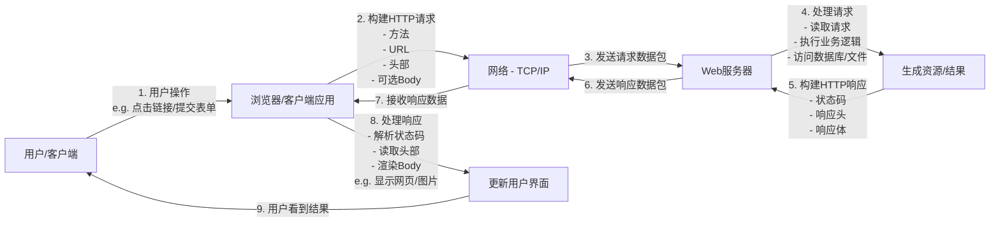

1.  **用户触发：** 用户在浏览器输入URL、点击链接或提交表单。
2.  **构建请求：** 浏览器根据用户操作构建HTTP请求报文。
3.  **发送请求：** 请求报文通过网络（TCP/IP连接）发送到目标服务器。
4.  **服务器处理：** Web服务器接收请求，解析内容，执行业务逻辑（可能查询数据库、读取文件等）。
5.  **构建响应：** 服务器根据处理结果构建HTTP响应报文（包含状态码、响应头和响应体）。
6.  **发送响应：** 响应报文通过网络（同一TCP/IP连接或新连接）发回客户端。
7.  **接收响应：** 浏览器接收到响应报文。
8.  **处理渲染：** 浏览器解析状态码（判断成功/失败）、响应头（获取内容类型、Cookie等）、渲染响应体内容（显示网页、图片等）。
9.  **用户反馈：** 用户看到更新后的界面或结果。

---

## 总结

*   **HTTP是规则：** 定义了客户端和服务器之间如何“说话”。
*   **核心是请求与响应：** 客户端发“请求单”，服务器回“结果包裹”。
*   **请求结构：** 方法 + URL路径 + 头部 (+ 可选Body)。
*   **响应结构：** 状态码 + 头部 (+ 响应体)。
*   **无状态：** 每次请求独立（Cookie/Session解决此问题）。
*   **无处不在：** 浏览器看网页、APP加载数据、API调用，背后几乎都是HTTP在默默工作。

理解HTTP协议是理解现代Web应用如何工作的基础！通过这个“快递服务”，信息得以在互联网上高效、可靠地传递。


# 简易多线程HTTP服务器框架实现

下面我将实现一个类似Tomcat的简易多线程HTTP服务器框架，并详细解释其工作原理和Servlet的运行机制。

## 实现思路

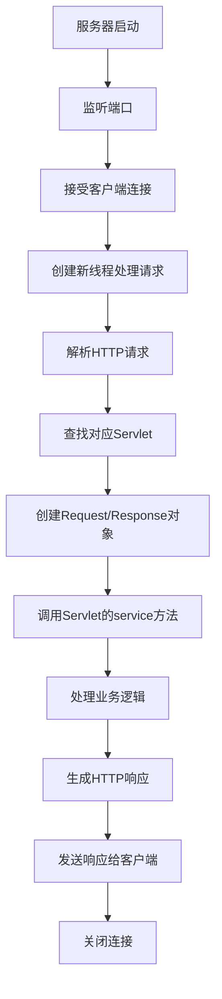

## 核心代码实现

```java
import java.io.*;
import java.net.*;
import java.util.*;
import java.util.concurrent.*;

// HTTP服务器主类
public class MiniHttpServer {
    private int port;
    private ExecutorService threadPool;
    private Map<String, Class<? extends HttpServlet>> servletMappings = new HashMap<>();
    private Map<String, Object> servletInstances = new ConcurrentHashMap<>();
    private boolean running = false;

    public MiniHttpServer(int port) {
        this.port = port;
        this.threadPool = Executors.newFixedThreadPool(50); // 50个线程的线程池
    }

    // 启动服务器
    public void start() throws IOException {
        running = true;
        try (ServerSocket serverSocket = new ServerSocket(port)) {
            System.out.println("Mini HTTP Server started on port " + port);
            
            while (running) {
                Socket clientSocket = serverSocket.accept();
                threadPool.execute(new RequestHandler(clientSocket));
            }
        }
    }

    // 停止服务器
    public void stop() {
        running = false;
        threadPool.shutdown();
        System.out.println("Server stopped");
    }

    // 注册Servlet映射
    public void addServlet(String path, Class<? extends HttpServlet> servletClass) {
        servletMappings.put(path, servletClass);
    }

    // 请求处理类
    private class RequestHandler implements Runnable {
        private final Socket clientSocket;

        public RequestHandler(Socket socket) {
            this.clientSocket = socket;
        }

        @Override
        public void run() {
            try (BufferedReader in = new BufferedReader(new InputStreamReader(clientSocket.getInputStream()));
                 PrintWriter out = new PrintWriter(clientSocket.getOutputStream(), true)) {
                
                // 1. 解析HTTP请求
                HttpRequest request = parseRequest(in);
                HttpResponse response = new HttpResponse(out);
                
                // 2. 查找对应的Servlet
                Class<? extends HttpServlet> servletClass = servletMappings.get(request.getPath());
                
                if (servletClass != null) {
                    // 3. 获取Servlet实例（单例模式）
                    HttpServlet servlet = getServletInstance(servletClass);
                    
                    // 4. 调用Servlet的service方法
                    servlet.service(request, response);
                } else {
                    // 没有对应的Servlet，返回404
                    response.sendError(404, "Not Found");
                }
            } catch (Exception e) {
                e.printStackTrace();
            } finally {
                try {
                    clientSocket.close();
                } catch (IOException e) {
                    e.printStackTrace();
                }
            }
        }

        // 获取Servlet实例（单例）
        private HttpServlet getServletInstance(Class<? extends HttpServlet> servletClass) 
                throws InstantiationException, IllegalAccessException {
            
            String className = servletClass.getName();
            if (!servletInstances.containsKey(className)) {
                synchronized (servletInstances) {
                    if (!servletInstances.containsKey(className)) {
                        HttpServlet instance = servletClass.newInstance();
                        instance.init(); // 调用Servlet初始化方法
                        servletInstances.put(className, instance);
                    }
                }
            }
            return (HttpServlet) servletInstances.get(className);
        }

        // 解析HTTP请求
        private HttpRequest parseRequest(BufferedReader in) throws IOException {
            HttpRequest request = new HttpRequest();
            
            // 读取请求行
            String requestLine = in.readLine();
            if (requestLine == null) return request;
            
            String[] parts = requestLine.split(" ");
            if (parts.length >= 2) {
                request.setMethod(parts[0]);
                request.setPath(parts[1]);
            }
            
            // 读取请求头
            String headerLine;
            while ((headerLine = in.readLine()) != null) {
                if (headerLine.isEmpty()) break; // 空行表示头部结束
                
                int colonIndex = headerLine.indexOf(":");
                if (colonIndex > 0) {
                    String key = headerLine.substring(0, colonIndex).trim();
                    String value = headerLine.substring(colonIndex + 1).trim();
                    request.addHeader(key, value);
                }
            }
            
            // 读取请求体（如果有）
            if ("POST".equalsIgnoreCase(request.getMethod())) {
                int contentLength = Integer.parseInt(request.getHeader("Content-Length", "0"));
                if (contentLength > 0) {
                    char[] body = new char[contentLength];
                    in.read(body, 0, contentLength);
                    request.setBody(new String(body));
                }
            }
            
            return request;
        }
    }

    // HTTP请求封装类
    public static class HttpRequest {
        private String method;
        private String path;
        private Map<String, String> headers = new HashMap<>();
        private String body;
        
        public String getMethod() { return method; }
        public void setMethod(String method) { this.method = method; }
        
        public String getPath() { return path; }
        public void setPath(String path) { this.path = path; }
        
        public void addHeader(String key, String value) { headers.put(key, value); }
        public String getHeader(String key) { return headers.get(key); }
        public String getHeader(String key, String defaultValue) { 
            return headers.getOrDefault(key, defaultValue); 
        }
        
        public String getBody() { return body; }
        public void setBody(String body) { this.body = body; }
    }

    // HTTP响应封装类
    public static class HttpResponse {
        private final PrintWriter out;
        private int status = 200;
        private String statusMessage = "OK";
        private Map<String, String> headers = new HashMap<>();
        
        public HttpResponse(PrintWriter out) {
            this.out = out;
            headers.put("Content-Type", "text/html; charset=UTF-8");
        }
        
        public void setStatus(int status, String message) {
            this.status = status;
            this.statusMessage = message;
        }
        
        public void addHeader(String key, String value) {
            headers.put(key, value);
        }
        
        public void sendError(int status, String message) {
            setStatus(status, message);
            out.println("HTTP/1.1 " + status + " " + message);
            out.println("Content-Type: text/html");
            out.println();
            out.println("<html><body><h1>Error " + status + " - " + message + "</h1></body></html>");
        }
        
        public PrintWriter getWriter() {
            // 发送响应头
            out.println("HTTP/1.1 " + status + " " + statusMessage);
            for (Map.Entry<String, String> entry : headers.entrySet()) {
                out.println(entry.getKey() + ": " + entry.getValue());
            }
            out.println(); // 空行分隔头部和主体
            return out;
        }
    }

    // Servlet接口
    public interface HttpServlet {
        void init();
        void service(HttpRequest request, HttpResponse response);
        void destroy();
    }

    // 抽象Servlet实现
    public static abstract class AbstractServlet implements HttpServlet {
        @Override
        public void init() {
            // 初始化逻辑
        }
        
        @Override
        public void service(HttpRequest request, HttpResponse response) {
            if ("GET".equalsIgnoreCase(request.getMethod())) {
                doGet(request, response);
            } else if ("POST".equalsIgnoreCase(request.getMethod())) {
                doPost(request, response);
            } else {
                response.sendError(405, "Method Not Allowed");
            }
        }
        
        protected void doGet(HttpRequest request, HttpResponse response) {
            response.sendError(405, "GET Method Not Allowed");
        }
        
        protected void doPost(HttpRequest request, HttpResponse response) {
            response.sendError(405, "POST Method Not Allowed");
        }
        
        @Override
        public void destroy() {
            // 清理资源
        }
    }

    public static void main(String[] args) throws Exception {
        // 创建服务器并启动
        MiniHttpServer server = new MiniHttpServer(8080);
        
        // 注册Servlet
        server.addServlet("/hello", HelloServlet.class);
        server.addServlet("/time", TimeServlet.class);
        
        // 启动服务器
        server.start();
    }
}

// 示例Servlet：HelloServlet
class HelloServlet extends MiniHttpServer.AbstractServlet {
    @Override
    protected void doGet(HttpRequest request, HttpResponse response) {
        PrintWriter out = response.getWriter();
        out.println("<html>");
        out.println("<head><title>Hello Servlet</title></head>");
        out.println("<body>");
        out.println("<h1>Hello, Servlet World!</h1>");
        out.println("<p>This is a simple servlet implementation.</p>");
        out.println("</body>");
        out.println("</html>");
    }
}

// 示例Servlet：TimeServlet
class TimeServlet extends MiniHttpServer.AbstractServlet {
    @Override
    protected void doGet(HttpRequest request, HttpResponse response) {
        response.addHeader("Cache-Control", "no-cache");
        PrintWriter out = response.getWriter();
        out.println("<html>");
        out.println("<head><title>Current Time</title></head>");
        out.println("<body>");
        out.println("<h1>Current Server Time</h1>");
        out.println("<p>" + new Date() + "</p>");
        out.println("</body>");
        out.println("</html>");
    }
}
```

## 服务器工作原理

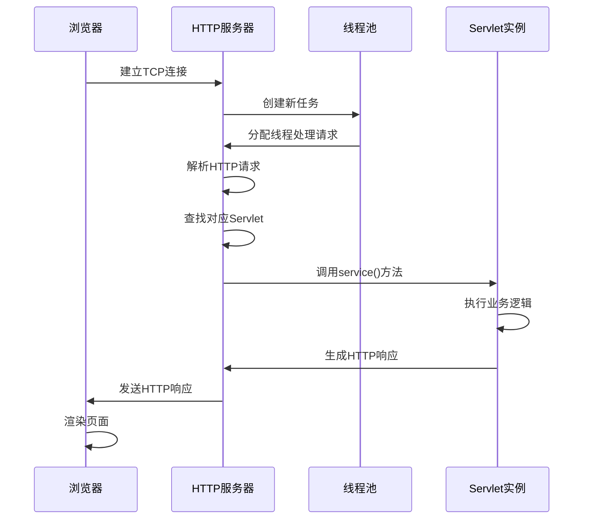

## Servlet在服务器端的作用

1. **生命周期管理**：
   - 服务器启动时初始化Servlet（调用init()方法）
   - 每次请求时调用service()方法
   - 服务器关闭时销毁Servlet（调用destroy()方法）

2. **请求处理**：
   - 接收HTTP请求对象（封装了请求信息）
   - 执行业务逻辑（访问数据库、处理数据等）
   - 生成HTTP响应（设置状态码、响应头和响应体）

3. **线程安全**：
   - Servlet通常被设计为单例
   - 多个线程同时访问同一个Servlet实例
   - 需要开发者确保Servlet的线程安全性

## 服务器在Web中的作用

1. **网络通信**：
   - 监听指定端口（通常是80或8080）
   - 接受客户端TCP连接
   - 处理底层的Socket通信

2. **请求解析**：
   - 解析HTTP请求行（方法、URL、协议版本）
   - 解析HTTP请求头（Host、Cookie、Content-Type等）
   - 解析请求体（POST请求的表单数据）

3. **响应生成**：
   - 设置HTTP状态码
   - 设置响应头（Content-Type、Cache-Control等）
   - 发送响应体（HTML、JSON、文件等）

4. **资源管理**：
   - 管理Servlet的生命周期
   - 维护URL到Servlet的映射关系
   - 提供线程池管理并发请求

5. **会话管理**：
   - 创建和维护会话（Session）
   - 管理Cookie
   - 保持用户状态

## 服务器处理流程详解

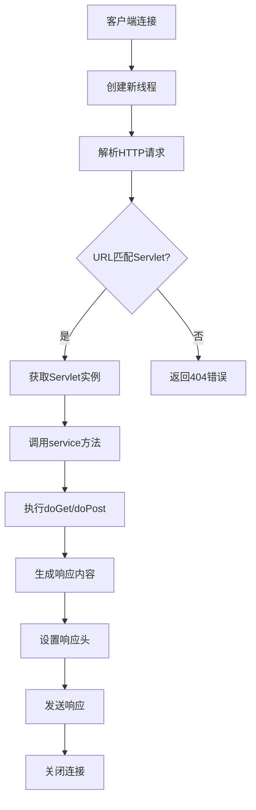

## 总结

这个简易HTTP服务器框架实现了以下核心功能：

1. 多线程处理并发请求
2. HTTP协议解析与响应生成
3. Servlet生命周期管理
4. URL到Servlet的映射
5. 线程池管理

虽然这只是一个简化版本，但它展示了类似Tomcat的核心工作原理。在实际应用中，Tomcat等服务器还实现了更多高级功能：

- 连接池管理
- JSP编译支持
- 安全认证
- 集群和负载均衡
- 热部署
- 更完善的协议支持（HTTP/2、WebSocket等）

通过这个实现，可以深入理解Servlet容器如何工作，以及HTTP服务器如何处理请求并将其分发给对应的Servlet进行处理。


## Servlet入门介绍

### 一、Servlet是什么？

**Servlet是运行在Web服务器上的Java程序**，用于处理客户端（通常是浏览器）的HTTP请求并生成动态响应。它是Java EE规范的核心组件，充当Web应用程序的"控制器"。

**简单比喻**：

- 餐厅顾客 -> 浏览器客户端
- 点菜单 -> HTTP请求
- 厨师 -> Servlet
- 做好的菜 -> HTTP响应
- 厨房 -> Web容器（如Tomcat）

### 二、为什么需要Servlet？

1. **处理动态内容**：相比静态HTML，能生成个性化响应
2. **交互式应用**：处理表单提交、用户登录等
3. **连接业务逻辑**：集成数据库、其他Java组件
4. **跨平台**：基于Java"一次编写，到处运行"

### 三、核心架构：Servlet容器

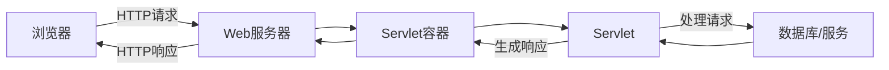

- **容器职责**：
  - 生命周期管理
  - 网络通信处理
  - 多线程支持
  - 安全控制
- 常见容器：Tomcat, Jetty, Undertow

### 四、Servlet生命周期

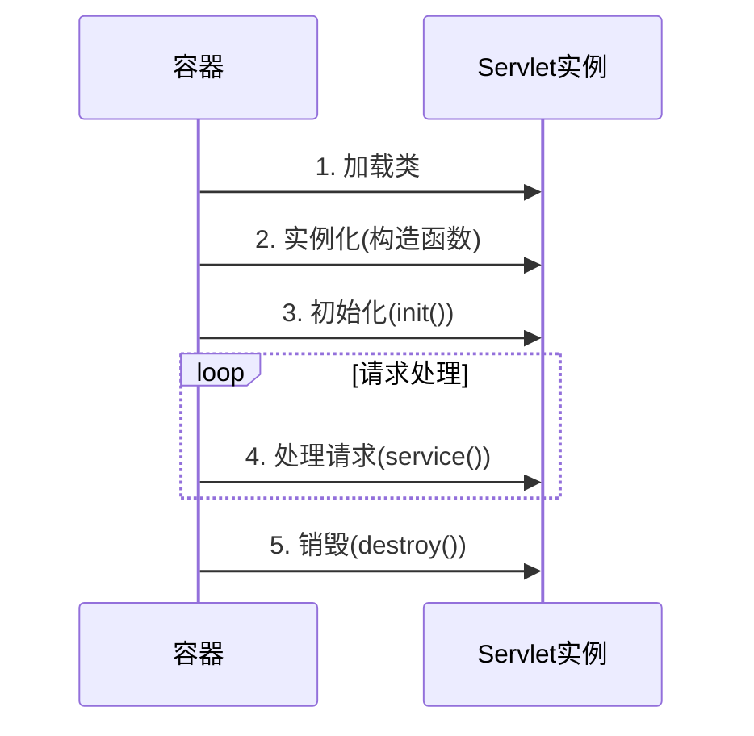

1. **初始化**：容器调用`init()`方法（仅一次）
2. **服务**：每次请求调用`service()`方法
3. **销毁**：容器移除Servlet时调用`destroy()`方法

### 五、核心API：HttpServlet

开发者通常继承`HttpServlet`并重写关键方法：

| 方法         | 触发条件      | 典型用途               |
| ------------ | ------------- | ---------------------- |
| `doGet()`    | GET请求       | 获取资源（如加载页面） |
| `doPost()`   | POST请求      | 提交数据（如表单提交） |
| `doPut()`    | PUT请求       | 更新资源               |
| `doDelete()` | DELETE请求    | 删除资源               |
| `init()`     | Servlet初始化 | 数据库连接等初始化操作 |
| `destroy()`  | Servlet销毁   | 资源清理               |

### 六、第一个Servlet示例

```java
import java.io.*;
import javax.servlet.*;
import javax.servlet.http.*;
import javax.servlet.annotation.*;

// 注解配置访问路径
@WebServlet("/hello")
public class HelloServlet extends HttpServlet {
    
    // 处理GET请求
    protected void doGet(HttpServletRequest request, 
                         HttpServletResponse response)
            throws ServletException, IOException {
        
        // 设置响应内容类型
        response.setContentType("text/html;charset=UTF-8");
        
        // 获取输出流
        PrintWriter out = response.getWriter();
        
        // 生成HTML响应
        out.println("<html>");
        out.println("<head><title>我的第一个Servlet</title></head>");
        out.println("<body>");
        out.println("<h1>你好，Servlet世界！</h1>");
        out.println("<p>当前时间: " + new java.util.Date() + "</p>");
        out.println("</body>");
        out.println("</html>");
    }
}
```

### 七、请求处理流程详解

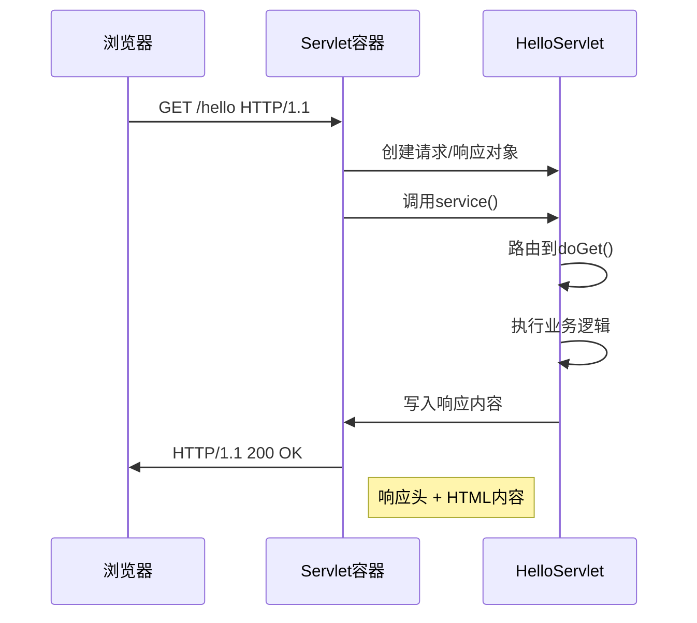

### 八、核心对象解析

#### 1. HttpServletRequest - 请求对象

```java
// 获取请求参数
String username = request.getParameter("username");

// 获取请求头
String userAgent = request.getHeader("User-Agent");

// 获取会话
HttpSession session = request.getSession();

// 获取请求路径
String path = request.getRequestURI();
```

#### 2. HttpServletResponse - 响应对象

```java
// 设置响应头
response.setHeader("Cache-Control", "no-cache");

// 设置状态码
response.setStatus(HttpServletResponse.SC_OK); // 200

// 重定向
response.sendRedirect("/new-location");

// 设置Cookie
Cookie cookie = new Cookie("user", "john");
response.addCookie(cookie);
```

### 九、Servlet配置方式

#### 1. 注解配置（推荐）

```java
@WebServlet(
    urlPatterns = {"/main", "/home"},
    loadOnStartup = 1,
    initParams = {
        @WebInitParam(name = "config", value = "default")
    }
)
```

#### 2. web.xml配置（传统方式）

```xml
<servlet>
    <servlet-name>HelloServlet</servlet-name>
    <servlet-class>com.example.HelloServlet</servlet-class>
    <init-param>
        <param-name>configFile</param-name>
        <param-value>/conf/settings.xml</param-value>
    </init-param>
</servlet>

<servlet-mapping>
    <servlet-name>HelloServlet</servlet-name>
    <url-pattern>/hello</url-pattern>
</servlet-mapping>
```

> [!CAUTION]
>
> **Servlet API是谁提供？**
>
> Servlet API是一个jar包。
>
> **Serlvet版本**
>
> 4.0及之前的 `servlet-api`引入依赖是 `javax.servlet:javax.servlet-api`；而5.0及之后的 `servlet-api`引入的依赖是 `jakarta.servlet:jakarta.servlet-api`。
>
> > [!tip]
> >
> > 早期的Servlet需要在 `web.xml`中配置映射路径，但在最新Servlet版本只需要通过注解就可以完成映射。

### 十、Servlet vs CGI vs 现代框架

| 特性       | Servlet      | CGI        | Spring MVC     |
| ---------- | ------------ | ---------- | -------------- |
| 进程创建   | 线程池复用   | 每次新进程 | 线程池复用     |
| 性能       | 高           | 低         | 高             |
| 内存占用   | 共享         | 隔离       | 共享           |
| 开发复杂度 | 中等         | 简单       | 低（注解驱动） |
| 适用场景   | 传统Java Web | 简单脚本   | 企业级应用     |

### 十一、实际应用场景

1. **RESTful API端点**：

```java
@WebServlet("/api/users/*")
public class UserServlet extends HttpServlet {
    protected void doGet(HttpServletRequest req, HttpServletResponse resp) {
        // 解析URL路径参数
        String pathInfo = req.getPathInfo(); // /123
        
        // 返回JSON数据
        resp.setContentType("application/json");
        PrintWriter out = resp.getWriter();
        out.print("{\"id\":123,\"name\":\"John\"}");
    }
}
```

2. **表单处理**：

```java
protected void doPost(HttpServletRequest req, HttpServletResponse resp) {
    String username = req.getParameter("username");
    String password = req.getParameter("password");
    
    if(authenticate(username, password)) {
        // 创建会话
        HttpSession session = req.getSession();
        session.setAttribute("user", username);
        
        // 重定向到主页
        resp.sendRedirect("/dashboard");
    } else {
        // 返回错误页面
        req.setAttribute("error", "无效凭证");
        req.getRequestDispatcher("/login.jsp").forward(req, resp);
    }
}
```

### 十二、最佳实践

1. **线程安全**：

   - 避免在Servlet中使用实例变量
   - 使用局部变量或同步块

2. **资源管理**：

   ```java
   public void init() {
       // 初始化资源（如数据库连接池）
   }
   
   public void destroy() {
       // 释放资源
   }
   ```

3. **异常处理**：

   ```java
   try {
       // 业务代码
   } catch (Exception e) {
       // 记录日志
       log.error("处理失败", e);
       
       // 返回错误页面
       resp.sendError(HttpServletResponse.SC_INTERNAL_SERVER_ERROR);
   }
   ```

### 十三、学习路径建议

1. 掌握HTTP协议基础
2. 搭建Tomcat服务器
3. 实现CRUD操作Servlet
4. 学习JSP与Servlet协作
5. 探索Filter和Listener
6. 过渡到Spring MVC框架

> **关键点**：Servlet是Java Web开发的基石，现代框架如Spring MVC底层仍基于Servlet API。理解Servlet生命周期和请求处理机制，是成为Java Web开发高手的必经之路。


# 搭建Tomcat服务器与Servlet多线程开发指南

## 一、Tomcat服务器搭建

### 安装步骤：

1. **下载Tomcat**：

   - 访问Apache Tomcat官网：https://tomcat.apache.org/
   - 选择稳定版本（推荐Tomcat 9.x或10.x）
   - 下载对应操作系统的安装包（Windows选择zip，Linux选择tar.gz）

2. **安装Tomcat**：

   ```bash
   # Linux/macOS
   tar -xzvf apache-tomcat-9.0.xx.tar.gz
   sudo mv apache-tomcat-9.0.xx /opt/tomcat
   
   # Windows
   解压下载的zip文件到C:\apache-tomcat-9.0.xx
   ```

3. **配置环境变量**：

   ```bash
   # Linux/macOS (~/.bashrc 或 ~/.zshrc)
   export CATALINA_HOME=/opt/tomcat
   export PATH=$PATH:$CATALINA_HOME/bin
   
   # Windows
   系统属性 -> 高级 -> 环境变量
   新建 CATALINA_HOME = C:\apache-tomcat-9.0.xx
   添加到Path: %CATALINA_HOME%\bin
   ```

4. **启动Tomcat**：

   ```bash
   # Linux/macOS
   $CATALINA_HOME/bin/startup.sh
   
   # Windows
   %CATALINA_HOME%\bin\startup.bat
   ```

5. **验证安装**：
   访问 http://localhost:8080，看到Tomcat欢迎页面即安装成功

### 目录结构说明：

```
bin/    - 启动/停止脚本
conf/   - 配置文件（server.xml, web.xml）
lib/    - 共享库
logs/   - 日志文件
webapps/ - Web应用部署目录
work/   - JSP编译文件
temp/   - 临时文件
```

## 二、Servlet在多线程下的运行特点

### Servlet生命周期：

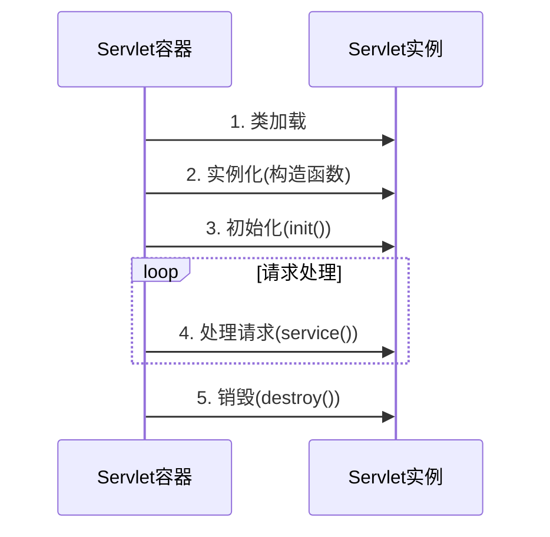

### 多线程特点：

1. **单实例多线程**：

   - 每个Servlet类只有一个实例
   - 所有客户端请求共享同一个Servlet实例
   - 容器使用线程池处理并发请求

2. **线程安全问题**：

   ```java
   public class UnsafeServlet extends HttpServlet {
       private int count = 0; // 实例变量 - 线程不安全
       
       protected void doGet(HttpServletRequest req, HttpServletResponse resp) {
           count++; // 多个线程同时修改
           resp.getWriter().write("Count: " + count);
       }
   }
   ```

3. **线程安全解决方案**：

   ```java
   public class SafeServlet extends HttpServlet {
       // 方案1: 使用局部变量（线程安全）
       protected void doGet(HttpServletRequest req, HttpServletResponse resp) {
           int localCount = 0; // 每个线程有自己的副本
           localCount++;
           // ...
       }
       
       // 方案2: 使用同步机制
       private int syncCount = 0;
       protected void doPost(HttpServletRequest req, HttpServletResponse resp) {
           synchronized(this) {
               syncCount++;
           }
       }
       
       // 方案3: 使用线程安全类
       private AtomicInteger atomicCount = new AtomicInteger(0);
       protected void doPut(HttpServletRequest req, HttpServletResponse resp) {
           atomicCount.incrementAndGet();
       }
       
       // 方案4: 避免使用实例变量
       // 使用请求作用域、会话作用域或应用作用域存储状态
   }
   ```

### 线程模型：

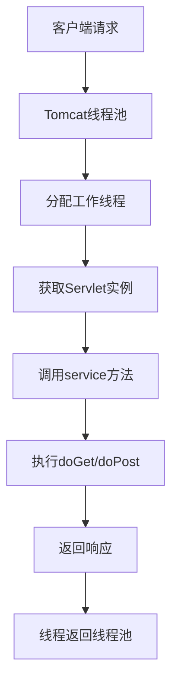

## 三、Servlet开发注意事项与最佳实践

### 注意事项：

1. **线程安全**：

   - 避免使用可修改的实例变量
   - 如果必须共享状态，使用同步或并发集合
   - 使用局部变量代替实例变量

2. **资源管理**：

   ```java
   public class ResourceServlet extends HttpServlet {
       private DataSource dataSource; // 数据库连接池
       
       public void init() {
           // 初始化资源
           dataSource = createDataSource();
       }
       
       protected void doGet(HttpServletRequest req, HttpServletResponse resp) {
           try (Connection conn = dataSource.getConnection()) {
               // 使用数据库连接
           } // 自动关闭
       }
       
       public void destroy() {
           // 清理资源
           shutdownDataSource(dataSource);
       }
   }
   ```

3. **异常处理**：

   ```java
   protected void doPost(HttpServletRequest req, HttpServletResponse resp) {
       try {
           // 业务逻辑
       } catch (BusinessException e) {
           resp.sendError(HttpServletResponse.SC_BAD_REQUEST, e.getMessage());
       } catch (Exception e) {
           log.error("处理请求失败", e);
           resp.sendError(HttpServletResponse.SC_INTERNAL_SERVER_ERROR);
       }
   }
   ```

### 最佳实践：

1. **使用MVC架构**：

   ```mermaid
   graph LR
       A[客户端] --> B[Servlet控制器]
       B --> C[Service业务层]
       C --> D[DAO数据层]
       D --> E[数据库]
       B --> F[视图 JSP/HTML]
   ```

2. **异步处理**（Tomcat 8+）：

   ```java
   @WebServlet(urlPatterns = "/async", asyncSupported = true)
   public class AsyncServlet extends HttpServlet {
       protected void doGet(HttpServletRequest req, HttpServletResponse resp) {
           AsyncContext asyncContext = req.startAsync();
           asyncContext.start(() -> {
               try {
                   // 长时间操作
                   Thread.sleep(3000);
                   asyncContext.getResponse().getWriter().write("Async response");
               } catch (Exception e) {
                   // 错误处理
               } finally {
                   asyncContext.complete();
               }
           });
       }
   }
   ```

3. **连接池配置**（Tomcat context.xml）：

   ```xml
   <Context>
       <Resource name="jdbc/myDB" 
                auth="Container"
                type="javax.sql.DataSource"
                maxTotal="100"
                maxIdle="30"
                maxWaitMillis="10000"
                username="dbuser"
                password="dbpass"
                driverClassName="com.mysql.cj.jdbc.Driver"
                url="jdbc:mysql://localhost:3306/mydb"/>
   </Context>
   ```

4. **使用监听器初始化资源**：

   ```java
   @WebListener
   public class AppInitializer implements ServletContextListener {
       public void contextInitialized(ServletContextEvent sce) {
           // 应用启动时初始化
           DataSource ds = createDataSource();
           sce.getServletContext().setAttribute("dataSource", ds);
       }
       
       public void contextDestroyed(ServletContextEvent sce) {
           // 应用关闭时清理
           DataSource ds = (DataSource) sce.getServletContext().getAttribute("dataSource");
           shutdownDataSource(ds);
       }
   }
   ```

## 四、Tomcat架构与Servlet工作原理

### Tomcat架构图：

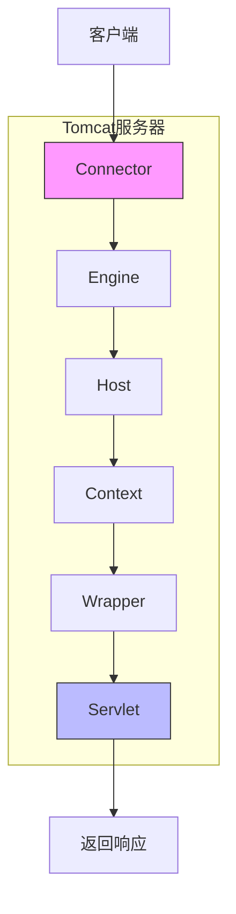

### 核心组件：

1. **Connector**：
   - 处理HTTP/HTTPS连接
   - 使用NIO或APR提高性能
   - 监听端口（默认8080）

2. **Container**：
   - **Engine**：整个Servlet引擎
   - **Host**：虚拟主机
   - **Context**：Web应用（对应webapps目录）
   - **Wrapper**：Servlet封装

### Servlet工作流程：

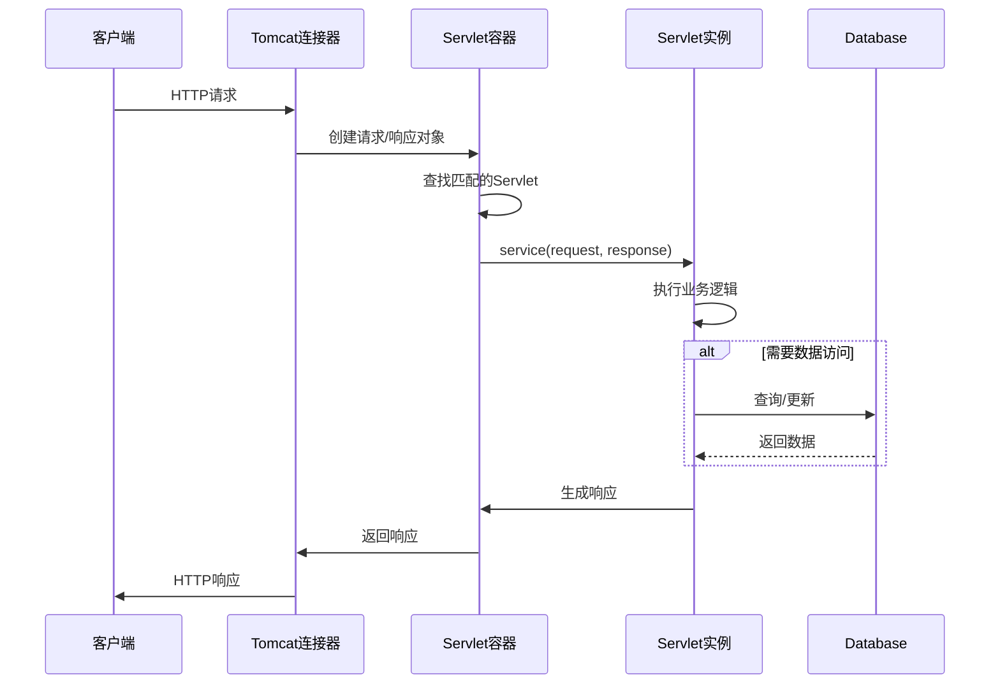

## 五、开发推荐工具与框架

1. **开发工具**：

   - IDE：IntelliJ IDEA（推荐）或Eclipse
   - 构建工具：Maven或Gradle
   - 版本控制：Git

2. **推荐框架**：

   | 框架        | 用途        | 优点               |
   | ----------- | ----------- | ------------------ |
   | Spring Boot | 全栈开发    | 快速启动、自动配置 |
   | Spring MVC  | Web MVC     | 灵活、集成度高     |
   | JAX-RS      | RESTful服务 | 标准API、轻量级    |
   | Hibernate   | ORM         | 简化数据库操作     |

3. **现代Servlet开发示例**（Spring Boot）：

   ```java
   @SpringBootApplication
   public class MyApp {
       public static void main(String[] args) {
           SpringApplication.run(MyApp.class, args);
       }
   }
   
   @RestController
   public class UserController {
       
       @Autowired
       private UserService userService;
       
       @GetMapping("/users")
       public List<User> getUsers() {
           return userService.getAllUsers();
       }
       
       @PostMapping("/users")
       public ResponseEntity<User> createUser(@RequestBody User user) {
           User saved = userService.saveUser(user);
           return ResponseEntity.created(URI.create("/users/" + saved.getId()))
                                .body(saved);
       }
   }
   ```

## 六、性能优化建议

1. **Tomcat配置优化**（conf/server.xml）：

   ```xml
   <Connector port="8080" protocol="HTTP/1.1"
              maxThreads="200"        <!-- 最大线程数 -->
              minSpareThreads="10"    <!-- 最小空闲线程 -->
              acceptCount="100"       <!-- 等待队列大小 -->
              connectionTimeout="20000"
              compression="on"        <!-- 启用压缩 -->
              compressableMimeType="text/html,text/xml,text/plain,text/css,text/javascript,application/json"/>
   ```

2. **数据库优化**：

   - 使用连接池（HikariCP）
   - 优化SQL查询
   - 使用缓存（Redis）

3. **Servlet优化**：

   - 避免在Servlet中创建大对象
   - 使用静态资源处理（不要通过Servlet）
   - 启用HTTP缓存头

4. **会话管理**：

   ```java
   @WebServlet(name = "SessionServlet", urlPatterns = "/session")
   public class SessionServlet extends HttpServlet {
       protected void doGet(HttpServletRequest req, HttpServletResponse resp) {
           HttpSession session = req.getSession();
           
           // 设置会话超时（分钟）
           session.setMaxInactiveInterval(30 * 60);
           
           // 存储数据
           session.setAttribute("user", currentUser);
           
           // 安全设置
           session.setAttribute("org.apache.tomcat.session.secure", true);
       }
   }
   ```

## 总结

Tomcat作为Java Web应用的核心服务器：

1. 采用多线程模型处理并发请求
2. 每个Servlet是单实例多线程运行
3. 开发时需特别注意线程安全问题
4. 推荐使用现代框架（如Spring Boot）简化开发

遵循最佳实践：

- 保持Servlet无状态
- 合理管理资源（数据库连接等）
- 使用适当的作用域存储数据
- 优化配置提升性能

通过理解Tomcat架构和Servlet运行原理，可以开发出高性能、可扩展的Web应用。


# CRUD Servlet实现与Maven WAR包部署

下面我将实现一个完整的CRUD Servlet应用，并使用Maven进行打包部署。

## 项目结构与Maven配置

### 项目结构

```
crud-demo/
├── src/
│   └── main/
│       ├── java/
│       │   └── com/
│       │       └── example/
│       │           ├── controller/
│       │           │   ├── UserServlet.java
│       │           │   └── ApiResponse.java
│       │           ├── dao/
│       │           │   ├── UserDao.java
│       │           │   └── UserDaoImpl.java
│       │           ├── model/
│       │           │   └── User.java
│       │           ├── service/
│       │           │   ├── UserService.java
│       │           │   └── UserServiceImpl.java
│       │           └── util/
│       │               └── DbUtil.java
│       ├── resources/
│       │   └── db.properties
│       └── webapp/
│           ├── WEB-INF/
│           │   ├── views/
│           │   │   ├── user-list.jsp
│           │   │   ├── user-form.jsp
│           │   │   └── error.jsp
│           │   └── web.xml
│           └── index.jsp
└── pom.xml
```

### pom.xml配置

```xml
<project xmlns="http://maven.apache.org/POM/4.0.0"
         xmlns:xsi="http://www.w3.org/2001/XMLSchema-instance"
         xsi:schemaLocation="http://maven.apache.org/POM/4.0.0 
                             http://maven.apache.org/xsd/maven-4.0.0.xsd">
    <modelVersion>4.0.0</modelVersion>
    
    <groupId>com.example</groupId>
    <artifactId>crud-demo</artifactId>
    <version>1.0.0</version>
    <packaging>war</packaging>
    
    <name>CRUD Servlet Demo</name>
    
    <properties>
        <project.build.sourceEncoding>UTF-8</project.build.sourceEncoding>
        <maven.compiler.source>11</maven.compiler.source>
        <maven.compiler.target>11</maven.compiler.target>
        <tomcat.version>10.1.0</tomcat.version>
        <junit.version>5.8.2</junit.version>
        <mysql.version>8.0.33</mysql.version>
    </properties>
    
    <dependencies>
        <!-- Servlet API -->
        <dependency>
            <groupId>jakarta.servlet</groupId>
            <artifactId>jakarta.servlet-api</artifactId>
            <version>6.0.0</version>
            <scope>provided</scope>
        </dependency>
        
        <!-- JSTL -->
        <dependency>
            <groupId>jakarta.servlet.jsp.jstl</groupId>
            <artifactId>jakarta.servlet.jsp.jstl-api</artifactId>
            <version>3.0.0</version>
        </dependency>
        <dependency>
            <groupId>org.glassfish.web</groupId>
            <artifactId>jakarta.servlet.jsp.jstl</artifactId>
            <version>3.0.0</version>
        </dependency>
        
        <!-- MySQL Connector -->
        <dependency>
            <groupId>mysql</groupId>
            <artifactId>mysql-connector-java</artifactId>
            <version>${mysql.version}</version>
        </dependency>
        
        <!-- JUnit -->
        <dependency>
            <groupId>org.junit.jupiter</groupId>
            <artifactId>junit-jupiter-api</artifactId>
            <version>${junit.version}</version>
            <scope>test</scope>
        </dependency>
        <dependency>
            <groupId>org.junit.jupiter</groupId>
            <artifactId>junit-jupiter-engine</artifactId>
            <version>${junit.version}</version>
            <scope>test</scope>
        </dependency>
    </dependencies>
    
    <build>
        <finalName>${project.artifactId}</finalName>
        <plugins>
            <!-- Maven Compiler Plugin -->
            <plugin>
                <groupId>org.apache.maven.plugins</groupId>
                <artifactId>maven-compiler-plugin</artifactId>
                <version>3.11.0</version>
                <configuration>
                    <release>11</release>
                    <encoding>UTF-8</encoding>
                </configuration>
            </plugin>
            
            <!-- Maven WAR Plugin -->
            <plugin>
                <groupId>org.apache.maven.plugins</groupId>
                <artifactId>maven-war-plugin</artifactId>
                <version>3.4.0</version>
                <configuration>
                    <warSourceDirectory>src/main/webapp</warSourceDirectory>
                    <webXml>src/main/webapp/WEB-INF/web.xml</webXml>
                    <webResources>
                        <resource>
                            <directory>src/main/resources</directory>
                            <targetPath>WEB-INF/classes</targetPath>
                        </resource>
                    </webResources>
                    <failOnMissingWebXml>false</failOnMissingWebXml>
                </configuration>
            </plugin>
            
            <!-- Tomcat Plugin for Testing -->
            <plugin>
                <groupId>org.apache.tomcat.maven</groupId>
                <artifactId>tomcat7-maven-plugin</artifactId>
                <version>2.2</version>
                <configuration>
                    <path>/</path>
                    <port>8080</port>
                    <uriEncoding>UTF-8</uriEncoding>
                </configuration>
            </plugin>
        </plugins>
    </build>
</project>
```

## 核心代码实现

### 1. 实体类 (User.java)

```java
package com.example.model;

import java.io.Serializable;

public class User implements Serializable {
    private Long id;
    private String name;
    private String email;
    private String country;
    
    // 构造方法
    public User() {}
    
    public User(String name, String email, String country) {
        this.name = name;
        this.email = email;
        this.country = country;
    }
    
    // Getter 和 Setter 方法
    public Long getId() { return id; }
    public void setId(Long id) { this.id = id; }
    
    public String getName() { return name; }
    public void setName(String name) { this.name = name; }
    
    public String getEmail() { return email; }
    public void setEmail(String email) { this.email = email; }
    
    public String getCountry() { return country; }
    public void setCountry(String country) { this.country = country; }
}
```

### 2. 数据库工具类 (DbUtil.java)

```java
package com.example.util;

import java.io.InputStream;
import java.sql.*;
import java.util.Properties;

public class DbUtil {
    private static Connection connection = null;
    
    public static Connection getConnection() {
        if (connection != null) {
            return connection;
        } else {
            try {
                Properties prop = new Properties();
                InputStream input = DbUtil.class.getClassLoader()
                    .getResourceAsStream("db.properties");
                prop.load(input);
                
                String driver = prop.getProperty("driver");
                String url = prop.getProperty("url");
                String user = prop.getProperty("user");
                String password = prop.getProperty("password");
                
                Class.forName(driver);
                connection = DriverManager.getConnection(url, user, password);
            } catch (Exception e) {
                e.printStackTrace();
            }
            return connection;
        }
    }
}
```

### 3. DAO接口 (UserDao.java)

```java
package com.example.dao;

import com.example.model.User;
import java.util.List;

public interface UserDao {
    void createUser(User user);
    void updateUser(User user);
    void deleteUser(Long id);
    User getUserById(Long id);
    List<User> getAllUsers();
}
```

### 4. DAO实现 (UserDaoImpl.java)

```java
package com.example.dao;

import com.example.model.User;
import com.example.util.DbUtil;
import java.sql.*;
import java.util.ArrayList;
import java.util.List;

public class UserDaoImpl implements UserDao {
    
    @Override
    public void createUser(User user) {
        String sql = "INSERT INTO users (name, email, country) VALUES (?, ?, ?)";
        try (Connection conn = DbUtil.getConnection();
             PreparedStatement stmt = conn.prepareStatement(sql)) {
            
            stmt.setString(1, user.getName());
            stmt.setString(2, user.getEmail());
            stmt.setString(3, user.getCountry());
            stmt.executeUpdate();
            
        } catch (SQLException e) {
            e.printStackTrace();
        }
    }

    @Override
    public void updateUser(User user) {
        String sql = "UPDATE users SET name=?, email=?, country=? WHERE id=?";
        try (Connection conn = DbUtil.getConnection();
             PreparedStatement stmt = conn.prepareStatement(sql)) {
            
            stmt.setString(1, user.getName());
            stmt.setString(2, user.getEmail());
            stmt.setString(3, user.getCountry());
            stmt.setLong(4, user.getId());
            stmt.executeUpdate();
            
        } catch (SQLException e) {
            e.printStackTrace();
        }
    }

    @Override
    public void deleteUser(Long id) {
        String sql = "DELETE FROM users WHERE id=?";
        try (Connection conn = DbUtil.getConnection();
             PreparedStatement stmt = conn.prepareStatement(sql)) {
            
            stmt.setLong(1, id);
            stmt.executeUpdate();
            
        } catch (SQLException e) {
            e.printStackTrace();
        }
    }

    @Override
    public User getUserById(Long id) {
        User user = null;
        String sql = "SELECT * FROM users WHERE id=?";
        try (Connection conn = DbUtil.getConnection();
             PreparedStatement stmt = conn.prepareStatement(sql)) {
            
            stmt.setLong(1, id);
            try (ResultSet rs = stmt.executeQuery()) {
                if (rs.next()) {
                    user = new User();
                    user.setId(rs.getLong("id"));
                    user.setName(rs.getString("name"));
                    user.setEmail(rs.getString("email"));
                    user.setCountry(rs.getString("country"));
                }
            }
            
        } catch (SQLException e) {
            e.printStackTrace();
        }
        return user;
    }

    @Override
    public List<User> getAllUsers() {
        List<User> users = new ArrayList<>();
        String sql = "SELECT * FROM users";
        try (Connection conn = DbUtil.getConnection();
             Statement stmt = conn.createStatement();
             ResultSet rs = stmt.executeQuery(sql)) {
            
            while (rs.next()) {
                User user = new User();
                user.setId(rs.getLong("id"));
                user.setName(rs.getString("name"));
                user.setEmail(rs.getString("email"));
                user.setCountry(rs.getString("country"));
                users.add(user);
            }
            
        } catch (SQLException e) {
            e.printStackTrace();
        }
        return users;
    }
}
```

### 5. Servlet控制器 (UserServlet.java)

```java
package com.example.controller;

import com.example.dao.UserDao;
import com.example.dao.UserDaoImpl;
import com.example.model.User;
import jakarta.servlet.RequestDispatcher;
import jakarta.servlet.ServletException;
import jakarta.servlet.annotation.WebServlet;
import jakarta.servlet.http.HttpServlet;
import jakarta.servlet.http.HttpServletRequest;
import jakarta.servlet.http.HttpServletResponse;
import java.io.IOException;
import java.util.List;

@WebServlet(name = "UserServlet", urlPatterns = {"/users"})
public class UserServlet extends HttpServlet {
    
    private UserDao userDao;
    
    @Override
    public void init() {
        userDao = new UserDaoImpl();
    }
    
    protected void doPost(HttpServletRequest request, HttpServletResponse response)
            throws ServletException, IOException {
        doGet(request, response);
    }

    protected void doGet(HttpServletRequest request, HttpServletResponse response)
            throws ServletException, IOException {
        
        String action = request.getParameter("action");
        
        if (action == null) {
            action = "list";
        }
        
        try {
            switch (action) {
                case "new":
                    showNewForm(request, response);
                    break;
                case "create":
                    createUser(request, response);
                    break;
                case "edit":
                    showEditForm(request, response);
                    break;
                case "update":
                    updateUser(request, response);
                    break;
                case "delete":
                    deleteUser(request, response);
                    break;
                default:
                    listUsers(request, response);
            }
        } catch (Exception e) {
            throw new ServletException(e);
        }
    }
    
    private void listUsers(HttpServletRequest request, HttpServletResponse response)
            throws ServletException, IOException {
        List<User> users = userDao.getAllUsers();
        request.setAttribute("users", users);
        RequestDispatcher dispatcher = request.getRequestDispatcher("/WEB-INF/views/user-list.jsp");
        dispatcher.forward(request, response);
    }
    
    private void showNewForm(HttpServletRequest request, HttpServletResponse response)
            throws ServletException, IOException {
        RequestDispatcher dispatcher = request.getRequestDispatcher("/WEB-INF/views/user-form.jsp");
        dispatcher.forward(request, response);
    }
    
    private void showEditForm(HttpServletRequest request, HttpServletResponse response)
            throws ServletException, IOException {
        Long id = Long.parseLong(request.getParameter("id"));
        User existingUser = userDao.getUserById(id);
        request.setAttribute("user", existingUser);
        RequestDispatcher dispatcher = request.getRequestDispatcher("/WEB-INF/views/user-form.jsp");
        dispatcher.forward(request, response);
    }
    
    private void createUser(HttpServletRequest request, HttpServletResponse response)
            throws IOException {
        User newUser = new User();
        newUser.setName(request.getParameter("name"));
        newUser.setEmail(request.getParameter("email"));
        newUser.setCountry(request.getParameter("country"));
        
        userDao.createUser(newUser);
        response.sendRedirect("users");
    }
    
    private void updateUser(HttpServletRequest request, HttpServletResponse response)
            throws IOException {
        Long id = Long.parseLong(request.getParameter("id"));
        User user = new User();
        user.setId(id);
        user.setName(request.getParameter("name"));
        user.setEmail(request.getParameter("email"));
        user.setCountry(request.getParameter("country"));
        
        userDao.updateUser(user);
        response.sendRedirect("users");
    }
    
    private void deleteUser(HttpServletRequest request, HttpServletResponse response)
            throws IOException {
        Long id = Long.parseLong(request.getParameter("id"));
        userDao.deleteUser(id);
        response.sendRedirect("users");
    }
}
```

### 6. 视图文件 (user-list.jsp)

```jsp
<%@ page contentType="text/html;charset=UTF-8" language="java" %>
<%@ taglib uri="http://java.sun.com/jsp/jstl/core" prefix="c" %>
<!DOCTYPE html>
<html>
<head>
    <title>用户列表</title>
    <link href="https://cdn.jsdelivr.net/npm/bootstrap@5.3.0/dist/css/bootstrap.min.css" rel="stylesheet">
</head>
<body>
    <div class="container mt-4">
        <h1 class="mb-4">用户管理系统</h1>
        
        <a href="users?action=new" class="btn btn-primary mb-3">添加新用户</a>
        
        <table class="table table-striped">
            <thead>
                <tr>
                    <th>ID</th>
                    <th>姓名</th>
                    <th>邮箱</th>
                    <th>国家</th>
                    <th>操作</th>
                </tr>
            </thead>
            <tbody>
                <c:forEach var="user" items="${users}">
                    <tr>
                        <td>${user.id}</td>
                        <td>${user.name}</td>
                        <td>${user.email}</td>
                        <td>${user.country}</td>
                        <td>
                            <a href="users?action=edit&id=${user.id}" class="btn btn-sm btn-warning">编辑</a>
                            <a href="users?action=delete&id=${user.id}" 
                               class="btn btn-sm btn-danger" 
                               onclick="return confirm('确定删除该用户?')">删除</a>
                        </td>
                    </tr>
                </c:forEach>
            </tbody>
        </table>
    </div>
</body>
</html>
```

### 7. 数据库配置文件 (db.properties)

```
driver=com.mysql.cj.jdbc.Driver
url=jdbc:mysql://localhost:3306/userdb?useSSL=false&serverTimezone=UTC
user=root
password=yourpassword
```

## 构建与部署流程

### 1. 创建数据库

```sql
CREATE DATABASE userdb;
USE userdb;

CREATE TABLE users (
    id BIGINT AUTO_INCREMENT PRIMARY KEY,
    name VARCHAR(50) NOT NULL,
    email VARCHAR(50) NOT NULL,
    country VARCHAR(50) NOT NULL
);

INSERT INTO users (name, email, country) VALUES
('张三', 'zhangsan@example.com', '中国'),
('李四', 'lisi@example.com', '中国'),
('John Doe', 'john@example.com', '美国');
```

### 2. 构建WAR包

```bash
mvn clean package
```

### 3. 部署到Tomcat

1. 将生成的 `crud-demo.war` 文件复制到 Tomcat 的 `webapps` 目录
2. 启动 Tomcat 服务器
3. 访问应用：http://localhost:8080/crud-demo/users

## Servlet多线程处理流程

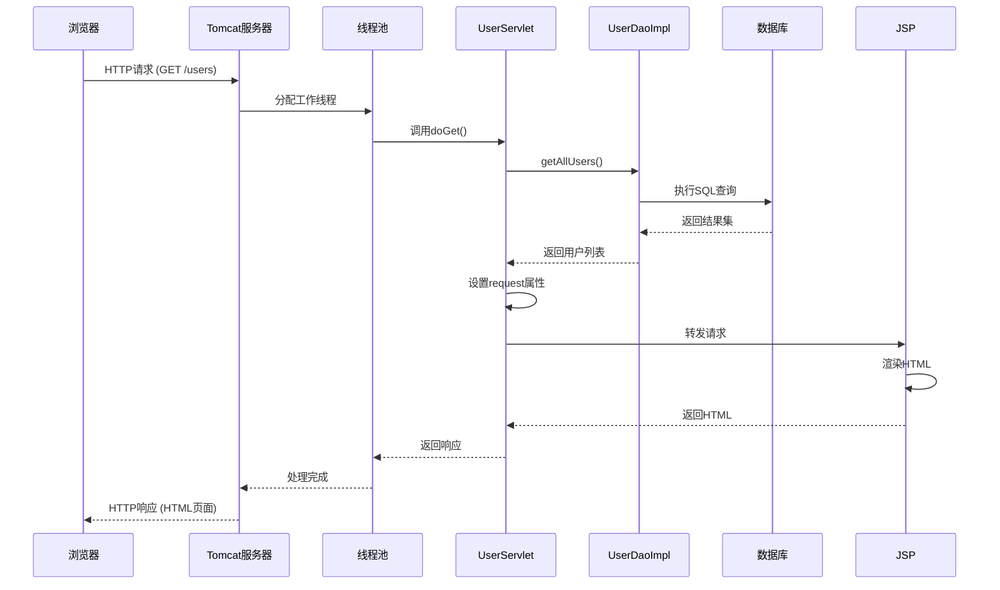

## 多线程注意事项

1. **线程安全设计**：

   - DAO层无状态（所有方法都是局部变量）
   - Servlet实例变量`userDao`在`init()`中初始化（只执行一次）
   - 避免在Servlet中使用可修改的实例变量

2. **数据库连接管理**：

   - 使用`DbUtil`确保每个线程有独立连接
   - 通过`try-with-resources`自动关闭资源
   - 连接池配置（生产环境推荐）

3. **同步处理**：

   ```java
   // 需要同步的代码块
   synchronized(this) {
       // 关键操作
   }
   ```

4. **并发集合使用**：

   ```java
   // 如果需要共享数据
   private static ConcurrentHashMap<String, Object> cache = new ConcurrentHashMap<>();
   ```

## 开发最佳实践

1. **分层架构**：

   - Controller：处理HTTP请求
   - Service：业务逻辑
   - DAO：数据访问
   - Model：数据模型

2. **错误处理**：

   ```java
   try {
       // 业务代码
   } catch (SQLException e) {
       request.setAttribute("error", "数据库错误: " + e.getMessage());
       request.getRequestDispatcher("/WEB-INF/views/error.jsp").forward(request, response);
   }
   ```

3. **输入验证**：

   ```java
   private boolean validateUser(HttpServletRequest request) {
       String name = request.getParameter("name");
       if (name == null || name.trim().isEmpty()) {
           request.setAttribute("error", "姓名不能为空");
           return false;
       }
       // 更多验证...
       return true;
   }
   ```

4. **日志记录**：

   ```java
   import java.util.logging.Logger;
   
   public class UserServlet extends HttpServlet {
       private static final Logger logger = Logger.getLogger(UserServlet.class.getName());
       
       protected void doGet(...) {
           logger.info("处理用户请求: action=" + action);
           // ...
       }
   }
   ```

5. **使用连接池**（生产环境）：

   ```xml
   <!-- context.xml -->
   <Resource name="jdbc/userDB" 
             auth="Container"
             type="javax.sql.DataSource"
             maxTotal="100"
             maxIdle="30"
             maxWaitMillis="10000"
             username="root"
             password="yourpassword"
             driverClassName="com.mysql.cj.jdbc.Driver"
             url="jdbc:mysql://localhost:3306/userdb"/>
   ```

## 总结

通过这个CRUD Servlet实现，我们展示了：

1. **完整分层架构**：MVC模式的应用
2. **数据库操作**：使用JDBC进行CRUD操作
3. **多线程处理**：Servlet在Tomcat中的线程模型
4. **安全实践**：线程安全设计和输入验证
5. **构建部署**：Maven WAR包配置和部署流程

关键点：

- Servlet是单例多线程模型
- 避免使用可修改的实例变量
- 使用连接池管理数据库连接
- 分层设计提高代码可维护性
- 输入验证和错误处理必不可少

这个示例提供了一个完整的CRUD应用基础，可以进一步扩展为更复杂的业务系统。


# Servlet核心组件与配置详解

## 一、Servlet核心组件介绍

### Servlet核心架构

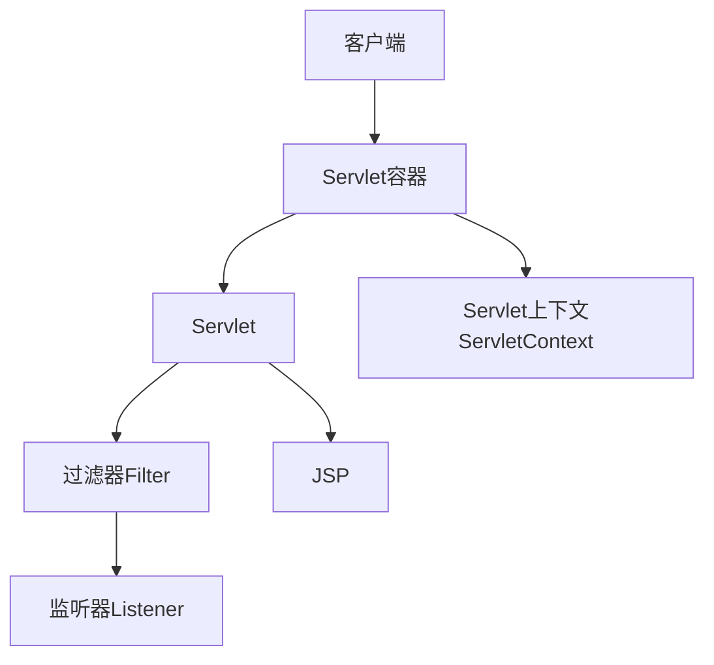

### 1. Servlet接口

- 所有Servlet必须实现的根接口
- 生命周期方法：
  - `init(ServletConfig config)`：初始化
  - `service(ServletRequest req, ServletResponse res)`：处理请求
  - `destroy()`：销毁

### 2. GenericServlet抽象类

- 提供Servlet接口的基本实现
- 协议无关的通用Servlet
- 实现了`ServletConfig`接口

### 3. HttpServlet类

- 处理HTTP请求的抽象类
- 继承自GenericServlet
- 关键方法：
  - `doGet()`：处理GET请求
  - `doPost()`：处理POST请求
  - `doPut()`：处理PUT请求
  - `doDelete()`：处理DELETE请求

### 4. ServletContext接口

- 代表整个Web应用的上下文
- 共享数据作用域：应用级别
- 主要功能：
  - 获取应用初始化参数
  - 设置和获取属性
  - 获取资源路径
  - 日志记录

### 5. ServletConfig接口

- 代表单个Servlet的配置信息
- 主要方法：
  - `getInitParameter(String name)`：获取初始化参数
  - `getServletContext()`：获取ServletContext

### 6. HttpServletRequest接口

- 扩展ServletRequest
- 提供HTTP特定功能：
  - 获取请求头
  - 获取Cookie
  - 获取会话
  - 获取请求参数

### 7. HttpServletResponse接口

- 扩展ServletResponse
- 提供HTTP响应功能：
  - 设置状态码
  - 设置响应头
  - 发送重定向
  - 添加Cookie

### 8. 过滤器(Filter)

- 请求预处理和后处理
- 典型用途：
  - 身份验证
  - 日志记录
  - 数据压缩
  - 字符编码转换

### 9. 监听器(Listener)

- 事件驱动的组件
- 主要类型：
  - ServletContext监听器
  - HttpSession监听器
  - ServletRequest监听器

## 二、Servlet请求处理流程

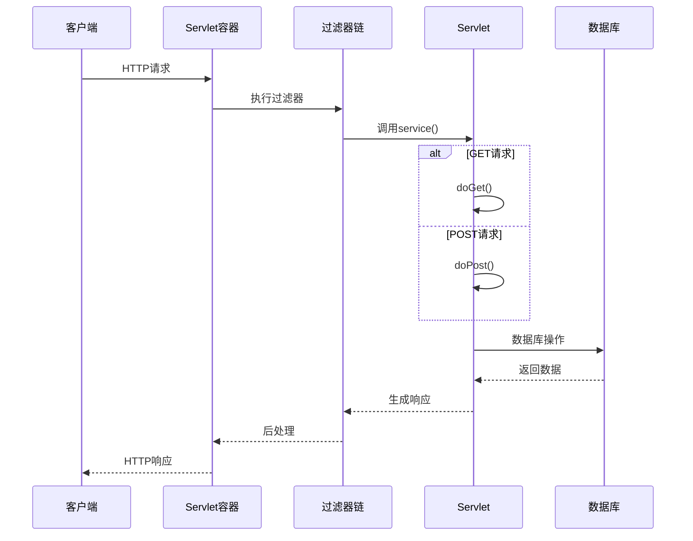

### 详细步骤：

1. **接收请求**：容器接收HTTP请求
2. **创建对象**：创建HttpServletRequest和HttpServletResponse对象
3. **过滤器处理**：应用配置的过滤器链
4. **查找Servlet**：根据URL映射确定目标Servlet
5. **调用service()**：调用Servlet的service方法
6. **分派请求**：service()根据HTTP方法调用doGet()/doPost()
7. **业务处理**：执行业务逻辑和数据库操作
8. **生成响应**：设置响应内容、状态码和头信息
9. **过滤器后处理**：响应通过过滤器链返回
10. **发送响应**：容器将响应发送给客户端
11. **销毁对象**：请求和响应对象被销毁

## 三、HttpServletRequest详解

### 主要功能：

1. **获取请求参数**：

   ```java
   String username = request.getParameter("username");
   Map<String, String[]> params = request.getParameterMap();
   ```

2. **获取请求头**：

   ```java
   String userAgent = request.getHeader("User-Agent");
   ```

3. **获取Cookie**：

   ```java
   Cookie[] cookies = request.getCookies();
   ```

4. **会话管理**：

   ```java
   HttpSession session = request.getSession(); // 获取或创建会话
   ```

5. **获取路径信息**：

   ```java
   String contextPath = request.getContextPath(); // /myapp
   String servletPath = request.getServletPath(); // /myservlet
   String pathInfo = request.getPathInfo(); // /additional/path
   ```

6. **获取属性**：

   ```java
   Object value = request.getAttribute("key");
   request.setAttribute("key", value);
   ```

7. **请求转发**：

   ```java
   RequestDispatcher dispatcher = request.getRequestDispatcher("/target");
   dispatcher.forward(request, response);
   ```

## 四、HttpServletResponse详解

### 主要功能：

1. **设置响应头**：

   ```java
   response.setHeader("Cache-Control", "no-cache");
   response.setContentType("text/html;charset=UTF-8");
   ```

2. **设置状态码**：

   ```java
   response.setStatus(HttpServletResponse.SC_OK); // 200
   response.sendError(404, "Not Found");
   ```

3. **重定向**：

   ```java
   response.sendRedirect("/new/location");
   ```

4. **添加Cookie**：

   ```java
   Cookie cookie = new Cookie("user", "john");
   cookie.setMaxAge(3600); // 1小时
   response.addCookie(cookie);
   ```

5. **写入响应体**：

   ```java
   // 字符数据
   PrintWriter writer = response.getWriter();
   writer.println("<h1>Hello World</h1>");
   
   // 二进制数据
   OutputStream output = response.getOutputStream();
   output.write(imageBytes);
   ```

6. **缓冲区控制**：

   ```java
   response.setBufferSize(8192); // 8KB缓冲区
   response.flushBuffer(); // 强制刷新缓冲区
   ```

## 五、web.xml配置详解

### 基本结构：

```xml
<web-app xmlns="https://jakarta.ee/xml/ns/jakartaee"
         xmlns:xsi="http://www.w3.org/2001/XMLSchema-instance"
         xsi:schemaLocation="https://jakarta.ee/xml/ns/jakartaee
                             https://jakarta.ee/xml/ns/jakartaee/web-app_6_0.xsd"
         version="6.0">
    
    <!-- 上下文参数 -->
    <context-param>
        <param-name>configFile</param-name>
        <param-value>/WEB-INF/config.properties</param-value>
    </context-param>
    
    <!-- Servlet声明 -->
    <servlet>
        <servlet-name>UserServlet</servlet-name>
        <servlet-class>com.example.UserServlet</servlet-class>
        
        <!-- 初始化参数 -->
        <init-param>
            <param-name>debug</param-name>
            <param-value>true</param-value>
        </init-param>
        
        <!-- 启动顺序 -->
        <load-on-startup>1</load-on-startup>
    </servlet>
    
    <!-- Servlet映射 -->
    <servlet-mapping>
        <servlet-name>UserServlet</servlet-name>
        <url-pattern>/users/*</url-pattern>
        <url-pattern>/user/*</url-pattern>
    </servlet-mapping>
    
    <!-- 过滤器配置 -->
    <filter>
        <filter-name>LoggingFilter</filter-name>
        <filter-class>com.example.LoggingFilter</filter-class>
    </filter>
    <filter-mapping>
        <filter-name>LoggingFilter</filter-name>
        <url-pattern>/*</url-pattern>
    </filter-mapping>
    
    <!-- 监听器配置 -->
    <listener>
        <listener-class>com.example.AppContextListener</listener-class>
    </listener>
    
    <!-- 错误页面配置 -->
    <error-page>
        <error-code>404</error-code>
        <location>/error/404.html</location>
    </error-page>
    
    <!-- 会话配置 -->
    <session-config>
        <session-timeout>30</session-timeout> <!-- 30分钟 -->
        <cookie-config>
            <http-only>true</http-only>
            <secure>true</secure>
        </cookie-config>
    </session-config>
</web-app>
```

### 主要配置元素：

1. **<context-param>**：应用级初始化参数
2. **<servlet>**：Servlet声明
   - <servlet-class>：Servlet实现类
   - <init-param>：Servlet初始化参数
   - <load-on-startup>：启动顺序
3. **<servlet-mapping>**：URL到Servlet的映射
4. **<filter>**：过滤器声明
5. **<filter-mapping>**：过滤器映射
6. **<listener>**：监听器声明
7. **<error-page>**：错误处理配置
8. **<session-config>**：会话配置

## 六、注解配置详解

### 常用注解：

1. **@WebServlet** - Servlet配置

   ```java
   @WebServlet(
       name = "UserServlet",
       urlPatterns = {"/users", "/user/*"},
       initParams = {
           @WebInitParam(name = "debug", value = "true")
       },
       loadOnStartup = 1
   )
   public class UserServlet extends HttpServlet { ... }
   ```

2. **@WebFilter** - 过滤器配置

   ```java
   @WebFilter(
       filterName = "AuthFilter",
       urlPatterns = "/secure/*",
       initParams = {
           @WebInitParam(name = "exclusions", value = "/login,/logout")
       }
   )
   public class AuthFilter implements Filter { ... }
   ```

3. **@WebListener** - 监听器配置

   ```java
   @WebListener
   public class AppContextListener implements ServletContextListener { ... }
   ```

4. **@WebInitParam** - 初始化参数

   ```java
   @WebServlet(
       urlPatterns = "/config",
       initParams = @WebInitParam(name = "configFile", value = "/WEB-INF/config.xml")
   )
   ```

5. **@MultipartConfig** - 文件上传配置

   ```java
   @WebServlet("/upload")
   @MultipartConfig(
       location = "/tmp",
       maxFileSize = 1024 * 1024 * 10, // 10MB
       maxRequestSize = 1024 * 1024 * 50 // 50MB
   )
   public class UploadServlet extends HttpServlet { ... }
   ```

## 七、web.xml 与 注解配置对比

| 特性         | web.xml 配置           | 注解配置               |
| ------------ | ---------------------- | ---------------------- |
| **配置方式** | 集中式XML配置          | 分散式代码注解         |
| **可读性**   | 所有配置集中一处       | 配置分散在各组件中     |
| **维护性**   | 修改需重启服务器       | 部分修改可热部署       |
| **复杂性**   | 结构复杂但清晰         | 简洁但分散             |
| **覆盖顺序** | 优先级低               | 优先级高               |
| **兼容性**   | 所有Servlet 3.0+容器   | Servlet 3.0+容器       |
| **适用场景** | 大型企业应用、复杂配置 | 中小型应用、快速开发   |
| **配置内容** | 所有组件配置           | 仅组件自身配置         |
| **外部配置** | 支持外部化配置         | 较难外部化配置         |
| **重构友好** | 类名修改需同步更新     | 自动关联，重构友好     |
| **版本控制** | 单独文件，易于管理     | 与代码混合，需整体管理 |

### 混合使用建议：

```tcl
pie
    title 配置方式使用比例
    “注解配置” ： 65
    “web.xml配置” ： 30
    “两者混合” ： 5
```

1. **推荐使用注解**：

   - 简单Servlet配置
   - 小型到中型项目
   - 快速原型开发
   - 微服务架构

2. **推荐使用web.xml**：

   - 企业级应用
   - 需要外部化配置的场景
   - 复杂过滤器链配置
   - 需要兼容旧版本Servlet容器

3. **混合使用策略**：

   ```xml
   <!-- web.xml 片段 -->
   <web-app>
       <!-- 通用配置 -->
       <context-param>...</context-param>
       <session-config>...</session-config>
       <error-page>...</error-page>
       
       <!-- 覆盖注解配置 -->
       <servlet>
           <servlet-name>UserServlet</servlet-name>
           <servlet-class>com.example.UserServlet</servlet-class>
           <init-param>
               <param-name>debug</param-name>
               <param-value>false</param-value> <!-- 覆盖注解中的true -->
           </init-param>
       </servlet>
   </web-app>
   ```

## 八、最佳实践与总结

### Servlet开发最佳实践：

1. **线程安全**：

   - 避免使用实例变量
   - 使用局部变量或线程安全集合

   ```java
   // 错误：非线程安全
   private int counter;
   
   // 正确：使用线程安全类
   private AtomicInteger counter = new AtomicInteger(0);
   ```

2. **资源管理**：

   ```java
   @Override
   public void init() {
       // 初始化资源
       dataSource = createDataSource();
   }
   
   @Override
   public void destroy() {
       // 清理资源
       shutdownDataSource(dataSource);
   }
   ```

3. **异常处理**：

   ```java
   protected void doGet(HttpServletRequest req, HttpServletResponse resp) {
       try {
           // 业务逻辑
       } catch (BusinessException e) {
           resp.sendError(400, e.getMessage());
       } catch (Exception e) {
           log.error("处理失败", e);
           resp.sendError(500);
       }
   }
   ```

4. **使用MVC架构**：

   ```mermaid
   graph LR
       A[客户端] --> B[Servlet控制器]
       B --> C[服务层]
       C --> D[DAO层]
       D --> E[数据库]
       B --> F[视图 JSP/Thymeleaf]
   ```

### 总结：

1. **Servlet核心**：

   - HttpServlet处理HTTP请求
   - HttpServletRequest封装请求数据
   - HttpServletResponse生成响应

2. **配置方式**：

   - web.xml：集中式配置，适合复杂场景
   - 注解：声明式配置，提高开发效率
   - 现代应用推荐注解为主，web.xml为辅

3. **架构演进**：

   - 传统Servlet → JSP → MVC框架 → RESTful服务
   - 现代开发中，Servlet作为底层技术被框架封装
   - 理解Servlet原理是掌握Java Web开发的基础

4. **学习路径**：

   ```mermaid
   flowchart LR
       A[Servlet基础] --> B[Filter/Listener]
       B --> C[JSP/JSTL]
       C --> D[MVC框架]
       D --> E[RESTful服务]
       E --> F[Spring Boot]
   ```

掌握Servlet核心组件和工作原理，熟练运用两种配置方式，是构建健壮Java Web应用的基石。随着技术发展，虽然直接使用Servlet的场景减少，但其作为Java EE Web层的核心地位不变，深入理解Servlet机制对排查问题、性能优化和架构设计至关重要。


# 重定向与转发

以下是Servlet中**重定向(Redirect)**与**转发(Forward)**的详细介绍及代码示例（基于Java EE标准），结合应用场景和核心技术要点说明：

------

### 一、核心概念对比

| **特性**     | 重定向 (`sendRedirect()`) | 转发 (`RequestDispatcher.forward()`) |
| ------------ | ------------------------- | ------------------------------------ |
| **请求次数** | 2次（浏览器发起新请求）   | 1次（服务器内部跳转）                |
| **URL变化**  | 地址栏显示新URL           | 地址栏保持不变                       |
| **数据传递** | 需手动传参（Session/URL） | 自动共享`request`属性                |
| **性能**     | 较慢（额外网络开销）      | 较快（无网络延迟）                   |
| **适用场景** | 跨域跳转、防表单重复提交  | 服务器内部流程控制、MVC视图渲染      |

------

### 二、重定向代码示例

#### 场景：用户登录后跳转到主页

```java
// LoginServlet.java  
protected void doPost(HttpServletRequest request, HttpServletResponse response) {
    String username = request.getParameter("username"); 
    String password = request.getParameter("password"); 
    
    if (isValidUser(username, password)) {
        // 1. 重定向到主页（URL改变）
        response.sendRedirect("/app/home.jsp");  
        
        // 2. 可选：通过Session传递数据
        HttpSession session = request.getSession(); 
        session.setAttribute("user",  username);
    } else {
        // 3. 带错误参数重定向回登录页 
        response.sendRedirect("/app/login.jsp?error=1");  
    }
}
```

#### 关键说明：

- 使用`response.sendRedirect(" 目标URL")`
- 传参方式：
  - URL参数：`/path?key=value`
  - Session存储：`request.getSession().setAttribute()`
- 浏览器收到**302状态码**后自动发起新请求

------

### 三、转发代码示例

#### 场景：Servlet处理业务后转发给JSP渲染页面

```java
// OrderServlet.java  
protected void doGet(HttpServletRequest request, HttpServletResponse response) {
    // 1. 执行业务逻辑 
    List<Product> products = orderService.getProducts(); 
    
    // 2. 数据存入request属性（自动传递）
    request.setAttribute("productList",  products);
    
    // 3. 获取转发器并跳转
    RequestDispatcher dispatcher = request.getRequestDispatcher("/WEB-INF/order.jsp"); 
    dispatcher.forward(request,  response); // 地址栏保持/app/order 
}
```

#### 关键说明：

- 使用`request.getRequestDispatcher(" 路径").forward()`
- 路径规则：
  - 绝对路径：`/WEB-INF/order.jsp` （推荐）
  - 相对路径：`../order.jsp`
- **数据共享**：通过`request.setAttribute()` 传递对象

------

### 四、特殊场景代码

#### 1. 混合使用（防表单重复提交）

```java
// SubmitFormServlet.java  
protected void doPost(HttpServletRequest request, HttpServletResponse response) {
    // 1. 处理表单数据
    saveFormData(request);
    
    // 2. 重定向到结果页（避免刷新重复提交）
    response.sendRedirect("/app/success");  // 浏览器URL变为/app/success 
}
 
// SuccessServlet.java  
protected void doGet(HttpServletRequest request, HttpServletResponse response) {
    // 3. 转发到JSP渲染（隐藏内部路径）
    request.getRequestDispatcher("/WEB-INF/success.jsp").forward(request,  response);
}
```

#### 2. 转发到Servlet链

```java
// FirstServlet.java  
protected void doGet(...) {
    request.setAttribute("step1",  "complete");
    request.getRequestDispatcher("/second").forward(request,  response);
}
 
// SecondServlet.java 
protected void doGet(...) {
    String result = (String) request.getAttribute("step1");  // 获取前置数据
    // ...继续处理
}
```

------

### 五、注意事项

1. **路径问题**：

   - 重定向：需写**完整上下文路径**（如`/app/home`）
   - 转发：使用**服务器路径**（如`/WEB-INF/page.jsp` ）

2. **资源保护**：

   - 转发可访问`WEB-INF`下的保护资源（如JSP）
   - 重定向无法直接跳转到`WEB-INF`

3. **异常处理**：

   ```java
   try {
       dispatcher.forward(request,  response);
   } catch (ServletException | IOException e) {
       // 处理转发失败（如目标资源不存在）
   }
   ```

4. **性能优化**：

   - 高频请求链用**转发**（减少网络交互）
   - 跨域/外部跳转用**重定向**

------

### 六、选择策略

| **场景**                  | 推荐方式 | 原因                         |
| ------------------------- | -------- | ---------------------------- |
| 用户登录后跳转            | 重定向   | 避免刷新重复提交表单         |
| 显示敏感数据（如订单）    | 转发     | 隐藏JSP真实路径（放WEB-INF） |
| 集成第三方支付回调        | 重定向   | 支持跨域URL                  |
| MVC模式中Controller到View | 转发     | 高效传递模型数据             |

> 通过合理选择两种机制，可平衡**安全性**（隐藏内部资源）、**用户体验**（URL可书签化）和**性能**需求。实际开发中，Spring MVC等框架的`redirect:`/`forward:`前缀进一步简化了操作。


# Session和Cookie

## 概念介绍

### Cookie

**Cookie**是服务器发送到用户浏览器并保存在本地的一小块数据，它会在浏览器下次向同一服务器再发起请求时被携带并发送到服务器上。主要特点：

- 存储在客户端（浏览器）
- 有大小限制（通常4KB左右）
- 可以设置过期时间
- 每次请求都会自动发送给服务器

### Session

**Session**是服务器端的一种机制，用于跟踪用户的状态。服务器会为每个用户创建一个唯一的Session ID，并通过Cookie或URL重写的方式将这个ID传递给客户端。主要特点：

- 数据存储在服务器端
- 安全性较高
- 依赖于Cookie或URL重写
- 会占用服务器资源

## 在Servlet中的使用

### Cookie的使用

```java
// 创建Cookie 
Cookie cookie = new Cookie("username", "john_doe");
// 设置过期时间（秒）
cookie.setMaxAge(60  * 60 * 24); // 1天
// 设置路径（可选）
cookie.setPath("/"); 
// 发送Cookie到客户端 
response.addCookie(cookie); 
 
// 读取Cookie
Cookie[] cookies = request.getCookies(); 
if (cookies != null) {
    for (Cookie c : cookies) {
        if ("username".equals(c.getName()))  {
            String username = c.getValue(); 
            // 使用username...
        }
    }
}
 
// 删除Cookie（通过设置过期时间为0）
Cookie deleteCookie = new Cookie("username", "");
deleteCookie.setMaxAge(0); 
response.addCookie(deleteCookie); 
```

### Session的使用

```java
// 获取Session（如果不存在则创建）
HttpSession session = request.getSession(); 
 
// 设置Session属性 
session.setAttribute("user",  userObject);
session.setAttribute("loginTime",  new Date());
 
// 获取Session属性
User user = (User) session.getAttribute("user"); 
Date loginTime = (Date) session.getAttribute("loginTime"); 
 
// 设置Session超时时间（分钟）
session.setMaxInactiveInterval(30);  // 30分钟
 
// 使Session失效（用户登出时）
session.invalidate(); 
 
// 检查Session是否为新创建的
if (session.isNew())  {
    // 新会话处理逻辑
}
```

## 注意点

### Cookie注意事项

1. **安全性**：敏感信息不应存储在Cookie中，或者应该加密
2. **大小限制**：单个Cookie通常不超过4KB，每个域名下的Cookie数量也有限制
3. **域名限制**：Cookie默认只能被创建它的域名访问
4. **HttpOnly标志**：设置`cookie.setHttpOnly(true)` 可以防止XSS攻击
5. **Secure标志**：对于敏感Cookie，应设置`cookie.setSecure(true)` 仅通过HTTPS传输

### Session注意事项

1. **性能影响**：大量Session会占用服务器内存
2. **分布式环境**：在集群环境中需要特殊处理（如Session复制或集中存储）
3. **Session固定攻击**：应在用户认证后调用`request.changeSessionId()` （Servlet 3.1+）
4. **超时设置**：应根据应用需求合理设置超时时间
5. **浏览器兼容性**：某些浏览器禁用Cookie时需要URL重写

## 开发中的应用

### 典型应用场景

1. **用户认证**：登录后存储用户ID在Session中
2. **购物车**：使用Session临时存储用户选择的商品
3. **用户偏好**：使用Cookie存储语言偏好、主题设置等
4. **跟踪用户行为**：使用Cookie记录用户访问路径
5. **防止重复提交**：使用Session存储一次性令牌

### 最佳实践

1. **最小化Session使用**：只存储必要数据，避免大对象
2. **合理使用Cookie**：非敏感、小型数据适合使用Cookie
3. **混合使用**：可以将Session ID存储在Cookie中，而实际数据存储在服务器
4. **安全考虑**：对敏感操作使用HTTPS和Secure Cookie
5. **隐私合规**：遵循GDPR等隐私法规，提供Cookie使用说明

## 后续缺点与解决方案

### Cookie的缺点

1. 安全性问题：容易受到CSRF和XSS攻击
   - 解决方案：使用HttpOnly和Secure标志，实施CSRF防护措施
2. 隐私问题：可能被用于跟踪用户
   - 解决方案：提供明确的Cookie政策，允许用户选择
3. 大小限制：存储空间有限
   - 解决方案：只存储必要的小数据，大数据使用服务器存储
4. 客户端可能禁用：用户可能禁用Cookie
   - 解决方案：实现URL重写或提示用户启用Cookie

### Session的缺点

1. 服务器资源消耗：大量用户时内存占用高
   - 解决方案：使用分布式Session存储（如Redis）
2. 扩展性问题：在集群环境中难以共享
   - 解决方案：使用集中式Session存储或粘性会话
3. 移动端问题：移动网络切换可能导致Session丢失
   - 解决方案：使用Token-based认证替代
4. 单点故障：如果Session服务器宕机，所有用户受影响
   - 解决方案：实现高可用架构
5. 无状态API不适用：RESTful API通常要求无状态
   - 解决方案：使用JWT等Token机制替代

## 现代替代方案

随着技术的发展，一些现代应用开始采用替代方案：

- **JWT (JSON Web Tokens)**：用于无状态认证
- **OAuth/OpenID Connect**：用于第三方认证
- **LocalStorage/SessionStorage**：客户端存储，但不自动发送到服务器

然而，Session和Cookie仍然是许多Web应用的基础机制，理解它们的原理和正确使用方法对于Web开发者至关重要。


# MVC高级开发

# 基于Servlet的MVC框架设计与实现

我将设计一个类似Spring MVC的轻量级MVC框架，采用前端控制器模式实现请求分发、控制器映射和视图解析等功能。下面是我的完整设计方案：

## MVC框架设计思想

### 核心设计理念

1. **模型-视图-控制器分离**：遵循经典MVC模式，实现关注点分离
2. **约定优于配置**：减少XML配置，采用注解方式
3. **前端控制器模式**：所有请求通过单一Servlet分发
4. **依赖注入**：简单的IoC容器管理组件
5. **AOP思想**：支持拦截器机制

## 设计思想与核心架构

### MVC分层设计思想

1. **模型层(Model)**：负责业务逻辑处理和数据访问
2. **视图层(View)**：负责数据展示和用户界面
3. **控制器层(Controller)**：作为模型和视图的协调者，处理用户请求

### 框架核心组件

- **DispatcherServlet**：前端控制器，所有请求的统一入口
- **HandlerMapping**：请求URL到控制器的映射
- **HandlerAdapter**：处理器适配器，执行控制器方法
- **ViewResolver**：视图解析器，将逻辑视图名解析为物理视图
- **Interceptor**：拦截器，实现AOP切面功能

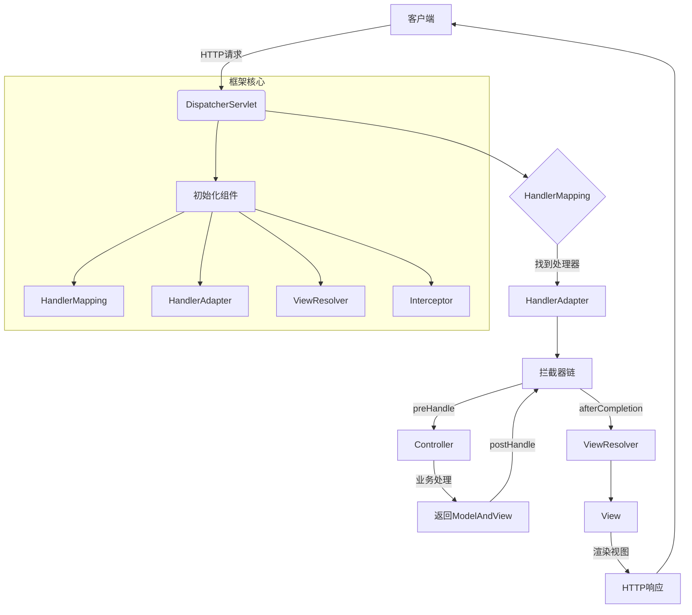

## 完整代码实现

### 1. DispatcherServlet - 前端控制器

```java
public class DispatcherServlet extends HttpServlet {
    private List<HandlerMapping> handlerMappings;
    private List<HandlerAdapter> handlerAdapters;
    private List<ViewResolver> viewResolvers;
    private List<HandlerInterceptor> interceptors;

    @Override
    public void init() throws ServletException {
        // 初始化框架组件（实际应用中可通过配置文件或注解扫描）
        initHandlerMappings();
        initHandlerAdapters();
        initViewResolvers();
        initInterceptors();
    }

    protected void service(HttpServletRequest req, HttpServletResponse resp) 
            throws ServletException, IOException {
        try {
            // 1. 查找处理器
            Object handler = getHandler(req);
            if (handler == null) {
                resp.sendError(HttpServletResponse.SC_NOT_FOUND);
                return;
            }

            // 2. 获取处理器适配器
            HandlerAdapter ha = getHandlerAdapter(handler);
            
            // 3. 执行拦截器前置处理
            if (!applyPreHandle(req, resp, handler)) {
                return;
            }

            // 4. 执行控制器方法
            ModelAndView mv = ha.handle(req, resp, handler);
            
            // 5. 应用默认视图名
            applyDefaultViewName(req, mv);
            
            // 6. 执行拦截器后置处理
            applyPostHandle(req, resp, handler, mv);
            
            // 7. 处理视图渲染
            processDispatchResult(req, resp, mv);
            
            // 8. 执行拦截器最终处理
            triggerAfterCompletion(req, resp, handler, null);
        } catch (Exception ex) {
            // 异常处理
            triggerAfterCompletion(req, resp, null, ex);
            throw new ServletException(ex);
        }
    }

    // 其他辅助方法...
}
```

### 2. HandlerMapping - 处理器映射接口

```java
public interface HandlerMapping {
    Object getHandler(HttpServletRequest request) throws Exception;
}

// 基于注解的处理器映射实现
public class AnnotationHandlerMapping implements HandlerMapping {
    private Map<String, Object> urlMap = new HashMap<>();

    public AnnotationHandlerMapping(String basePackage) {
        // 扫描指定包下的Controller类
        scanControllers(basePackage);
    }

    private void scanControllers(String basePackage) {
        // 实现类扫描逻辑（简化版）
        // 实际应使用反射扫描包下的类
        urlMap.put("/user/list", new UserController());
        urlMap.put("/product/detail", new ProductController());
    }

    @Override
    public Object getHandler(HttpServletRequest request) {
        String uri = request.getRequestURI();
        return urlMap.get(uri);
    }
}
```

### 3. HandlerAdapter - 处理器适配器

```java
public interface HandlerAdapter {
    boolean supports(Object handler);
    ModelAndView handle(HttpServletRequest request, 
                       HttpServletResponse response, 
                       Object handler) throws Exception;
}

// 支持Controller接口的适配器
public class SimpleControllerHandlerAdapter implements HandlerAdapter {
    @Override
    public boolean supports(Object handler) {
        return (handler instanceof Controller);
    }

    @Override
    public ModelAndView handle(HttpServletRequest request, 
                              HttpServletResponse response, 
                              Object handler) throws Exception {
        return ((Controller) handler).handleRequest(request, response);
    }
}

// Controller接口定义
public interface Controller {
    ModelAndView handleRequest(HttpServletRequest request, 
                              HttpServletResponse response) throws Exception;
}
```

### 4. ViewResolver - 视图解析器

```java
public interface ViewResolver {
    View resolveViewName(String viewName, Locale locale) throws Exception;
}

public class InternalResourceViewResolver implements ViewResolver {
    private String prefix = "/WEB-INF/views/";
    private String suffix = ".jsp";

    @Override
    public View resolveViewName(String viewName, Locale locale) {
        return new InternalResourceView(prefix + viewName + suffix);
    }
}

public interface View {
    void render(Map<String, ?> model, 
               HttpServletRequest request, 
               HttpServletResponse response) throws Exception;
}

public class InternalResourceView implements View {
    private String url;

    public InternalResourceView(String url) {
        this.url = url;
    }

    @Override
    public void render(Map<String, ?> model, 
                      HttpServletRequest request, 
                      HttpServletResponse response) throws Exception {
        // 将模型数据设置到request属性中
        for (Map.Entry<String, ?> entry : model.entrySet()) {
            request.setAttribute(entry.getKey(), entry.getValue());
        }
        
        // 转发到JSP页面
        RequestDispatcher dispatcher = request.getRequestDispatcher(url);
        dispatcher.forward(request, response);
    }
}
```

### 5. Interceptor - 拦截器

```java
public interface HandlerInterceptor {
    default boolean preHandle(HttpServletRequest request, 
                            HttpServletResponse response, 
                            Object handler) throws Exception {
        return true;
    }
    
    default void postHandle(HttpServletRequest request, 
                          HttpServletResponse response, 
                          Object handler, 
                          ModelAndView modelAndView) throws Exception {
    }
    
    default void afterCompletion(HttpServletRequest request, 
                               HttpServletResponse response, 
                               Object handler, 
                               Exception ex) throws Exception {
    }
}

// 示例：日志拦截器
public class LoggingInterceptor implements HandlerInterceptor {
    @Override
    public boolean preHandle(HttpServletRequest request, 
                           HttpServletResponse response, 
                           Object handler) {
        System.out.println("[" + new Date() + "] Request: " + 
                          request.getMethod() + " " + request.getRequestURI());
        return true;
    }
    
    @Override
    public void afterCompletion(HttpServletRequest request, 
                              HttpServletResponse response, 
                              Object handler, 
                              Exception ex) {
        System.out.println("[" + new Date() + "] Response: " + 
                          response.getStatus() + " " + request.getRequestURI());
    }
}
```

### 6. ModelAndView - 模型和视图容器

```java
public class ModelAndView {
    private Object view;
    private Map<String, Object> model = new HashMap<>();
    private HttpStatus status;

    public ModelAndView() {}
    
    public ModelAndView(String viewName) {
        this.view = viewName;
    }
    
    public ModelAndView addObject(String attributeName, Object attributeValue) {
        model.put(attributeName, attributeValue);
        return this;
    }
    
    public void setViewName(String viewName) {
        this.view = viewName;
    }
    
    // 其他getter/setter方法...
}
```

### 7. 控制器示例

```java
@Controller
public class UserController implements Controller {
    private UserService userService = new UserService();

    @Override
    public ModelAndView handleRequest(HttpServletRequest request, 
                                     HttpServletResponse response) {
        String action = request.getParameter("action");
        
        if ("list".equals(action)) {
            return listUsers();
        } else if ("detail".equals(action)) {
            return userDetail(request);
        }
        
        return new ModelAndView("error").addObject("message", "Invalid action");
    }
    
    private ModelAndView listUsers() {
        List<User> users = userService.getAllUsers();
        return new ModelAndView("userList").addObject("users", users);
    }
    
    private ModelAndView userDetail(HttpServletRequest request) {
        int userId = Integer.parseInt(request.getParameter("id"));
        User user = userService.getUserById(userId);
        return new ModelAndView("userDetail").addObject("user", user);
    }
}
```

### 8. web.xml配置

```xml
<web-app>
    <servlet>
        <servlet-name>dispatcher</servlet-name>
        <servlet-class>com.example.mvc.DispatcherServlet</servlet-class>
        <init-param>
            <param-name>basePackage</param-name>
            <param-value>com.example.controllers</param-value>
        </init-param>
        <load-on-startup>1</load-on-startup>
    </servlet>
    
    <servlet-mapping>
        <servlet-name>dispatcher</servlet-name>
        <url-pattern>/</url-pattern>
    </servlet-mapping>
</web-app>
```

## 框架特点与优势

1. **前端控制器模式**
   - 单一入口点处理所有请求
   - 集中式请求处理流程控制

2. **松耦合设计**
   - 组件通过接口定义
   - 支持多种实现方式（XML配置、注解等）

3. **可扩展架构**
   - 易于添加新功能组件
   - 支持自定义视图解析器、拦截器等

4. **生命周期管理**
   - 组件初始化/销毁回调
   - 资源自动释放

5. **AOP支持**
   - 拦截器实现横切关注点
   - 日志、安全、事务等通用功能

## 与传统Servlet开发对比

| 功能          | 传统Servlet            | MVC框架            | 优势                         |
| ------------- | ---------------------- | ------------------ | ---------------------------- |
| 请求分发      | 每个Servlet处理特定URL | 前端控制器统一分发 | 集中管理，减少配置           |
| 视图处理      | Servlet直接输出HTML    | 专用视图组件       | 视图与业务逻辑分离           |
| 控制器实现    | 继承HttpServlet        | POJO类+注解        | 简化开发，更易测试           |
| 参数绑定      | 手动获取请求参数       | 自动绑定到对象     | 减少样板代码                 |
| 异常处理      | 每个Servlet单独处理    | 全局异常处理器     | 统一错误处理机制             |
| 拦截器/过滤器 | 仅支持Servlet过滤器    | 专用拦截器组件     | 更细粒度控制，支持控制器方法 |

## 使用示例

```java
@Controller
@RequestMapping("/product")
public class ProductController {
    
    @Autowired
    private ProductService productService;
    
    @GetMapping("/list")
    public ModelAndView listProducts() {
        List<Product> products = productService.getAllProducts();
        return new ModelAndView("product/list", "products", products);
    }
    
    @PostMapping("/create")
    public ModelAndView createProduct(@ModelAttribute Product product) {
        productService.saveProduct(product);
        return new ModelAndView("redirect:/product/list");
    }
    
    @ExceptionHandler(ProductNotFoundException.class)
    public ModelAndView handleProductNotFound(ProductNotFoundException ex) {
        return new ModelAndView("error/product-not-found")
                .addObject("message", ex.getMessage());
    }
}
```

这个MVC框架设计采用了类似Spring MVC的核心思想，通过DispatcherServlet作为前端控制器统一处理请求，结合HandlerMapping、HandlerAdapter、ViewResolver等组件实现请求处理流程。框架支持拦截器、视图解析、异常处理等高级功能，同时保持了良好的扩展性和灵活性。

该设计避免了与Spring框架的直接依赖，完全基于Servlet API实现，可以作为理解MVC框架原理的学习项目，也可作为轻量级Web应用开发的基础框架。


# Filter（过滤器）

## 基本概念

Filter是Java Servlet规范中的一种组件，位于客户端与Servlet之间，可以**拦截请求和响应**，进行预处理和后处理。Filter组成一个链式结构（FilterChain），请求会依次通过各个Filter，最后到达目标Servlet。

### 核心特点

- **拦截能力**：可以拦截请求和响应
- **链式处理**：多个Filter可以形成处理链
- **声明式配置**：通过web.xml 或注解配置
- **生命周期**：由容器管理，与Servlet类似

## 使用方式

### 1. 实现Filter接口

```java
public class LoggingFilter implements Filter {
    
    @Override
    public void init(FilterConfig filterConfig) throws ServletException {
        // 初始化代码 
        System.out.println("LoggingFilter  initialized");
    }
    
    @Override
    public void doFilter(ServletRequest request, ServletResponse response, 
                        FilterChain chain) throws IOException, ServletException {
        long startTime = System.currentTimeMillis(); 
        
        // 1. 请求预处理 
        HttpServletRequest httpRequest = (HttpServletRequest) request;
        System.out.println("Request  URL: " + httpRequest.getRequestURL()); 
        
        // 2. 传递请求到Filter链中的下一个组件 
        chain.doFilter(request,  response);
        
        // 3. 响应后处理 
        long duration = System.currentTimeMillis()  - startTime;
        System.out.println("Request  processed in " + duration + " ms");
    }
    
    @Override
    public void destroy() {
        // 清理代码
        System.out.println("LoggingFilter  destroyed");
    }
}
```

### 2. 配置Filter

#### 方式一：注解配置（Servlet 3.0+）

```java
@WebFilter(
    filterName = "loggingFilter",
    urlPatterns = {"/*"},
    initParams = {
        @WebInitParam(name = "logLevel", value = "debug")
    }
)
public class LoggingFilter implements Filter {
    // 实现代码...
}
```

#### 方式二：web.xml 配置

```java
<filter>
    <filter-name>loggingFilter</filter-name>
    <filter-class>com.example.LoggingFilter</filter-class> 
    <init-param>
        <param-name>logLevel</param-name>
        <param-value>debug</param-value>
    </init-param>
</filter>
<filter-mapping>
    <filter-name>loggingFilter</filter-name>
    <url-pattern>/*</url-pattern>
    <!-- 可以指定servlet名称 -->
    <!-- <servlet-name>someServlet</servlet-name> -->
</filter-mapping>
```

## 核心注意点

### 1. 生命周期管理

- **init()**：在Filter实例化后调用一次，用于初始化
- **doFilter()**：每次请求都会调用
- **destroy()**：在Filter销毁前调用，用于资源清理

### 2. Filter执行顺序

- 通过注解配置时，顺序**不确定**（可通过`@Order`注解或web.xml 控制）
- 通过web.xml 配置时，按`<filter-mapping>`出现的顺序执行

### 3. 必须调用FilterChain.doFilter()

- 如果不调用，请求将被拦截，不会继续传递
- 可以在调用前后添加预处理和后处理逻辑

### 4. 线程安全问题

- Filter是**单例**的，需注意实例变量的线程安全
- 推荐将可变状态存储在方法局部变量或请求属性中

### 5. 性能考虑

- 避免在Filter中执行耗时操作
- 对于静态资源，考虑排除不必要的Filter处理

## 典型应用场景

### 1. 日志记录

```java
public void doFilter(ServletRequest request, ServletResponse response, 
                     FilterChain chain) throws IOException, ServletException {
    long start = System.currentTimeMillis(); 
    chain.doFilter(request,  response);
    long elapsed = System.currentTimeMillis()  - start;
    logger.info("Request  processed in {} ms", elapsed);
}
```

### 2. 认证/授权

```java
public void doFilter(ServletRequest request, ServletResponse response,
                     FilterChain chain) throws IOException, ServletException {
    HttpServletRequest httpRequest = (HttpServletRequest) request;
    HttpSession session = httpRequest.getSession(false); 
    
    if (session == null || session.getAttribute("user")  == null) {
        ((HttpServletResponse)response).sendRedirect("/login");
    } else {
        chain.doFilter(request,  response);
    }
}
```

### 3. 编码设置

```java
public void doFilter(ServletRequest request, ServletResponse response,
                     FilterChain chain) throws IOException, ServletException {
    request.setCharacterEncoding("UTF-8"); 
    response.setCharacterEncoding("UTF-8"); 
    chain.doFilter(request,  response);
}
```

### 4. 跨域处理（CORS）

```java
public void doFilter(ServletRequest req, ServletResponse res,
                     FilterChain chain) throws IOException, ServletException {
    HttpServletResponse response = (HttpServletResponse) res;
    response.setHeader("Access-Control-Allow-Origin",  "*");
    response.setHeader("Access-Control-Allow-Methods",  "POST, GET, OPTIONS, DELETE");
    response.setHeader("Access-Control-Max-Age",  "3600");
    response.setHeader("Access-Control-Allow-Headers",  "x-requested-with");
    chain.doFilter(req,  res);
}
```

### 5. 缓存控制

```java
public void doFilter(ServletRequest req, ServletResponse res,
                     FilterChain chain) throws IOException, ServletException {
    HttpServletResponse response = (HttpServletResponse) res;
    response.setHeader("Cache-Control",  "no-cache, no-store, must-revalidate");
    response.setHeader("Pragma",  "no-cache");
    response.setHeader("Expires",  "0");
    chain.doFilter(req,  res);
}
```

### 6. XSS防护

```java
public void doFilter(ServletRequest request, ServletResponse response,
                     FilterChain chain) throws IOException, ServletException {
    chain.doFilter(new  XSSRequestWrapper((HttpServletRequest) request), response);
}
 
// XSSRequestWrapper需要继承HttpServletRequestWrapper并重写相关方法
```

## 高级应用技巧

### 1. 动态启用/禁用Filter

```java
public void doFilter(ServletRequest request, ServletResponse response,
                     FilterChain chain) throws IOException, ServletException {
    if (shouldFilter((HttpServletRequest) request)) {
        // 执行过滤逻辑 
        filterLogic(request, response, chain);
    } else {
        chain.doFilter(request,  response);
    }
}
```

### 2. 请求/响应包装

```java
public void doFilter(ServletRequest request, ServletResponse response,
                     FilterChain chain) throws IOException, ServletException {
    // 包装请求
    HttpServletRequest wrappedRequest = new CustomRequestWrapper((HttpServletRequest) request);
    // 包装响应
    HttpServletResponse wrappedResponse = new CustomResponseWrapper((HttpServletResponse) response);
    
    chain.doFilter(wrappedRequest,  wrappedResponse);
    
    // 处理包装后的响应 
    String content = wrappedResponse.getContent(); 
    // 修改内容等操作...
    response.getWriter().write(modifiedContent); 
}
```

### 3. 组合多个Filter逻辑

```java
public void doFilter(ServletRequest request, ServletResponse response,
                     FilterChain chain) throws IOException, ServletException {
    // 逻辑1
    doLogic1(request);
    
    // 逻辑2 
    doLogic2(request);
    
    chain.doFilter(request,  response);
    
    // 后处理逻辑
    doPostProcessing(response);
}
```

## 常见问题与解决方案

### 1. Filter不生效

- **检查urlPatterns**：确保匹配目标URL
- **检查web.xml 顺序**：可能有其他Filter拦截了请求
- **确认调用chain.doFilter()** ：没有调用会导致请求中断

### 2. 性能问题

- **减少Filter数量**：合并相关逻辑
- **排除静态资源**：配置`<url-pattern>`时排除`.js,.css`等
- **异步支持**：对于耗时操作，考虑使用AsyncContext

### 3. 编码问题

- **尽早设置编码**：在第一个Filter中设置request/response编码
- **统一编码**：确保所有Filter和Servlet使用相同编码

### 4. 异常处理

```java
public void doFilter(ServletRequest request, ServletResponse response,
                     FilterChain chain) throws IOException, ServletException {
    try {
        chain.doFilter(request,  response);
    } catch (Exception e) {
        // 统一异常处理
        handleException(e, (HttpServletRequest) request, (HttpServletResponse) response);
    }
}
```

## Filter与Interceptor对比

| 特性     | Filter                      | Interceptor (Spring)   |
| -------- | --------------------------- | ---------------------- |
| 规范级别 | Servlet规范                 | Spring框架             |
| 依赖     | 仅需Servlet容器             | 需要Spring环境         |
| 执行位置 | Servlet之前/之后            | Controller方法前后     |
| 访问范围 | 所有请求                    | 可精确到Controller方法 |
| 参数获取 | 原始ServletRequest/Response | 更丰富的参数绑定       |
| 异常处理 | 只能捕获Servlet异常         | 可处理业务异常         |

## 最佳实践建议

1. **职责单一**：每个Filter只处理一个明确的任务
2. **性能优化**：避免在Filter中执行数据库操作等耗时任务
3. **配置灵活**：通过init-param使Filter行为可配置
4. **错误处理**：实现完善的异常处理机制
5. **资源清理**：在destroy()中正确释放资源
6. **测试覆盖**：为Filter编写单元测试和集成测试
7. **文档记录**：为每个Filter添加清晰的文档说明其用途和配置

Filter作为Servlet规范的核心组件之一，在Web应用中扮演着重要角色。合理使用Filter可以有效地实现横切关注点，保持业务代码的整洁性。


# Filter对请求进行预处理

## 基本原理

Filter可以通过**请求包装器(HttpServletRequestWrapper)**修改请求参数、头部和属性。这是通过创建一个自定义的请求包装类，继承HttpServletRequestWrapper并重写相关方法实现的。

## 核心实现步骤

### 1. 创建自定义请求包装器

```java
public class ModifiedRequestWrapper extends HttpServletRequestWrapper {
    
    // 用于存储修改后的参数 
    private final Map<String, String[]> modifiedParams;
    
    public ModifiedRequestWrapper(HttpServletRequest request) {
        super(request);
        // 初始化时复制原始参数 
        this.modifiedParams  = new HashMap<>(request.getParameterMap()); 
    }
    
    // 重写获取参数的方法 
    @Override 
    public String getParameter(String name) {
        String[] values = modifiedParams.get(name); 
        return values != null && values.length  > 0 ? values[0] : null;
    }
    
    @Override 
    public Map<String, String[]> getParameterMap() {
        return Collections.unmodifiableMap(modifiedParams); 
    }
    
    @Override 
    public Enumeration<String> getParameterNames() {
        return Collections.enumeration(modifiedParams.keySet()); 
    }
    
    @Override 
    public String[] getParameterValues(String name) {
        return modifiedParams.get(name); 
    }
    
    // 添加修改参数的方法 
    public void setParameter(String name, String value) {
        modifiedParams.put(name,  new String[]{value});
    }
    
    public void setParameters(Map<String, String[]> newParams) {
        modifiedParams.putAll(newParams); 
    }
    
    // 可以重写其他需要修改的方法，如header相关方法
    @Override
    public String getHeader(String name) {
        if ("User-Agent".equalsIgnoreCase(name)) {
            return "Modified-Agent";
        }
        return super.getHeader(name); 
    }
}
```

### 2. 在Filter中使用包装器

```java
@WebFilter("/*")
public class RequestModificationFilter implements Filter {
    
    @Override 
    public void doFilter(ServletRequest request, ServletResponse response, 
                        FilterChain chain) throws IOException, ServletException {
        
        HttpServletRequest httpRequest = (HttpServletRequest) request;
        
        // 创建包装器实例
        ModifiedRequestWrapper wrappedRequest = new ModifiedRequestWrapper(httpRequest);
        
        // 修改请求参数 
        wrappedRequest.setParameter("modified",  "true");
        
        // 添加新参数
        wrappedRequest.setParameter("requestTime",  String.valueOf(System.currentTimeMillis())); 
        
        // 继续过滤器链，传入包装后的请求
        chain.doFilter(wrappedRequest,  response);
    }
    
    // init和destroy方法...
}
```

## 主要应用场景

### 1. 参数预处理

```java
// 在包装器中重写getParameter方法
@Override
public String getParameter(String name) {
    String value = super.getParameter(name); 
    if ("content".equals(name) && value != null) {
        return value.trim();  // 自动去除前后空格
    }
    return value;
}
```

### 2. 敏感词过滤

```java
@Override
public String getParameter(String name) {
    String value = super.getParameter(name); 
    if (value != null) {
        return SensitiveWordFilter.filter(value);  // 应用敏感词过滤 
    }
    return value;
}
```

### 3. 参数解密

```java
@Override
public String getParameter(String name) {
    String encrypted = super.getParameter(name); 
    if ("token".equals(name) && encrypted != null) {
        return CryptoUtil.decrypt(encrypted);  // 自动解密
    }
    return encrypted;
}
```

### 4. 请求头修改

```java
// 在包装器中添加 
private Map<String, String> modifiedHeaders = new HashMap<>();
 
public void setHeader(String name, String value) {
    modifiedHeaders.put(name,  value);
}
 
@Override
public String getHeader(String name) {
    if (modifiedHeaders.containsKey(name))  {
        return modifiedHeaders.get(name); 
    }
    return super.getHeader(name); 
}
```

## 关键注意事项

### 1. 线程安全问题

- **包装器实例必须每个请求创建新的**：不能在Filter中共享包装器实例
- **参数Map处理**：getParameterMap()返回的Map应该是不可修改的

### 2. 性能考虑

- **避免深度复制大数据**：如上传文件内容，除非必要不要复制
- **缓存计算结果**：对于复杂处理，考虑缓存处理结果

### 3. 请求体处理

- **对于POST请求**：需要特别处理请求体数据

```java
public class BodyModificationWrapper extends HttpServletRequestWrapper {
    private byte[] modifiedBody;
    
    public BodyModificationWrapper(HttpServletRequest request, String modifiedBody) {
        super(request);
        this.modifiedBody  = modifiedBody.getBytes(StandardCharsets.UTF_8); 
    }
    
    @Override 
    public ServletInputStream getInputStream() {
        return new DelegatingServletInputStream(new ByteArrayInputStream(modifiedBody));
    }
    
    @Override
    public BufferedReader getReader() {
        return new BufferedReader(new InputStreamReader(
            new ByteArrayInputStream(modifiedBody), StandardCharsets.UTF_8));
    }
}
```

### 4. 转发与包含

- **请求转发(forward)**：包装后的请求会保持
- **包含(include)**：原始请求会被使用，包装可能失效

### 5. 安全考虑

- **重要参数签名验证**：修改关键参数需要重新计算签名
- **防止参数注入**：谨慎处理参数修改，避免安全漏洞

## 高级技巧

### 1. 动态参数计算

```java
@Override
public String getParameter(String name) {
    if ("currentUser".equals(name)) {
        return SecurityContext.getCurrentUser();  // 动态获取当前用户
    }
    return super.getParameter(name); 
}
```

### 2. 请求URI重写

```java
public class UrlRewriteWrapper extends HttpServletRequestWrapper {
    private String newPath;
    
    public UrlRewriteWrapper(HttpServletRequest request, String newPath) {
        super(request);
        this.newPath  = newPath;
    }
    
    @Override 
    public String getRequestURI() {
        return newPath;
    }
    
    @Override 
    public String getServletPath() {
        return newPath;
    }
}
```

### 3. 多级修改处理

```java
// 在Filter中处理多个包装器 
ModifiedRequestWrapper wrapper1 = new ModifiedRequestWrapper(request);
wrapper1.setParameter("stage",  "1");
 
EnhancedRequestWrapper wrapper2 = new EnhancedRequestWrapper(wrapper1);
wrapper2.setHeader("X-Request-Stage",  "processed");
 
chain.doFilter(wrapper2,  response);
```

## 常见问题解决方案

### 1. 文件上传请求修改

- **问题**：直接修改multipart请求会导致上传失败
- **方案**：使用Commons FileUpload等库处理后再包装

```java
public class MultipartModificationWrapper extends HttpServletRequestWrapper {
    private Map<String, List<FileItem>> multipartParams;
    
    public MultipartModificationWrapper(HttpServletRequest request) 
        throws ServletException {
        super(request);
        
        // 解析原始multipart请求
        ServletFileUpload upload = new ServletFileUpload();
        this.multipartParams  = upload.parseParameterMap(request); 
    }
    
    // 实现相关方法访问和修改文件上传参数 
}
```

### 2. JSON请求体修改

```java
public class JsonBodyWrapper extends HttpServletRequestWrapper {
    private String modifiedJson;
    
    public JsonBodyWrapper(HttpServletRequest request) throws IOException {
        super(request);
        String originalJson = IOUtils.toString(request.getInputStream(),  
            request.getCharacterEncoding()); 
        JSONObject json = new JSONObject(originalJson);
        // 修改JSON内容 
        json.put("modified",  true);
        this.modifiedJson  = json.toString(); 
    }
    
    @Override
    public ServletInputStream getInputStream() {
        return new DelegatingServletInputStream(
            new ByteArrayInputStream(modifiedJson.getBytes())); 
    }
}
```

### 3. 保持POST请求特性

- **问题**：修改后可能导致请求变为GET特性
- **方案**：确保保持原始请求方法和其他特性

```java
public class PostPreservingWrapper extends HttpServletRequestWrapper {
    public PostPreservingWrapper(HttpServletRequest request) {
        super(request);
    }
    
    @Override
    public String getMethod() {
        return "POST"; // 强制保持POST方法 
    }
}
```

## 最佳实践建议

1. **明确修改范围**：只修改必要的参数，保持其他参数不变
2. **记录修改日志**：对于关键参数修改，记录原始值和修改后的值
3. **单元测试**：为包装器编写全面的单元测试
4. **性能测试**：评估修改请求对性能的影响
5. **文档说明**：清晰记录哪些Filter会修改请求以及如何修改
6. **异常处理**：妥善处理可能出现的各种异常情况

通过合理使用请求包装器，可以在不修改业务代码的情况下实现各种请求预处理需求，这是Filter最强大的功能之一。但同时也需要谨慎处理，避免引入不可预期的问题。


# Filter对响应进行处理

## 响应处理的基本原理

Filter不仅可以拦截请求，还能对响应进行处理。这是通过在`chain.doFilter()` 调用后添加响应处理逻辑实现的，此时Servlet已经完成了对请求的处理并生成了响应内容。

## 核心实现方式

### 1. 响应包装器模式

```java
@WebFilter("/*")
public class ResponseProcessingFilter implements Filter {
    
    @Override 
    public void doFilter(ServletRequest request, ServletResponse response, 
                        FilterChain chain) throws IOException, ServletException {
        
        // 1. 创建自定义响应包装器
        CharResponseWrapper wrapper = new CharResponseWrapper(
            (HttpServletResponse)response);
        
        // 2. 继续过滤器链，传入包装后的响应
        chain.doFilter(request,  wrapper);
        
        // 3. 获取Servlet生成的响应内容 
        String content = wrapper.toString(); 
        
        // 4. 修改响应内容
        if (content != null) {
            content = content.replace(" 旧内容", "新内容");
            
            // 5. 设置响应头（如需要）
            response.setContentLength(content.length()); 
            
            // 6. 输出修改后的内容
            response.getWriter().write(content); 
        }
    }
}
 
// 自定义响应包装器 
class CharResponseWrapper extends HttpServletResponseWrapper {
    private CharArrayWriter output;
    
    public CharResponseWrapper(HttpServletResponse response) {
        super(response);
        this.output  = new CharArrayWriter();
    }
    
    @Override
    public PrintWriter getWriter() {
        return new PrintWriter(output);
    }
    
    @Override
    public String toString() {
        return output.toString(); 
    }
}
```

### 2. 二进制响应处理（如图片/PDF）

```java
class ByteResponseWrapper extends HttpServletResponseWrapper {
    private ByteArrayOutputStream output;
    
    public ByteResponseWrapper(HttpServletResponse response) {
        super(response);
        this.output  = new ByteArrayOutputStream();
    }
    
    @Override
    public ServletOutputStream getOutputStream() {
        return new FilterServletOutputStream(output);
    }
    
    public byte[] getData() {
        return output.toByteArray(); 
    }
}
 
class FilterServletOutputStream extends ServletOutputStream {
    private OutputStream output;
    
    public FilterServletOutputStream(OutputStream output) {
        this.output  = output;
    }
    
    @Override
    public void write(int b) throws IOException {
        output.write(b); 
    }
    
    // 其他需要实现的方法...
}
```

## 主要应用场景

### 1. 内容压缩（GZIP）

```java
@WebFilter(urlPatterns = {"/*"}, 
           initParams = {
               @WebInitParam(name = "compressionThreshold", value = "1024")
           })
public class CompressionFilter implements Filter {
    private int compressionThreshold;
    
    @Override 
    public void init(FilterConfig config) {
        compressionThreshold = Integer.parseInt( 
            config.getInitParameter("compressionThreshold")); 
    }
    
    @Override
    public void doFilter(ServletRequest req, ServletResponse res,
                        FilterChain chain) throws IOException, ServletException {
        HttpServletRequest request = (HttpServletRequest) req;
        HttpServletResponse response = (HttpServletResponse) res;
        
        String acceptEncoding = request.getHeader("Accept-Encoding"); 
        if (acceptEncoding != null && acceptEncoding.contains("gzip"))  {
            CompressionResponseWrapper wrappedResp = 
                new CompressionResponseWrapper(response);
            wrappedResp.setCompressionThreshold(compressionThreshold); 
            
            try {
                chain.doFilter(request,  wrappedResp);
            } finally {
                wrappedResp.finish(); 
            }
        } else {
            chain.doFilter(request,  response);
        }
    }
}
```

### 2. 统一响应格式处理

```java
public void doFilter(ServletRequest req, ServletResponse res,
                     FilterChain chain) throws IOException, ServletException {
    HttpServletResponse response = (HttpServletResponse) res;
    GenericResponseWrapper wrapper = new GenericResponseWrapper(response);
    
    chain.doFilter(req,  wrapper);
    
    String contentType = response.getContentType(); 
    if (contentType != null && contentType.contains("application/json"))  {
        String content = wrapper.getData(); 
        JSONObject json = new JSONObject(content);
        
        // 添加统一响应字段
        json.put("timestamp",  System.currentTimeMillis()); 
        json.put("status",  "success");
        
        // 输出修改后的JSON 
        response.setContentLength(json.toString().length()); 
        response.getWriter().print(json.toString()); 
    }
}
```

### 3. 敏感信息过滤

```java
public void doFilter(ServletRequest req, ServletResponse res,
                     FilterChain chain) throws IOException, ServletException {
    CharResponseWrapper wrapper = new CharResponseWrapper(
        (HttpServletResponse) res);
    
    chain.doFilter(req,  wrapper);
    
    String content = wrapper.toString(); 
    if (content != null) {
        // 过滤敏感信息
        content = SensitiveDataFilter.filter(content); 
        
        // 输出过滤后的内容 
        res.getWriter().write(content); 
    }
}
```

### 4. 缓存处理

```java
public void doFilter(ServletRequest req, ServletResponse res,
                     FilterChain chain) throws IOException, ServletException {
    HttpServletResponse response = (HttpServletResponse) res;
    CacheResponseWrapper wrapper = new CacheResponseWrapper(response);
    
    String cacheKey = ((HttpServletRequest)req).getRequestURI();
    String cachedContent = CacheManager.get(cacheKey); 
    
    if (cachedContent != null) {
        // 直接返回缓存内容
        response.getWriter().write(cachedContent); 
        return;
    }
    
    chain.doFilter(req,  wrapper);
    
    String content = wrapper.toString(); 
    if (content != null) {
        // 存入缓存 
        CacheManager.put(cacheKey,  content);
        response.getWriter().write(content); 
    }
}
```

### 5. 跨域处理（CORS）

```java
public void doFilter(ServletRequest req, ServletResponse res,
                     FilterChain chain) throws IOException, ServletException {
    HttpServletResponse response = (HttpServletResponse) res;
    
    // 设置CORS头
    response.setHeader("Access-Control-Allow-Origin",  "*");
    response.setHeader("Access-Control-Allow-Methods",  "GET, POST, PUT, DELETE");
    response.setHeader("Access-Control-Max-Age",  "3600");
    response.setHeader("Access-Control-Allow-Headers",  "Content-Type, Authorization");
    
    chain.doFilter(req,  res);
}
```

## 关键注意事项

### 1. 性能考虑

- **缓冲大小**：合理设置响应包装器的缓冲区大小
- **大文件处理**：避免对大文件内容进行内存缓冲
- **资源释放**：确保及时释放包装器使用的资源

### 2. 响应提交问题

- **检查isCommitted()**：在处理前检查响应是否已提交

```java
if (!response.isCommitted())  {
    // 安全处理响应 
}
```

### 3. 内容类型处理

- **保持原始Content-Type**：修改内容时需要确保内容类型匹配
- **字符编码一致**：保持请求和响应编码一致

### 4. 异常处理

- **包装器异常**：妥善处理包装器可能抛出的IO异常
- **内容修改异常**：处理内容修改过程中的异常情况

### 5. 与其它Filter的协作

- **执行顺序**：响应处理Filter通常应该放在Filter链的末端
- **多次包装**：避免多个Filter对响应进行多次包装

## 高级应用技巧

### 1. 动态内容替换

```java
public void doFilter(ServletRequest req, ServletResponse res,
                     FilterChain chain) throws IOException, ServletException {
    CharResponseWrapper wrapper = new CharResponseWrapper(
        (HttpServletResponse) res);
    
    chain.doFilter(req,  wrapper);
    
    String content = wrapper.toString(); 
    if (content != null) {
        // 使用正则表达式替换内容
        content = content.replaceAll( 
            "(<div id=\"ad\">).*?(</div>)", 
            "$1替代内容$2");
        
        res.getWriter().write(content); 
    }
}
```

### 2. 响应内容加密

```java
public void doFilter(ServletRequest req, ServletResponse res,
                     FilterChain chain) throws IOException, ServletException {
    ByteResponseWrapper wrapper = new ByteResponseWrapper(
        (HttpServletResponse) res);
    
    chain.doFilter(req,  wrapper);
    
    byte[] data = wrapper.getData(); 
    if (data != null && data.length  > 0) {
        byte[] encrypted = CryptoUtil.encrypt(data); 
        res.getOutputStream().write(encrypted); 
    }
}
```

### 3. 响应时间戳

```java
public void doFilter(ServletRequest req, ServletResponse res,
                     FilterChain chain) throws IOException, ServletException {
    long startTime = System.currentTimeMillis(); 
    
    chain.doFilter(req,  res);
    
    if (res instanceof HttpServletResponse) {
        HttpServletResponse response = (HttpServletResponse) res;
        response.setHeader("X-Response-Time",  
            String.valueOf(System.currentTimeMillis()  - startTime));
    }
}
```

### 4. AOP式日志记录

```java
public void doFilter(ServletRequest req, ServletResponse res,
                     FilterChain chain) throws IOException, ServletException {
    HttpServletRequest request = (HttpServletRequest) req;
    HttpServletResponse response = (HttpServletResponse) res;
    
    CharResponseWrapper wrapper = new CharResponseWrapper(response);
    
    try {
        chain.doFilter(request,  wrapper);
        
        String content = wrapper.toString(); 
        logResponse(request, response, content);
        
        if (content != null) {
            response.getWriter().write(content); 
        }
    } catch (Exception e) {
        logError(request, e);
        throw e;
    }
}
```

## 常见问题解决方案

### 1. 响应乱码问题

- **统一设置编码**：在Filter最开始处设置请求和响应编码

```java
request.setCharacterEncoding("UTF-8"); 
response.setCharacterEncoding("UTF-8"); 
```

### 2. 文件下载损坏

- **二进制响应处理**：使用字节流包装器而非字符流包装器
- **禁用缓存**：对于动态生成的文件

```java
response.setHeader("Cache-Control",  "no-store");
```

### 3. 性能瓶颈

- **选择性处理**：根据内容类型决定是否处理

```java
String contentType = response.getContentType(); 
if (contentType != null && contentType.startsWith("text/html"))  {
    // 只处理HTML内容 
}
```

### 4. 内存溢出

- **限制处理大小**：对于大响应不进行缓冲处理

```java
if (response.getContentLength()  > MAX_SIZE) {
    chain.doFilter(request,  response);
    return;
}
```

## 最佳实践建议

1. **明确处理范围**：通过urlPatterns精确控制Filter的作用范围
2. **性能监控**：记录Filter处理耗时，及时发现性能问题
3. **异常恢复**：确保异常情况下仍能返回合理的响应
4. **内容检测**：处理前检查内容类型和长度
5. **资源清理**：在Filter销毁时释放所有资源
6. **测试覆盖**：为各种响应类型编写测试用例

Filter对响应的处理能力为Web应用提供了强大的后处理机制，合理使用可以实现许多横切关注点，如安全控制、性能优化、内容转换等。掌握这些技术可以显著提升Web应用的灵活性和可维护性。


# Listener（监听器）

## 基本概念

Listener（监听器）是Java Web应用中的一种事件监听机制，用于监听Web应用中的**特定事件**并在事件发生时执行预定义的操作。它是观察者模式在Servlet规范中的实现。

### 核心特点

- **事件驱动**：响应Web容器生命周期和状态变化
- **声明式配置**：通过注解或web.xml 配置
- **无侵入性**：不修改现有代码即可扩展功能
- **多种类型**：可监听不同维度的事件

## Listener类型及使用

### 1. ServletContext监听器

#### 接口：

- `ServletContextListener` - 监听上下文生命周期
- `ServletContextAttributeListener` - 监听上下文属性变化

#### 实现示例：

```java
@WebListener 
public class AppContextListener implements ServletContextListener {
    
    @Override
    public void contextInitialized(ServletContextEvent sce) {
        // 应用启动时执行 
        System.out.println("Web 应用程序初始化");
        
        // 初始化全局资源
        ServletContext ctx = sce.getServletContext(); 
        ctx.setAttribute("appStartTime",  System.currentTimeMillis()); 
        
        // 加载配置文件 
        String configFile = ctx.getInitParameter("configFile"); 
        // 初始化配置...
    }
    
    @Override 
    public void contextDestroyed(ServletContextEvent sce) {
        // 应用关闭时执行 
        System.out.println("Web 应用程序销毁");
        
        // 释放资源
        long startTime = (Long) sce.getServletContext() 
                                .getAttribute("appStartTime");
        System.out.println(" 应用运行时长: " + 
            (System.currentTimeMillis()  - startTime) + "ms");
    }
}
```

### 2. Session监听器

#### 接口：

- `HttpSessionListener` - 监听Session生命周期
- `HttpSessionAttributeListener` - 监听Session属性变化
- `HttpSessionActivationListener` - 监听Session活化/钝化
- `HttpSessionBindingListener` - 监听对象绑定到Session

#### 实现示例：

```java
@WebListener
public class SessionTracker implements HttpSessionListener {
    
    private static final AtomicInteger activeSessions = new AtomicInteger();
    
    public static int getActiveSessions() {
        return activeSessions.get(); 
    }
    
    @Override
    public void sessionCreated(HttpSessionEvent se) {
        activeSessions.incrementAndGet(); 
        System.out.println("Session 创建，ID: " + se.getSession().getId()); 
        System.out.println(" 当前活跃会话数: " + activeSessions.get()); 
    }
    
    @Override
    public void sessionDestroyed(HttpSessionEvent se) {
        activeSessions.decrementAndGet(); 
        System.out.println("Session 销毁，ID: " + se.getSession().getId()); 
        System.out.println(" 当前活跃会话数: " + activeSessions.get()); 
        
        // 记录会话持续时间 
        long createTime = se.getSession().getCreationTime(); 
        System.out.println(" 会话持续时间: " + 
            (System.currentTimeMillis()  - createTime) + "ms");
    }
}
```

### 3. Request监听器

#### 接口：

- `ServletRequestListener` - 监听Request生命周期
- `ServletRequestAttributeListener` - 监听Request属性变化

#### 实现示例：

```java
@WebListener
public class RequestAnalyzer implements ServletRequestListener {
    
    @Override 
    public void requestInitialized(ServletRequestEvent sre) {
        HttpServletRequest req = (HttpServletRequest) sre.getServletRequest(); 
        req.setAttribute("startTime",  System.nanoTime()); 
        
        System.out.println(" 请求开始: " + req.getRequestURI()); 
        System.out.println(" 来自IP: " + req.getRemoteAddr()); 
    }
    
    @Override 
    public void requestDestroyed(ServletRequestEvent sre) {
        HttpServletRequest req = (HttpServletRequest) sre.getServletRequest(); 
        long startTime = (Long) req.getAttribute("startTime"); 
        long duration = System.nanoTime()  - startTime;
        
        System.out.println(" 请求完成: " + req.getRequestURI()); 
        System.out.println(" 处理时间: " + (duration / 1_000_000) + "ms");
    }
}
```

## 配置方式

### 1. 注解配置（Servlet 3.0+）

```java
@WebListener 
public class MyListener implements ServletContextListener {
    // 实现代码...
}
```

### 2. web.xml 配置

```java
<listener>
    <listener-class>com.example.MyListener</listener-class> 
</listener>
```

## 主要应用场景

### 1. 应用初始化

- 加载配置文件
- 初始化数据库连接池
- 缓存预热
- 注册自定义组件

### 2. 资源管理

- 应用启动时创建资源
- 应用关闭时释放资源
- 连接泄漏检测

### 3. 监控统计

- 在线用户统计
- 请求频率监控
- 性能指标收集

### 4. 安全控制

- 防止Session固定攻击
- 记录用户登录日志
- 异常访问检测

### 5. 自定义扩展

- 实现伪IoC容器
- 动态注册Servlet/Filter
- 环境检测与适配

## 关键注意事项

### 1. 执行顺序问题

- **多个Listener的执行顺序**：web.xml 中按配置顺序执行，注解方式顺序不确定
- **与Filter/Servlet的初始化顺序**：Listener最先执行

### 2. 线程安全问题

- **ServletContext和HttpSession监听器**：需考虑多线程并发访问
- **避免实例变量**：推荐使用局部变量或同步控制

### 3. 性能影响

- **Session监听器**：频繁创建销毁Session时需注意性能
- **复杂逻辑处理**：避免在监听器中执行耗时操作

### 4. 异常处理

- **contextInitialized中的异常**：会导致应用启动失败
- **其他监听器异常**：可能中断当前操作但不影响整体应用

### 5. 特殊场景

- **分布式环境**：Session监听器行为可能与单机不同
- **Session持久化**：活化/钝化时的特殊处理

## 高级使用技巧

### 1. 动态注册组件

```java
public class DynamicComponentListener implements ServletContextListener {
    @Override 
    public void contextInitialized(ServletContextEvent sce) {
        ServletContext ctx = sce.getServletContext(); 
        
        // 动态注册Filter 
        FilterRegistration.Dynamic filter = ctx.addFilter(  
            "dynamicFilter", new MyFilter());
        filter.addMappingForUrlPatterns( 
            EnumSet.of(DispatcherType.REQUEST),  true, "/*");
        
        // 动态注册Servlet 
        ServletRegistration.Dynamic servlet = ctx.addServlet( 
            "dynamicServlet", new MyServlet());
        servlet.addMapping("/dynamic"); 
    }
}
```

### 2. 组合监听器

```java
@WebListener 
public class CompositeListener implements 
    ServletContextListener, HttpSessionListener {
    
    // 实现多个接口方法...
}
```

### 3. 基于事件的资源管理

```java
public class DBConnectionManager implements ServletContextListener {
    
    private static DataSource dataSource;
    
    public static Connection getConnection() throws SQLException {
        return dataSource.getConnection(); 
    }
    
    @Override 
    public void contextInitialized(ServletContextEvent sce) {
        // 初始化连接池
        HikariConfig config = new HikariConfig();
        config.setJdbcUrl("jdbc:mysql://localhost:3306/mydb"); 
        // 其他配置...
        dataSource = new HikariDataSource(config);
        
        sce.getServletContext().setAttribute("dataSource",  dataSource);
    }
    
    @Override
    public void contextDestroyed(ServletContextEvent sce) {
        if (dataSource != null) {
            dataSource.close(); 
        }
    }
}
```

## 常见问题解决方案

### 1. 监听器不执行

- **检查配置**：确认web.xml 配置正确或注解被扫描到
- **检查依赖**：确保没有缺少必要的依赖
- **查看日志**：检查容器启动日志是否有异常

### 2. 内存泄漏问题

- **Session监听器**：确保及时清理不再需要的Session属性
- **静态集合**：避免在监听器中使用静态集合长期持有对象引用

### 3. 分布式环境问题

- **Session复制**：确保集群中所有节点都能收到Session事件
- **全局锁**：分布式环境下需要特殊处理资源共享

### 4. 与框架集成

- **Spring集成**：通常不需要自定义Listener，使用Spring的生命周期机制
- **CDI环境**：可以考虑使用CDI事件替代部分监听器功能

## 最佳实践建议

1. **单一职责**：每个监听器只关注一种类型的事件
2. **轻量级处理**：避免在监听器中执行复杂业务逻辑
3. **异常处理**：妥善处理可能出现的异常情况
4. **文档记录**：为自定义监听器添加清晰的文档说明
5. **性能测试**：评估监听器对应用性能的影响
6. **环境适配**：考虑不同部署环境下的行为差异

Listener是Java Web应用中非常强大的机制，合理使用可以实现许多系统级功能而不需要修改业务代码。理解各种监听器的特点和适用场景，可以帮助开发者构建更加健壮和可维护的Web应用。


