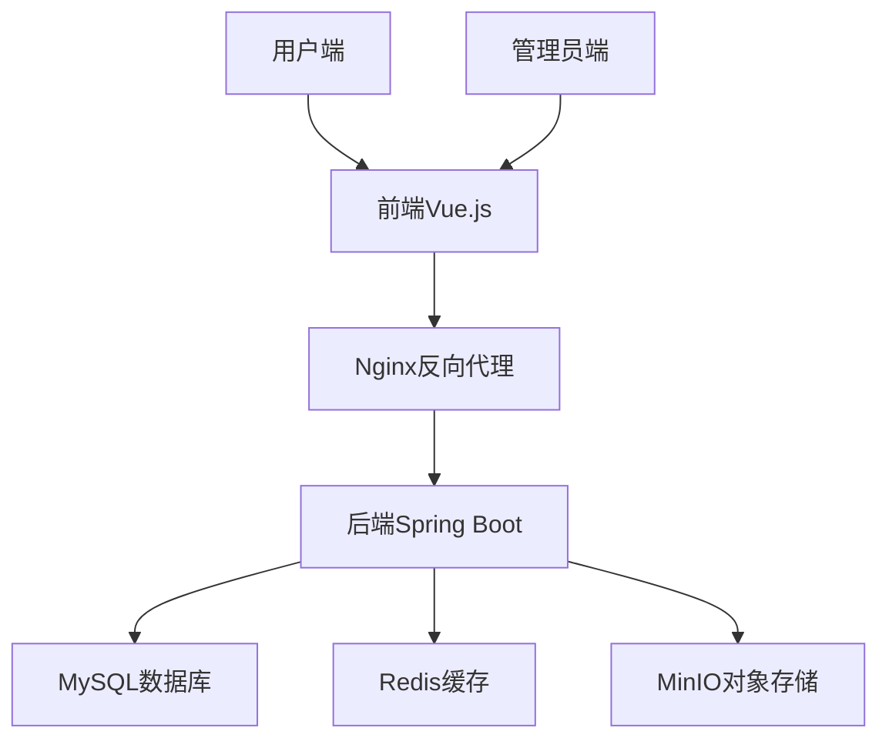
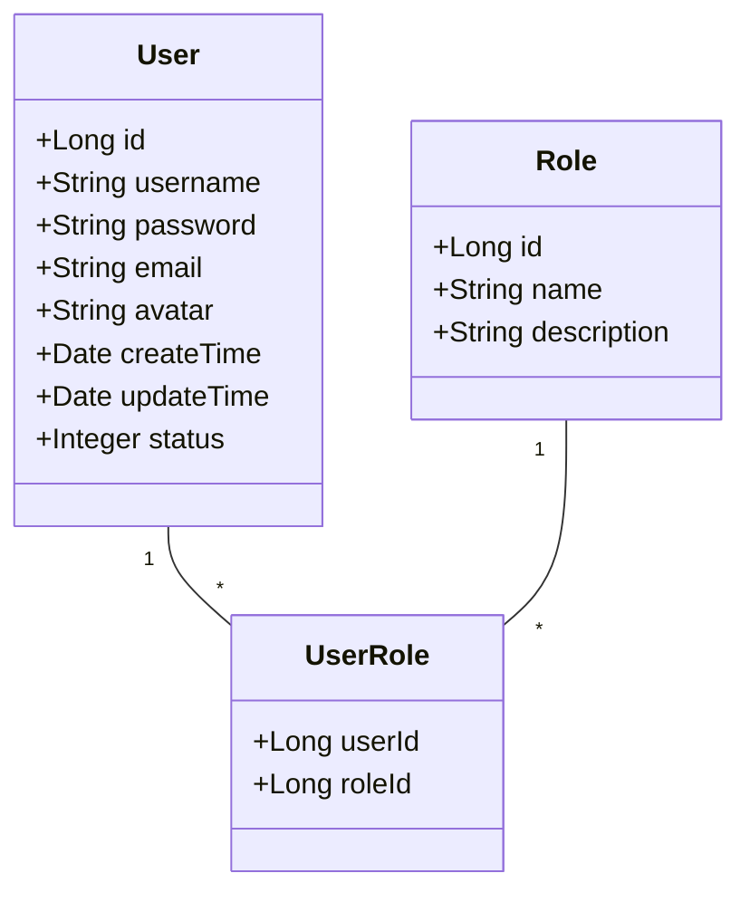
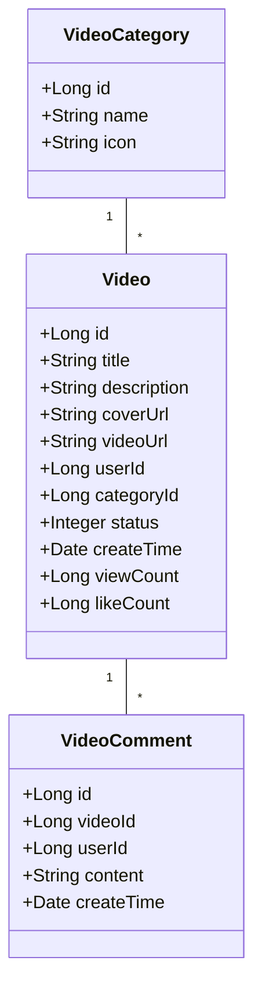
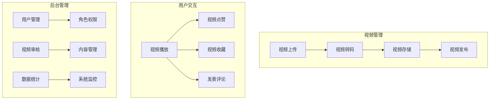

# Vue + Java 在线视频网站软件文档详解

## 一、项目概述

本项目是一个基于前后端分离架构的在线视频平台，前端使用Vue.js框架，后端采用Java Spring Boot技术栈。平台提供视频上传、播放、分类、用户管理、评论互动等核心功能。

## 二、系统架构设计



## 三、技术栈

### 前端技术栈
- **框架**: Vue 3 + Composition API
- **UI框架**: Element Plus
- **状态管理**: Pinia
- **路由**: Vue Router
- **视频播放**: Video.js
- **网络请求**: Axios

### 后端技术栈
- **核心框架**: Spring Boot 3.0
- **安全框架**: Spring Security + JWT
- **数据库**: MySQL 8.0
- **缓存**: Redis 7.0
- **对象存储**: MinIO
- **API文档**: Swagger 3.0
- **任务调度**: Quartz

## 四、核心模块设计

### 1. 用户模块


### 2. 视频模块


### 3. 系统功能模块


## 五、API接口设计示例

### 1. 视频上传接口
```java
@RestController
@RequestMapping("/api/videos")
public class VideoController {

    @Autowired
    private VideoService videoService;
    
    @PostMapping("/upload")
    public ResponseEntity<VideoUploadResponse> uploadVideo(
            @RequestParam("file") MultipartFile file,
            @RequestParam("title") String title,
            @RequestParam("description") String description,
            @RequestParam("categoryId") Long categoryId) {
        
        VideoUploadResponse response = videoService.uploadVideo(
                file, title, description, categoryId);
        
        return ResponseEntity.ok(response);
    }
}
```

### 2. 视频播放接口
```java
@GetMapping("/play/{videoId}")
public ResponseEntity<VideoPlayResponse> playVideo(@PathVariable Long videoId) {
    VideoPlayResponse response = videoService.getVideoForPlay(videoId);
    return ResponseEntity.ok(response);
}
```

### 3. 用户认证接口
```java
@PostMapping("/auth/login")
public ResponseEntity<LoginResponse> login(@RequestBody LoginRequest request) {
    Authentication authentication = authenticationManager.authenticate(
            new UsernamePasswordAuthenticationToken(
                    request.getUsername(),
                    request.getPassword()
            )
    );
    
    SecurityContextHolder.getContext().setAuthentication(authentication);
    String jwt = jwtUtils.generateJwtToken(authentication);
    
    return ResponseEntity.ok(new LoginResponse(jwt));
}
```

## 六、前端核心组件实现

### 视频播放器组件
```html
<template>
  <div class="video-player-container">
    <video
      ref="videoPlayer"
      class="video-js vjs-big-play-centered"
      controls
      preload="auto"
      :poster="video.coverUrl"
    ></video>
    
    <div class="video-info">
      <h2>{{ video.title }}</h2>
      <div class="meta">
        <span>播放: {{ formatCount(video.viewCount) }}</span>
        <span>点赞: {{ formatCount(video.likeCount) }}</span>
        <span>发布于: {{ formatDate(video.createTime) }}</span>
      </div>
    </div>
    
    <div class="actions">
      <el-button type="danger" @click="handleLike">
        <el-icon><VideoPlay /></el-icon> 点赞
      </el-button>
      <el-button @click="handleCollect">
        <el-icon><Star /></el-icon> 收藏
      </el-button>
    </div>
  </div>
</template>

<script setup>
import { ref, onMounted, onBeforeUnmount } from 'vue';
import videojs from 'video.js';
import 'video.js/dist/video-js.css';

const props = defineProps({
  video: {
    type: Object,
    required: true
  }
});

const videoPlayer = ref(null);
let player = null;

onMounted(() => {
  player = videojs(videoPlayer.value, {
    controls: true,
    autoplay: false,
    preload: 'auto',
    sources: [{
      src: props.video.videoUrl,
      type: 'video/mp4'
    }]
  });
  
  player.on('play', () => {
    // 记录播放行为
    recordView();
  });
});

onBeforeUnmount(() => {
  if (player) {
    player.dispose();
  }
});

const recordView = async () => {
  // 调用API记录播放次数
  await axios.post(`/api/videos/${props.video.id}/view`);
};

const handleLike = async () => {
  // 调用点赞API
  const response = await axios.post(`/api/videos/${props.video.id}/like`);
  // 更新点赞状态
};
</script>
```

## 七、部署方案

### Docker Compose部署
```yaml
version: '3.8'

services:
  nginx:
    image: nginx:latest
    ports:
      - "80:80"
      - "443:443"
    volumes:
      - ./nginx.conf:/etc/nginx/nginx.conf
      - ./frontend-dist:/usr/share/nginx/html
    depends_on:
      - backend

  backend:
    build: ./backend
    ports:
      - "8080:8080"
    environment:
      - SPRING_DATASOURCE_URL=jdbc:mysql://mysql:3306/video_db
      - SPRING_REDIS_HOST=redis
    depends_on:
      - mysql
      - redis
      - minio

  mysql:
    image: mysql:8.0
    environment:
      MYSQL_ROOT_PASSWORD: rootpass
      MYSQL_DATABASE: video_db
      MYSQL_USER: video_user
      MYSQL_PASSWORD: videopass
    volumes:
      - mysql-data:/var/lib/mysql

  redis:
    image: redis:7.0
    ports:
      - "6379:6379"

  minio:
    image: minio/minio
    ports:
      - "9000:9000"
      - "9001:9001"
    environment:
      MINIO_ROOT_USER: minioadmin
      MINIO_ROOT_PASSWORD: minioadmin
    command: server /data --console-address ":9001"
    volumes:
      - minio-data:/data

volumes:
  mysql-data:
  minio-data:
```

## 八、安全设计

1. **认证授权**
   - JWT令牌认证
   - OAuth2.0第三方登录
   - RBAC权限控制模型

2. **数据安全**
   - HTTPS传输加密
   - 敏感数据加密存储
   - SQL注入防护

3. **视频安全**
   - 视频水印保护
   - 防盗链机制
   - 内容审核系统

## 九、性能优化

1. **前端优化**
   - 组件懒加载
   - 视频分片加载
   - CDN资源加速

2. **后端优化**
   - Redis缓存热点数据
   - 数据库读写分离
   - 视频转码分布式处理

3. **存储优化**
   - 视频文件分片存储
   - 冷热数据分层存储
   - 使用WebP格式封面图

## 十、项目总结

本项目实现了一个功能完备的在线视频平台，核心技术特点包括：

- 前后端分离架构，模块化开发
- 基于MinIO的高效视频存储方案
- 响应式设计，适配多终端设备
- 完善的用户认证和权限管理
- 视频转码处理与内容分发优化
- 弹性的容器化部署方案

系统满足了用户观看、上传视频的核心需求，同时为管理员提供了完善的后台管理功能，具有良好的扩展性和可维护性。